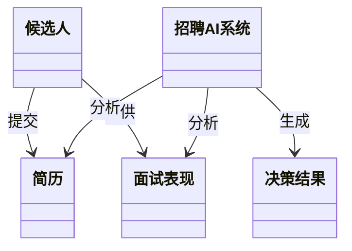
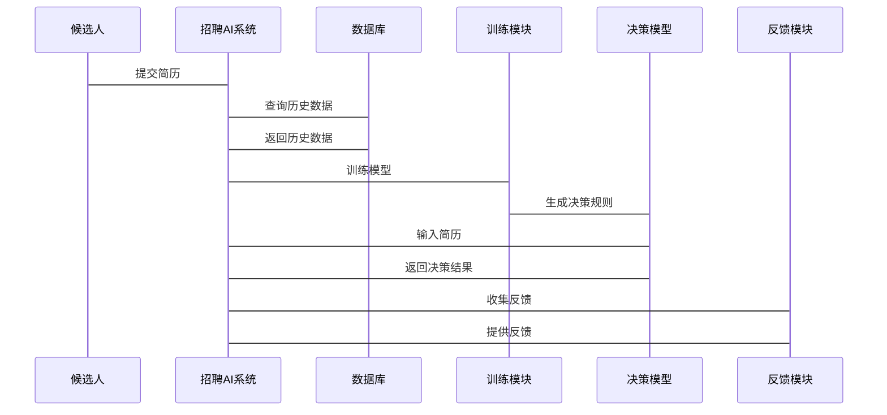

                 


# 《芒格的认知偏差理论：在人工智能伦理决策中的应用》

## 关键词：芒格认知偏差，人工智能伦理决策，决策系统，算法偏见，系统架构设计，伦理算法

## 摘要：  
本文探讨了芒格的认知偏差理论在人工智能伦理决策中的应用。首先介绍了认知偏差的基本概念和类型，分析了人工智能决策的基本原理及其面临的伦理挑战。随后，详细阐述了认知偏差理论在人工智能决策中的具体应用，包括偏差识别与纠正策略。最后，通过系统设计和实际案例，展示了如何将认知偏差理论应用于AI决策系统，以优化决策过程，确保伦理合规。

---

# 第一部分：芒格的认知偏差理论概述

## 第1章：芒格的认知偏差理论核心概念

### 1.1 认知偏差的基本定义  
认知偏差是指人们在信息处理和决策过程中，由于心理、情感或环境因素的影响，导致系统性偏离事实或理性决策的现象。认知偏差可以分为两大类：  
1. **记忆偏差**：如确认偏差、记忆偏差等。  
2. **推理偏差**：如归纳偏差、演绎偏差等。  

认知偏差对决策的影响主要体现在以下方面：  
- **信息处理偏差**：影响信息的收集、处理和存储。  
- **决策偏好偏差**：影响决策的优先级和选择。  
- **结果评估偏差**：影响对决策结果的评估和反馈。  

### 1.2 芒格认知偏差理论的起源与发展  
芒格的认知偏差理论由心理学家 Daniel Kahneman 和 Amos Tversky 在20世纪70年代提出，主要研究人类决策中的非理性行为。该理论的核心观点是：人类决策并非完全理性，而是受到认知偏差的影响。  

常见的认知偏差类型包括：  
- **确认偏差**：倾向于寻找支持已有假设的信息。  
- ** Availability bias**：倾向于根据容易回忆的信息做出决策。  
- ** 过度自信偏差**：高估自己对事件的控制能力。  

### 1.3 认知偏差与决策的关系  
认知偏差对决策的影响是多方面的：  
1. **信息处理阶段**：认知偏差可能导致信息收集不全面或处理不准确。  
2. **决策阶段**：认知偏差可能导致选择偏差，如过度依赖直觉而非数据。  
3. **结果评估阶段**：认知偏差可能导致对决策结果的错误归因。  

---

# 第二部分：人工智能伦理决策中的挑战

## 第2章：人工智能决策的基本原理  

### 2.1 人工智能决策的基本概念  
人工智能决策是指通过算法和数据驱动的方式，模拟人类决策过程的技术。其核心包括：  
1. **数据输入**：收集和处理相关数据。  
2. **模型训练**：通过机器学习算法训练模型。  
3. **决策输出**：模型根据输入数据生成决策结果。  

人工智能决策的优势在于：  
- 高效性：能够在短时间内处理大量数据。  
- 客观性：减少人为情绪和偏见的影响。  
- 可扩展性：适用于大规模数据处理。  

### 2.2 人工智能决策中的伦理问题  
人工智能决策面临的伦理挑战包括：  
1. **透明性问题**：决策过程难以解释。  
2. **公平性问题**：可能存在算法偏见。  
3. **可解释性问题**：复杂的模型难以理解。  

### 2.3 人工智能决策中的认知偏差  
人工智能决策中的认知偏差主要体现在：  
1. **数据偏差**：训练数据中的偏见会影响模型输出。  
2. **算法偏差**：算法设计中的偏见可能导致决策错误。  
3. **结果偏差**：模型输出的结果可能受到认知偏差的影响。  

---

# 第三部分：芒格认知偏差理论在人工智能伦理决策中的应用  

## 第3章：认知偏差理论在人工智能决策中的应用  

### 3.1 认知偏差理论在人工智能决策中的重要性  
认知偏差理论在人工智能决策中的重要性体现在：  
1. **优化决策过程**：通过识别和纠正认知偏差，提升决策的准确性。  
2. **减少算法偏见**：通过分析认知偏差，优化算法设计，避免偏见。  
3. **提升决策透明性**：通过理解认知偏差，提高决策过程的可解释性。  

### 3.2 人工智能决策中的认知偏差识别与纠正  
认知偏差识别的方法包括：  
1. **数据分析**：通过统计分析识别数据中的偏差。  
2. **模型评估**：通过模型评估工具检测算法中的偏见。  
3. **用户反馈**：通过用户反馈识别决策中的偏差。  

认知偏差纠正的策略包括：  
1. **数据预处理**：清洗数据，去除偏差。  
2. **算法优化**：调整算法参数，减少偏见。  
3. **决策后校正**：根据反馈结果调整决策。  

### 3.3 认知偏差理论对人工智能决策优化的作用  
认知偏差理论对人工智能决策优化的作用包括：  
1. **提升决策准确性**：通过纠正认知偏差，减少错误决策。  
2. **增强决策透明性**：通过理解认知偏差，提高决策过程的可解释性。  
3. **优化算法设计**：通过分析认知偏差，优化算法设计，减少偏见。  

---

# 第四部分：系统分析与架构设计方案  

## 第4章：人工智能伦理决策系统的架构设计  

### 4.1 系统概述  
人工智能伦理决策系统的目标是通过识别和纠正认知偏差，优化决策过程，确保决策的公平性和透明性。  

系统范围包括：  
- 数据收集模块：收集决策相关的数据。  
- 数据处理模块：清洗和预处理数据。  
- 模型训练模块：训练机器学习模型。  
- 决策输出模块：生成决策结果。  
- 反馈模块：根据反馈结果优化模型。  

### 4.2 系统功能设计  

#### 问题场景介绍  
假设我们正在设计一个招聘AI系统，该系统需要根据简历和面试表现推荐候选人。然而，系统可能因为训练数据中的性别偏见而推荐较少女性候选人。  

#### 领域模型设计（使用mermaid类图）  



#### 系统架构设计（使用mermaid架构图）  


#### 系统交互设计（使用mermaid序列图）  



---

## 项目实战  

### 4.3 算法原理讲解  

#### 算法原理的数学模型和公式（使用latex格式）  
假设我们有一个分类模型，其损失函数为：  
$$ L = \sum_{i=1}^{n} (y_i - \hat{y_i})^2 $$  
其中，$y_i$ 是真实标签，$\hat{y_i}$ 是预测标签。  

为了纠正认知偏差，我们可以引入公平性约束：  
$$ \text{Fairness Constraint} = \sum_{i=1}^{n} (y_i - \hat{y_i}) \cdot \text{bias}_i = 0 $$  

#### 算法实现的详细步骤  
1. 数据预处理：清洗数据，去除偏差。  
2. 模型训练：训练机器学习模型，引入公平性约束。  
3. 模型评估：评估模型的公平性和准确性。  
4. 模型优化：根据反馈结果优化模型。  

#### 代码示例  

```python
import pandas as pd
from sklearn.linear_model import LogisticRegression
from sklearn.metrics import accuracy_score
from fairness_constraint import FairnessConstraint

# 数据预处理
data = pd.read_csv('data.csv')
X = data.drop('label', axis=1)
y = data['label']

# 训练模型
model = LogisticRegression()
model.fit(X, y)

# 引入公平性约束
fairness_constraint = FairnessConstraint()
model_with_fairness = fairness_constraint.apply(X, y, model)

# 模型评估
accuracy = accuracy_score(y, model_with_fairness.predict(X))
print(f"Accuracy: {accuracy}")
```

---

## 总结  

芒格的认知偏差理论为人工智能伦理决策提供了重要的理论基础。通过识别和纠正认知偏差，可以优化决策过程，确保决策的公平性和透明性。未来，随着技术的进步，认知偏差理论在人工智能伦理决策中的应用将更加广泛和深入。  

--- 

**参考文献**：  
1. Kahneman, D. (2011). *Thinking, Fast and Slow*.  
2. Tversky, A., & Kahneman, D. (1974). *Judgment under Uncertainty: Heuristics and Biases*.  
3. Selbst, A. D., & Wallach, H. (2019). *Machine Learning and Algorithmic Bias in the Workplace*.  

**索引**：  
- 认知偏差  
- 人工智能决策  
- 伦理算法  
- 系统架构设计

