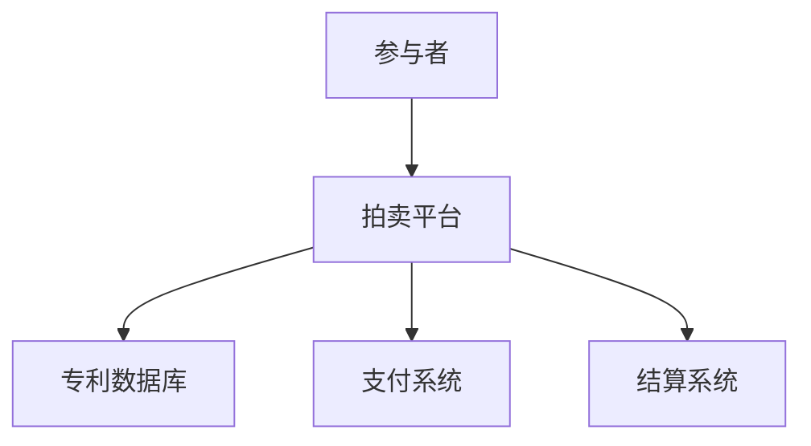
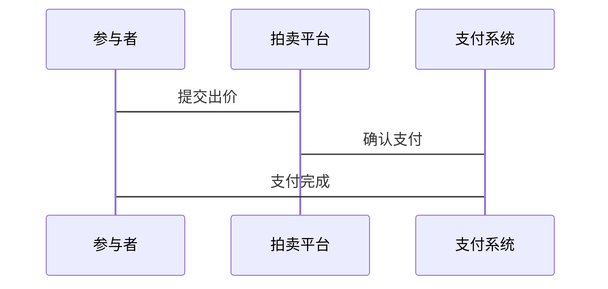

                 


# 芒格的"赢家的诅咒"提醒在量子专利拍卖中的应用

---

## 关键词：
- 芒格的"赢家的诅咒"
- 量子专利拍卖
- 拍卖算法
- 信息不对称
- 量子计算

---

## 摘要：
本文探讨了芒格的"赢家的诅咒"这一概念在量子专利拍卖中的应用。通过分析量子专利拍卖的背景、机制及存在的问题，结合VCG拍卖算法，提出了一种基于信息对称的量子专利拍卖系统设计。文章从理论到实践，详细阐述了如何在量子专利拍卖中避免"赢家的诅咒"，并结合实际案例进行了深入分析。本文旨在为量子专利拍卖的设计和优化提供新的思路和方法。

---

# 第1章: 芒格的"赢家的诅咒"概述

## 1.1 芒格"赢家的诅咒"的定义与核心概念

### 1.1.1 "赢家的诅咒"的定义
"赢家的诅咒"是指在拍卖中，获胜者往往因为过于乐观或信息不对称而支付过高的代价，导致最终的经济损失。这一概念最初由沃伦·巴菲特的合作伙伴查理·芒格提出。

### 1.1.2 "赢家的诅咒"的核心要素
- **信息不对称**：参与者掌握的信息不一致。
- **过度乐观**：参与者倾向于低估风险，高估收益。
- **竞拍者过多**：多个参与者竞争同一标的物，导致价格虚高。

### 1.1.3 "赢家的诅咒"的背景与问题背景
在现代市场经济中，拍卖是一种重要的资源配置方式。然而，信息不对称和过度竞争常常导致"赢家的诅咒"现象，特别是在高科技领域的专利拍卖中，这一问题尤为突出。

---

## 1.2 量子专利拍卖的定义与特点

### 1.2.1 量子专利的基本概念
量子专利是指与量子计算、量子通信等量子技术相关的专利。这类专利具有高度的技术壁垒和战略价值。

### 1.2.2 量子专利拍卖的定义
量子专利拍卖是指通过拍卖方式将量子专利出售给最高出价者的交易过程。

### 1.2.3 量子专利拍卖的特点与优势
- **高价值**：量子专利通常涉及前沿技术，具有较高的市场价值。
- **稀缺性**：量子专利的数量有限，导致竞争激烈。
- **技术复杂性**：量子专利的技术门槛高，评估难度大。

---

# 第2章: 芒格"赢家的诅咒"在量子专利拍卖中的问题背景

## 2.1 量子专利拍卖中的"赢家的诅咒"问题

### 2.1.1 量子专利拍卖的现状与挑战
- 量子技术的快速发展导致专利数量激增。
- 专利评估难度大，容易出现信息不对称。

### 2.1.2 "赢家的诅咒"在量子专利拍卖中的具体体现
- **高价成交**：参与者为了争夺专利，往往出价远高于实际价值。
- **资源浪费**：高价成交可能导致企业后续研发投入不足。

### 2.1.3 量子专利拍卖中的信息不对称问题
- **买方信息劣势**：买家对专利的技术价值和市场前景了解不全面。
- **卖方策略**：卖方可能通过夸大专利价值吸引更高出价。

---

## 2.2 量子专利拍卖中的理性决策与非理性行为

### 2.2.1 理性决策的基本概念
理性决策是指基于充分信息和逻辑分析做出的最佳选择。

### 2.2.2 非理性行为在量子专利拍卖中的表现
- **从众心理**：参与者因看到他人出价较高而跟风出价。
- **过度自信**：参与者低估了竞争者的出价能力。

### 2.2.3 信息不对称对决策的影响
信息不对称会导致参与者做出非理性决策，从而加剧"赢家的诅咒"现象。

---

# 第3章: 芒格"赢家的诅咒"与量子专利拍卖的核心概念联系

## 3.1 量子专利拍卖中的核心概念

### 3.1.1 量子专利的价值评估
- **技术评估**：评估专利的技术先进性和实用性。
- **市场评估**：评估专利的市场前景和商业价值。

### 3.1.2 量子专利拍卖的市场机制
- **价格发现机制**：通过拍卖确定专利的市场价值。
- **资源配置机制**：将专利分配给最有价值的买家。

### 3.1.3 量子专利拍卖中的竞争与合作
- **竞争**：参与者为争夺专利展开竞争。
- **合作**：拍卖平台与参与者之间的合作关系。

---

## 3.2 "赢家的诅咒"与量子专利拍卖的关系

### 3.2.1 "赢家的诅咒"在量子专利拍卖中的具体表现
- **高价成交**：获胜者支付的价格远高于实际价值。
- **资源浪费**：高价成交可能导致企业后续投入不足。

### 3.2.2 量子专利拍卖中的价格发现机制
- **市场机制**：通过拍卖确定专利的市场价格。
- **信息反馈**：拍卖结果反映了市场对专利的真实价值。

### 3.2.3 量子专利拍卖中的市场失灵与市场效率
- **市场失灵**：信息不对称导致资源配置低效。
- **市场效率**：拍卖机制能够有效配置资源。

---

## 3.3 量子专利拍卖中的信息不对称与市场机制设计

### 3.3.1 信息不对称的定义与影响
- **信息不对称**：参与者掌握的信息不一致，影响决策。
- **影响**：信息不对称可能导致高价成交和资源浪费。

### 3.3.2 量子专利拍卖中的信息不对称问题
- **买方信息劣势**：买家对专利技术价值了解不足。
- **卖方策略**：卖方可能通过夸大专利价值吸引高价。

### 3.3.3 信息不对称对拍卖结果的影响
- **高价成交**：信息不对称导致参与者出价过高。
- **资源配置低效**：信息不对称影响资源配置效率。

---

# 第4章: 量子专利拍卖中的算法原理

## 4.1 量子专利拍卖的算法选择

### 4.1.1 常见的拍卖算法概述
- **英国式拍卖**：单轮出价，最高出价者胜出。
- **荷兰式拍卖**：逐步降低价格，第一个接受的价格胜出。
- **密封递增拍卖**：参与者同时提交出价，最高者胜出。
- **VCG拍卖**：基于 Vickrey 理论的拍卖机制。

### 4.1.2 量子专利拍卖中适用的算法分析
- **VCG拍卖**：适用于复杂市场，能够有效解决信息不对称问题。
- **英国式拍卖**：适用于简单市场，但容易引发"赢家的诅咒"。

### 4.1.3 基于VCG机制的拍卖算法
- **VCG机制的基本原理**：以参与者的边际贡献为依据确定价格。
- **VCG机制的数学模型**：$$P_i = \sum_{j \neq i} v_j$$
- **VCG机制的特点**：能够有效解决信息不对称问题。

---

## 4.2 基于VCG机制的拍卖算法原理

### 4.2.1 VCG机制的基本原理
VCG机制是一种基于 Vickrey 理论的拍卖机制，以参与者的边际贡献为依据确定价格。

### 4.2.2 VCG机制的数学模型
$$P_i = \sum_{j \neq i} v_j$$
其中，\( P_i \) 表示第 \( i \) 个参与者的支付价格，\( v_j \) 表示第 \( j \) 个参与者对标的物的估值。

### 4.2.3 VCG机制的特点
- **高效性**：能够有效配置资源，避免"赢家的诅咒"。
- **公平性**：每个参与者支付的价格与其贡献相匹配。

---

## 4.3 VCG机制在量子专利拍卖中的应用

### 4.3.1 量子专利拍卖中的VCG机制设计
- **参与者估值**：通过市场调研和专家评估确定专利的市场价值。
- **算法实现**：基于VCG机制设计拍卖算法。

### 4.3.2 量子专利拍卖中的VCG算法实现
```python
def vcg_auction(participants, values):
    max_value = max(values)
    winner = participants[values.index(max_value)]
    total = sum(values)
    winner_payment = total - max_value
    return winner, winner_payment
```

### 4.3.3 VCG机制的优势
- **避免高价成交**：通过VCG机制设计，能够有效避免"赢家的诅咒"。
- **提高市场效率**：VCG机制能够提高资源配置效率，降低信息不对称问题。

---

# 第5章: 量子专利拍卖中的系统架构与设计

## 5.1 量子专利拍卖系统的设计目标

### 5.1.1 系统目标
- **高效性**：快速完成专利拍卖过程。
- **安全性**：确保拍卖过程的安全性和隐私性。
- **可扩展性**：能够支持大规模专利拍卖。

### 5.1.2 系统设计原则
- **模块化设计**：系统模块化设计，便于维护和扩展。
- **高可用性**：系统设计考虑高可用性，确保拍卖过程不中断。

---

## 5.2 量子专利拍卖系统的功能设计

### 5.2.1 系统功能模块
- **参与者管理模块**：管理参与者信息，包括注册、登录等。
- **专利信息管理模块**：管理量子专利信息，包括专利描述、技术指标等。
- **拍卖流程管理模块**：管理拍卖流程，包括出价、成交等。
- **支付与结算模块**：处理拍卖的支付与结算。

### 5.2.2 系统功能流程
1. **参与者注册**：参与者提交注册信息，系统审核后生成账户。
2. **专利信息发布**：卖家发布专利信息，包括专利描述、技术指标等。
3. **拍卖流程启动**：系统启动拍卖流程，参与者提交出价。
4. **拍卖结果确定**：系统根据VCG机制确定拍卖结果。
5. **支付与结算**：中标者支付价款，系统完成结算。

---

## 5.3 量子专利拍卖系统的架构设计

### 5.3.1 系统架构图


### 5.3.2 模块交互流程
1. **参与者登录**：参与者登录系统，进入拍卖界面。
2. **浏览专利**：参与者浏览量子专利信息，提交出价。
3. **拍卖结果**：系统根据VCG机制确定拍卖结果，通知中标者和参与者。
4. **支付与结算**：中标者支付价款，系统完成结算。

---

## 5.4 量子专利拍卖系统的核心实现

### 5.4.1 拍卖算法实现
```python
def vcg_auction(participants, values):
    max_value = max(values)
    winner = participants[values.index(max_value)]
    total = sum(values)
    winner_payment = total - max_value
    return winner, winner_payment
```

### 5.4.2 系统接口设计
- **API接口**：提供RESTful API接口，支持参与者和系统之间的交互。
- **数据接口**：支持数据库的读写操作，确保数据的安全性和完整性。

---

## 5.5 量子专利拍卖系统的交互设计

### 5.5.1 系统交互流程图


---

# 第6章: 量子专利拍卖中的项目实战

## 6.1 项目背景与目标

### 6.1.1 项目背景
- **量子计算发展迅速**：量子计算技术的快速发展导致专利数量激增。
- **专利拍卖需求增加**：企业对量子专利的需求日益增加。

### 6.1.2 项目目标
- **设计量子专利拍卖系统**：基于VCG机制设计量子专利拍卖系统。
- **实现系统功能**：实现参与者管理、专利信息发布、拍卖流程管理、支付与结算等功能。

---

## 6.2 项目实现

### 6.2.1 环境安装
- **Python 3.8以上版本**
- **Django框架**
- **数据库（MySQL）**
- **支付接口（支付宝/微信支付）**

### 6.2.2 核心代码实现
```python
from django.shortcuts import render, redirect
from .models import Participant, Patent, Auction

def auction(request):
    if request.method == 'POST':
        participant = request.POST['participant']
        value = int(request.POST['value'])
        # 获取所有参与者和出价
        participants = ['A', 'B', 'C']
        values = [100, 200, 150]
        # 确定最高出价
        max_value = max(values)
        winner = participants[values.index(max_value)]
        total = sum(values)
        winner_payment = total - max_value
        # 记录拍卖结果
        auction = Auction(participant=winner, payment=winner_payment)
        auction.save()
        # 支付流程
        return redirect('payment', winner=winner)
    return render(request, 'auction.html')
```

---

## 6.3 项目实战分析

### 6.3.1 案例分析
假设有一项量子专利拍卖，参与者包括A、B、C，出价分别为100、200、150。根据VCG机制，B胜出，支付价格为150。

### 6.3.2 实际应用中的注意事项
- **信息透明**：确保参与者能够获取足够的专利信息。
- **系统安全性**：确保拍卖系统的安全性和隐私性。
- **法律合规**：确保拍卖过程符合相关法律法规。

---

## 6.4 项目总结

### 6.4.1 项目成果
- **系统设计**：基于VCG机制设计量子专利拍卖系统。
- **功能实现**：实现参与者管理、专利信息发布、拍卖流程管理、支付与结算等功能。

### 6.4.2 项目经验
- **信息不对称问题**：通过VCG机制有效解决信息不对称问题。
- **系统设计**：模块化设计能够提高系统的可维护性和可扩展性。

---

# 第7章: 总结与展望

## 7.1 全文总结

### 7.1.1 芒格"赢家的诅咒"的核心思想
芒格的"赢家的诅咒"提醒我们在拍卖中要避免过高出价，特别是在信息不对称的情况下。

### 7.1.2 量子专利拍卖中的应用
通过VCG机制设计量子专利拍卖系统，能够有效避免"赢家的诅咒"。

---

## 7.2 未来展望

### 7.2.1 量子专利拍卖的未来发展趋势
- **技术进步**：量子计算技术的进一步发展将推动专利拍卖的市场需求。
- **机制优化**：拍卖机制将更加智能化，能够更好地解决信息不对称问题。

### 7.2.2 量子专利拍卖的未来挑战
- **技术难题**：如何设计更加高效的拍卖算法。
- **法律问题**：如何确保拍卖过程的法律合规性。

---

## 7.3 最佳实践 Tips

### 7.3.1 拍卖机制设计
- **选择合适的拍卖机制**：根据市场特点选择合适的拍卖机制。
- **避免信息不对称**：通过信息共享和透明化设计减少信息不对称。

### 7.3.2 系统设计
- **模块化设计**：确保系统模块化设计，便于维护和扩展。
- **安全性设计**：确保系统安全性，防止数据泄露和恶意攻击。

---

## 7.4 小结

芒格的"赢家的诅咒"提醒我们在量子专利拍卖中要避免过高出价，特别是在信息不对称的情况下。通过VCG机制设计量子专利拍卖系统，能够有效解决信息不对称问题，提高资源配置效率。未来，随着量子计算技术的进一步发展，量子专利拍卖的市场需求将不断增加，拍卖机制也将更加智能化和高效化。

