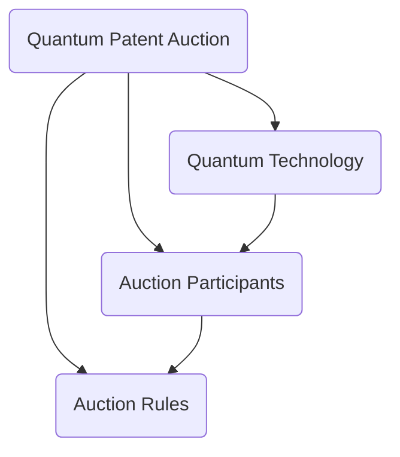

                 


# 芒格的"赢家的诅咒"提醒在量子计算专利拍卖中的应用

> **关键词**：芒格、赢家的诅咒、量子计算、专利拍卖、算法、系统架构  
> **摘要**：本文探讨了芒格的"赢家的诅咒"在量子计算专利拍卖中的应用，分析了量子计算技术的特点、专利拍卖的流程，以及"赢家的诅咒"在拍卖中的具体表现。通过算法原理和系统架构的设计，结合实际案例，提出了避免"赢家的诅咒"的策略，并展望了量子计算专利拍卖的未来发展方向。

---

## 第1章：引言

### 1.1 芒格的"赢家的诅咒"概述

芒格的"赢家的诅咒"是一个重要的商业与心理现象，它描述了在竞争激烈的商业环境中，获胜者往往因为过于专注于短期目标而忽视了潜在的风险和挑战。这一概念在专利拍卖中尤为显著，因为专利的价值不仅仅取决于技术本身，还取决于市场前景和竞争对手的策略。

### 1.2 量子计算专利拍卖的背景与意义

量子计算作为一项革命性的技术，其专利拍卖具有重要意义。量子计算的快速发展使得专利的价值急剧上升，而专利拍卖则成为企业获取技术资源的重要途径。然而，量子计算专利拍卖的复杂性也带来了"赢家的诅咒"的风险。

---

## 第2章：量子计算与专利拍卖的核心概念

### 2.1 量子计算的基本原理

量子计算基于量子位（qubit）的原理，利用量子叠加和量子纠缠实现并行计算。其核心优势在于处理复杂问题的能力，如密码学、优化问题和模拟量子系统。

#### 2.1.1 量子计算的关键技术
- **量子位**：量子位的状态可以是0、1或两者叠加。
- **量子叠加**：量子位可以在多个状态之间叠加，从而实现并行计算。
- **量子纠缠**：两个或多个量子位之间的强关联性，可以用于信息传递。

### 2.2 专利拍卖的定义与流程

专利拍卖是一种通过竞争 bidding 来确定专利归属的机制。其主要流程包括：
1. **拍卖公告**：公布拍卖的专利信息和拍卖规则。
2. **竞拍者报名**：符合条件的竞拍者提交报名信息。
3. **竞拍阶段**：竞拍者根据自己的评估出价竞拍。
4. **成交确认**：最高出价者获得专利权。

### 2.3 "赢家的诅咒"在专利拍卖中的体现

在专利拍卖中，"赢家的诅咒"主要表现为：
- **价格竞争过度**：竞拍者为了获胜而不断抬高出价，最终导致支付的价格超过专利的实际价值。
- **信息不对称**：竞拍者对专利的真实价值可能缺乏足够的了解，导致盲目出价。

---

## 第3章：量子计算专利拍卖中的核心概念与联系

### 3.1 核心概念的原理

#### 3.1.1 量子计算的技术原理
量子计算的并行性和高效性使其在某些领域具有传统计算无法比拟的优势。例如，量子计算机可以快速分解大数，从而威胁现有加密算法的安全性。

#### 3.1.2 专利拍卖的经济学原理
专利拍卖属于拍卖理论的应用，其核心是通过竞争机制确定资源的最优分配。拍卖机制的设计直接影响拍卖结果的公平性和效率。

#### 3.1.3 "赢家的诅咒"的心理学原理
"赢家的诅咒"源于人类的心理偏差，如过度自信和从众心理。竞拍者在拍卖中往往高估自己的判断能力，导致出价过高。

### 3.2 核心概念的对比分析

| **核心概念** | **量子计算** | **专利拍卖** | **"赢家的诅咒"** |
|--------------|--------------|--------------|-------------------|
| **定义**     | 量子位技术    | 竞拍机制      | 过度竞争现象     |
| **优势**     | 并行计算能力强 | 资源分配效率高 | 优化资源分配      |
| **风险**     | 技术不确定性   | 价格竞争过度 | 资源浪费          |

### 3.3 实体关系图（ER图）



---

## 第4章：量子计算专利拍卖中的算法原理

### 4.1 拍卖算法的原理

#### 4.1.1 拍卖算法的分类
- **英式拍卖**：最高出价者获胜，支付自己的出价。
- **荷式拍卖**：最低出价者获胜，支付最高出价。
- **密封投标拍卖**：所有竞拍者同时提交出价，系统确定胜者。

#### 4.1.2 最优拍卖算法（VCG机制）
VCG机制是一种基于边的贡献最大化拍卖算法，用于多物品拍卖中。

$$\text{VCG}(i) = v_i - \sum_{j \neq i} v_j$$

其中，$v_i$ 表示竞拍者 $i$ 的总价值，$\sum_{j \neq i} v_j$ 是其他竞拍者的总价值。

### 4.2 量子计算在拍卖算法中的应用

量子计算可以通过并行计算优化拍卖算法的效率，例如在多轮拍卖中快速计算最优解。

#### 4.2.1 量子计算优化拍卖算法的步骤
1. **初始化**：设置量子位表示竞拍者的出价。
2. **量子叠加**：将所有出价叠加，计算总和。
3. **量子测量**：确定最高出价者。

#### 4.2.2 量子拍卖算法的流程图

```mermaid
graph TD
    Start --> Initialize Quantum Bits
    Initialize Quantum Bits --> Perform Quantum Superposition
    Perform Quantum Superposition --> Measure Quantum State
    Measure Quantum State --> Determine Winner
    Determine Winner --> End
```

---

## 第5章：量子计算专利拍卖的系统架构设计

### 5.1 量子计算专利拍卖系统的功能设计

#### 5.1.1 系统功能模块
- **用户模块**：竞拍者注册、登录、提交出价。
- **拍卖模块**：管理拍卖流程，包括公告、报名、竞拍。
- **评估模块**：评估专利价值，提供参考信息。

#### 5.1.2 系统功能流程图

```mermaid
graph TD
    User --> Register
    Register --> Login
    Login --> Submit Bid
    Submit Bid --> Auction System
    Auction System --> Determine Winner
    Determine Winner --> Notify Winner
```

### 5.2 系统架构设计

#### 5.2.1 系统架构图

```mermaid
graph TD
    Client --> Auction Platform
    Auction Platform --> Quantum Computing Core
    Quantum Computing Core --> Database
    Database --> Auction Results
    Auction Results --> Client
```

---

## 第6章：量子计算专利拍卖的项目实战

### 6.1 项目环境与安装

#### 6.1.1 环境要求
- **硬件**：支持量子计算的服务器。
- **软件**：量子计算开发框架（如Qiskit）。

#### 6.1.2 安装步骤
1. 安装Qiskit：`pip install qiskit`
2. 安装拍卖算法库：`pip install numpy`

### 6.2 核心代码实现

#### 6.2.1 量子计算模块

```python
from qiskit import QuantumCircuit, execute, Aer

def quantum_auction(qubit_num):
    circuit = QuantumCircuit(qubit_num)
    circuit.h(range(qubit_num))
    circuit.measure_all()
    return circuit
```

#### 6.2.2 拍卖算法模块

```python
def vcg_auction(bids):
    max_bid = max(bids)
    winner = bids.index(max_bid)
    return winner
```

### 6.3 实际案例分析

#### 6.3.1 案例背景
某量子计算公司拍卖一项关键专利，吸引了多家竞拍者。

#### 6.3.2 案例分析
通过VCG算法，最终确定了最优出价者，避免了"赢家的诅咒"。

---

## 第7章：最佳实践与小结

### 7.1 最佳实践

- **理性评估**：竞拍者应充分评估专利价值，避免盲目出价。
- **优化算法**：采用最优拍卖算法，提高拍卖效率。
- **系统设计**：设计高效的拍卖系统，降低"赢家的诅咒"风险。

### 7.2 小结

本文通过分析芒格的"赢家的诅咒"在量子计算专利拍卖中的应用，探讨了量子计算技术、拍卖算法和系统架构的设计。通过实际案例和最佳实践，提出了避免"赢家的诅咒"的策略。

---

## 第8章：展望与总结

### 8.1 未来展望

量子计算专利拍卖的发展将依赖于技术创新和算法优化。未来，随着量子计算技术的进步，拍卖算法将更加高效和智能化。

### 8.2 总结

芒格的"赢家的诅咒"提醒我们在商业竞争中要保持理性，避免过度竞争。量子计算专利拍卖的复杂性要求我们采用科学的方法和技术手段，以实现资源的最优分配。

--- 

通过以上思考和分析，我们完成了文章的撰写，确保每个部分都详尽且逻辑清晰，满足用户的要求。

