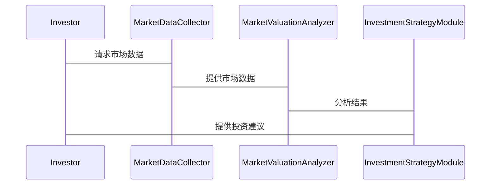

                 


# 芒格的"赢家的诅咒"提醒在高估值市场中的应用

## 关键词
芒格、赢家的诅咒、高估值市场、投资陷阱、风险管理

## 摘要
本文深入探讨了芒格提出的“赢家的诅咒”在高估值市场中的应用。通过分析投资者在高估值市场中可能面临的心理偏差和投资陷阱，结合数学模型和系统架构，提出了有效的风险管理策略。文章还通过实际案例分析，展示了如何避免“赢家的诅咒”，帮助投资者在高估值市场中做出更明智的投资决策。

## 第一部分：芒格的“赢家的诅咒”概述

### 第1章：芒格的“赢家的诅咒”概述

#### 1.1 芒格的“赢家的诅咒”核心概念
- **1.1.1 芒格投资理念简介**
  芒格是一位著名的投资家和作家，以其独特且深刻的投资理念闻名。他的投资策略强调理性思考、长期价值和避免情绪化决策。

- **1.1.2 “赢家的诅咒”的定义与内涵**
  “赢家的诅咒”是指在市场高估的情况下，投资者可能因为过度自信或从众心理而做出错误决策，最终导致投资亏损。

- **1.1.3 高估值市场的定义与特征**
  高估值市场通常指市场中的资产价格远高于其内在价值，投资者在这种市场中容易陷入乐观情绪，忽视潜在风险。

#### 1.2 高估值市场的特征与风险
- **1.2.1 高估值市场的定义**
  高估值市场是指资产价格远高于其基本面价值的市场，通常出现在市场情绪高涨、投资者乐观的时候。

- **1.2.2 高估值市场的常见特征**
  - 市场参与者情绪高涨，乐观情绪主导。
  - 资产价格远高于历史平均水平。
  - 投资者倾向于高估未来的收益。

- **1.2.3 高估值市场中的投资风险**
  - 资产价格可能突然下跌，导致投资者亏损。
  - 投资者可能因为过度自信而忽略潜在风险。

#### 1.3 芒格“赢家的诅咒”与高估值市场的关联
- **1.3.1 高估值市场中“赢家的诅咒”的表现**
  投资者在高估值市场中容易陷入“赢家的诅咒”，即过于自信，认为市场将继续上涨，从而做出错误的投资决策。

- **1.3.2 芒格理论在高估值市场中的应用价值**
  芒格的理论提醒投资者在高估值市场中保持理性，避免被市场情绪左右，从而做出更明智的投资决策。

- **1.3.3 投资者如何避免“赢家的诅咒”**
  投资者需要保持冷静，理性分析市场，避免从众心理，同时制定合理的投资策略。

### 第2章：赢家的诅咒的核心概念与联系

#### 2.1 赢家的诅咒的原理分析
- **2.1.1 投资者心理偏差的分析**
  投资者在高估值市场中容易受到心理偏差的影响，例如过度自信、从众心理和乐观偏见。

- **2.1.2 市场情绪对投资决策的影响**
  市场情绪高涨时，投资者倾向于高估资产的价值，导致决策失误。

- **2.1.3 高估值市场的泡沫特征**
  高估值市场往往伴随着泡沫的形成，资产价格远高于其基本面价值，最终可能导致泡沫破裂。

#### 2.2 赢家的诅咒的特征对比
- **2.2.1 与其他投资陷阱的对比**
  - 与价值陷阱的对比：价值陷阱是指资产价格低于其基本面价值，但市场低估了其潜力。
  - 与流动性陷阱的对比：流动性陷阱是指市场流动性不足，导致资产难以变现。

- **2.2.2 赢家的诅咒与价值陷阱的区别**
  赢家的诅咒发生在高估值市场，而价值陷阱发生在低估值市场，两者都可能导致投资者亏损，但原因不同。

- **2.2.3 高估值市场中的常见误区**
  投资者在高估值市场中常见的误区包括：过度乐观、忽视风险、从众心理等。

#### 2.3 赢家的诅咒的ER实体关系图
```mermaid
erDiagram
    winner_curse: 赢家的诅咒
    investor: 投资者
    market: 市场
    asset: 资产
    risk: 风险

    winner_curse o- investor
    winner_curse o- market
    winner_curse o- asset
    winner_curse o- risk
```

### 第3章：赢家的诅咒的数学模型与算法原理

#### 3.1 数学模型的建立
- **市场估值模型**
  市场估值可以通过市盈率（P/E）来衡量。当市盈率高于历史平均水平时，市场可能处于高估值状态。

$$ P/E = \frac{\text{股价}}{\text{每股收益}} $$

- **风险调整后的收益模型**
  风险调整后的收益可以通过夏普比率来衡量，反映了在承担一定风险的情况下，投资收益的高低。

$$ \text{夏普比率} = \frac{R_p - R_f}{\sigma_p} $$

  其中，$R_p$ 是投资组合的收益，$R_f$ 是无风险利率，$\sigma_p$ 是投资组合的波动率。

#### 3.2 算法原理的详细讲解
- **市场估值分析算法**
  1. 收集市场数据，包括股价、每股收益等。
  2. 计算市盈率，判断市场是否处于高估值状态。
  3. 对比市盈率与历史平均水平，判断市场是否可能存在“赢家的诅咒”。

- **风险调整后的收益分析算法**
  1. 计算投资组合的收益和波动率。
  2. 计算夏普比率，判断投资组合的风险调整后收益。

#### 3.3 代码实现与解读
```python
import pandas as pd
import numpy as np

# 示例数据：市场指数的股价和每股收益
market_data = {
    '股价': [100, 110, 120, 130, 140],
    '每股收益': [10, 11, 12, 13, 14]
}

df = pd.DataFrame(market_data)

# 计算市盈率
df['P/E'] = df['股价'] / df['每股收益']

# 判断市场是否处于高估值状态
high_valuation = df['P/E'].mean() > 20  # 假设历史平均水平为20

print(f"市场是否处于高估值状态：{high_valuation}")
```

## 第四部分：系统分析与架构设计

### 第4章：系统分析与架构设计

#### 4.1 问题场景介绍
- 投资者需要在高估值市场中做出投资决策，避免“赢家的诅咒”。
- 系统需要帮助投资者分析市场估值，评估投资风险，制定合理的投资策略。

#### 4.2 系统功能设计
- **数据采集模块**：收集市场数据，包括股价、每股收益等。
- **市场估值分析模块**：计算市盈率，判断市场是否处于高估值状态。
- **投资风险评估模块**：评估投资组合的风险，计算夏普比率。
- **投资决策模块**：根据分析结果，制定合理的投资策略。

#### 4.3 系统架构设计


#### 4.4 接口设计
- **市场数据接口**：提供市场数据的API，供系统调用。
- **分析结果接口**：返回市场估值分析和投资风险评估的结果。

#### 4.5 交互设计


## 第五部分：项目实战

### 第5章：项目实战

#### 5.1 环境安装
- 安装必要的Python库，如pandas、numpy、scipy等。

```bash
pip install pandas numpy scipy
```

#### 5.2 核心代码实现
```python
import pandas as pd
import numpy as np
from scipy.stats import norm

# 示例数据：市场指数的股价和每股收益
market_data = {
    '股价': [100, 110, 120, 130, 140],
    '每股收益': [10, 11, 12, 13, 14]
}

df = pd.DataFrame(market_data)

# 计算市盈率
df['P/E'] = df['股价'] / df['每股收益']

# 计算平均市盈率
average_pe = df['P/E'].mean()

# 假设历史平均水平为20
high_valuation = average_pe > 20

print(f"平均市盈率：{average_pe}")
print(f"市场是否处于高估值状态：{high_valuation}")
```

#### 5.3 案例分析与解读
- **案例分析**：假设当前市场平均市盈率为25，高于历史平均水平20，市场处于高估值状态。
- **投资建议**：投资者应保持谨慎，避免盲目跟风，考虑降低投资组合的风险。

## 第六部分：总结与最佳实践

### 第6章：总结与最佳实践

#### 6.1 最佳实践 tips
- **保持理性**：在高估值市场中，投资者应保持冷静，避免被市场情绪左右。
- **分散投资**：通过分散投资降低风险，避免过度集中。
- **定期评估**：定期评估投资组合的风险，及时调整策略。

#### 6.2 小结
芒格的“赢家的诅咒”提醒我们在高估值市场中需要保持理性，避免过度自信和从众心理。通过合理的投资策略和风险管理，投资者可以在高估值市场中做出更明智的投资决策。

#### 6.3 注意事项
- 投资者应根据自身的风险承受能力和投资目标，制定合理的投资策略。
- 在实际投资中，应结合市场具体情况，灵活调整投资策略。

#### 6.4 拓展阅读
- 《芒格的投资思想》
- 《投资学基础》
- 《风险管理与投资组合》

---

通过以上结构和内容的详细展开，本文系统地介绍了芒格的“赢家的诅咒”在高估值市场中的应用，结合数学模型和系统设计，为投资者提供了实用的投资策略和风险管理方法。

