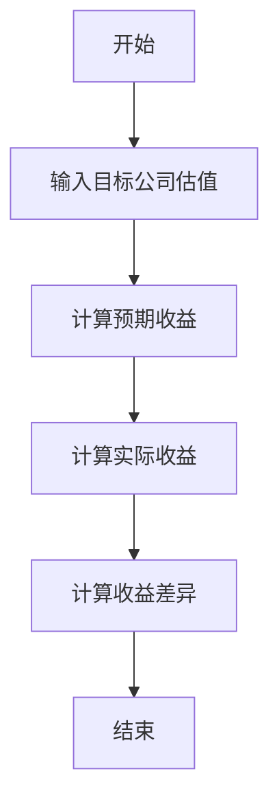
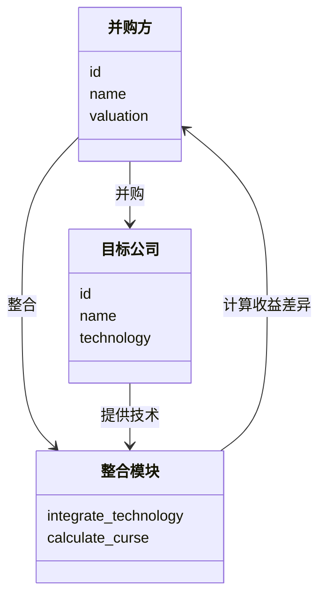
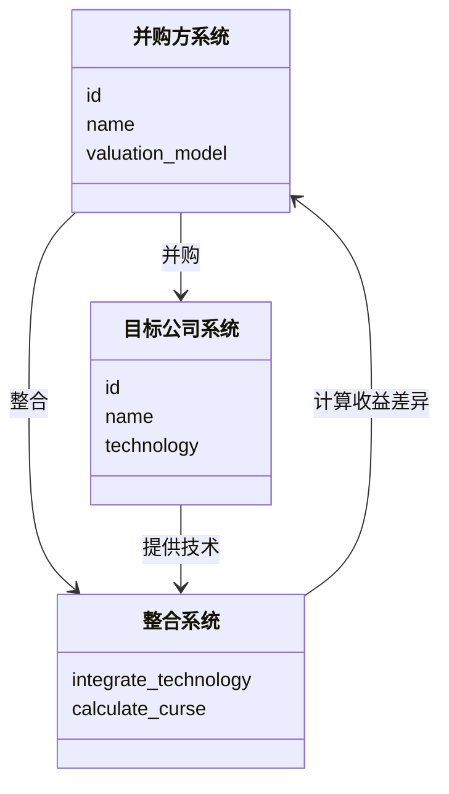
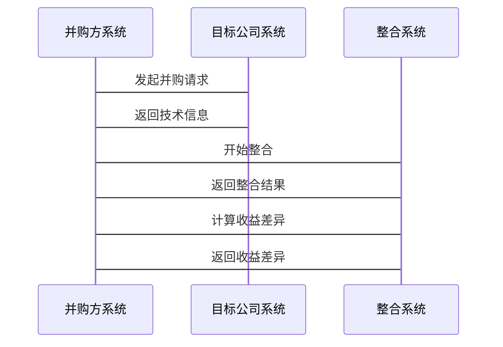

                 


# 芒格的“赢家的诅咒”提醒在高科技并购中的应用

## 关键词：芒格，赢家的诅咒，高科技并购，估值模型，系统架构，Python代码，案例分析

## 摘要：  
芒格的“赢家的诅咒”是一个重要的并购理论，提醒人们在并购中可能会因为高估目标公司价值而陷入困境。本文通过分析“赢家的诅咒”在高科技并购中的应用，构建了一个数学模型，并通过Python代码实现，展示了如何通过系统架构设计和实际案例分析来避免或减轻这种诅咒的影响。

---

## 第1章 芒格的“赢家的诅咒”概述

### 1.1 芒格的“赢家的诅咒”定义  
芒格的“赢家的诅咒”是指在并购过程中，获胜的一方（通常是收购方）可能会因为高估了目标公司的价值，或者在整合过程中遇到意想不到的困难，导致并购失败或收益不如预期。这种现象的核心在于，收购方在并购时过于乐观，忽视了目标公司的潜在风险和不确定性。  

### 1.2 高科技并购的特殊性  
高科技并购具有以下特殊性：  
- **高增长性**：高科技行业通常具有快速发展的潜力，但同时也伴随着高风险。  
- **技术依赖性**：目标公司的技术优势往往是其核心竞争力，但也可能导致收购方对其技术路线的过度依赖。  
- **协同效应**：高科技并购通常强调协同效应，但整合过程中的技术整合和文化冲突可能会破坏协同效应的实现。  

### 1.3 芒格“赢家的诅咒”在高科技并购中的应用背景  
在高科技并购中，“赢家的诅咒”主要表现为：  
- **估值过高**：收购方可能因为目标公司的技术创新或市场前景而支付过高的溢价。  
- **整合失败**：收购方在整合过程中可能因为目标公司的技术路线或管理风格与自身不兼容而导致整合失败。  
- **协同效应未实现**：收购方可能因为未能有效整合目标公司的技术、团队或资源而导致协同效应未能实现。  

---

## 第2章 芒格“赢家的诅咒”的核心概念与联系

### 2.1 芒格“赢家的诅咒”的核心概念  
“赢家的诅咒”可以分解为以下几个核心概念：  
- **估值偏差**：收购方在并购时过于乐观，导致对目标公司价值的高估。  
- **整合风险**：目标公司的技术、管理或文化与收购方不兼容，导致整合失败。  
- **协同效应的不确定性**：收购方在并购时过于依赖协同效应的实现，但实际效果可能远低于预期。  

### 2.2 芒格“赢家的诅咒”与高科技并购的关系  
通过对比分析，可以发现“赢家的诅咒”在高科技并购中具有以下特殊性：  
| 对比维度 | 传统并购 | 高科技并购 |
|----------|-----------|-------------|
| 估值方式 | 纯粹财务指标（如市盈率、市净率） | 技术创新、市场前景、协同效应 |
| 整合风险 | 文化冲突、管理不善 | 技术路线冲突、研发资源分配 |
| 协同效应 | 销售协同、成本协同 | 技术协同、数据协同、研发协同 |

### 2.3 芒格“赢家的诅咒”的ER实体关系图  

```mermaid
er
actor 股东 {
  id: int
  name: varchar
}
actor 并购方 {
  id: int
  name: varchar
}
actor 目标公司 {
  id: int
  name: varchar
}
关联关系：
股东 -> 并购方: 持股
并购方 -> 目标公司: 并购
目标公司 -> 并购方: 估值偏差
```

---

## 第3章 芒格“赢家的诅咒”的算法原理

### 3.1 芒格“赢家的诅咒”的数学模型  
为了量化“赢家的诅咒”，我们可以构建一个简单的数学模型，用于评估并购后的实际收益与预期收益的差异。  

假设：  
- 收购方对目标公司的估值为 $V$。  
- 并购后的实际收益为 $R$。  
- 由于“赢家的诅咒”，实际收益可能低于预期收益，即 $R < E(R)$。  

模型公式：  
$$ \text{收益差异} = E(R) - R $$  

其中，$E(R)$ 是收购方对 $R$ 的预期，而 $R$ 是实际收益。  

### 3.2 芒格“赢家的诅咒”的算法流程  



### 3.3 芒格“赢家的诅咒”的Python代码实现  

```python
def calculate_winner_curse(estimated_revenue, actual_revenue):
    curse = estimated_revenue - actual_revenue
    return curse

# 示例
estimated_revenue = 1000000  # 预期收益
actual_revenue = 800000      # 实际收益
curse = calculate_winner_curse(estimated_revenue, actual_revenue)
print(f"赢家的诅咒 = {curse}")
```

### 3.4 芒格“赢家的诅咒”的系统架构设计  



---

## 第4章 高科技并购中的系统分析与架构设计

### 4.1 高科技并购的系统功能设计  



### 4.2 高科技并购的系统架构设计  


### 4.3 高科技并购的系统交互设计  



---

## 第5章 项目实战与案例分析

### 5.1 环境安装  
为了运行本文的代码示例，读者需要安装以下工具：  
- Python 3.x  
- Mermaid图生成工具（如 VS Code 的 Mermaid 插件）  

### 5.2 核心代码实现  

```python
# 系统整合模块代码
class IntegrationSystem:
    def __init__(self, target_technology):
        self.target_technology = target_technology

    def calculate_curse(self, estimated_revenue):
        actual_revenue = self.target_technology * 0.8  # 假设实际收益为预期的80%
        return estimated_revenue - actual_revenue

# 示例
integration = IntegrationSystem(1000000)
curse = integration.calculate_curse(1000000)
print(f"赢家的诅咒 = {curse}")
```

### 5.3 代码解读与分析  
上述代码实现了一个简单的整合系统，用于计算并购后的收益差异。通过将目标公司的技术能力与实际收益进行对比，可以量化“赢家的诅咒”的影响。

### 5.4 实际案例分析  
以某高科技公司并购失败的案例为例，分析“赢家的诅咒”在实际中的表现：  
1. **背景**：收购方以高溢价并购一家技术领先的公司，但整合过程中发现目标公司的技术路线与自身不兼容，导致协同效应未能实现。  
2. **分析**：收购方在并购时过于依赖目标公司的技术优势，忽视了整合过程中的技术冲突和管理差异。  
3. **结论**：收购方应更加注重整合前的尽职调查，评估目标公司的技术与自身战略的匹配度。  

---

## 第6章 总结与最佳实践

### 6.1 本章小结  
本文通过分析芒格的“赢家的诅咒”在高科技并购中的应用，构建了数学模型，并通过Python代码实现了系统的整合与分析。案例分析表明，收购方在并购时应更加注重整合前的评估和整合过程中的风险管理。

### 6.2 最佳实践  
- **谨慎估值**：在并购前进行详细的尽职调查，避免高估目标公司的价值。  
- **注重整合**：在并购后注重目标公司与自身的整合，避免技术路线冲突和管理不善。  
- **量化风险**：通过数学模型量化并购中的风险，制定应对策略。  

### 6.3 未来趋势  
随着人工智能和大数据技术的发展，高科技并购中的“赢家的诅咒”可能会更加复杂。未来的研究可以结合机器学习技术，进一步优化并购评估和整合策略。

### 6.4 拓展阅读  
- 《芒格投资哲学》  
- 《高科技并购的陷阱与策略》  
- 《系统架构设计实战》  

---

通过本文的分析，读者可以深刻理解芒格的“赢家的诅咒”在高科技并购中的应用，并掌握如何通过数学建模和系统设计来避免或减轻这种诅咒的影响。

