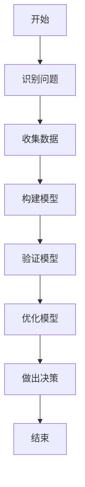
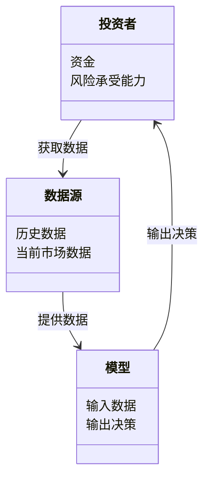
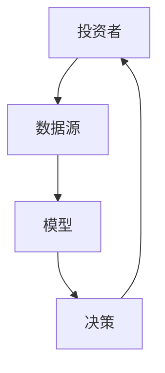

                 


# 芒格的"跨学科学习"在投资视野拓展中的应用

## 关键词：芒格，跨学科学习，多元思维模型，投资分析，系统架构，Python实现

## 摘要：芒格的"跨学科学习"在投资视野拓展中的应用，通过介绍芒格的多元思维模型，分析其在投资决策中的应用，探讨如何利用跨学科学习提升投资分析能力。结合实际案例，展示多元思维模型的数学模型、算法实现及系统架构设计，帮助读者理解其在投资中的应用。

---

## 第一部分：背景介绍

### 第1章：芒格的跨学科学习概述

#### 1.1 芒格的生平与投资理念

- 1.1.1 芝加格大学者与巴菲特的黄金搭档
  - 芒格的学术背景与职业经历
  - 芒格与巴菲特的合作关系
- 1.1.2 芒格的跨学科学习方法
  - 多元思维模型的起源与核心思想
  - 跨学科学习在芒格投资决策中的作用
- 1.1.3 投资视野拓展的核心理念
  - 如何通过跨学科学习提升投资决策能力
  - 跨学科学习对投资分析的深远影响

#### 1.2 跨学科学习的定义与背景

- 1.2.1 跨学科学习的定义
  - 跨学科学习的定义与特点
  - 跨学科学习与单一学科学习的对比
- 1.2.2 跨学科学习的背景与现状
  - 当前投资领域的知识碎片化问题
  - 跨学科学习在投资领域的必要性
- 1.2.3 跨学科学习在投资中的重要性
  - 跨学科学习如何帮助投资者全面分析问题
  - 跨学科学习在风险管理中的应用

#### 1.3 芒格的多元思维模型

- 1.3.1 多元思维模型的核心概念
  - 多元思维模型的定义与核心要素
  - 多元思维模型与传统投资分析方法的对比
- 1.3.2 多元思维模型的特点
  - 跨学科整合性
  - 系统性与全局性
  - 灵活性与适应性
- 1.3.3 多元思维模型与其他投资方法的对比
  - 基本面分析法
  - 技术分析法
  - 量化投资法
  - 芒格多元思维模型的优势与劣势

---

## 第二部分：核心概念与联系

### 第2章：多元思维模型的原理与应用

#### 2.1 多元思维模型的原理

- 2.1.1 多元思维模型的数学基础
  - 多元思维模型的数学模型
  - 投资决策的数学表达
- 2.1.2 多元思维模型的逻辑结构
  - 知识整合的逻辑框架
  - 投资决策的逻辑路径
- 2.1.3 多元思维模型的属性特征对比表格
  | 特性 | 单一学科模型 | 多元思维模型 |
  |------|--------------|--------------|
  | 分析维度 | 单一 | 多维 |
  | 分析深度 | 深入 | 全面 |
  | 灵活性 | 低 | 高 |

#### 2.2 多元思维模型的ER实体关系图

```mermaid
erDiagram
    actor 投资者
    actor 环境
    actor 数据源
    entity 信息
    entity 模型
    entity 决策
    投资者 --> 信息: 使用
    环境 --> 信息: 提供
    数据源 --> 信息: 提供
    信息 --> 模型: 输入
    模型 --> 决策: 输出
```

#### 2.3 多元思维模型的算法流程图



---

## 第三部分：算法原理讲解

### 第3章：多元思维模型的算法实现

#### 3.1 算法原理

- 3.1.1 算法的基本原理
  - 多元思维模型的算法流程
  - 算法的核心步骤
- 3.1.2 算法的数学模型
  - 投资回报率计算公式
  - 风险评估模型
  - 投资组合优化算法
- 3.1.3 算法的实现步骤
  - 数据预处理
  - 模型构建
  - 模型验证
  - 模型优化

#### 3.2 算法的Python实现

- 3.2.1 环境安装与配置
  - 安装Python和相关库
  - 安装Jupyter Notebook
  - 安装数据可视化库（Matplotlib、Seaborn）
- 3.2.2 核心代码实现
  ```python
  import numpy as np
  import pandas as pd
  from sklearn import linear_model
  import matplotlib.pyplot as plt

  # 示例数据
  data = pd.DataFrame({
      '因素1': np.random.rand(100),
      '因素2': np.random.rand(100),
      '目标': np.random.rand(100)
  })

  # 构建多元回归模型
  model = linear_model.LinearRegression()
  model.fit(data[['因素1', '因素2']], data['目标'])

  # 输出系数
  print(model.coef_)
  ```

---

## 第四部分：数学模型与系统架构

### 第4章：多元思维模型的数学模型

#### 4.1 数学模型的构建

- 4.1.1 投资回报率的数学表达
  $$ ROI = \frac{利润}{投资} \times 100\% $$
- 4.1.2 风险评估模型
  $$ 风险 = 标准差 \times \sqrt{T} $$
  其中，T是时间单位
- 4.1.3 投资组合优化模型
  $$ max \sum_{i=1}^{n} w_i R_i - \lambda \sum_{i=1}^{n} w_i^2 \sigma_i^2 $$
  其中，\( w_i \)是投资比例，\( R_i \)是预期回报率，\( \sigma_i^2 \)是风险，\( \lambda \)是风险厌恶系数

#### 4.2 系统架构设计

- 4.2.1 系统功能设计（领域模型）


- 4.2.2 系统架构设计


---

## 第五部分：项目实战

### 第5章：多元思维模型的实际应用

#### 5.1 项目介绍

- 5.1.1 项目背景
  - 某公司投资分析案例
- 5.1.2 项目目标
  - 应用多元思维模型进行投资决策
- 5.1.3 项目需求
  - 数据收集与分析
  - 模型构建与验证
  - 投资决策支持

#### 5.2 核心代码实现

- 5.2.1 数据预处理
  ```python
  import pandas as pd
  data = pd.read_csv('投资数据.csv')
  data = data.dropna()
  ```

- 5.2.2 模型构建与验证
  ```python
  from sklearn.model_selection import train_test_split
  from sklearn.metrics import accuracy_score

  X = data.drop('目标', axis=1)
  y = data['目标']
  X_train, X_test, y_train, y_test = train_test_split(X, y, test_size=0.2)

  model = linear_model.LinearRegression()
  model.fit(X_train, y_train)
  y_pred = model.predict(X_test)
  print(accuracy_score(y_test, y_pred))
  ```

- 5.2.3 模型优化
  ```python
  from sklearn.ensemble import RandomForestRegressor

  model = RandomForestRegressor(n_estimators=100)
  model.fit(X_train, y_train)
  y_pred = model.predict(X_test)
  print(accuracy_score(y_test, y_pred))
  ```

#### 5.3 案例分析

- 5.3.1 案例背景
  - 公司基本面分析
  - 市场环境分析
- 5.3.2 数据收集与分析
  - 财务数据、行业数据、宏观经济数据
- 5.3.3 模型应用
  - 构建多元回归模型
  - 模型验证与优化
  - 投资决策支持

---

## 第六部分：最佳实践

### 第6章：总结与展望

#### 6.1 最佳实践 tips

- 投资分析中的多元思维模型应用
  - 多元思维模型的优势
  - 注意事项
  - 常见问题与解决方案

#### 6.2 小结

- 芒格的跨学科学习方法
  - 多元思维模型的核心思想
  - 投资分析中的应用
  - 未来发展趋势

#### 6.3 注意事项

- 数据质量的重要性
- 模型的局限性
- 风险管理的重要性

#### 6.4 拓展阅读

- 推荐书籍与文章
  - 《芒格的多元思维模型》
  - 《投资学原理》
  - 《Python在金融中的应用》

---

## 附录

### 附录A：数学公式汇总

- 多元回归模型公式
  $$ Y = \beta_0 + \beta_1 X_1 + \beta_2 X_2 + \epsilon $$
- 风险评估公式
  $$ 标准差 = \sqrt{\sum (x_i - \mu)^2 / N} $$

### 附录B：Python代码库

- 数据处理库：Pandas、NumPy
- 可视化库：Matplotlib、Seaborn
- 机器学习库：Scikit-learn、XGBoost

### 附录C：参考文献

- 芒格的经典著作
- 相关学术论文
- 网络资源与在线课程

---

## 结束语

芒格的跨学科学习方法为投资分析提供了全新的视角。通过多元思维模型，投资者能够更好地整合不同领域的知识，做出更明智的决策。未来，随着技术的进步和数据的丰富，多元思维模型在投资中的应用将更加广泛和深入。

