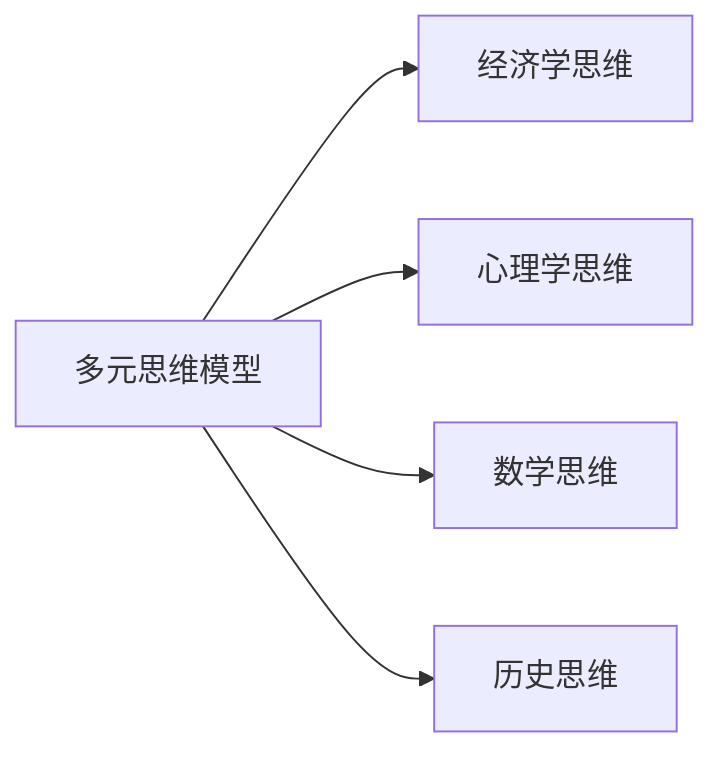
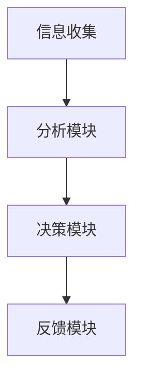

                 


# 芒格的跨学科学习方法：拓宽投资视野

## 关键词
芒格、跨学科学习、投资视野、多元思维模型、系统架构、数学模型

## 摘要
本文深入探讨了芒格的跨学科学习方法，特别是其在投资领域的应用。通过分析芒格的多元思维模型、逆向思维和能力圈等核心概念，结合算法原理和数学模型，展示了如何将这些方法系统化地应用于投资决策中。文章还通过实际案例分析，详细讲解了如何构建和优化投资系统，帮助读者提升跨学科学习的能力，拓宽投资视野。

---

## 第1章：芒格的生平与投资理念

### 1.1 芒格的生平简介
查理·芒格（Charlie Munger）是世界著名投资者和作家，以其独特的投资理念和跨学科学习方法闻名。他早年就读于哈佛大学，后转学到加州大学伯克利分校，获得数学学士学位。芒格的职业生涯始于法律界，后来转向投资领域，与沃伦·巴菲特共同创立了伯克希尔哈撒韦公司。

### 1.2 芒格的投资理念
芒格的价值投资理念强调长期主义和安全边际。他认为，投资者应该寻找那些具有持续竞争优势和良好管理的公司，并在市场低估时进行投资。芒格的长期主义理念要求投资者不仅关注短期收益，还要关注企业的长期价值。

### 1.3 芒格的跨学科学习方法
芒格的跨学科学习方法强调多元思维模型的应用。他认为，投资者应该具备多个学科的知识，以便从不同的角度分析问题。这种思维方式能够帮助投资者避免单一思维的局限性，从而做出更明智的投资决策。

---

## 第2章：多元思维模型的构建

### 2.1 多元思维模型的定义与特点
多元思维模型是指通过多个学科的思维方式来分析问题，从而形成全面的理解。其特点包括多样性、互补性和系统性。

### 2.2 多元思维模型的核心要素
多元思维模型的核心要素包括经济学思维、心理学思维、数学思维和历史思维。这些思维方式相互补充，帮助投资者全面分析问题。

### 2.3 多元思维模型的实体关系图


---

## 第3章：芒格的决策算法

### 3.1 芒格决策算法的流程
芒格的决策算法是一个系统化的流程，包括问题识别、信息收集、模型构建、决策判断和结果反馈。

### 3.2 芒格决策算法的数学模型
芒格的决策算法可以表示为一个期望值模型：
$$E = \sum p_i x_i$$
其中，\(E\) 是期望值，\(p_i\) 是每个结果的概率，\(x_i\) 是结果的值。

---

## 第4章：系统分析与架构设计

### 4.1 投资决策系统的架构设计
投资决策系统的架构包括信息收集模块、分析模块、决策模块和反馈模块。

### 4.2 投资决策系统的架构图


---

## 第5章：项目实战

### 5.1 环境安装
需要安装Python、Jupyter Notebook和相关库（如pandas、numpy、matplotlib）。

### 5.2 核心实现源代码
以下是一个简单的多元思维模型应用的Python代码示例：
```python
import pandas as pd
import numpy as np

# 数据预处理
data = pd.read_csv('data.csv')
data_clean = data.dropna()

# 基于多元思维模型的分析
def analyze_data(data):
    economic_factors = data['economic_factors']
    psychological_factors = data['psychological_factors']
    return economic_factors, psychological_factors

economic_factors, psychological_factors = analyze_data(data_clean)
```

---

## 第6章：总结与最佳实践

### 6.1 总结
芒格的跨学科学习方法强调多元思维模型的应用，帮助投资者做出更明智的投资决策。

### 6.2 最佳实践 tips
1. 培养跨学科学习的能力。
2. 使用多元思维模型分析问题。
3. 避免过度依赖单一学科的思维方式。

### 6.3 注意事项
- 投资者应根据实际情况调整多元思维模型的应用。
- 需要不断更新知识，以适应变化的市场环境。

### 6.4 拓展阅读
- 《芒格主义》
- 《思考，快与慢》

---

通过以上内容，我们可以看到芒格的跨学科学习方法不仅是一种思维方式，更是一种系统化的投资策略。希望本文能够帮助读者更好地理解和应用这种方法，拓宽投资视野。

