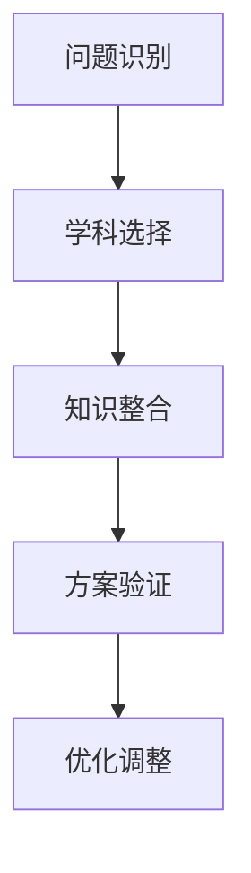
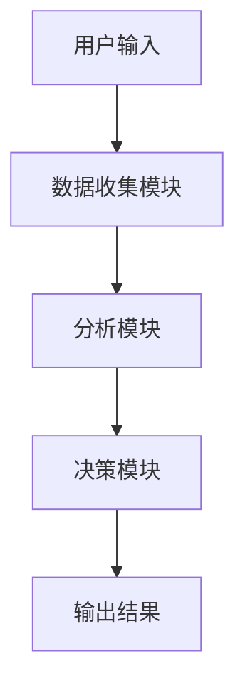

                 

# 芒格的"跨学科"学习：拓宽投资视野的重要性

## 关键词：跨学科学习、芒格、投资视野、思维模型、知识整合

## 摘要：  
芒格以其独特的"跨学科"学习方法闻名，这种方法不仅帮助他在投资领域取得了巨大成功，也为现代技术领域提供了宝贵的启示。本文将详细探讨芒格的跨学科学习理念、方法及其在投资中的应用，同时结合技术领域的实际情况，分析如何通过跨学科学习来拓宽投资视野，提升决策能力。

---

# 第一部分：芒格的"跨学科"学习背景与重要性

## 第1章：芒格的生平与跨学科思维的起源

### 1.1 芒格的早年经历  
查理·芒格（Charlie Munger）是美国著名的投资者和思想家，与沃伦·巴菲特（Warren Buffett）共同创立了伯克希尔哈撒韦公司。芒格的早年生活并不富裕，但他从小就展现出对知识的极大兴趣。他在哈佛大学完成了本科学习后，转向法律专业，并最终成为一名成功的律师。然而，芒格的兴趣并不局限于法律领域，他广泛涉猎哲学、心理学、经济学、物理学等多个学科。

#### 1.1.1 芒格的早年经历  
- 查理·芒格出生于1924年，早年在密歇根州长大。  
- 他在哈佛大学完成了本科学习，随后转入贾德森大学（Judson College）继续学习。  
- 芒格对哲学和科学有着浓厚的兴趣，这为他后来的跨学科学习奠定了基础。

#### 1.1.2 芒格与巴菲特的合作历程  
- 1957年，芒格与巴菲特相识，并逐渐建立了深厚的友谊。  
- 芒格的投资理念与巴菲特的价值投资理念相辅相成，两人共同创立了伯克希尔哈撒韦公司，并取得了巨大成功。

#### 1.1.3 芒格的学术背景与知识储备  
- 芒格拥有法律背景，但他对经济学、心理学、哲学等领域有着深厚的造诣。  
- 他的跨学科学习方法使他能够从多个角度分析问题，从而做出更明智的投资决策。

### 1.2 跨学科思维的定义与特点  

#### 1.2.1 跨学科思维的核心概念  
- 跨学科思维是指将不同学科的知识、方法和视角结合起来，以解决复杂问题的一种思维方式。  
- 它强调知识的整合与应用，而非单一学科的孤立使用。

#### 1.2.2 跨学科思维与单一学科思维的对比  
| 对比维度      | 单一学科思维                     | 跨学科思维                     |
|---------------|----------------------------------|----------------------------------|
| 知识基础      | 仅限于单一学科                   | 跨越多个学科                   |
| 问题解决      | 偏好单一学科的方法               | 综合多种学科的方法               |
| 创新能力      | 较低                            | 较高                            |

#### 1.2.3 跨学科思维在投资中的重要性  
- 跨学科思维使投资者能够从多个角度分析企业的价值，避免单一视角的局限性。  
- 例如，通过心理学理解市场情绪，通过经济学分析行业趋势，通过物理学理解企业的技术优势。

### 1.3 跨学科学习在投资中的应用  

#### 1.3.1 跨学科学习的起源与演变  
- 跨学科学习并非芒格首创，但他在投资领域的成功应用使其广为人知。  
- 20世纪中叶，随着金融市场的复杂化，单一学科的分析方法逐渐显现出不足，跨学科学习应运而生。

#### 1.3.2 跨学科学习在投资决策中的作用  
- 芒格通过跨学科学习，能够从物理学、心理学、经济学等多个角度分析企业的经营状况和行业趋势。  
- 例如，他利用物理学的杠杆原理分析企业的财务杠杆风险。

#### 1.3.3 跨学科学习对投资视野的拓展  
- 跨学科学习使芒格能够看到投资机会背后更深层次的逻辑。  
- 例如，他通过心理学研究市场情绪，从而在市场恐慌时发现投资机会。

---

## 第2章：芒格的"跨学科"学习方法

### 2.1 芒格的"跨学科"学习理念  

#### 2.1.1 芒格的"跨学科"学习理念  
- 芒格认为，投资是一项终身学习的事业，而跨学科学习是理解复杂系统的最佳方法。  
- 他强调，投资者必须具备广泛的知识储备，才能在面对复杂问题时做出明智决策。

#### 2.1.2 芒格的"跨学科"学习步骤  
1. **确定学习目标**：明确要解决的问题，例如分析一家企业的竞争优势。  
2. **选择相关学科**：根据问题选择相关的学科，例如分析企业的财务状况时，需要学习会计学和经济学。  
3. **系统学习**：深入学习选定学科的核心知识，建立知识框架。  
4. **整合知识**：将不同学科的知识结合起来，形成解决问题的综合方法。  
5. **实践应用**：通过实际案例检验学习成果，不断调整和完善。

#### 2.1.3 芒格的"跨学科"学习工具  
- **书籍**：芒格推荐了大量经典著作，如《心理会计学》、《经济学原理》等。  
- **案例分析**：通过分析历史投资案例，学习如何应用跨学科学习方法。  
- **思维导图**：绘制知识框架，帮助整理和整合不同学科的知识。

### 2.2 芒格的"跨学科"学习实践  

#### 2.2.1 芒格的"跨学科"学习案例  
- 芒格在分析可口可乐公司时，结合了经济学（市场垄断）、心理学（消费者行为）和物理学（产品稳定性）等多个学科的知识。  
- 他通过分析可口可乐的市场地位和品牌价值，判断其长期投资价值。

#### 2.2.2 芒格的"跨学科"学习成果  
- 芒格的成功投资案例证明了跨学科学习的有效性。  
- 例如，他对苹果公司的分析结合了技术（产品创新）和市场（消费者需求）等多个因素。

#### 2.2.3 芒格的"跨学科"学习  
- 芒格的跨学科学习方法不仅适用于投资，还可以应用于其他领域，例如技术开发和项目管理。  
- 通过跨学科学习，技术开发者可以更好地理解用户需求，设计出更符合市场需求的产品。

---

# 第二部分：芒格"跨学科"学习方法的技术应用

## 第3章：芒格"跨学科"学习方法的核心概念

### 3.1 芒格"跨学科"学习的核心原理  

#### 3.1.1 芒格"跨学科"学习的核心原理  
- 芒格的跨学科学习方法强调知识的整合与应用。  
- 通过将不同学科的知识结合起来，芒格能够从多个角度分析问题，从而做出更明智的决策。

#### 3.1.2 芒格"跨学科"学习的核心要素  
1. **知识整合**：将不同学科的知识结合起来，形成统一的知识框架。  
2. **问题分析**：从多个角度分析问题，避免单一视角的局限性。  
3. **决策优化**：通过跨学科学习，优化决策过程，提高决策质量。

### 3.2 芒格"跨学科"学习方法的优势  

#### 3.2.1 芒格"跨学科"学习方法的优势  
- **全面性**：跨学科学习能够覆盖多个学科的知识，提供更全面的分析视角。  
- **创新性**：跨学科学习能够激发创新思维，发现新的解决方案。  
- **实用性**：跨学科学习能够提高实际问题的解决能力。

#### 3.2.2 芒格"跨学科"学习方法的挑战  
- **知识广度**：跨学科学习需要掌握大量知识，对学习者提出了更高的要求。  
- **时间成本**：跨学科学习需要投入更多的时间和精力，对学习者的耐心和毅力提出了挑战。

---

## 第4章：芒格"跨学科"学习方法的算法原理

### 4.1 芒格"跨学科"学习方法的算法步骤  

#### 4.1.1 芒格"跨学科"学习方法的算法步骤  
1. **问题识别**：明确需要解决的问题。  
2. **学科选择**：根据问题选择相关的学科。  
3. **知识整合**：将不同学科的知识整合起来，形成解决方案。  
4. **方案验证**：通过实际案例验证解决方案的可行性。  
5. **优化调整**：根据验证结果优化解决方案。

#### 4.1.2 芒格"跨学科"学习方法的算法流程图  

### 4.2 芒格"跨学科"学习方法的数学模型  

#### 4.2.1 芒格"跨学科"学习方法的数学模型  
- 芒格的跨学科学习方法可以看作是一种多维度分析模型，结合了多个学科的知识和方法。

#### 4.2.2 芒格"跨学科"学习方法的公式表示  
$$ \text{投资价值} = \sum_{i=1}^{n} w_i \cdot x_i $$
其中，\( w_i \) 是第 \( i \) 个学科的权重，\( x_i \) 是第 \( i \) 个学科的分析结果。

---

## 第5章：芒格"跨学科"学习方法的系统架构设计

### 5.1 投资决策系统的系统架构  

#### 5.1.1 投资决策系统的系统架构  
- **输入层**：接收市场数据、企业信息等输入。  
- **处理层**：对输入数据进行分析和处理，结合不同学科的知识。  
- **输出层**：输出投资决策结果。

#### 5.1.2 投资决策系统的功能模块  
1. **数据收集模块**：收集市场数据、企业信息等。  
2. **分析模块**：对数据进行多学科分析。  
3. **决策模块**：根据分析结果做出投资决策。

### 5.2 投资决策系统的交互设计  

#### 5.2.1 投资决策系统的交互流程  
1. 用户输入需要分析的企业信息。  
2. 系统对输入数据进行多学科分析。  
3. 系统输出投资决策结果。

#### 5.2.2 投资决策系统的交互流程图  

---

## 第6章：芒格"跨学科"学习方法的项目实战

### 6.1 项目背景与目标  

#### 6.1.1 项目背景  
- 投资者需要通过跨学科学习，提高投资决策能力。  
- 本项目旨在通过跨学科学习方法，分析一家企业的投资价值。

#### 6.1.2 项目目标  
- 分析一家企业的投资价值。  
- 提供投资决策建议。

### 6.2 项目核心实现  

#### 6.2.1 数据收集与分析  
- 收集企业的财务数据、市场数据等。  
- 通过多学科分析，评估企业的投资价值。

#### 6.2.2 投资决策建议  
- 根据分析结果，提供投资决策建议。  
- 例如，建议投资者买入、持有或卖出某只股票。

### 6.3 项目总结  

#### 6.3.1 项目成果  
- 成功分析一家企业的投资价值。  
- 提供了具体的投资决策建议。

#### 6.3.2 项目经验  
- 跨学科学习能够显著提高投资决策的准确性。  
- 投资者需要不断学习和实践，才能掌握跨学科学习方法。

---

## 第7章：芒格"跨学科"学习方法的总结与展望

### 7.1 总结  

#### 7.1.1 芒格"跨学科"学习方法的核心观点  
- 跨学科学习能够帮助投资者从多个角度分析问题，提高决策能力。  
- 芒格的成功案例证明了跨学科学习的有效性。

#### 7.1.2 芒格"跨学科"学习方法的实际应用  
- 跨学科学习不仅适用于投资领域，还可以应用于其他领域。  
- 例如，技术开发者可以通过跨学科学习，设计出更符合市场需求的产品。

### 7.2 展望  

#### 7.2.1 芒格"跨学科"学习方法的未来发展  
- 随着技术的进步，跨学科学习的重要性将更加凸显。  
- 未来，跨学科学习将在更多领域得到应用。

#### 7.2.2 芒格"跨学科"学习方法的技术创新  
- 结合人工智能和大数据技术，跨学科学习将更加高效和智能化。  
- 例如，通过机器学习算法，自动整合和分析多个学科的知识。

---

## 参考文献  

1. 芒格的著作和演讲。  
2. 投资领域的相关书籍和论文。  
3. 技术领域的相关书籍和论文。  

---

通过芒格的"跨学科"学习方法，投资者可以更好地理解复杂的市场环境，做出更明智的投资决策。同时，这种方法也为技术领域提供了宝贵的启示，帮助技术开发者更好地应对复杂的技术挑战。希望本文能够为读者提供有价值的见解，启发更多人探索跨学科学习的潜力。

