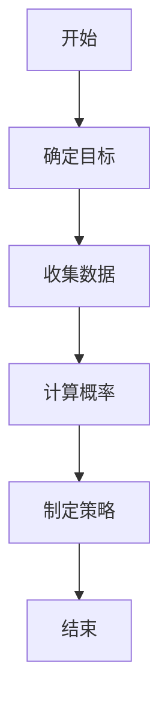
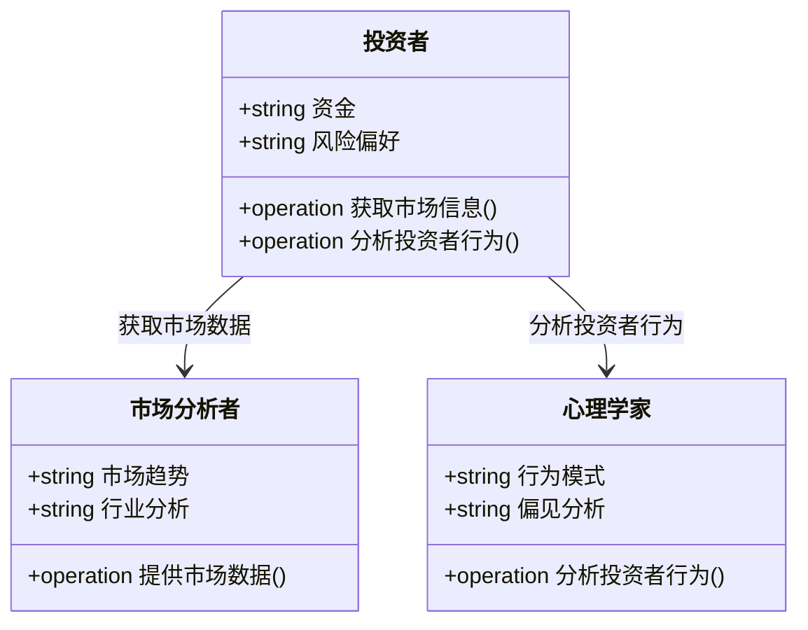
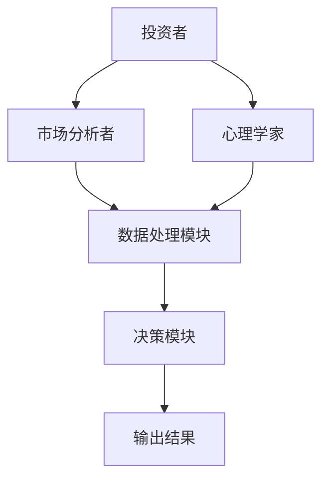
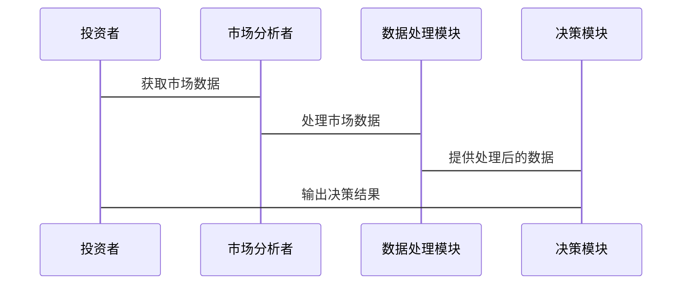

                 


# 芒格的跨界思维：将不同领域的知识应用于投资决策

## 关键词：芒格、跨界思维、多元思维模型、投资决策、系统分析

## 摘要：芒格的跨界思维是一种通过整合多个领域的知识和经验来优化投资决策的方法。本文将详细探讨芒格的跨界思维模型，包括其核心概念、算法原理、系统架构以及实际应用案例。通过分析芒格的方法，读者将学会如何在投资决策中应用多元思维模型，提升决策的广度和深度，从而实现更高效的投资策略。

---

## 第一部分：芒格的跨界思维概述

### 第1章：芒格的跨界思维概述

#### 1.1 芒格的跨界思维背景

##### 1.1.1 投资决策中的问题背景
投资决策是一个复杂的系统性问题，传统的投资方法往往局限于单一领域，难以全面评估风险和机会。芒格的跨界思维通过整合物理学、心理学、经济学等多个领域的知识，提供了一种更全面的决策框架。

##### 1.1.2 芒格思维的起源与特点
芒格的跨界思维起源于他对知识的广泛涉猎和对复杂问题的深入分析。其特点包括知识的跨界整合、系统的思维方式以及长期的价值观导向。

##### 1.1.3 跨界思维的核心概念
跨界思维的核心在于将不同领域的知识和经验结合起来，形成一个完整的知识体系，从而在投资决策中做出更明智的选择。

#### 1.2 芒格思维与其他投资方法的对比

##### 1.2.1 传统投资方法的局限性
传统投资方法通常依赖于单一的市场分析或技术分析，忽视了其他领域的信息，容易导致决策偏差。

##### 1.2.2 芒格思维的独特优势
芒格思维通过整合多领域的知识，能够更全面地评估投资机会和风险，从而提高决策的准确性和稳健性。

##### 1.2.3 跨界思维在投资中的应用范围
跨界思维不仅适用于股票投资，还可应用于房地产、创业投资等领域，其应用范围非常广泛。

---

### 第2章：多元思维模型的原理与应用

#### 2.1 多元思维模型的定义与特点

##### 2.1.1 多元思维模型的核心要素
多元思维模型包括多个学科的基本原理和工具，如物理学的热力学、经济学的供求关系、心理学的行为模式等。

##### 2.1.2 多元思维模型的属性特征对比表

| 特性 | 描述 |
|------|------|
| 宽度 | 跨界性 |
| 深度 | 专业性 |
| 灵活性 | 适应性 |

##### 2.1.3 ER实体关系图架构
```mermaid
erDiagram
    actor 投资者 {
        +string 资金 : 投资金额
        +string 风险 : 风险偏好
    }
    actor 市场分析者 {
        +string 市场趋势 : 市场状况
        +string 行业分析 : 行业动态
    }
    actor 心理学家 {
        +string 行为模式 : 投资者行为
        +string 偏见分析 : 认知偏差
    }
    投资者 --> 市场分析者 : 获取市场信息
    投资者 --> 心理学家 : 分析投资者行为
```

---

#### 2.2 多元思维模型的数学模型与公式

##### 2.2.1 投资决策中的概率模型


##### 2.2.2 投资组合优化的数学公式
$$ \text{收益} = \sum_{i=1}^{n} w_i r_i $$
其中，\( w_i \) 是第 \( i \) 个资产的权重，\( r_i \) 是第 \( i \) 个资产的预期收益。

##### 2.2.3 多元思维模型的公式推导
$$ \text{风险调整后收益} = \text{收益} - \text{风险成本} $$

---

### 第3章：多元思维模型的算法原理

#### 3.1 投资决策中的概率算法

##### 3.1.1 概率算法的流程图


##### 3.1.2 概率算法的Python实现代码
```python
import numpy as np

def calculate_probability(data):
    probabilities = {}
    for outcome in data:
        if outcome in probabilities:
            probabilities[outcome] += 1
        else:
            probabilities[outcome] = 1
    total = len(data)
    for outcome in probabilities:
        probabilities[outcome] /= total
    return probabilities

# 示例数据
data = [1, 2, 3, 2, 2, 3, 1]
probabilities = calculate_probability(data)
print(probabilities)
```

##### 3.1.3 概率算法的数学模型
$$ P(A|B) = \frac{P(B|A)P(A)}{P(B)} $$

#### 3.2 投资组合优化的算法

##### 3.2.1 投资组合优化的流程图


##### 3.2.2 投资组合优化的Python实现代码
```python
import numpy as np

def optimize_portfolio(returns, weights):
    # 计算预期收益
    expected_return = np.sum(returns * weights)
    # 计算风险
    covariance_matrix = np.cov(returns)
    risk = np.sqrt(np.dot(weights.T, covariance_matrix * weights))
    return expected_return, risk

# 示例数据
returns = np.array([0.1, 0.2, 0.15])
weights = np.array([0.3, 0.5, 0.2])
expected_return, risk = optimize_portfolio(returns, weights)
print(expected_return, risk)
```

##### 3.2.3 投资组合优化的数学模型
$$ \text{最大化} \sum_{i=1}^{n} w_i r_i - \lambda \sum_{i=1}^{n} \sum_{j=1}^{n} w_i w_j \sigma_{i,j} $$

---

### 第4章：投资决策系统的分析与设计

#### 4.1 投资决策系统的功能设计

##### 4.1.1 问题场景介绍
投资决策系统旨在帮助投资者通过多元思维模型进行决策，包括数据收集、分析、策略制定等环节。

##### 4.1.2 系统功能设计（领域模型）


##### 4.1.3 系统架构设计（架构图）


##### 4.1.4 系统交互设计（序列图）


---

## 第五部分：项目实战

### 第5章：多元思维模型的实际应用

#### 5.1 环境配置与数据收集
- 环境：Python 3.8+, numpy, pandas
- 数据来源：股票市场数据、行业报告、投资者行为数据

#### 5.2 系统核心实现源代码
```python
import numpy as np
import pandas as pd

def calculate_investment_return(data, weights):
    return np.dot(data, weights)

# 示例数据
data = pd.DataFrame({
    '股票A': [0.1, 0.2, 0.15],
    '股票B': [0.05, 0.1, 0.08],
    '股票C': [0.08, 0.06, 0.07]
})

weights = np.array([0.3, 0.4, 0.3])
returns = calculate_investment_return(data, weights)
print(returns)
```

#### 5.3 投资案例分析与解读
- 案例：分析某公司的投资价值，结合市场趋势、行业地位、财务状况等因素，应用多元思维模型进行决策。

#### 5.4 代码实现与分析
- 代码实现：基于多元思维模型，编写投资决策系统的核心模块。
- 代码分析：解释代码的功能、实现方法和优化技巧。

#### 5.5 项目小结
- 总结：通过实际案例，验证多元思维模型的有效性，总结经验教训。

---

## 第六部分：总结与展望

### 第6章：芒格思维的核心要点与未来展望

#### 6.1 芒格思维的核心要点
- 多元思维模型的重要性
- 跨界知识整合的必要性
- 长期价值投资的理念

#### 6.2 未来展望
- 人工智能在投资决策中的应用
- 多元思维模型的进一步优化
- 新兴领域的知识整合

---

## 总结
芒格的跨界思维通过整合多领域的知识，为投资决策提供了全新的视角和方法。本文详细介绍了芒格思维的原理、算法、系统设计以及实际应用，帮助读者在投资决策中实现更高效和准确的判断。未来，随着技术的进步和知识的积累，跨界思维的应用将更加广泛和深入。

