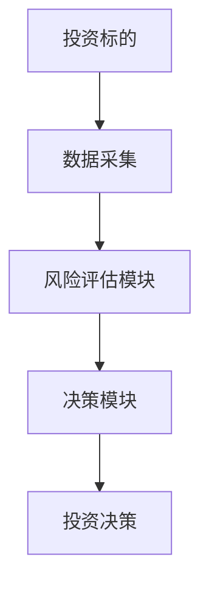

                 


# 《芒格的"远离"策略在前沿科技投资中的重要性》

---

## 关键词：芒格、投资策略、远离策略、前沿科技、风险管理、科技投资、投资哲学

---

## 摘要：  
芒格的“远离”策略是一种基于风险管理的投资哲学，强调通过识别和避免高风险领域的投资来实现长期稳健的收益。在前沿科技投资中，这种策略尤为重要，因为这些领域的不确定性和波动性极高。本文将深入探讨芒格“远离”策略的核心理念，分析其在人工智能、区块链和生物技术等前沿科技领域的具体应用，并结合实际案例，总结如何通过“远离”策略在科技投资中实现风险控制和价值创造。

---

## 正文

### # 第一部分：芒格“远离”策略的背景与核心理念

#### ## 第1章：芒格“远离”策略的基本概念与理论基础

##### ### 1.1 芒格“远离”策略的核心理念

###### ###### 1.1.1 什么是“远离”策略  
芒格的“远离”策略是一种以风险管理为核心的投资哲学。它强调通过识别和避免那些具有高度不确定性、高风险或不可持续性的投资领域，来降低投资组合的整体风险。芒格认为，投资者的时间和精力有限，与其在众多领域中分散投资，不如专注于少数具有确定性和长期潜力的优质资产。

###### ###### 1.1.2 “远离”策略的哲学基础  
芒格的投资哲学深受价值投资理论的影响，但他更加强调对风险的规避。他认为，市场的不确定性、技术的快速变化以及人类认知的局限性，使得许多投资领域充满了陷阱。通过“远离”这些不确定性较高的领域，投资者可以避免重大损失，并将精力集中在那些具有明确竞争优势和长期增长潜力的领域。

###### ###### 1.1.3 芒格投资理念的演变与特点  
芒格的投资理念从早期的“寻找优秀的投资机会”逐渐转变为“通过避免错误来实现投资成功”。他的“远离”策略并不是消极的投资态度，而是一种高度理性化的风险管理方法。他强调，投资者必须具备对风险的敏感性和对市场的深刻理解，才能有效地实施“远离”策略。

##### ### 1.2 前沿科技投资的特殊性与挑战

###### ###### 1.2.1 前沿科技的定义与特征  
前沿科技通常指那些处于技术发展前沿、具有较高创新性和潜力的领域，如人工智能、区块链、生物技术等。这些领域的特点是技术变化快、市场不确定性高、竞争激烈且投资门槛高。

###### ###### 1.2.2 前沿科技投资的主要风险  
1. **技术风险**：前沿科技领域技术更新换代快，许多项目可能因为技术不成熟或替代技术的出现而失败。  
2. **市场风险**：前沿科技市场的波动性极高，投资者可能面临价格剧烈波动的风险。  
3. **竞争风险**：许多前沿科技领域竞争激烈，企业可能因为无法持续创新或成本过高而被淘汰。  
4. **政策风险**：前沿科技往往涉及政策敏感性较高的领域，政策的变化可能对投资产生重大影响。

###### ###### 1.2.3 芒格“远离”策略在科技投资中的适用性  
芒格的“远离”策略特别适合前沿科技投资，因为这些领域的高不确定性和高风险使得传统的价值投资方法难以适用。通过“远离”策略，投资者可以避免那些风险过高或不具备长期竞争优势的项目，从而将投资集中在那些真正具有潜力的领域。

##### ### 1.3 “远离”策略与传统投资策略的对比

###### ###### 1.3.1 传统投资策略的优缺点  
1. **优点**：传统投资策略注重基本面分析，通过寻找具有强大财务表现和竞争优势的企业进行投资。这种方法在成熟市场中表现良好。  
2. **缺点**：在前沿科技领域，传统策略可能因为技术的快速变化和市场的不确定性而失效。此外，传统策略通常需要大量的资金和长期的持股，这在前沿科技领域可能不太适用。

###### ###### 1.3.2 “远离”策略的独特优势  
1. **风险控制**：通过避免高风险领域，投资者可以降低投资组合的整体风险。  
2. **专注优质资产**：芒格的“远离”策略强调专注于那些具有明确竞争优势和长期增长潜力的领域，从而提高了投资的效率。  
3. **灵活性**：与传统策略相比，“远离”策略更具灵活性，可以根据市场变化随时调整投资方向。

###### ###### 1.3.3 两种策略的适用场景分析  
- **传统投资策略适用的场景**：成熟市场、具有稳定财务表现和竞争优势的企业。  
- **“远离”策略适用的场景**：前沿科技领域、高不确定性和高风险的市场。

---

### # 第二部分：芒格“远离”策略在前沿科技投资中的具体应用

#### ## 第2章：前沿科技领域的投资风险分析

##### ### 2.1 人工智能领域的投资风险

###### ###### 2.1.1 人工智能技术的不确定性  
人工智能技术的快速发展带来了许多不确定性。许多人工智能初创企业可能因为技术不成熟或市场需求不足而失败。

###### ###### 2.1.2 人工智能企业的财务风险  
人工智能企业的研发投入高，盈利周期长。许多企业可能因为无法实现盈利而面临财务危机。

###### ###### 2.1.3 人工智能市场的竞争风险  
人工智能市场竞争激烈，许多企业可能因为无法持续创新或成本过高而被淘汰。

##### ### 2.2 区块链技术的投资风险

###### ###### 2.2.1 区块链技术的成熟度问题  
区块链技术尚未完全成熟，许多项目可能因为技术不完善或应用不明确而失败。

###### ###### 2.2.2 区块链项目的合规性风险  
区块链项目可能面临政策监管和合规性问题，尤其是在加密货币和去中心化金融领域。

###### ###### 2.2.3 区块链市场的波动性风险  
区块链市场的波动性极高，价格可能因为市场情绪的变化而剧烈波动。

##### ### 2.3 生物技术领域的投资风险

###### ###### 2.3.1 生物技术的研发周期长  
生物技术的研发周期长，许多项目可能因为研发失败或成本过高而失败。

###### ###### 2.3.2 生物技术的伦理问题  
生物技术可能涉及伦理问题，尤其是在基因编辑和人工器官等领域。

###### ###### 2.3.3 生物技术的政策风险  
生物技术可能面临严格的政策监管，尤其是在药品审批和基因编辑等领域。

#### ## 第3章：基于芒格“远离”策略的投资决策模型

##### ### 3.1 算法原理与数学模型

###### ###### 3.1.1 算法原理  
基于芒格“远离”策略的投资决策模型是一个基于风险控制的算法。该算法通过分析投资标的的风险特征，判断是否符合“远离”策略的要求。

###### ###### 3.1.2 数学模型  
以下是基于“远离”策略的风险评估模型：

$$ \text{风险评分} = \sum_{i=1}^{n} w_i \times r_i $$

其中，\( w_i \) 是风险因素 \( i \) 的权重，\( r_i \) 是风险因素 \( i \) 的评分（1-5分）。

##### ### 3.2 系统架构设计

###### ###### 3.2.1 系统功能设计  
- **风险评估模块**：分析投资标的的风险特征。  
- **决策模块**：根据风险评估结果，判断是否符合“远离”策略的要求。  
- **数据采集模块**：采集投资标的的相关数据。

###### ###### 3.2.2 系统架构图  


##### ### 3.3 项目实战：构建基于“远离”策略的负面清单

###### ###### 3.3.1 环境安装  
需要安装Python和相关库，如Pandas、NumPy等。

###### ###### 3.3.2 核心代码实现  
```python
import pandas as pd
import numpy as np

def risk_assessment(technology, market, competition, policy):
    # 风险评估函数
    risk_score = 0
    # 技术风险评分
    if technology < 3:
        risk_score += 2
    # 市场风险评分
    if market < 3:
        risk_score += 2
    # 竞争风险评分
    if competition < 3:
        risk_score += 2
    # 政策风险评分
    if policy < 3:
        risk_score += 2
    return risk_score

# 数据加载
data = pd.read_csv('technologies.csv')
data['风险评分'] = data.apply(lambda x: risk_assessment(x['技术'], x['市场'], x['竞争'], x['政策']), axis=1)

# 输出结果
print(data)
```

##### ### 3.4 案例分析：某区块链项目的“远离”策略应用

###### ###### 3.4.1 案例背景  
某区块链项目声称可以通过去中心化的方式实现跨境支付。然而，该项目的技术尚未成熟，市场需求不明确，且面临严格的政策监管。

###### ###### 3.4.2 风险评估  
- 技术风险：4分  
- 市场风险：3分  
- 竞争风险：4分  
- 政策风险：5分  

风险评分：4 + 3 + 4 + 5 = 16分（高于阈值，属于高风险）

###### ###### 3.4.3 决策结果  
由于该项目的风险评分超过阈值，应采取“远离”策略，避免投资。

---

### # 第三部分：结论与展望

#### ## 第4章：结论与展望

##### ### 4.1 结论  
芒格的“远离”策略在前沿科技投资中具有重要的现实意义。通过识别和避免高风险领域，投资者可以降低投资组合的整体风险，并将精力集中在那些具有明确竞争优势和长期增长潜力的领域。

##### ### 4.2 未来展望  
随着前沿科技的快速发展，芒格的“远离”策略将更加重要。未来，投资者需要更加注重风险控制，并通过系统化的风险管理方法来实现投资成功。

---

## 参考文献  
（此处可以列出相关的书籍、论文和其他参考文献）

---

通过本文的分析，我们可以看到，芒格的“远离”策略不仅是一种投资哲学，更是一种系统化的风险管理方法。在前沿科技投资中，这种策略可以帮助投资者避免高风险领域，专注于那些具有明确竞争优势和长期增长潜力的领域，从而实现稳健的投资收益。

