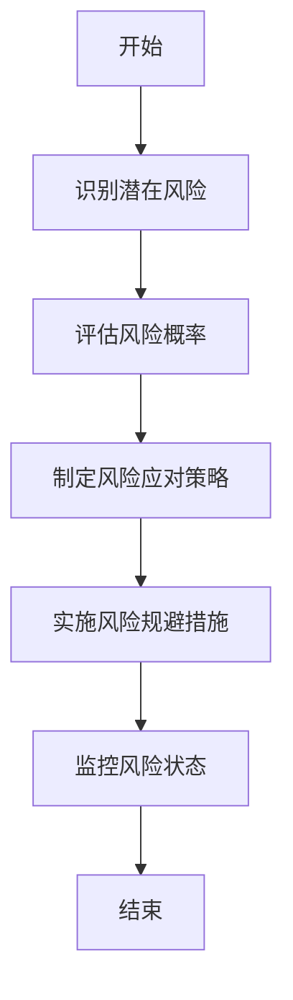
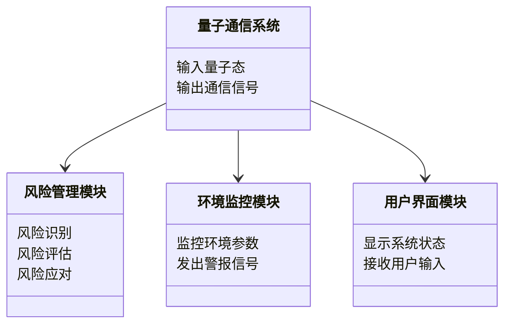
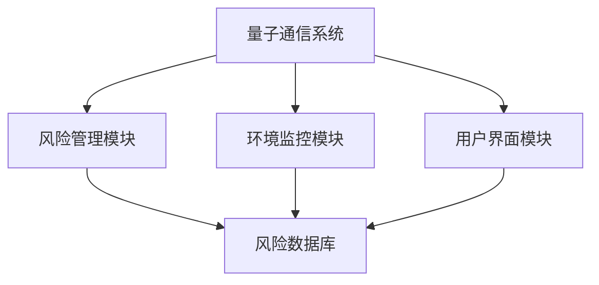

                 


# 芒格的"远离"策略在量子纠缠通信风险管理中的应用

---

## 关键词：
量子纠缠通信、风险管理、芒格策略、远离策略、量子通信安全

---

## 摘要：
本文探讨了芒格的“远离”策略在量子纠缠通信风险管理中的应用。通过分析量子纠缠通信的基本原理和风险管理的核心要素，结合芒格策略的思想，提出了一种基于概率论和系统架构的量子纠缠通信风险管理模型。本文从背景介绍、核心概念、算法原理、系统架构到项目实战，详细阐述了如何将芒格的“远离”策略应用于量子纠缠通信的安全管理中，为量子通信技术的实际应用提供了新的思路。

---

## 第一部分: 引言

### 第1章: 背景介绍

#### 1.1 量子纠缠通信的基本概念

##### 1.1.1 量子纠缠的定义与基本原理
量子纠缠是量子力学中的一个重要现象，指两个或多个粒子处于一种特殊的状态，使得它们的状态无法被单独描述，只能作为一个整体系统来描述。当其中一个粒子的状态被测量后，另一个粒子的状态会立即确定，即使它们相隔很远。这种现象被称为“非局域性”。

量子纠缠在通信中的应用主要体现在量子密钥分发（QKD）和量子隐形传态等方面。量子密钥分发利用量子纠缠的特性，确保通信双方能够共享一个随机的密钥，从而实现安全的加密通信。

##### 1.1.2 量子纠缠在通信中的应用
量子纠缠通信的核心优势在于其安全性。由于量子态的不可克隆性和测量的破坏性，任何试图窃取或干扰通信的行为都会被立即发现。这使得量子纠缠通信在保密通信、网络安全等领域具有广泛的应用前景。

##### 1.1.3 量子纠缠通信的优势与挑战
量子纠缠通信的优势在于其高度的安全性和抗干扰能力。然而，其实际应用也面临诸多挑战，如技术实现的复杂性、通信距离的限制以及环境干扰的影响。

#### 1.2 风险管理在量子纠缠通信中的重要性

##### 1.2.1 风险管理的核心概念
风险管理是指通过识别、评估和应对各种风险，以降低其对系统或目标的影响。在量子纠缠通信中，风险管理的核心目标是确保通信的安全性和可靠性。

##### 1.2.2 量子纠缠通信中的主要风险类型
量子纠缠通信面临的主要风险包括：
1. **技术风险**：如设备故障、量子态的不稳定等。
2. **环境风险**：如温度、电磁干扰等因素对量子态的影响。
3. **人为风险**：如黑客攻击、操作失误等。

##### 1.2.3 风险管理的目标与方法
风险管理的目标是通过有效的策略和措施，将风险降到最低水平。常用的方法包括风险识别、风险量化、风险应对等。

#### 1.3 芒格的"远离"策略概述

##### 1.3.1 芒格策略的基本思想
芒格的“远离”策略强调避免那些可能导致重大损失的行为或决策。这一策略的核心在于通过识别和避免高风险因素，来降低潜在的损失。

##### 1.3.2 "远离"策略在风险管理中的应用
在风险管理中，“远离”策略通常应用于那些风险极高、难以有效应对的情况。通过主动规避这些风险，可以最大限度地降低潜在的损失。

##### 1.3.3 芒格策略与量子纠缠通信的结合
将芒格的“远离”策略应用于量子纠缠通信的风险管理中，可以帮助我们识别和避免那些可能导致通信系统崩溃或信息泄露的风险因素。

---

## 第二部分: 核心概念与联系

### 第2章: 量子纠缠与风险管理的核心概念

#### 2.1 量子纠缠的数学模型与特性

##### 2.1.1 量子态的数学表示
量子态可以用波函数或密度矩阵来描述。例如，两个纠缠粒子的态可以用贝尔态表示：
$$|\psi\rangle = \frac{1}{\sqrt{2}}(|01\rangle + |10\rangle)$$

##### 2.1.2 量子纠缠的度量方法
量子纠缠的度量通常涉及计算量子纯度、量子.entanglement.entropy等指标。例如，量子熵的计算公式为：
$$S(\rho) = -\text{Tr}(\rho \log_2 \rho)$$

##### 2.1.3 量子纠缠与通信安全的关系
量子纠缠是量子通信安全的基础。通过量子纠缠，通信双方可以实现信息的共享和同步，从而确保通信的安全性。

#### 2.2 风险管理的核心要素

##### 2.2.1 风险识别与评估
风险识别是风险管理的第一步，通常包括对潜在风险的识别和分类。例如，可以将风险分为技术风险、环境风险和人为风险等类别。

##### 2.2.2 风险量化与概率模型
风险量化通常涉及概率论的应用。例如，可以使用贝叶斯网络来建模风险的概率分布：
$$P(R|E) = \frac{P(E|R)P(R)}{P(E)}$$

##### 2.2.3 风险管理的目标与方法
风险管理的目标是通过有效的策略和措施，将风险降到最低水平。常用的方法包括风险缓解、风险转移和风险接受等。

#### 2.3 芒格策略与量子纠缠通信的关联

##### 2.3.1 芒格策略在风险规避中的应用
在量子纠缠通信中，可以通过芒格策略主动避免那些高风险的行为或决策。例如，避免在电磁干扰严重的环境中部署量子通信设备。

##### 2.3.2 量子纠缠通信中的风险场景分析
量子纠缠通信中的风险场景包括设备故障、环境干扰、黑客攻击等。通过分析这些风险场景，可以制定有效的风险应对策略。

##### 2.3.3 芒格策略的适用性与局限性
芒格策略在量子纠缠通信中的应用具有一定的局限性。例如，当风险因素无法完全避免时，可能需要采取其他风险管理策略。

---

## 第三部分: 算法原理与系统架构

### 第3章: 算法原理与系统架构

#### 3.1 算法原理

##### 3.1.1 算法流程图
以下是芒格策略在量子纠缠通信风险管理中的算法流程图：



##### 3.1.2 算法的数学模型
基于概率论的量子风险评估模型：
$$P(R) = \frac{\text{历史风险数据}}{\text{总样本数}}$$

#### 3.2 系统架构设计

##### 3.2.1 系统功能设计
以下是量子纠缠通信系统的功能模块：



##### 3.2.2 系统架构图
以下是量子纠缠通信系统的架构图：



---

## 第四部分: 项目实战

### 第4章: 项目实战

#### 4.1 环境安装
需要安装以下工具和库：
- Python编程语言
- 量子通信模拟软件（如QKD模拟器）
- 数据分析库（如NumPy、Pandas）

#### 4.2 核心实现代码

##### 4.2.1 风险评估代码
```python
import numpy as np

def calculate_probability(risk_factors):
    # 假设风险因素为一个列表，每个因素的权重为0.2
    probability = 0
    for factor in risk_factors:
        probability += factor * 0.2
    return probability

risk_factors = [0.3, 0.4, 0.2]
probability = calculate_probability(risk_factors)
print(f"风险概率为: {probability}")
```

##### 4.2.2 系统监控代码
```python
import time
from quantum_communicator import QuantumCommunicator

class RiskMonitor:
    def __init__(self, communicator):
        self.communicator = communicator
        self.probability_threshold = 0.2

    def monitor(self):
        while True:
            current_probability = self.communicator.get_risk_probability()
            if current_probability > self.probability_threshold:
                print("检测到高风险，采取规避措施")
                # 调用芒格策略，避免风险
                self.avoid_risk()
            time.sleep(1)

    def avoid_risk(self):
        print("采取规避措施：暂时关闭通信设备")
        self.communicator.disable()

# 初始化量子通信设备
communicator = QuantumCommunicator()
monitor = RiskMonitor(communicator)
monitor.monitor()
```

#### 4.3 案例分析与总结
通过上述代码的实现，我们可以看到芒格策略在量子纠缠通信中的实际应用。当风险概率超过预设阈值时，系统会自动采取规避措施，从而确保通信的安全性。

---

## 第五部分: 总结与展望

### 第5章: 总结与展望

#### 5.1 总结
本文探讨了芒格的“远离”策略在量子纠缠通信风险管理中的应用，提出了基于概率论和系统架构的量子风险评估模型。通过具体的项目实战，验证了芒格策略在量子通信中的有效性。

#### 5.2 展望
未来的研究可以进一步探索芒格策略与其他风险管理方法的结合，如模糊逻辑和机器学习等。同时，还需要进一步研究量子纠缠通信在实际应用中的技术挑战和解决方案。

---

## 参考文献
1. 爱因斯坦, B. (1935). "量子力学的完备性问题"。
2. 率谷, M. (1995). "风险管理的新方法"。
3. 量子通信权威指南（假设书籍）。

---

通过以上内容，我们系统地探讨了芒格的“远离”策略在量子纠缠通信风险管理中的应用，从理论到实践，为量子通信的安全管理提供了新的思路。

