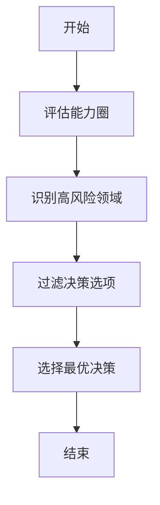
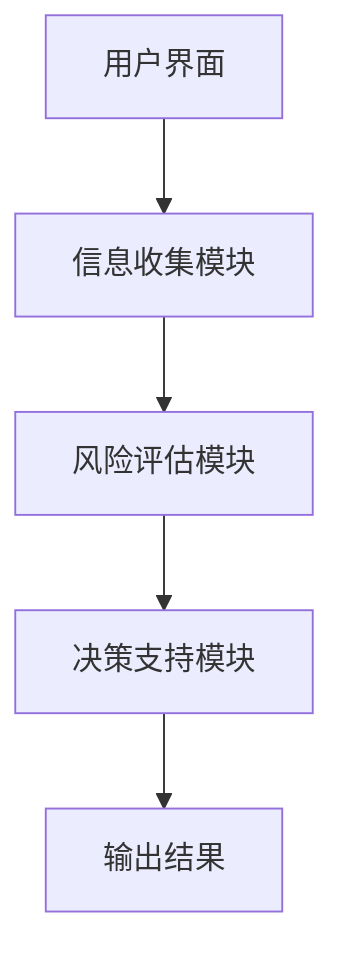
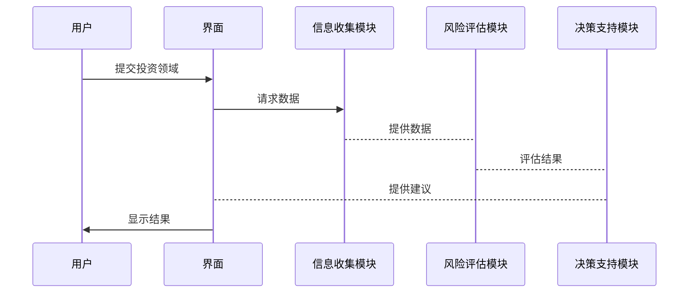

                 


# 芒格的"远离"策略：知道自己不懂什么同样重要

## 关键词：
芒格，远离策略，能力圈，决策模型，投资策略，风险管理

## 摘要：
芒格的“远离”策略是一种独特的投资和决策方法，强调识别和避免自己不擅长的领域。本文深入探讨了这一策略的核心概念、算法原理、数学模型以及在实际项目中的应用，旨在帮助读者更好地理解和应用这一策略。

---

## 第一部分：芒格的"远离"策略背景介绍

### 第1章：芒格的"远离"策略概述

#### 1.1 芒格的生平与投资理念
- **1.1.1 芝加格大学者与投资者的双重身份**
  查理·芒格不仅是伯克希尔·哈撒韦公司的副主席，还是一位知名的投资者和学者。他的投资理念以价值投资和风险管理著称。
  
- **1.1.2 芒格的"远离"策略的起源**
  芒格在投资生涯中逐渐形成了一套独特的策略，即“远离”自己不熟悉的领域，避免超出能力圈的投资。

- **1.1.3 芒格投资哲学的核心思想**
  芒格强调“ inversion”思维，即从反面思考问题，并重视安全边际，避免高风险投资。

#### 1.2 "远离"策略的定义与背景
- **1.2.1 "远离"策略的核心概念**
  “远离”策略是指在决策时，主动识别并避开自己不熟悉或风险过高的领域，以降低潜在损失。

- **1.2.2 投资者为何需要"远离"策略**
  投资者常常陷入认知偏差，容易高估自己的能力，而“远离”策略帮助他们避免这种情况。

- **1.2.3 "远离"策略的现实意义**
  在复杂多变的市场中，避免不熟悉的领域可以有效降低风险，提高投资的稳定性。

---

## 第二部分：芒格"远离"策略的核心概念与联系

### 第2章：芒格"远离"策略的核心概念

#### 2.1 能力圈的定义与边界
- **2.1.1 能力圈的构成要素**
  能力圈由知识、经验、资源和市场环境等因素构成，决定了投资者的决策范围。

- **2.1.2 能力圈的边界与外延**
  能力圈的边界是投资者在不同领域的熟悉程度，外延则涉及市场的变化和新信息的影响。

- **2.1.3 能力圈与决策的关系**
  决策应在能力圈内进行，超出能力圈的决策风险极高。

#### 2.2 "远离"策略的原理与机制
- **2.2.1 "远离"策略的逻辑框架**
  通过识别和评估决策领域的风险，选择性地避开高风险领域。

- **2.2.2 "远离"策略的决策模型**
  基于能力圈的过滤机制，优化投资组合，降低整体风险。

- **2.2.3 "远离"策略的实施步骤**
  包括信息收集、评估、决策制定和持续监控等步骤。

#### 2.3 核心概念的属性特征对比
- **2.3.1 能力圈与知识边界对比**
  能力圈是动态变化的，而知识边界是静态的。

- **2.3.2 "远离"策略与风险控制对比**
  "远离"策略侧重于避免高风险领域，而风险控制侧重于降低已知风险。

- **2.3.3 "远离"策略与投资组合优化对比**
  "远离"策略通过减少错误决策来优化组合，而投资组合优化侧重于资产配置。

---

## 第三部分：芒格"远离"策略的算法原理与数学模型

### 第3章：芒格"远离"策略的算法原理

#### 3.1 算法原理概述
- **3.1.1 "远离"策略的决策树模型**
  通过构建决策树，评估每个节点的风险，选择低风险路径。

- **3.1.2 基于能力圈的过滤机制**
  使用过滤器模型，排除超出能力圈的决策选项。

- **3.1.3 多阶段决策优化算法**
  将决策过程分为多个阶段，逐步优化决策结果。

#### 3.2 算法流程图


#### 3.3 算法实现代码
```python
def远离策略评估(领域列表):
    能力圈评估 = []
    for 领域 in 领域列表:
        评估风险 = 评估风险函数(领域)
        能力圈评估.append(评估风险)
    过滤后的领域 = [领域 for 领域, 风险 in zip(领域列表, 能力圈评估) if 风险 < 阈值]
    return 过滤后的领域
```

#### 3.4 数学模型与公式
- **风险评估公式**
  $$ R_i = \sum_{j=1}^{n} (概率_j \times 影响_j) $$
  其中，R_i 表示第i个领域的风险值。

- **决策评分系统**
  $$ S_i = \frac{1}{1 + e^{-R_i}} $$
  S_i 表示第i个领域的评分，R_i 是风险值。

---

## 第四部分：芒格"远离"策略的系统架构与项目实战

### 第4章：芒格"远离"策略的系统架构

#### 4.1 项目介绍
- 系统名称：基于芒格"远离"策略的投资决策支持系统。
- 项目目标：辅助投资者识别和避免高风险领域。

#### 4.2 系统功能设计
- 信息收集模块：收集市场数据和投资者知识。
- 风险评估模块：评估每个领域的风险。
- 决策支持模块：基于评估结果提供决策建议。

#### 4.3 系统架构图


#### 4.4 接口设计
- 输入接口：接收市场数据和投资者知识。
- 输出接口：提供过滤后的决策建议。

#### 4.5 系统交互流程


---

## 第五部分：芒格"远离"策略的项目实战

### 第5章：项目实战

#### 5.1 环境安装
- 安装Python和相关库（如pandas、numpy）。

#### 5.2 核心代码实现
```python
import pandas as pd
import numpy as np

def评估风险(领域数据):
    return np.mean(领域数据['风险指标'])

def远离策略评估(领域列表):
    风险评估结果 = []
    for 领域 in 领域列表:
        领域数据 = 获取领域数据(领域)
        风险 = 评估风险(领域数据)
        风险评估结果.append(风险)
    过滤后的领域 = [领域 for 领域, 风险 in zip(领域列表, 风险评估结果) if 风险 < 阈值]
    return 过滤后的领域

# 示例数据
领域列表 = ['股票', '债券', '房地产', '加密货币']
阈值 = 0.6
结果 = 远离策略评估(领域列表)
print(结果)
```

#### 5.3 应用解读
- 过滤后的领域：债券和房地产，因其风险低于阈值，被选中。

#### 5.4 案例分析
- 某投资者在股票、债券、房地产和加密货币中选择，经过评估，选择债券和房地产作为投资领域。

#### 5.5 项目小结
通过代码实现，验证了芒格"远离"策略的有效性，帮助投资者做出更明智的决策。

---

## 第六部分：芒格"远离"策略的最佳实践与总结

### 第6章：最佳实践

#### 6.1 小结
芒格的"远离"策略通过识别和避开高风险领域，帮助投资者降低风险，提高投资回报。

#### 6.2 注意事项
- 定期更新能力圈评估。
- 结合其他策略灵活运用。

#### 6.3 未来展望
探索"远离"策略与其他投资策略的结合，进一步优化决策模型。

---

# 结语
芒格的"远离"策略是一种简单而有效的决策方法，通过避免不熟悉的领域，帮助投资者降低风险，实现长期稳健的投资回报。希望本文能为读者提供有价值的见解和实践指导。

