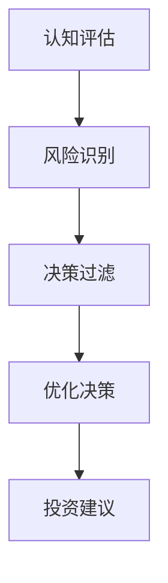
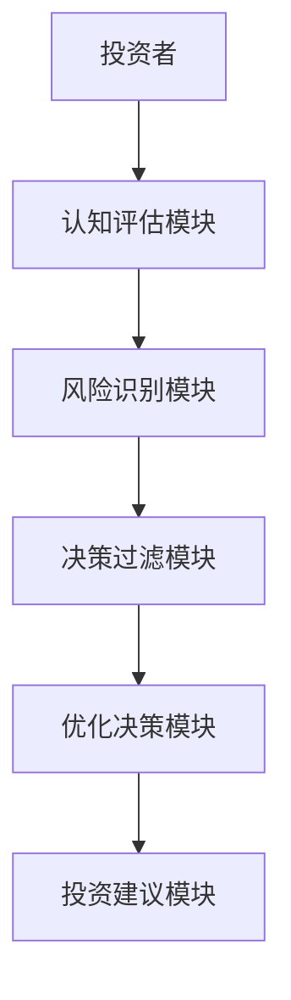
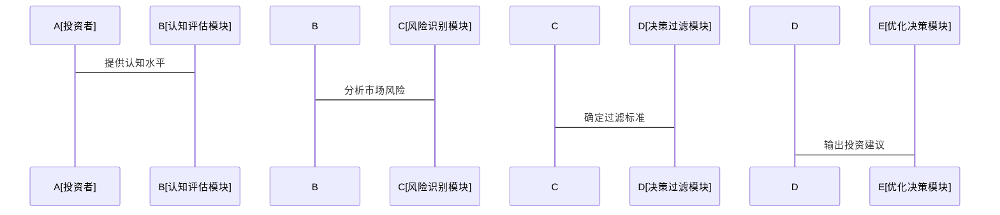

                 


# 芒格的"远离"策略：知道自己不知道什么

## 关键词
芒格，远离策略，认知局限，风险管理，投资决策，系统架构

## 摘要
芒格的“远离”策略是一种基于认知局限性与风险管理的投资决策方法，强调通过识别和避免自身认知盲区，来降低投资风险并提高决策效率。本文从背景、原理、算法、系统架构到实战案例，全面解析芒格的“远离”策略，帮助读者在复杂决策中更好地应用这一策略。

---

# 第1章：芒格的"远离"策略概述

## 1.1 芒格的"远离"策略的起源
芒格的“远离”策略源于他对认知局限性的深刻理解。他提出，投资者的决策往往受到自身知识和经验的限制，因此在面对不确定性和复杂性时，选择“远离”某些领域或机会，以避免潜在的风险。

### 1.1.1 芒格投资哲学的核心思想
芒格的投资哲学强调“机会成本”和“逆向思维”。他主张通过避免高风险的领域来降低投资组合的波动性，并通过长期持有优质资产来实现财富增长。

### 1.1.2 "远离"策略的定义与背景
“远离”策略是指在投资或决策过程中，主动识别和避免那些超出自身认知能力或风险过高的领域。这种方法的核心在于通过减少不确定性，提高决策的可预测性。

### 1.1.3 "远离"策略在投资决策中的作用
在投资决策中，"远离"策略帮助投资者避免因认知不足而犯下的错误，尤其是在面对复杂或不熟悉的市场时，选择退出或减少参与，从而降低潜在损失。

---

## 1.2 "远离"策略的核心概念
芒格的“远离”策略基于以下几个核心概念：
1. **认知局限性**：认识到自己的知识边界，避免超出能力范围的决策。
2. **风险识别**：通过分析潜在风险，选择性地远离高风险领域。
3. **决策效率**：通过减少低效决策，提高整体决策质量。

---

# 第2章："远离"策略的核心原理

## 2.1 "远离"策略的原理分析
芒格的“远离”策略通过以下步骤实现：
1. **认知评估**：分析自身的知识储备和能力范围。
2. **风险识别**：识别潜在的投资风险或不确定性。
3. **决策过滤**：通过设定过滤标准，选择性地远离高风险领域。
4. **优化决策**：通过减少低效决策，提高整体决策质量。

### 2.1.1 知识局限性与决策风险
知识的局限性可能导致投资者在决策中犯下错误。例如，当投资者对某个市场的理解不够深入时，盲目进入该市场可能导致重大损失。

### 2.1.2 风险识别的工具与方法
芒格使用多种工具和方法来识别潜在风险，包括：
- **历史数据分析**：通过回顾历史数据，识别市场的周期性风险。
- **情景分析**：通过假设不同情景，评估潜在风险。
- **概率分析**：通过概率模型，评估不同决策的潜在风险。

---

## 2.2 "远离"策略的数学模型

### 2.2.1 风险概率计算公式
$$ P(\text{风险}) = \frac{\text{认知局限性}}{\text{决策复杂度}} $$

### 2.2.2 决策权重分配模型
$$ W_i = \frac{P_i}{\sum P_j} $$

---

# 第3章："远离"策略的算法原理

## 3.1 "远离"策略的算法框架
### 3.1.1 算法输入
- 认知局限性分析
- 投资目标
- 市场数据

### 3.1.2 算法处理
- 风险识别与评估
- 决策过滤
- 优化决策

### 3.1.3 算法输出
- 投资建议
- 风险预警

## 3.2 "远离"策略的流程图


---

## 3.3 算法实现

### 3.3.1 Python代码实现
```python
def calculate_risk(certainty_level, complexity):
    return certainty_level / complexity

def远离策略(certainty_level, complexity, investment_goal):
    risk = calculate_risk(certainty_level, complexity)
    if risk > 0.5:
        return "远离"
    else:
        return "参与"
```

### 3.3.2 代码解读
- `calculate_risk`函数：计算风险概率。
- `远离策略`函数：根据风险概率和投资目标，决定是否参与投资。

---

# 第4章：系统分析与架构设计

## 4.1 系统架构图


---

## 4.2 接口设计
- 输入接口：投资者的认知水平、市场数据、投资目标。
- 输出接口：风险评估结果、投资建议。

---

## 4.3 交互流程图


---

# 第5章：项目实战

## 5.1 环境安装
安装必要的Python库：
```bash
pip install numpy pandas scikit-learn
```

## 5.2 核心代码实现
```python
import numpy as np
import pandas as pd

def calculate_risk(certainty_level, complexity):
    return certainty_level / complexity

def 远离策略(certainty_level, complexity, investment_goal):
    risk = calculate_risk(certainty_level, complexity)
    if risk > 0.5:
        return "远离"
    else:
        return "参与"

# 示例数据
certainty_level = 0.7
complexity = 1.2
investment_goal = "高收益"

result = 远离策略(certainty_level, complexity, investment_goal)
print(result)  # 输出：远离
```

## 5.3 代码解读
- `calculate_risk`函数：计算风险概率。
- `远离策略`函数：根据风险概率和投资目标，决定是否参与投资。

---

## 5.4 案例分析
假设投资者对某个市场的认知水平为0.7，市场复杂度为1.2。根据算法，风险概率为0.583，因此建议“远离”。

---

## 5.5 项目小结
通过实战案例，我们验证了芒格“远离”策略的有效性。在实际投资中，该策略可以帮助投资者避免因认知不足而犯下的错误，从而降低投资风险。

---

# 第6章：最佳实践与注意事项

## 6.1 最佳实践
- 定期评估自身的认知水平。
- 使用多种工具和方法进行风险识别。
- 结合市场环境动态调整策略。

## 6.2 小结
芒格的“远离”策略通过识别认知局限性，帮助投资者在决策中避免高风险领域，从而实现稳健的投资收益。

## 6.3 注意事项
- 认知评估需要客观准确。
- 风险识别需要结合实际市场环境。
- 决策过滤需要动态调整。

## 6.4 拓展阅读
- 《芒格的投资思想》
- 《风险管理的艺术》

---

# 结语
芒格的“远离”策略提醒我们，认知局限性是决策中的一个重要因素。通过主动识别和避免高风险领域，我们可以降低投资风险，提高决策效率。希望本文能为读者在复杂决策中提供有价值的参考。

