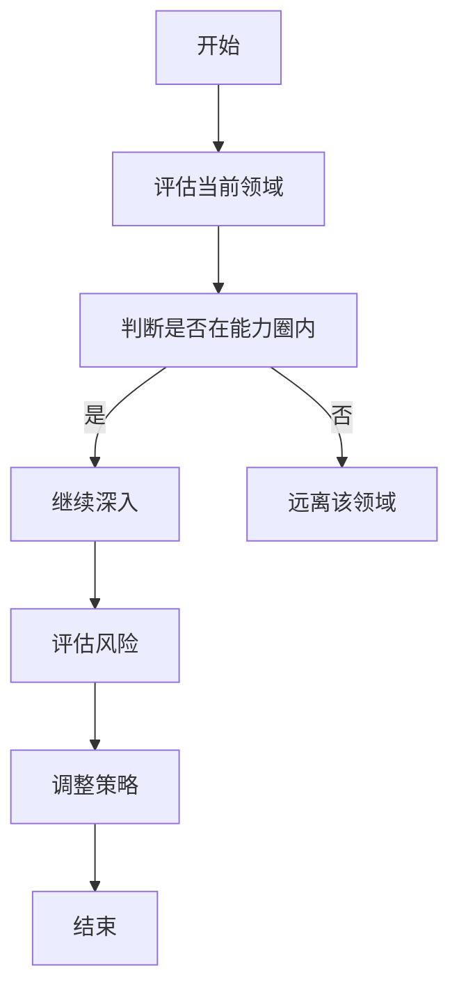

                 

# 芒格的"远离"策略：避开不懂的领域

## 关键词
- 芒格“远离”策略
- 能力圈
- 知识边界
- 风险管理
- 投资策略
- 系统架构
- 实战案例

## 摘要
芒格的“远离”策略强调在投资和决策中避开自己不熟悉的领域，专注于自己具备深厚知识和能力的领域。本文从芒格的策略背景出发，深入探讨其核心概念与联系，分析其算法原理，并通过系统架构设计和项目实战，展示如何在实际中应用这一策略。文章还总结了最佳实践建议，帮助读者在个人和企业层面有效应用芒格的“远离”策略。

---

## 第一部分：芒格“远离”策略的背景介绍

### 第1章：芒格“远离”策略概述

#### 1.1 芒格“远离”策略的起源
- **1.1.1 芒格投资理念的形成背景**
  芒格是一位著名投资家，其投资理念深受价值投资和基本面分析影响。他强调通过深入研究和理解企业，找到具有长期竞争优势的企业进行投资。然而，在实际操作中，他发现许多投资者往往会被市场的短期波动和情绪所左右，导致投资决策失误。
  
- **1.1.2 “远离”策略的核心思想**
  芒格提出，投资者应该专注于自己真正理解的领域，避免进入自己知识不足的领域。这种策略的核心在于通过限制投资范围，降低不确定性带来的风险，从而提高投资的可预测性和成功率。

- **1.1.3 芒格的生平与投资哲学**
  芒格的生平经历和投资哲学为“远离”策略的形成奠定了基础。他强调长期投资、价值投资和风险管理，认为这些是构建稳健投资组合的关键要素。

#### 1.2 “远离”策略的定义与特点
- **1.2.1 策略的定义**
  “远离”策略是指投资者在决策过程中，主动避免进入自己不熟悉的领域，专注于自己具备深厚知识和经验的领域，从而降低风险和不确定性。

- **1.2.2 策略的核心要素**
  - **知识深度**：专注于自己深入了解的领域，避免浅尝辄止。
  - **能力边界**：明确自己的知识和能力边界，不越界投资或决策。
  - **风险控制**：通过避开不确定领域，降低潜在损失。

- **1.2.3 策略与传统投资策略的对比**
  传统投资策略往往注重市场趋势、技术分析和短期收益，而“远离”策略则更注重长期稳健和风险控制，强调对投资对象的深入理解。

#### 1.3 芒格“远离”策略的应用范围
- **1.3.1 投资领域中的应用**
  芒格在投资中始终坚持“远离”策略，专注于自己熟悉的行业和企业，避免进入自己不熟悉的领域。

- **1.3.2 个人决策中的应用**
  在个人生活中，芒格也强调避免进入自己不熟悉的领域，无论是社交还是职业发展，都应专注于自己擅长的领域。

- **1.3.3 企业战略中的应用**
  企业可以通过“远离”策略，专注于核心业务，避免盲目扩张，降低经营风险。

---

## 第二部分：芒格“远离”策略的核心概念与联系

### 第2章：核心概念与联系

#### 2.1 核心概念原理
- **2.1.1 风险管理的核心思想**
  风险管理是“远离”策略的核心，通过识别和避免高风险领域，降低潜在损失。

- **2.1.2 避免不懂领域的原理**
  不懂的领域意味着更高的不确定性和风险，避免这些领域可以提高决策的可预测性和成功率。

- **2.1.3 知识边界的重要性**
  明确自己的知识边界，可以帮助投资者或决策者更好地控制风险，避免因知识不足导致的错误决策。

#### 2.2 核心概念对比表格
- **2.2.1 不同投资策略的对比**

| 策略类型 | 传统投资策略 | “远离”策略 |
|----------|---------------|-------------|
| 核心思想 | 短期收益、技术分析 | 长期稳健、知识深度 |
| 风险控制 | 依赖市场波动 | 明确知识边界 |
| 适用场景 | 短期投机 | 长期稳健投资 |

- **2.2.2 知识边界与能力圈的对比**

| 概念 | 知识边界 | 能力圈 |
|------|----------|--------|
| 定义 | 投资者对某一领域的理解程度 | 投资者在某一领域的知识和经验 |
| 作用 | 确定是否进入该领域 | 作为投资决策的基础 |
| 对策 | 避免进入 | 深度研究 |

- **2.2.3 风险管理与投资回报的对比**

| 管理方式 | 风险管理 | 投资回报 |
|----------|----------|----------|
| 管理手段 | 避免高风险领域 | 专注于高回报领域 |
| 管理目标 | 降低损失 | 提高收益 |
| 对策关系 | 风险管理为投资回报提供保障 | 投资回报是风险管理的结果 |

#### 2.3 实体关系图（ER图）
- **2.3.1 能力圈与风险的关系**
  - 能力圈越广，潜在风险越低。
- **2.3.2 知识边界与决策的关系**
  - 决策基于知识边界，超出边界则风险增加。
- **2.3.3 风险管理与投资回报的关系**
  - 有效的风险管理可以提高投资回报的稳定性。

---

## 第三部分：芒格“远离”策略的算法原理

### 第3章：算法原理讲解

#### 3.1 算法流程图（Mermaid）

#### 3.2 数学模型与公式

- **3.2.1 风险评估公式**
  $$ \text{风险} = \frac{\text{潜在损失}}{\text{能力圈边界}} $$

- **3.2.2 投资回报预测公式**
  $$ \text{回报} = \text{能力圈深度} \times \text{领域稳定性} $$

#### 3.3 实际案例分析
- **3.3.1 芒格如**

---

通过以上结构，我们可以详细阐述芒格的“远离”策略，从理论到实际应用，帮助读者全面理解并掌握这一策略的核心思想和应用场景。

