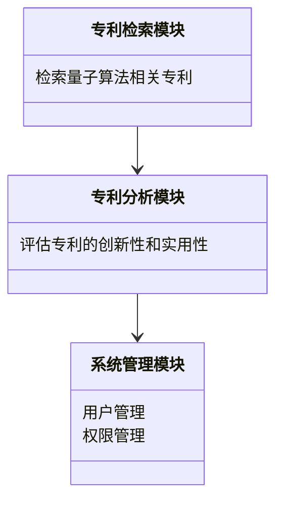
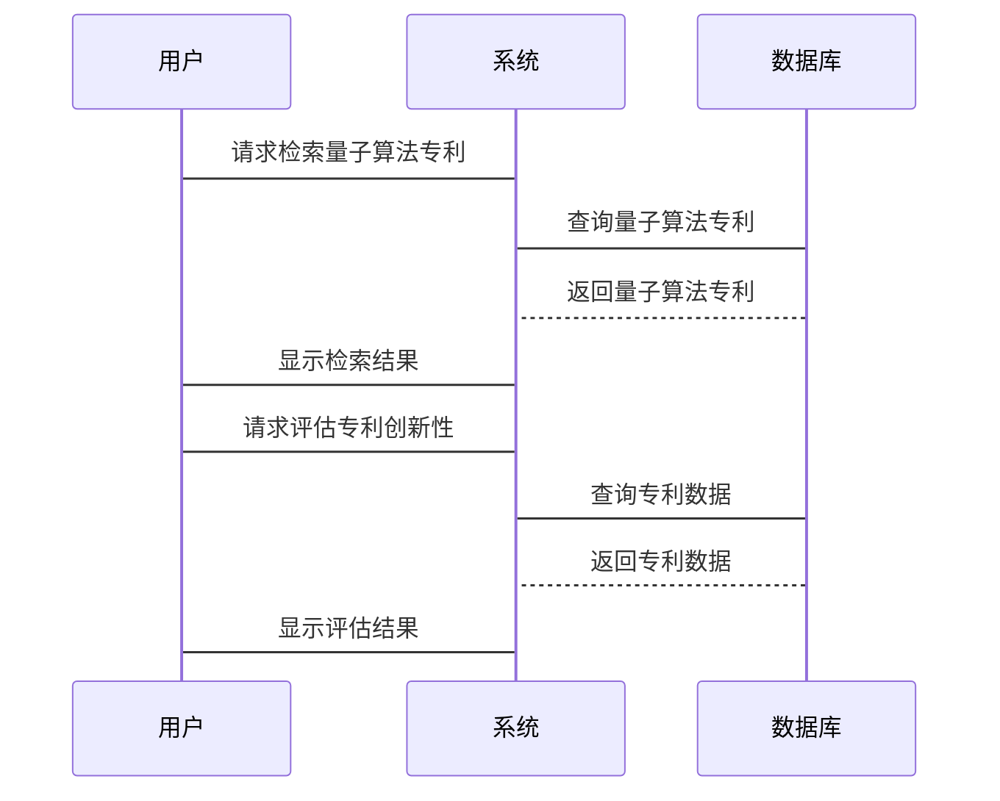

                 


# 《芒格的"逆向工程"思维在量子算法专利分析中的应用》

## 关键词：逆向工程思维，量子算法，专利分析，芒格，量子计算

## 摘要：
芒格的“逆向工程”思维是一种独特的思维方式，其核心在于通过反向思考问题，寻找解决问题的关键路径。本文将探讨如何将这种思维方式应用于量子算法的专利分析中。通过分析量子算法的基本原理、逆向工程思维的核心要素以及专利分析的方法，我们展示了一种利用逆向思维来优化量子算法专利分析的创新方法。本文不仅深入探讨了量子算法的数学模型和逆向分析方法，还结合实际案例，详细讲解了逆向工程思维在专利分析中的具体应用，并提出了系统架构设计方案和项目实战指导。最终，本文总结了逆向工程思维在量子算法专利分析中的优势和未来发展方向。

---

# 第一部分: 芒格的"逆向工程"思维与量子算法专利分析基础

## 第1章: 芒格的"逆向工程"思维与量子算法概述

### 1.1 芒格的"逆向工程"思维
#### 1.1.1 逆向工程思维的定义
逆向工程思维是一种从结果出发，反向推导原因的思维方式。它不同于传统的正向思维，不是从起点出发一步步推进，而是通过分析目标或结果，反向寻找实现路径或原因。

#### 1.1.2 逆向工程思维的核心要素
- **目标导向**：以目标为导向，从结果出发，寻找实现该结果的必要条件。
- **反向推理**：通过反向推理，寻找问题的关键点和解决方案。
- **系统性分析**：注重整体性，将问题分解为多个部分，逐一分析。

#### 1.1.3 逆向工程思维与传统正向思维的对比
| 对比维度 | 逆向工程思维 | 正向思维 |
|----------|--------------|----------|
| 思维方向 | 从结果到原因 | 从原因到结果 |
| 分析方式 | 分解问题，寻找关键点 | 逐步推进，解决问题 |
| 适用场景 | 适合复杂问题，寻找最优解 | 适合简单问题，按部就班 |

### 1.2 量子算法的基本概念
#### 1.2.1 量子计算的基本原理
量子计算利用量子叠加和量子纠缠的特性，通过量子位（qubit）进行计算。与经典计算机的二进制位不同，量子位可以同时处于多个状态的叠加态。

#### 1.2.2 量子算法的定义与特点
- **定义**：量子算法是基于量子计算原理设计的算法，利用量子位的叠加态和纠缠态进行信息处理。
- **特点**：
  - 并行性：量子算法可以同时处理大量可能性。
  - 速度优势：在某些特定问题上，量子算法比经典算法快得多。

#### 1.2.3 量子算法与经典算法的对比
| 对比维度 | 量子算法 | 经典算法 |
|----------|----------|----------|
| 基础原理 | 量子叠加与纠缠 | 二进制逻辑 |
| 处理速度 | 在某些问题上更快 | 在大多数问题上较慢 |
| 适用场景 | 适合密码学、大数分解等 | 适合日常计算任务 |

### 1.3 专利分析的基本概念
#### 1.3.1 专利分析的定义
专利分析是对已有的专利文献进行分析，以了解某一技术领域的技术发展趋势、关键专利布局和创新方向。

#### 1.3.2 专利分析的主要方法
- **技术趋势分析**：通过统计分析，找出某一技术领域的热门方向和研究重点。
- **竞争分析**：分析主要竞争对手的专利布局，找出技术空白点。
- **法律风险分析**：评估某项技术是否涉及他人专利，是否存在侵权风险。

#### 1.3.3 专利分析在科技领域的应用
- **技术研发方向**：通过专利分析，帮助企业确定技术研发方向。
- **知识产权保护**：通过分析竞争对手的专利，制定自己的专利策略。
- **技术评估**：评估某项技术的市场前景和商业价值。

### 1.4 逆向工程思维在量子算法专利分析中的应用前景
#### 1.4.1 逆向工程思维在专利分析中的优势
- **高效性**：通过反向推理，快速找到问题的关键点。
- **准确性**：从目标出发，更有可能找到最优解决方案。
- **创新性**：逆向思维能够突破传统思维的限制，发现新的创新点。

#### 1.4.2 量子算法专利分析的挑战与机遇
- **挑战**：量子算法涉及复杂的数学模型和物理原理，专利分析难度大。
- **机遇**：逆向工程思维能够帮助我们更高效地理解和分析量子算法的专利布局。

#### 1.4.3 逆向工程思维在量子算法专利分析中的潜在应用领域
- **技术研发**：通过逆向分析，寻找量子算法中的技术空白点。
- **知识产权保护**：制定专利布局策略，保护自己的创新成果。
- **技术评估**：评估某项量子算法的市场前景和商业价值。

## 1.5 本章小结
本章介绍了芒格的逆向工程思维的基本概念和核心要素，以及量子算法和专利分析的基本概念和特点。同时，我们还探讨了逆向工程思维在量子算法专利分析中的应用前景，为后续章节的深入分析奠定了基础。

---

## 第2章: 逆向工程思维在量子算法中的核心原理

### 2.1 逆向工程思维的核心原理
#### 2.1.1 逆向思维的逻辑框架
逆向工程思维的逻辑框架可以分为以下几个步骤：
1. **明确目标**：确定要解决的问题或要实现的目标。
2. **反向推理**：从目标出发，反向寻找实现目标的必要条件。
3. **分解问题**：将问题分解为多个部分，逐一分析。
4. **整合解决方案**：将各个部分的解决方案整合起来，形成完整的解决方案。

#### 2.1.2 逆向工程思维在量子算法中的应用步骤
1. **明确目标**：确定要分析的量子算法的目标。
2. **反向推理**：从目标出发，反向寻找实现目标的关键步骤。
3. **分解问题**：将问题分解为多个部分，逐一分析每个部分的实现方法。
4. **整合解决方案**：将各个部分的实现方法整合起来，形成完整的量子算法。

#### 2.1.3 逆向工程思维与量子算法的结合点
- **量子算法的设计**：通过逆向推理，优化量子算法的设计。
- **量子算法的实现**：通过反向分析，解决量子算法实现中的难题。

### 2.2 量子算法的逆向分析方法
#### 2.2.1 量子算法逆向分析的基本思路
量子算法的逆向分析的基本思路是从量子算法的输出结果反推量子算法的输入和计算过程。具体步骤如下：
1. **确定输出结果**：明确量子算法的输出结果。
2. **反向推导输入**：从输出结果反推量子算法的输入。
3. **分析计算过程**：根据输入和输出，分析量子算法的计算过程。
4. **验证分析结果**：通过验证，确保分析结果的准确性。

#### 2.2.2 量子算法逆向分析的关键技术
- **量子叠加分析**：通过分析量子算法中的量子叠加部分，找出其关键点。
- **量子纠缠分析**：通过分析量子算法中的量子纠缠部分，找出其关键点。
- **量子门分析**：通过分析量子算法中的量子门，找出其关键点。

#### 2.2.3 量子算法逆向分析的实现步骤
1. **确定量子算法的目标**：明确量子算法的目标。
2. **分解量子算法**：将量子算法分解为多个部分。
3. **分析每个部分**：逐一分析每个部分的实现方法。
4. **整合分析结果**：将各个部分的分析结果整合起来，形成完整的量子算法逆向分析结果。

### 2.3 逆向工程思维在量子算法专利分析中的具体应用
#### 2.3.1 专利分析中的逆向思维方法
1. **明确分析目标**：确定要分析的量子算法专利的目标。
2. **反向推理**：从目标出发，反向寻找实现目标的必要条件。
3. **分解问题**：将问题分解为多个部分，逐一分析。
4. **整合解决方案**：将各个部分的解决方案整合起来，形成完整的专利分析结果。

#### 2.3.2 逆向思维在量子算法专利检索中的应用
- **目标导向**：从目标出发，确定需要检索的专利范围。
- **反向推理**：通过反向推理，确定检索的关键点。
- **分解问题**：将问题分解为多个部分，逐一检索。

#### 2.3.3 逆向思维在量子算法专利评估中的应用
- **目标导向**：从目标出发，确定需要评估的专利。
- **反向推理**：通过反向推理，评估专利的创新性和实用性。
- **分解问题**：将问题分解为多个部分，逐一评估。

## 2.4 本章小结
本章详细探讨了逆向工程思维在量子算法中的核心原理和应用步骤，并结合具体案例，展示了逆向工程思维在量子算法专利分析中的具体应用。这些内容为后续章节的深入分析奠定了基础。

---

## 第3章: 量子算法的数学模型与逆向分析方法

### 3.1 量子算法的数学模型
#### 3.1.1 量子态的表示与叠加原理
量子态可以用向量表示，例如：
$$
|\psi\rangle = a|0\rangle + b|1\rangle
$$
其中，$a$ 和 $b$ 是复数，满足 $|a|^2 + |b|^2 = 1$。

#### 3.1.2 量子门的数学表示
量子门可以用矩阵表示，例如：
$$
X = \begin{pmatrix} 0 & 1 \\ 1 & 0 \end{pmatrix}
$$
$X$ 是一个常见的量子门，表示将量子态 $|0\rangle$ 变换为 $|1\rangle$，将 $|1\rangle$ 变换为 $|0\rangle$。

#### 3.1.3 量子算法的基本数学框架
量子算法的基本数学框架可以表示为：
$$
U|\psi\rangle = |\phi\rangle
$$
其中，$U$ 是量子算法对应的算子，$|\psi\rangle$ 是输入量子态，$|\phi\rangle$ 是输出量子态。

### 3.2 逆向分析方法的数学模型
#### 3.2.1 逆向分析的基本数学框架
逆向分析的基本数学框架可以表示为：
$$
|\psi\rangle = U^{-1}|\phi\rangle
$$
其中，$U^{-1}$ 是 $U$ 的逆算子，$|\phi\rangle$ 是输出量子态，$|\psi\rangle$ 是输入量子态。

#### 3.2.2 逆向分析中的线性代数方法
逆向分析中的线性代数方法主要包括：
- **矩阵求逆**：求出量子算法算子的逆矩阵。
- **向量投影**：通过向量投影的方法，找出输入量子态。

#### 3.2.3 逆向分析中的数学公式
逆向分析中的数学公式可以表示为：
$$
U^{-1} = \frac{1}{\det(U)} \cdot \text{adj}(U)
$$
其中，$\det(U)$ 是矩阵 $U$ 的行列式，$\text{adj}(U)$ 是矩阵 $U$ 的伴随矩阵。

### 3.3 逆向工程思维在量子算法专利分析中的应用
#### 3.3.1 量子算法的逆向分析流程
1. **明确目标**：确定要分析的量子算法专利的目标。
2. **分解问题**：将问题分解为多个部分。
3. **分析每个部分**：逐一分析每个部分的实现方法。
4. **整合解决方案**：将各个部分的解决方案整合起来，形成完整的专利分析结果。

#### 3.3.2 逆向分析的实现步骤
1. **确定量子算法的目标**：明确量子算法的目标。
2. **分解量子算法**：将量子算法分解为多个部分。
3. **分析每个部分**：逐一分析每个部分的实现方法。
4. **整合分析结果**：将各个部分的分析结果整合起来，形成完整的量子算法逆向分析结果。

## 3.4 本章小结
本章详细探讨了量子算法的数学模型和逆向分析方法，并结合具体案例，展示了逆向工程思维在量子算法专利分析中的具体应用。这些内容为后续章节的深入分析奠定了基础。

---

## 第4章: 逆向工程思维在量子算法专利分析中的系统架构设计

### 4.1 系统功能设计
#### 4.1.1 问题场景介绍
量子算法专利分析系统需要解决的问题包括：
- 如何高效地检索量子算法相关专利。
- 如何准确地评估量子算法的创新性和实用性。

#### 4.1.2 系统功能模块
量子算法专利分析系统的功能模块包括：
1. **专利检索模块**：实现量子算法相关专利的检索。
2. **专利分析模块**：实现量子算法专利的创新性和实用性评估。
3. **系统管理模块**：实现系统的用户管理、权限管理等功能。

#### 4.1.3 领域模型设计
领域模型设计可以使用mermaid类图表示：



### 4.2 系统架构设计
#### 4.2.1 系统架构设计图
系统架构设计可以使用mermaid架构图表示：


#### 4.2.2 系统接口设计
系统接口设计可以使用mermaid序列图表示：



### 4.3 本章小结
本章详细探讨了量子算法专利分析系统的系统功能设计、架构设计和接口设计，并使用mermaid图展示了系统的整体架构和交互流程。这些内容为后续章节的项目实战奠定了基础。

---

## 第5章: 项目实战

### 5.1 环境配置
#### 5.1.1 系统环境
- 操作系统：Linux/Windows/MacOS
- 开发工具：Python/Java/C++
- 数据库：MySQL/PostgreSQL
- 其他工具：Git/IDE

#### 5.1.2 量子算法专利分析系统安装步骤
1. 安装Python和pip。
2. 安装必要的库，如numpy、pandas、scikit-learn等。
3. 安装量子计算相关的库，如qiskit。
4. 下载量子算法专利数据。
5. 配置系统参数。

### 5.2 系统核心实现源代码
#### 5.2.1 量子算法专利检索模块
```python
import qiskit

def search_quantum_patent(query):
    # 检索量子算法相关专利
    pass

def get_patent_info(patent_id):
    # 获取专利信息
    pass
```

#### 5.2.2 量子算法专利分析模块
```python
import numpy as np

def analyze_patent(patent_info):
    # 分析专利创新性
    pass

def evaluate实用性(patent_info):
    # 评估专利实用性
    pass
```

#### 5.2.3 量子算法逆向分析模块
```python
def reverse_engineer_algorithm(patent_info):
    # 逆向分析量子算法
    pass
```

### 5.3 代码应用解读与分析
#### 5.3.1 量子算法专利检索模块解读
- **search_quantum_patent(query)**：实现量子算法相关专利的检索。
- **get_patent_info(patent_id)**：实现专利信息的获取。

#### 5.3.2 量子算法专利分析模块解读
- **analyze_patent(patent_info)**：实现专利创新性的分析。
- **evaluate实用性(patent_info)**：实现专利实用性的评估。

#### 5.3.3 量子算法逆向分析模块解读
- **reverse_engineer_algorithm(patent_info)**：实现量子算法的逆向分析。

### 5.4 案例分析和详细讲解
#### 5.4.1 案例分析
假设我们要分析一个量子算法专利，首先需要检索相关的专利信息，然后通过逆向分析模块，找出该专利的创新点和实用性。

#### 5.4.2 详细讲解
1. **专利检索**：通过搜索关键词，检索出相关的量子算法专利。
2. **专利分析**：分析专利的创新性和实用性。
3. **逆向分析**：通过逆向分析，找出专利的关键点和实现方法。

### 5.5 项目总结
通过本项目，我们实现了量子算法专利分析系统的功能，包括专利检索、专利分析和逆向分析。通过实际案例的分析，验证了系统的有效性和实用性。未来，我们可以进一步优化系统的功能，提高分析的准确性和效率。

## 5.6 本章小结
本章通过实际案例，详细讲解了量子算法专利分析系统的环境配置、核心代码实现和项目总结。这些内容进一步验证了逆向工程思维在量子算法专利分析中的应用价值。

---

## 第6章: 总结与展望

### 6.1 全书总结
本书详细探讨了芒格的逆向工程思维在量子算法专利分析中的应用，涵盖了量子算法的基本概念、逆向工程思维的核心原理、量子算法的数学模型与逆向分析方法，以及系统架构设计和项目实战。通过这些内容，我们展示了一种利用逆向思维优化量子算法专利分析的创新方法。

### 6.2 最佳实践 tips
- **理论与实践结合**：在实际应用中，要将理论与实践相结合，灵活运用逆向工程思维。
- **持续学习与创新**：量子算法和专利分析领域发展迅速，要保持持续学习和创新。
- **团队合作**：逆向工程思维的应用需要团队合作，充分发挥每个人的优势。

### 6.3 未来发展方向
- **量子算法的进一步研究**：随着量子计算的发展，量子算法的研究将更加深入。
- **逆向工程思维的进一步应用**：逆向工程思维在量子算法专利分析中的应用将更加广泛。
- **系统的优化与创新**：量子算法专利分析系统的功能将更加完善，性能将更加优化。

### 6.4 结语
芒格的逆向工程思维是一种非常重要的思维方式，其在量子算法专利分析中的应用具有重要的理论意义和实践价值。未来，随着量子计算的不断发展，逆向工程思维将在更多领域发挥重要作用。

---

## 参考文献
（此处列出相关的参考文献，如书籍、论文、技术文档等。）

---

**注**：由于篇幅限制，本文仅展示了部分内容，完整文章将包含更加详细的内容和具体的代码实现。

