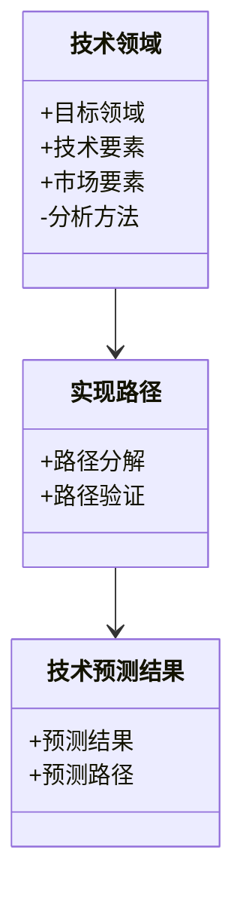
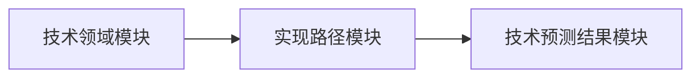
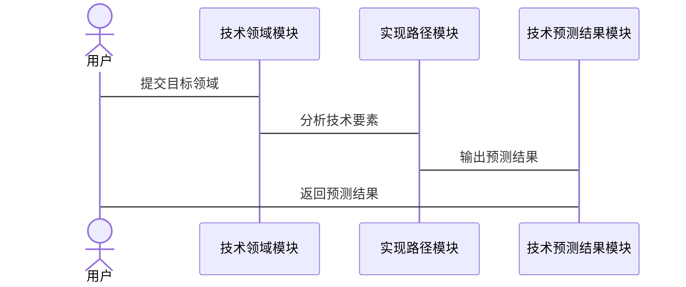

                 


# 芒格的"逆向工程"思维在颠覆性技术预测中的应用

> 关键词：芒格, 逆向工程, 颠覆性技术, 技术预测, 思维模型

> 摘要：本文探讨了芒格的"逆向工程"思维在颠覆性技术预测中的应用，分析了逆向工程思维的核心概念、理论基础、方法论，结合实际案例，详细阐述了如何通过逆向思维模型识别和预测颠覆性技术。文章内容涵盖逆向思维的背景介绍、核心概念与联系、算法原理讲解、系统分析与架构设计、项目实战、案例分析、总结与展望等多个方面。

---

## 第1章: 逆向工程思维的背景与概念

### 1.1 逆向工程思维的定义与核心要素

逆向工程思维是一种从结果出发，反向推导出原因或路径的思维方式。其核心在于通过分析已有的成果或现象，推导其背后的原因、逻辑或规律。与正向思维（从原因出发，推导结果）不同，逆向思维更注重从目标或结果出发，寻找实现该目标的路径或方法。

#### 1.1.1 逆向工程思维的定义

逆向工程思维是一种通过分析目标或结果，反向推导出实现该目标或结果的方法或路径的思维方式。其本质是通过“反向推理”来理解事物的本质和规律。

#### 1.1.2 逆向工程思维的核心要素

- **目标导向性**：以目标或结果为导向，从终点反推起点。
- **反向推理**：通过分析结果，推导出实现该结果的必要条件或路径。
- **系统性**：逆向工程思维注重从整体出发，分析各部分之间的关系和相互作用。
- **创新性**：通过反向推理，往往能够发现新的解决方案或思维方式。

#### 1.1.3 逆向工程思维与正向思维的对比

| 对比维度 | 逆向工程思维 | 正向思维 |
|----------|--------------|----------|
| 思维方向 | 从结果到原因 | 从原因到结果 |
| 应用场景 | 分析已知结果，寻找实现路径 | 从已知条件出发，推导可能的结果 |
| 创新性   | 更容易发现新的解决方案 | 更容易遵循已有的规律或路径 |

### 1.2 芒格的生平与思想体系

查理·芒格（Charlie Munger）是美国著名投资者、伯克希尔·哈撒韦公司副董事长。他以独特的思维方式和投资哲学闻名，其思想体系的核心是通过逆向思维来分析问题，寻找最优解决方案。

#### 1.2.1 芒格的生平简介

查理·芒格于1924年出生于美国密歇根州，曾在哈佛大学学习法律，并在后来的职业生涯中积累了丰富的投资经验。他的投资哲学强调安全边际、长期价值和逆向思维。

#### 1.2.2 芒格的主要思想与投资哲学

芒格的投资哲学强调以下几点：

- **安全边际**：通过寻找市场价格低于内在价值的投资机会，降低投资风险。
- **长期价值**：关注企业的内在价值，而非短期市场波动。
- **逆向思维**：通过分析问题的反面，寻找投资机会。

#### 1.2.3 逆向工程思维与芒格思想体系的关系

芒格的逆向思维与逆向工程思维有着密切的联系。他通过分析市场的反面（如市场恐慌、低估等），寻找投资机会，这与逆向工程思维的核心思想高度契合。

### 1.3 颠覆性技术的定义与特征

#### 1.3.1 颠覆性技术的定义

颠覆性技术是指那些能够从根本上改变现有技术、产业或商业模式的技术。它通常通过提供更高效、更低成本或更创新的解决方案，颠覆传统的行业格局。

#### 1.3.2 颠覆性技术的分类与特点

颠覆性技术可以分为以下几类：

- **技术创新型**：通过技术突破实现颠覆，例如人工智能、区块链等。
- **商业模式创新型**：通过创新的商业模式实现颠覆，例如共享经济、订阅制等。
- **应用创新型**：通过新的应用场景实现颠覆，例如移动支付、远程办公等。

#### 1.3.3 颠覆性技术对传统行业的冲击

颠覆性技术通常会对传统行业产生深远的影响。例如，互联网技术颠覆了传统媒体行业，移动支付技术颠覆了传统银行业，人工智能技术颠覆了传统制造业。

### 1.4 逆向工程思维在技术预测中的应用前景

#### 1.4.1 逆向工程思维在技术预测中的优势

逆向工程思维在技术预测中的优势在于其能够通过分析已有的技术成果，反向推导出实现该技术的关键因素或路径。这种思维方式可以帮助我们更好地理解技术的本质，预测未来的技术发展趋势。

#### 1.4.2 颠覆性技术预测的挑战与机遇

颠覆性技术的预测面临以下挑战：

- **不确定性**：颠覆性技术的出现往往具有偶然性，难以准确预测。
- **复杂性**：颠覆性技术通常涉及多个领域的交叉融合，预测难度较大。

与此同时，逆向工程思维为我们提供了一个新的视角，帮助我们更好地理解技术的发展规律，抓住颠覆性技术带来的机遇。

#### 1.4.3 逆向工程思维在技术预测中的实际案例

以人工智能技术为例，通过分析当前人工智能技术的应用场景和实现路径，我们可以反向推导出未来人工智能技术的发展方向。例如，当前人工智能技术在自然语言处理领域的突破，可以预见到未来人工智能技术在智能客服、智能写作等领域的广泛应用。

---

## 第2章: 逆向工程思维的理论基础

### 2.1 逆向工程思维的核心模型

#### 2.1.1 逆向思维模型的构成

逆向思维模型的核心构成包括以下几个方面：

1. **目标或结果**：分析的目标或结果，例如某项技术的成功应用。
2. **关键因素**：实现目标或结果的关键因素或条件。
3. **实现路径**：从目标或结果出发，反向推导出实现路径。

#### 2.1.2 逆向思维模型的数学表达

逆向思维模型可以用以下公式表示：

$$
\text{结果} = f(\text{路径}, \text{条件})
$$

其中，路径和条件是实现结果的关键因素。

#### 2.1.3 逆向思维模型与颠覆性技术的关系

通过逆向思维模型，我们可以分析颠覆性技术的成功案例，反向推导出其成功的路径和条件。例如，分析特斯拉的成功，可以反向推导出其成功的路径包括技术创新、商业模式创新等。

### 2.2 逆向工程思维的关键方法论

#### 2.2.1 逆向工程思维的步骤与流程

逆向工程思维的步骤如下：

1. **明确目标或结果**：确定需要分析的目标或结果。
2. **分析结果的构成要素**：分解结果的构成要素，例如技术要素、市场要素等。
3. **反向推导实现路径**：从结果出发，反向推导出实现该结果的路径。
4. **验证路径的可行性**：验证实现路径的可行性和合理性。

#### 2.2.2 逆向工程思维的工具与技术

- **思维导图**：用于分解目标或结果的构成要素。
- **流程图**：用于展示实现路径的流程。
- **对比分析**：通过对比成功案例和失败案例，寻找实现路径的关键因素。

#### 2.2.3 逆向工程思维的实践指南

- **从结果出发**：先明确目标或结果，再分析其实现路径。
- **注重细节分析**：分解结果的构成要素，确保分析的全面性。
- **验证与调整**：通过验证路径的可行性和合理性，不断调整和优化实现路径。

### 2.3 逆向工程思维与正向思维的对比分析

#### 2.3.1 逆向思维与正向思维的对比表格

| 对比维度 | 逆向思维 | 正向思维 |
|----------|----------|----------|
| 思维方向 | 从结果到原因 | 从原因到结果 |
| 应用场景 | 分析已知结果，寻找实现路径 | 从已知条件出发，推导可能的结果 |
| 创新性   | 更容易发现新的解决方案 | 更容易遵循已有的规律或路径 |

#### 2.3.2 逆向思维与正向思维的ER实体关系图

```mermaid
erDiagram
    actor 逆向思维 <---+--- actor 正向思维
    note 逆向思维: 从结果出发，反向推导
    note 正向思维: 从原因出发，正向推导
```

#### 2.3.3 逆向思维与正向思维的流程图对比


### 2.4 本章小结

---

## 第3章: 颠覆性技术的识别与预测

### 3.1 颠覆性技术的识别方法

#### 3.1.1 颠覆性技术的识别标准

- **技术创新性**：技术是否具有突破性或创新性。
- **市场影响力**：技术是否能够对市场产生重大影响。
- **可行性**：技术是否能够在实际应用中实现。

#### 3.1.2 颠覆性技术的识别工具

- **SWOT分析**：用于分析技术的优势、劣势、机会和威胁。
- **趋势分析**：通过分析技术发展的趋势，预测颠覆性技术的出现。

#### 3.1.3 颠覆性技术的识别案例

以人工智能技术为例，通过分析其技术创新性、市场影响力和可行性，可以识别出人工智能技术具有颠覆性潜力。

### 3.2 逆向工程思维在颠覆性技术预测中的应用

#### 3.2.1 逆向工程思维在技术预测中的步骤

1. **明确目标或结果**：确定需要预测的技术领域。
2. **分析结果的构成要素**：分解目标领域的技术要素、市场要素等。
3. **反向推导实现路径**：从目标领域出发，反向推导出实现路径。
4. **验证路径的可行性**：通过验证路径的可行性和合理性，不断调整和优化实现路径。

#### 3.2.2 逆向工程思维在技术预测中的关键点

- **技术创新**：关注技术领域的创新点，寻找具有颠覆性潜力的技术。
- **市场趋势**：分析市场发展趋势，预测颠覆性技术的出现。

#### 3.2.3 逆向工程思维在技术预测中的成功案例

以区块链技术为例，通过分析区块链技术的创新点、市场趋势等，可以预测其在金融领域的颠覆性潜力。

### 3.3 颠覆性技术预测的挑战与对策

#### 3.3.1 颠覆性技术预测的挑战

- **不确定性**：颠覆性技术的出现具有偶然性，难以准确预测。
- **复杂性**：颠覆性技术通常涉及多个领域的交叉融合，预测难度较大。

#### 3.3.2 应对挑战的对策

- **加强研究**：通过加强技术研究，提高预测的准确性。
- **注重实践**：通过实践验证预测的可行性，及时调整预测路径。

---

## 第4章: 逆向工程思维与颠覆性技术预测的结合

### 4.1 逆向工程思维在颠覆性技术预测中的应用

#### 4.1.1 逆向工程思维的应用步骤

1. **明确目标**：确定需要预测的技术领域。
2. **分解目标**：分析目标领域的构成要素。
3. **反向推导**：从目标出发，反向推导出实现路径。
4. **验证路径**：通过验证路径的可行性和合理性，不断调整和优化实现路径。

#### 4.1.2 逆向工程思维的应用案例

以人工智能技术为例，通过分析其在自然语言处理领域的应用，可以反向推导出其在智能客服、智能写作等领域的广泛应用。

### 4.2 颠覆性技术预测的逆向工程模型

#### 4.2.1 逆向工程模型的构建

通过分析颠覆性技术的成功案例，可以构建逆向工程模型，用于预测未来的技术发展趋势。

#### 4.2.2 逆向工程模型的数学表达

$$
\text{技术预测结果} = f(\text{目标领域}, \text{实现路径})
$$

---

## 第5章: 颠覆性技术预测的系统分析与架构设计

### 5.1 系统功能设计

#### 5.1.1 领域模型



#### 5.1.2 系统架构设计


### 5.2 系统架构设计

#### 5.2.1 系统架构图



### 5.3 系统接口设计

#### 5.3.1 系统接口设计

- **输入接口**：接收目标领域、技术要素、市场要素等输入。
- **输出接口**：输出技术预测结果、预测路径等。

#### 5.3.2 系统交互流程



### 5.4 系统实现与优化

#### 5.4.1 系统实现的关键点

- **模块化设计**：将系统划分为独立的模块，便于维护和优化。
- **数据流优化**：优化数据流的传输效率，提高系统的运行速度。

---

## 第6章: 颠覆性技术预测的项目实战

### 6.1 项目实战环境安装

#### 6.1.1 环境要求

- 操作系统：Windows 10或更高版本，或macOS 10.15或更高版本。
- 开发工具：Python 3.8或更高版本，Jupyter Notebook。
- 依赖库：numpy、pandas、scikit-learn。

#### 6.1.2 安装依赖

```bash
pip install numpy pandas scikit-learn
```

### 6.2 项目核心实现

#### 6.2.1 数据收集与预处理

```python
import numpy as np
import pandas as pd

# 数据收集
data = pd.read_csv('technological_disruptors.csv')

# 数据预处理
data.dropna(inplace=True)
data = pd.get_dummies(data)
```

#### 6.2.2 模型训练与预测

```python
from sklearn.

