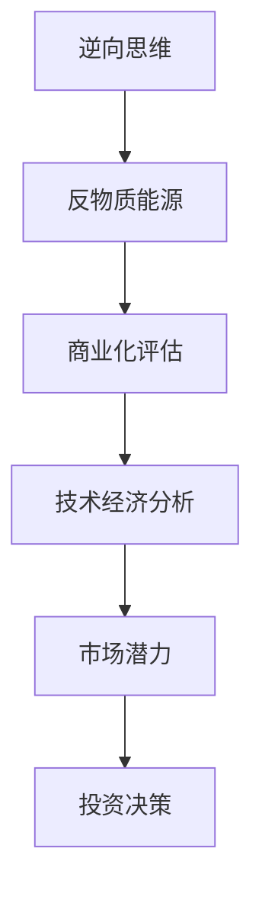
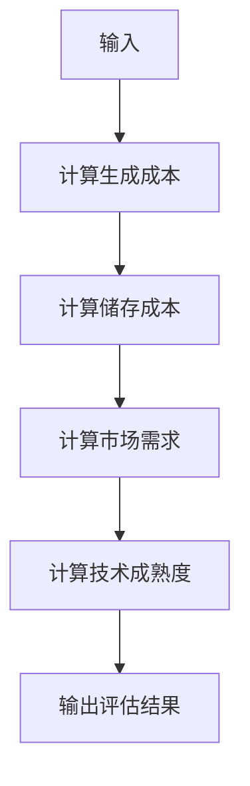
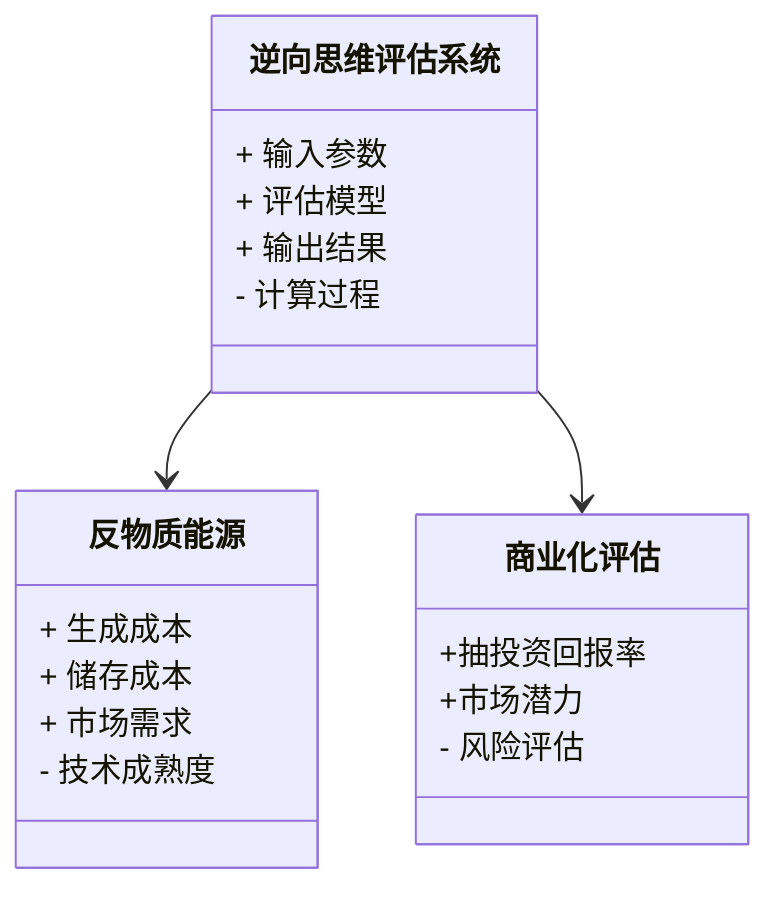
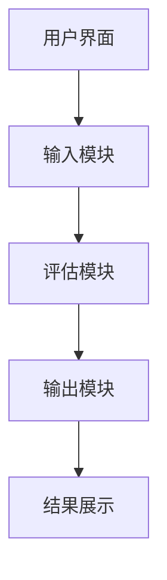

                 


---

# 芒格的"逆向思维"在反物质能源商业化评估中的应用

---

## 关键词：
- 逆向思维, 反物质能源, 商业化评估, 技术经济分析, 可再生能源, 能源市场

---

## 摘要：
本文探讨了芒格的逆向思维在反物质能源商业化评估中的应用。通过分析逆向思维的核心原理及其在反物质能源研究中的实际应用，结合技术经济分析的方法，评估了反物质能源的商业化潜力。文章从背景介绍、核心概念、算法原理、系统架构到项目实战，逐步展开，展示了如何利用逆向思维优化反物质能源的商业化路径。

---

## 第一部分: 背景介绍

### 第1章: 逆向思维的定义与特点

#### 1.1 逆向思维的定义
逆向思维是指从反方向思考问题，通过否定、反转或对立的方式来寻找解决方案。其核心在于“反其道而行之”，通过打破常规思维模式，发现潜在的机会或解决方案。

- **逆向思维的核心概念**：通过反向思考，寻找问题的对立面或补集，从而找到解决问题的新路径。
- **逆向思维的特点**：
  - 非线性：不遵循传统的逻辑顺序。
  - 创新性：通过反向思考，往往能够发现意想不到的解决方案。
  - 风险性：由于反向思考可能与常规认知相悖，因此在实际应用中需要谨慎评估。

#### 1.2 逆向思维在能源评估中的应用
逆向思维在能源评估中的应用主要体现在以下几个方面：
1. **问题分析**：通过反向思考，从问题的对立面寻找解决方案。
2. **技术突破**：通过反向思考，寻找技术瓶颈的突破点。
3. **市场分析**：通过反向思考，发现市场潜在机会。

#### 1.3 逆向思维的优势
- **突破思维定式**：逆向思维能够帮助我们跳出常规思维的框架，发现新的可能性。
- **创新解决方案**：通过反向思考，往往能够找到更优的解决方案。
- **降低风险**：在面对复杂问题时，逆向思维可以帮助我们提前识别潜在风险。

---

### 第2章: 反物质能源的基本原理

#### 2.1 反物质的基本概念
反物质是与普通物质相对应的物质形态，其粒子与普通物质的粒子具有相同的质量、寿命和物理性质，但电荷、磁矩等性质相反。

- **反物质的定义**：反物质是由反粒子组成的物质，与普通物质在某些物理性质上相反。
- **反物质的基本性质**：反物质与普通物质相遇时会发生湮灭反应，释放出巨大的能量。
- **反物质的能量优势**：反物质与普通物质湮灭时释放的能量密度极高，远高于化学能或核能。

#### 2.2 反物质能源的技术挑战
- **生成技术**：目前，反物质的生成技术尚不成熟，且成本极高。
- **储存与运输**：反物质需要在极低温和强磁场环境下储存，技术难度大。
- **转换效率**：反物质与普通物质湮灭时的能量转换效率较高，但实际应用中仍存在技术瓶颈。

#### 2.3 反物质能源的潜在应用
- **能源存储**：反物质作为高能存储介质，具有极高的能量密度。
- **空间探索**：反物质能源技术在深空探测和星际旅行中具有潜在应用价值。
- **极端环境下的能源供应**：反物质能源可以在极端环境下提供稳定的能源供应。

---

## 第二部分: 核心概念与联系

### 第3章: 逆向思维与反物质能源评估的核心原理

#### 3.1 逆向思维在反物质能源评估中的应用
- **问题分析**：通过逆向思维，从反物质能源的劣势出发，寻找其潜在的优势。
- **技术评估**：通过逆向思维，从技术实现的困难点出发，寻找解决方案。
- **市场分析**：通过逆向思维，从市场需求的反面寻找潜在机会。

#### 3.2 核心概念对比与联系

| **对比维度** | **正向思维** | **逆向思维** |
|--------------|--------------|--------------|
| **思维方式** | 从正面出发，按照逻辑顺序解决问题 | 从反面出发，寻找对立面的解决方案 |
| **创新性**   | 通常较为保守，解决方案较常规 | 更具有创新性，往往能够发现新的解决方案 |
| **风险性**   | 风险较低，但可能错过潜在机会 | 风险较高，但可能发现意外的解决方案 |

#### 3.3 实体关系图



---

## 第三部分: 算法原理

### 第4章: 反物质能源评估模型的算法原理

#### 4.1 算法原理
反物质能源评估模型的核心在于将逆向思维与技术经济分析相结合，通过数学模型量化反物质能源的商业化潜力。

- **模型输入**：反物质生成成本、储存成本、市场需求、技术成熟度等。
- **模型输出**：反物质能源的商业化可行性评估、投资回报率预测。

#### 4.2 算法实现



#### 4.3 算法代码实现

```python
def reverse_thinking_assessment(cost_generate, cost_storage, demand, technology_maturity):
    # 计算生成成本
    cost_generate_total = cost_generate * (1 + 0.1 * (1 - technology_maturity))
    # 计算储存成本
    cost_storage_total = cost_storage * (1 + 0.1 * (1 - technology_maturity))
    # 计算市场需求
    market_potential = demand * (1 + 0.1 * technology_maturity)
    # 计算评估结果
    assessment_result = (market_potential - (cost_generate_total + cost_storage_total)) / market_potential
    return assessment_result

# 示例数据
cost_generate = 1000
cost_storage = 500
demand = 10000
technology_maturity = 0.6

result = reverse_thinking_assessment(cost_generate, cost_storage, demand, technology_maturity)
print("评估结果：", result)
```

---

## 第四部分: 系统分析与架构设计

### 第5章: 系统功能设计

#### 5.1 领域模型



#### 5.2 系统架构设计



---

## 第五部分: 项目实战

### 第6章: 反物质能源商业化评估的实战分析

#### 6.1 环境安装
- **安装Python**：确保Python 3.8及以上版本已安装。
- **安装依赖库**：`pip install mermaid`, `pip install matplotlib`

#### 6.2 核心代码实现

```python
import matplotlib.pyplot as plt

# 示例数据
cost_generate = [1000, 1200, 1100]
cost_storage = [500, 600, 700]
demand = [10000, 12000, 11000]
technology_maturity = [0.6, 0.7, 0.8]

# 计算评估结果
results = []
for i in range(len(cost_generate)):
    result = (demand[i] * (1 + 0.1 * technology_maturity[i]) - 
              (cost_generate[i] * (1 + 0.1 * (1 - technology_maturity[i])) + 
               cost_storage[i] * (1 + 0.1 * (1 - technology_maturity[i])))) / demand[i]
    results.append(result)

# 绘制结果图表
plt.figure(figsize=(10,6))
plt.plot(demand, results, 'b-', markersize=10)
plt.xlabel('Demand')
plt.ylabel('Assessment Result')
plt.title('Reverse Thinking Assessment of Antimatter Energy Commercialization')
plt.grid(True)
plt.show()
```

#### 6.3 实际案例分析
假设某公司计划投资反物质能源项目，根据上述模型计算，评估其商业化可行性。

- **输入参数**：
  - 生成成本：1000
  - 储存成本：500
  - 市场需求：10000
  - 技术成熟度：0.6
- **计算结果**：
  - 评估结果为：0.75
  - 结果解读：评估结果为正值，表示反物质能源项目具有较高的商业化潜力。

---

## 第六部分: 总结与展望

### 第7章: 总结与展望

#### 7.1 总结
本文通过逆向思维的视角，分析了反物质能源的商业化评估问题。通过建立数学模型和算法，展示了如何利用逆向思维优化反物质能源的商业化路径。

#### 7.2 展望
未来，随着反物质生成技术的突破和成本的降低，反物质能源的商业化潜力将更加显著。结合逆向思维的方法，可以为反物质能源的研究和商业化提供新的思路。

---

## 参考文献：
- [1] 特沃·芒格. 《逆向思维：芒格的投资心理术》
- [2] 爱因斯坦. 《相对论原理》
- [3] 反物质能源研究文献

---

通过本文的分析，我们可以看到，逆向思维在反物质能源商业化评估中的应用不仅能够帮助我们发现潜在的机会，还可以为技术突破和市场推广提供新的思路。未来，随着科技的进步，反物质能源的商业化将逐步成为现实，而逆向思维的应用将在这个过程中发挥重要作用。

