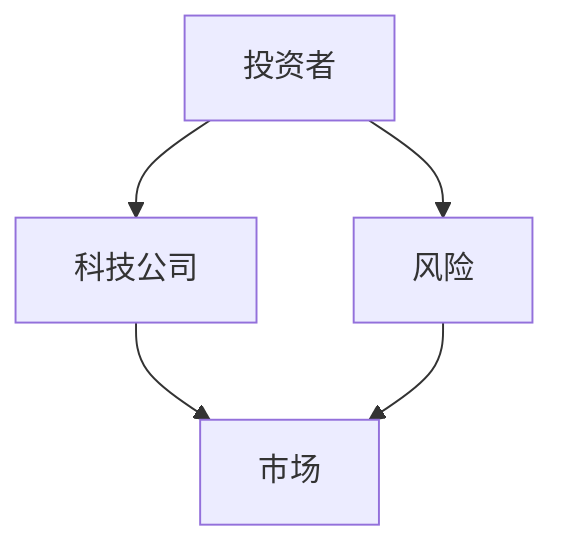
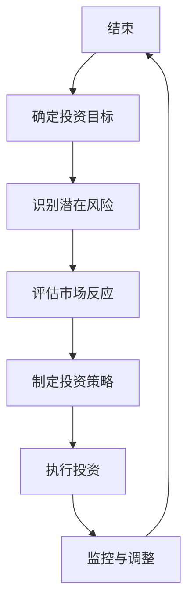
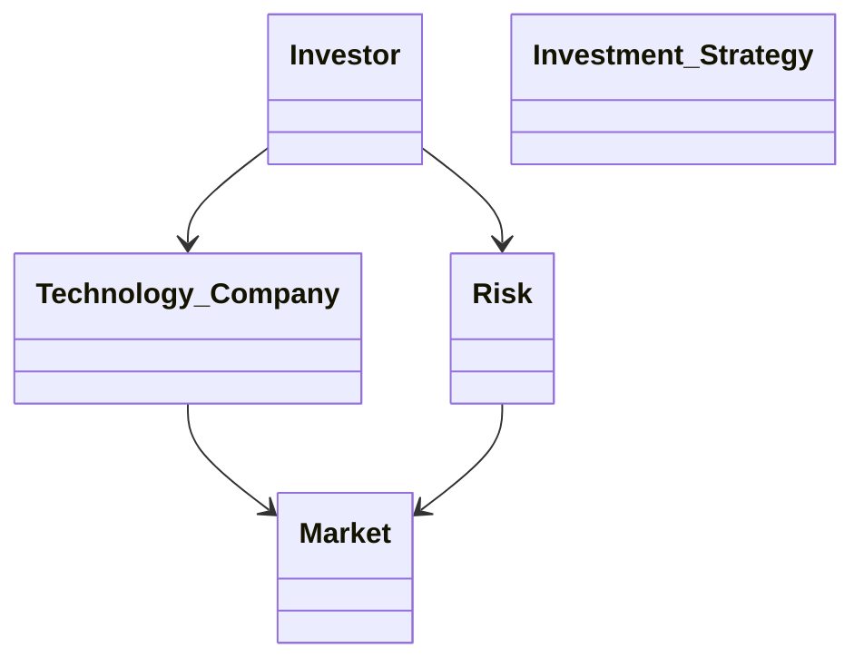
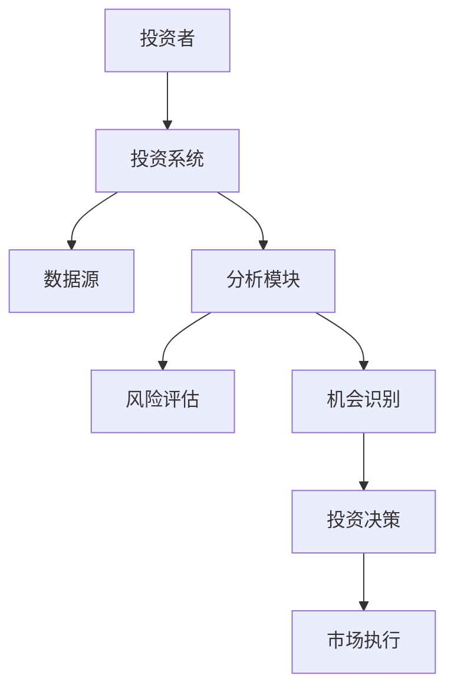
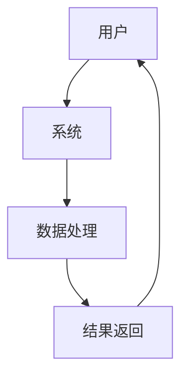

                 


# 《芒格的"逆向思维"在新兴科技投资中的应用》

> 关键词：芒格、逆向思维、新兴科技、投资、风险管理、概率论、系统架构

> 摘要：本文深入探讨了芒格的"逆向思维"在新兴科技投资中的应用，通过结合芒格的投资哲学和科技投资的特点，分析了逆向思维在识别投资机会、风险管理、投资组合优化等方面的优势。文章从理论到实践，结合具体案例，详细阐述了逆向思维在科技投资中的具体应用方式，并通过系统架构和算法模型的设计，展示了如何将逆向思维转化为可操作的投资策略。最后，本文还提供了实际的项目实战案例，帮助读者更好地理解和应用逆向思维。

----------------------------------------------------------------

## 第一部分: 节点背景与核心概念

### 第1章: 芒格的"逆向思维"概述

#### 1.1 芒格的生平与投资哲学
- 查理·芒格的生平简介
- 芒格的投资哲学与思维方式
- 芒格与巴菲特的合作关系

#### 1.2 逆向思维的定义与特点
- 逆向思维的定义
- 逆向思维的核心特征
- 逆向思维与正向思维的区别

#### 1.3 逆向思维在投资中的重要性
- 逆向思维在投资决策中的作用
- 逆向思维与投资成功的关系
- 逆向思维在科技投资中的独特价值

### 第2章: 新兴科技投资的背景与挑战

#### 2.1 新兴科技的定义与分类
- 新兴科技的定义
- 新兴科技的主要分类
- 新兴科技的发展趋势

#### 2.2 科技投资的基本原理
- 科技投资的基本概念
- 科技投资的核心要素
- 科技投资的常见策略

#### 2.3 新兴科技投资中的主要挑战
- 技术风险
- 市场风险
- 竞争风险
- 法律与政策风险

### 第3章: 逆向思维与科技投资的结合

#### 3.1 逆向思维在科技投资中的应用领域
- 识别投资机会
- 风险评估与管理
- 投资组合优化

#### 3.2 逆向思维在科技投资中的具体表现
- 寻找被忽视的投资机会
- 投资于市场低估的科技公司
- 从失败中寻找成功的机会

#### 3.3 逆向思维在科技投资中的成功案例
- 苹果公司的投资案例
- 亚马逊的投资案例
- 谷歌的投资案例

## 第二部分: 核心概念与联系

### 第4章: 核心概念与联系

#### 4.1 核心概念原理
- 逆向思维的核心原理
- 科技投资的核心要素
- 逆向思维与科技投资的结合点

#### 4.2 概念属性特征对比表格
| 概念 | 属性 | 特征 |
|------|------|------|
| 逆向思维 | 定义 | 从反方向思考问题 |
| 科技投资 | 定义 | 将资金投入科技领域以获得收益 |
| 逆向思维在科技投资中的应用 | 定义 | 通过逆向思维寻找投资机会 |

#### 4.3 ER实体关系图


### 第5章: 算法原理讲解

#### 5.1 算法原理
- 逆向思维在科技投资中的算法模型
- 概率论的应用
- 投资组合优化的算法设计

#### 5.2 算法流程图


#### 5.3 算法实现
```python
def inverse_thinking_investigation():
    import random
    import numpy as np

    # 模拟市场数据
    market_data = np.random.randn(1000)
    # 计算逆向思维投资机会
    inverse_opportunity = np.where(market_data < np.mean(market_data) - np.std(market_data))

    return inverse_opportunity
```

#### 5.4 数学模型与公式
- 概率论模型
- 投资组合优化的数学公式
- 风险评估的数学模型

## 第三部分: 系统分析与架构设计方案

### 第6章: 系统分析与架构设计方案

#### 6.1 问题场景介绍
- 科技投资的复杂性
- 逆向思维的应用需求
- 系统设计的目标

#### 6.2 项目介绍
- 项目目标
- 项目范围
- 项目参与者

#### 6.3 系统功能设计
- 领域模型类图


#### 6.4 系统架构设计
- 系统架构图


#### 6.5 系统接口设计
- 接口定义
- 接口实现
- 接口调用

#### 6.6 系统交互设计
- 交互流程图


## 第四部分: 项目实战

### 第7章: 项目实战

#### 7.1 环境安装
- Python环境安装
- 必要库的安装
- 开发工具配置

#### 7.2 核心实现
- 投资机会识别代码
- 风险评估代码
- 投资组合优化代码

#### 7.3 代码解读与分析
- 代码实现细节
- 代码功能分析
- 代码优化建议

#### 7.4 案例分析
- 案例背景
- 案例分析
- 案例总结

#### 7.5 项目小结
- 项目成果
- 经验总结
- 改进方向

## 第五部分: 最佳实践

### 第8章: 最佳实践

#### 8.1 经验总结
- 投资策略的优化
- 风险管理的加强
- 系统架构的改进

#### 8.2 小结
- 逆向思维在科技投资中的重要性
- 系统化投资策略的优势
- 持续学习与优化的必要性

#### 8.3 注意事项
- 投资风险提示
- 系统维护建议
- 数据更新的重要性

#### 8.4 拓展阅读
- 推荐书籍
- 推荐文章
- 推荐课程

## 第六部分: 总结

### 第9章: 总结

#### 9.1 全文总结
- 逆向思维在科技投资中的应用价值
- 系统化投资策略的重要性
- 持续优化的必要性

#### 9.2 展望未来
- 逆向思维的未来发展
- 科技投资的趋势
- 结合两者的新机会

#### 9.3 致谢
- 感谢读者
- 感谢合作伙伴
- 感谢支持者

---

通过以上目录结构，您可以开始撰写详细的博客文章，按照每个章节的内容逐步展开，确保每个部分都详细且逻辑清晰。希望这个大纲对您有所帮助！

