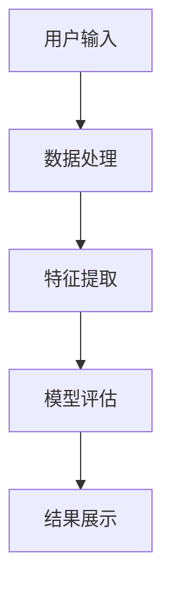
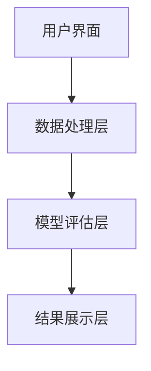

                 

# 芒格的"逆向思维"在颠覆性技术评估中的重要性

## 关键词：芒格、逆向思维、颠覆性技术、技术评估、创新、战略决策

## 摘要：芒格的逆向思维是一种从反方向思考问题的方法，能够帮助我们在评估颠覆性技术时发现潜在的机会和风险。本文将详细探讨逆向思维在颠覆性技术评估中的重要性，结合实际案例分析其应用，帮助读者更好地理解和应用这一思维方式。

---

## 第一部分：逆向思维与颠覆性技术概述

### 第1章：逆向思维的定义与特点

#### 1.1 逆向思维的定义与核心要素

- 逆向思维是一种从反方向思考问题的方法，与传统正向思维相对。
- 核心要素包括反向思考、问题解决和机会发现。

#### 1.2 颠覆性技术的定义与特点

- 颠覆性技术是指能够彻底改变现有市场格局或商业模式的新技术。
- 其特点包括创新性、革命性和潜在的高风险高回报。

#### 1.3 逆向思维在颠覆性技术评估中的重要性

- 逆向思维能够帮助我们从反面发现问题，提前识别潜在风险。
- 它还能帮助我们发现看似不可能的机会，从而在竞争中占据先机。

---

## 第二部分：逆向思维的评估框架与方法

### 第2章：逆向思维的评估框架

#### 2.1 逆向思维评估框架的核心要素

- **问题背景分析**：从反面思考问题的根源和影响。
- **技术可行性评估**：评估技术实现的可能性和潜在风险。
- **市场潜力分析**：通过反向思考发现市场机会。

#### 2.2 逆向思维评估的步骤

1. **明确评估目标**：确定评估的核心问题和目标。
2. **收集相关信息**：从反面寻找问题相关的数据和信息。
3. **构建评估模型**：利用逆向思维构建评估框架。
4. **得出评估结论**：通过反向分析得出最终结论。

#### 2.3 逆向思维评估的数学模型

- 技术潜力评估公式：$$技术潜力 = 1 - （技术可行性 + 市场潜力）$$
- 市场可行性评估公式：$$市场可行性 = 1 - （市场需求 + 竞争压力）$$
- 综合评估模型：$$综合评估 = 技术潜力 \times 市场潜力$$

---

## 第三部分：项目实战与案例分析

### 第3章：项目实战

#### 3.1 环境安装与配置

- **开发环境**：安装必要的开发工具和库，例如Python、TensorFlow等。

#### 3.2 系统功能设计

- **用户需求分析**：通过逆向思维分析用户需求，确定系统功能模块。
- **功能模块划分**：包括数据输入、特征提取、模型评估和结果展示。
- **功能流程图（Mermaid）**

#### 3.3 系统架构设计

- **分层架构设计**：用户界面、数据处理层、模型评估层和结果展示层。
- **系统架构图（Mermaid）**

---

## 第四部分：总结与展望

### 第4章：总结与展望

#### 4.1 总结

- 逆向思维在颠覆性技术评估中具有重要意义，能够帮助我们从反面发现问题和机会。
- 通过逆向思维，我们可以更全面地评估技术的潜力和风险，做出更明智的决策。

#### 4.2 展望

- 逆向思维的应用前景广阔，未来可以在更多领域中发挥重要作用。
- 随着技术的发展，逆向思维的评估框架和方法也将不断完善，为颠覆性技术的评估提供更有力的支持。

---

## 结语

芒格的逆向思维是一种极具价值的思维方式，它能够帮助我们在评估颠覆性技术时发现潜在的机会和风险。通过本文的详细分析和实际案例，我们希望能够为读者提供一些新的思路和方法，帮助他们在技术评估和决策中更加得心应手。

