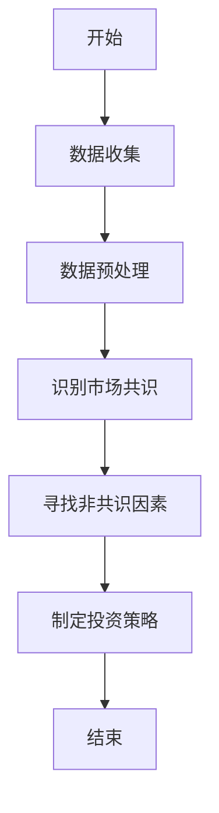
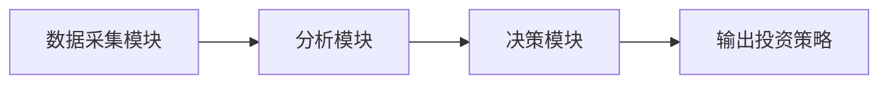

                 


# 芒格的"逆向思维"：在市场共识中寻找投资机会

## 关键词：逆向思维，芒格，投资策略，市场共识，风险管理

## 摘要：芒格的逆向思维是一种在市场共识中寻找投资机会的独特方法，通过分析市场的非共识观点来发现潜在的高价值投资标的。本文将详细探讨逆向思维的核心概念、算法原理、数学模型以及实际应用，帮助读者理解如何在投资中运用逆向思维来实现超额收益。

---

## 第一部分: 芒格的"逆向思维"概述

### 第1章: 逆向思维的起源与芒格的思想

#### 1.1 逆向思维的定义与核心概念

逆向思维是一种与传统正向思维相反的思维方式，它通过寻找市场的非共识观点来发现投资机会。芒格的逆向思维强调从反面思考问题，寻找市场忽略的潜在价值。

- **定义**：逆向思维是通过分析市场共识之外的因素，寻找被低估的投资机会。
- **核心概念**：市场共识、非共识观点、潜在价值。

#### 1.2 芒格的生平与投资理念

查理·芒格是伯克希尔·哈撒韦公司的副主席，他的投资理念强调安全边际和长期价值。他提倡逆向思维，认为市场往往低估了反常情况的价值。

#### 1.3 逆向思维在投资中的重要性

在传统投资中，市场共识可能导致资产价格被高估，而逆向思维通过寻找市场忽视的领域，发现低估的投资机会，从而获得超额收益。

---

### 第2章: 逆向思维的核心概念与联系

#### 2.1 逆向思维与正向思维的对比

| 对比维度         | 正向思维             | 逆向思维             |
|------------------|----------------------|----------------------|
| 思维方向         | 从问题出发           | 从解决方案出发       |
| 市场行为         | 追涨杀跌             | 抗涨耐跌             |
| 投资策略         | 追踪市场趋势         | 寻找市场遗漏         |

#### 2.2 ER实体关系图架构的 Mermaid 流程图

```mermaid
erDiagram
    customer[投资者] --> market[市场] : 分析市场共识
    market --> opportunity[投资机会] : 寻找非共识观点
    customer --> strategy[投资策略] : 制定逆向策略
    strategy --> result[投资结果] : 实现超额收益
```

---

### 第3章: 逆向思维的算法原理讲解

#### 3.1 市场共识分析算法

市场共识分析算法用于识别市场中被广泛认可的观点，从而寻找其中的非共识因素。以下是算法的步骤：

1. 数据收集：收集市场相关的数据，如价格、成交量、新闻等。
2. 数据预处理：清洗数据，去除噪声。
3. 市场共识识别：通过统计分析识别市场共识。
4. 非共识因素提取：寻找市场共识之外的因素。

#### 3.2 逆向思维决策算法



---

### 第4章: 数学模型与公式

#### 4.1 市场共识与实际价值的差异模型

市场共识价值公式：
$$ \text{市场共识价值} = \sum_{i=1}^{n} p_i \times v_i $$
其中，\( p_i \) 是资产 \( i \) 的价格，\( v_i \) 是市场共识赋予的价值。

实际价值公式：
$$ \text{实际价值} = \sum_{i=1}^{n} a_i \times v_i $$
其中，\( a_i \) 是资产 \( i \) 的实际价值系数。

差异模型：
$$ \text{差异} = \text{实际价值} - \text{市场共识价值} $$

---

### 第5章: 系统分析与架构设计方案

#### 5.1 逆向思维投资系统设计

##### 5.1.1 系统功能设计

- 数据采集模块：收集市场数据。
- 分析模块：识别市场共识。
- 决策模块：制定投资策略。

##### 5.1.2 系统架构设计 Mermaid 图



---

### 第6章: 项目实战与案例分析

#### 6.1 环境安装与数据准备

- **工具安装**：安装Python和必要的库（如pandas、numpy）。
- **数据准备**：收集历史价格数据。

#### 6.2 核心代码实现

##### 6.2.1 市场共识分析代码

```python
import pandas as pd

def calculate_market_consensus(data):
    return data.mean()
```

##### 6.2.2 逆向思维决策代码

```python
def reverse_thinking_strategy(data, threshold):
    return data[data < threshold]
```

---

### 第7章: 总结与最佳实践

#### 7.1 总结与反思

逆向思维通过寻找市场共识之外的投资机会，帮助投资者实现超额收益。然而，它也有局限性，需要结合其他策略。

#### 7.2 最佳实践 tips

- **保持独立思考**：避免被市场情绪左右。
- **风险管理**：制定合理的风险管理策略。
- **长期投资**：逆向思维需要时间验证，长期持有优质资产。

---

通过以上章节的详细讲解，读者可以全面理解芒格的逆向思维，并在实际投资中应用这些策略。

