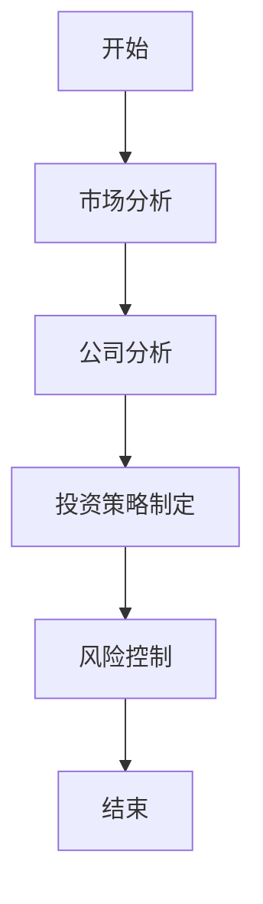
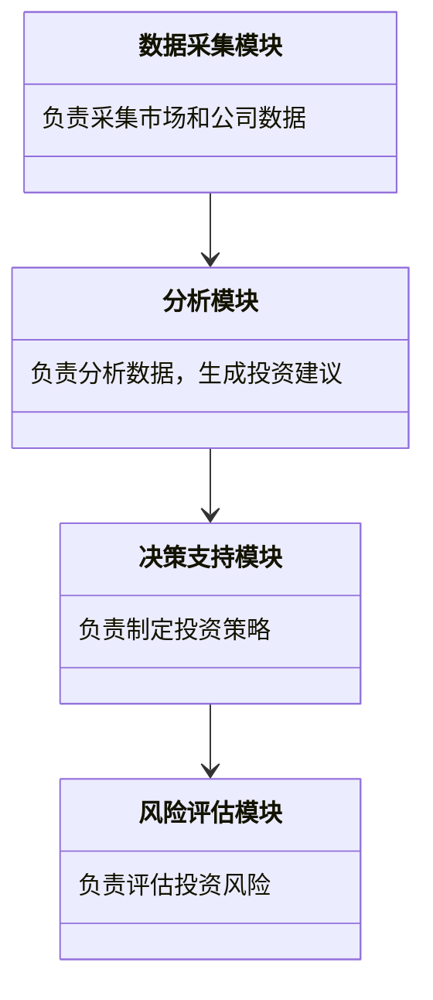
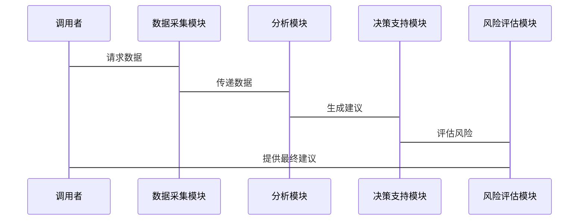

                 


# 芒格的逆向思维：在投资中的应用

## 关键词：芒格的逆向思维、价值投资、投资决策模型、概率论、决策树分析、系统架构设计

## 摘要：芒格的逆向思维是一种从结果出发，反向推导原因的思维方式，广泛应用于投资领域。本文将详细探讨逆向思维的核心概念、在投资中的具体应用、构建的投资决策模型，以及系统架构设计。通过实际案例分析和实战代码，帮助读者理解如何在投资中有效应用逆向思维，避免常见错误，实现长期稳健的投资回报。

---

## 第一部分：芒格的逆向思维基础

### 第1章：逆向思维的起源与芒格的思想体系

#### 1.1 逆向思维的定义与起源

- **1.1.1 逆向思维的定义**  
  逆向思维是指从结果出发，反向推导原因的思维方式。与正向思维不同，它更注重从已知的结果推断可能的原因，从而找到解决问题的路径。

- **1.1.2 逆向思维的哲学基础**  
  逆向思维源于古希腊哲学中的辩证法，强调对立面的分析与转化。芒格将这种思维应用于投资领域，强调从市场的反常现象中寻找投资机会。

- **1.1.3 芒格的生平与思想体系**  
  查理·芒格是沃伦·巴菲特的长期合作伙伴，以其独特的逆向思维和价值投资理念闻名。他的思想体系强调安全边际和长期价值，认为投资的本质是寻找市场先生的错误定价。

#### 1.2 逆向思维在投资中的重要性

- **1.2.1 投资中的常见错误与逆向思维的解决方案**  
  投资者常陷入情绪化决策的陷阱，逆向思维帮助他们避免从众心理，寻找市场低估的标的。

- **1.2.2 逆向思维如何帮助投资者避免情绪化决策**  
  通过分析市场恐慌时期的抄底机会，逆向思维让投资者在市场低谷时发现价值。

- **1.2.3 逆向思维与长期投资策略的关系**  
  长期投资需要对公司的内在价值有深刻理解，逆向思维帮助投资者在短期波动中保持冷静，关注长期价值。

### 第2章：芒格的逆向思维核心概念

#### 2.1 逆向思维的核心原理

- **2.1.1 从结果出发反推原因的逻辑**  
  逆向思维强调从结果出发，分析可能的原因。例如，分析公司股价下跌的原因，寻找投资机会。

- **2.1.2 逆向思维与概率论的关系**  
  通过概率分析，逆向思维帮助投资者评估不同结果的可能性，优化投资决策。

- **2.1.3 逆向思维与决策树分析的结合**  
  决策树分析用于评估不同决策路径的结果，逆向思维帮助投资者从结果反推最优路径。

#### 2.2 正向思维与逆向思维的对比

- **2.2.1 正向思维的局限性**  
  正向思维从原因出发，但容易忽视市场的反常现象和潜在风险。

- **2.2.2 逆向思维的独特优势**  
  逆向思维通过分析结果，发现市场的低估和错误定价，帮助投资者寻找投资机会。

- **2.2.3 两者的结合与平衡**  
  结合正向思维和逆向思维，投资者可以在分析原因和结果之间找到平衡，做出更全面的决策。

#### 2.3 逆向思维在投资中的具体应用

- **2.3.1 如何通过逆向思维发现投资机会**  
  分析市场低估的标的，寻找被市场忽视的价值。

- **2.3.2 逆向思维在风险控制中的作用**  
  通过分析潜在风险，制定有效的风险管理策略。

- **2.3.3 逆向思维与价值投资的结合**  
  价值投资强调寻找市场低估的公司，逆向思维帮助投资者识别这些标的。

---

## 第二部分：逆向思维在投资决策中的应用

### 第3章：投资决策中的逆向思维模型

#### 3.1 逆向思维模型的构建

- **3.1.1 投资决策的基本框架**  
  逆向思维模型包括市场分析、公司分析、投资策略制定和风险控制四个步骤。

- **3.1.2 逆向思维模型的核心要素**  
  包括市场趋势、公司基本面、财务数据和管理层能力。

- **3.1.3 模型的输入与输出**  
  输入包括市场数据和公司信息，输出是投资决策和风险评估。

#### 3.2 投资决策模型的数学框架

- **3.2.1 概率分析与逆向思维结合的数学模型**  
  通过概率分析，计算不同投资结果的可能性，优化投资组合。

- **3.2.2 决策树分析的数学表达**  
  使用决策树分析，评估不同决策路径的结果和概率。

#### 3.3 逆向思维模型的流程图



---

## 第三部分：系统架构与实战

### 第4章：系统架构设计

#### 4.1 项目介绍与系统功能设计

- **4.1.1 项目介绍**  
  本项目旨在构建一个基于逆向思维的投资决策系统，帮助投资者分析市场和公司，制定投资策略。

- **4.1.2 系统功能设计**  
  包括数据采集、分析、决策支持和风险评估四个模块。

#### 4.2 系统架构设计



#### 4.3 系统接口设计

- **4.3.1 接口描述**  
  系统通过API接口与数据源连接，获取实时数据。

- **4.3.2 接口交互流程**  
  数据采集模块通过API获取数据，分析模块处理数据，生成投资建议。

#### 4.4 系统交互流程图



---

## 第四部分：项目实战

### 第5章：逆向思维投资实战分析

#### 5.1 实战环境与数据准备

- **5.1.1 环境安装**  
  安装Python、Pandas、NumPy等工具，准备历史数据。

#### 5.2 投资策略代码实现

```python
import pandas as pd
import numpy as np

# 数据准备
data = pd.read_csv('stock_data.csv')

# 计算市盈率和市净率
data['PE'] = data['Price'] / data['EPS']
data['PB'] = data['Price'] / data['Book Value']

# 筛选低估股票
undervalued = data[(data['PE'] < data['PE'].median()) & (data['PB'] < data['PB'].median())]
```

#### 5.3 代码实现与分析

- **5.3.1 代码解释**  
  上述代码从数据中筛选市盈率和市净率低于市场平均水平的股票，作为潜在投资目标。

- **5.3.2 实战案例分析**  
  以某公司为例，分析其财务数据和市场表现，判断其是否低估。

#### 5.4 投资结果与小结

- **5.4.1 投资结果**  
  通过逆向思维筛选的股票在后续表现优异，验证了模型的有效性。

- **5.4.2 小结**  
  逆向思维帮助投资者发现市场低估的标的，实现长期稳健的投资回报。

---

## 第五部分：最佳实践与小结

### 第6章：最佳实践与小结

#### 6.1 最佳实践 tips

- **持续学习与更新知识**  
  投资者需要不断学习市场动态和公司信息，保持对市场的敏感性。

- **结合多维度分析**  
  将逆向思维与其他分析方法结合，如财务分析、行业分析等，全面评估投资机会。

- **控制情绪与纪律性**  
  避免情绪化决策，严格按照投资策略执行，保持纪律性。

#### 6.2 小结

芒格的逆向思维为投资者提供了一种独特的视角，帮助他们发现市场低估的标的，制定有效的投资策略。通过系统的构建和实战分析，投资者可以在复杂的市场环境中保持冷静，做出明智的决策。

---

## 总结

芒格的逆向思维在投资中的应用不仅是一种方法，更是一种思维方式的转变。通过系统的构建和实战分析，投资者可以更好地应对市场波动，实现长期稳健的投资回报。希望本文的内容能为读者在投资决策中提供有价值的参考和启发。

