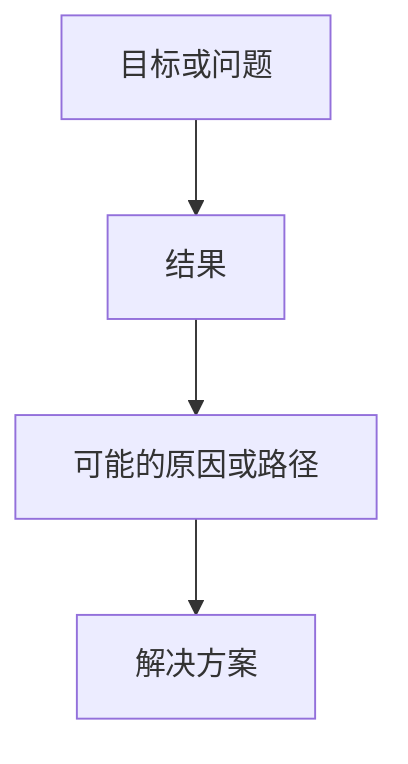
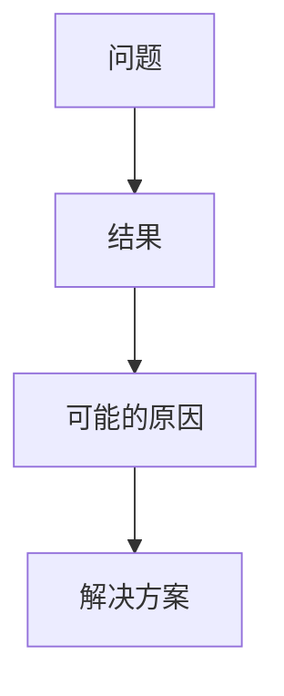
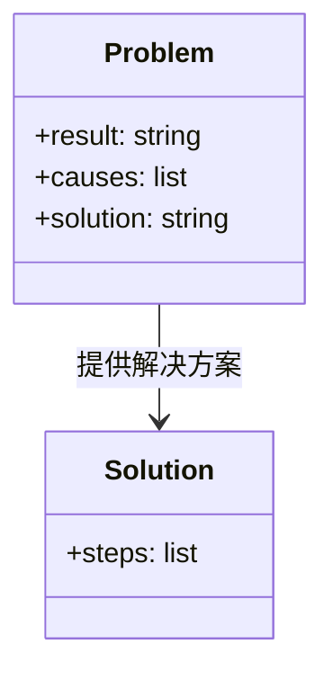
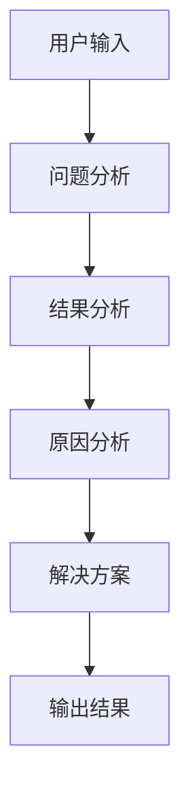
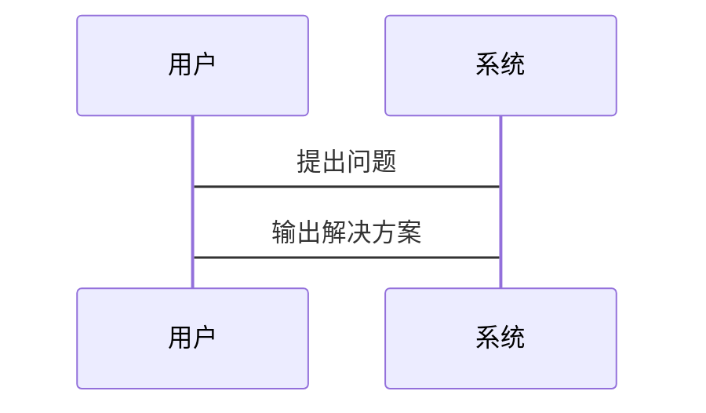
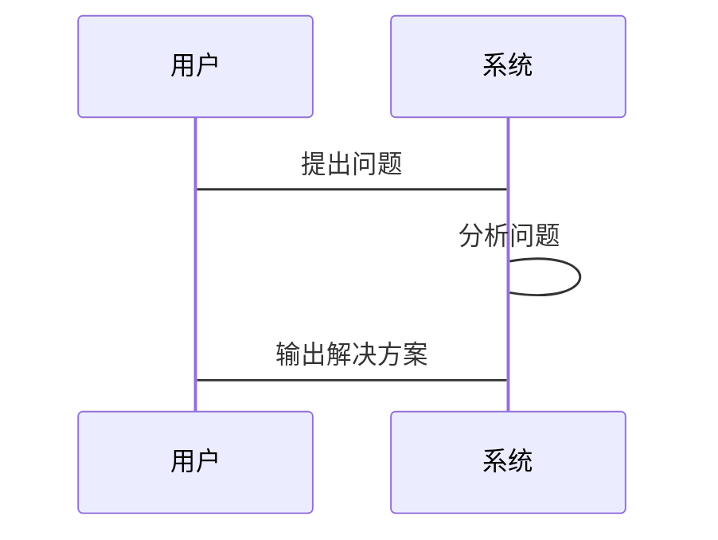

                 


# 芒格的逆向思考法：挑战常规思维模式

## 关键词
- 芒格的逆向思维
- 思维模型
- 决策优化
- 批判性思维
- 问题解决

## 摘要
芒格的逆向思考法是一种颠覆传统思维的创新方法，通过反向思考问题，挑战常规思维模式，寻找更优解决方案。本文从背景介绍、核心概念、算法原理、数学模型、系统架构、项目实战到最佳实践，全面解析逆向思维的应用，结合实际案例，帮助读者掌握这一思维方式。

---

# 第一部分: 芒格的逆向思考法背景介绍

# 第1章: 逆向思维的起源与芒格的贡献

## 1.1 逆向思维的定义与核心概念

### 1.1.1 逆向思维的起源与发展
逆向思维是一种不同于正向思维的思考方式，通过反向思考问题，寻找新的解决方案。其起源可以追溯到古希腊哲学家亚里士多德，他在《工具论》中提出逆向推理的概念。芒格进一步发展了这一思想，将其应用于投资和决策领域。

**关键术语对比表：**

| 正向思维 | 逆向思维 |
|----------|----------|
| 从原因到结果 | 从结果到原因 |
| 前提明确 | 结果为导向 |
| 解决已知问题 | 寻找未知解决方案 |

### 1.1.2 芒格的逆向思考法的核心思想
芒格的逆向思考法以“倒推法”为基础，通过分析问题的反面，找到潜在的解决方案。他强调通过反向思考来优化决策，避免陷入思维定式。

### 1.1.3 逆向思维在问题解决中的应用
逆向思维广泛应用于创新设计、投资决策等领域。通过反向思考，可以发现隐藏的机会和风险，从而制定更有效的策略。

## 1.2 芒格的思维模式与投资哲学

### 1.2.1 芒格的思维模型体系
芒格提出了“多元思维模型”，将各个学科的基本原理作为工具，用于分析问题。逆向思维是其中的重要工具，帮助他识别投资中的潜在风险。

### 1.2.2 芒格投资哲学的核心理念
芒格的投资哲学强调安全边际和长期价值。逆向思维帮助他在市场低谷时发现投资机会，避免过度乐观的决策。

### 1.2.3 芒格思维模式对现代决策的影响
芒格的逆向思维影响了现代商业决策、风险管理等领域，成为解决复杂问题的重要方法。

## 1.3 逆向思维在现代社会的应用场景

### 1.3.1 商业决策中的逆向思维
企业可以通过逆向思维分析市场趋势，找到竞争优势。例如，苹果通过逆向设计，推出革命性的产品。

### 1.3.2 个人生活中的逆向思维
个人可以通过逆向思维规划职业发展，避免常见错误。例如，设定目标后，反向思考可能遇到的障碍，提前制定应对策略。

### 1.3.3 逆向思维在创新中的作用
创新需要打破常规，逆向思维通过反向思考，发现新的可能性。例如，特斯拉通过逆向设计，推动电动汽车的发展。

## 1.4 本章小结
逆向思维是一种颠覆传统思维的创新方法，通过反向思考问题，挑战常规思维模式，寻找更优解决方案。芒格的逆向思考法在投资、商业决策等领域取得了显著成效，值得我们深入研究和应用。

---

# 第二部分: 逆向思维的核心概念与原理

# 第2章: 逆向思维的核心概念体系

## 2.1 核心概念的定义与属性

### 2.1.1 逆向思维的定义
逆向思维是一种通过反向思考问题，寻找解决方案的思维方法。它与正向思维相反，从结果出发，推导原因。

### 2.1.2 逆向思维的关键属性对比表

| 属性 | 正向思维 | 逆向思维 |
|------|----------|----------|
| 思维方向 | 原因→结果 | 结果→原因 |
| 思维过程 | 直接推理 | 反向推理 |
| 解决方式 | 解决已知问题 | 寻找未知解决方案 |

### 2.1.3 逆向思维的ER实体关系图
```mermaid
erDiagram
    customer[客户]
    problem[问题]
    solution[解决方案]
   思考过程[思维过程]
    customer -|> problem : 提出问题
    problem -|> solution : 寻找解决方案
    solution -|> 思考过程 : 分析解决方案
```

## 2.2 逆向思维的原理与机制

### 2.2.1 逆向思维的逻辑结构
逆向思维的逻辑结构包括以下步骤：
1. 明确目标或问题。
2. 从结果出发，分析可能的原因或路径。
3. 反向推理，寻找解决方案。

### 2.2.2 逆向思维的思维流程图


### 2.2.3 逆向思维的数学模型与公式
逆向思维可以通过条件概率公式表示：
$$ P(A|B) = \frac{P(B|A)P(A)}{P(B)} $$
其中，$A$表示原因，$B$表示结果。

## 2.3 逆向思维与正向思维的对比分析

### 2.3.1 思维方向的对比
正向思维从原因出发，逆向思维从结果出发。例如，正向思维是“如果下雨，地会湿”，逆向思维是“地湿了，是否下雨了”。

### 2.3.2 思维过程的对比
正向思维直接推导，逆向思维反向推理。例如，正向思维是“如果努力学习，就会取得好成绩”，逆向思维是“取得好成绩，是否努力学习了”。

### 2.3.3 思维结果的对比
正向思维解决已知问题，逆向思维寻找未知解决方案。例如，正向思维解决“如何提高效率”，逆向思维解决“效率低下，如何优化”。

## 2.4 本章小结
逆向思维是一种重要的思维方法，通过反向思考，寻找新的解决方案。其核心在于从结果出发，分析原因，推导出解决方案。与正向思维相比，逆向思维更具创新性和突破性。

---

# 第三部分: 逆向思维的算法与数学模型

# 第3章: 逆向思维的算法原理

## 3.1 逆向思维的启发式算法

### 3.1.1 启发式算法的定义与特点
启发式算法是一种基于经验或直觉的搜索算法，通常用于解决复杂问题。逆向思维可以通过启发式算法实现反向推理。

### 3.1.2 逆向思维算法的流程图


### 3.1.3 启发式算法的Python实现代码
```python
def reverse_thinking(problem):
    result = problem.get_result()
    possible Causes = problem.find_possible_causes(result)
    solution = problem.solve_with_causes(possible Causes)
    return solution

# 示例用法
class Problem:
    def get_result(self):
        return "问题结果"

    def find_possible_causes(self, result):
        return ["可能原因1", "可能原因2"]

    def solve_with_causes(self, causes):
        return "解决方案"

problem = Problem()
solution = reverse_thinking(problem)
print(solution)
```

## 3.2 逆向思维的决策树模型

### 3.2.1 决策树模型的定义与特点
决策树是一种树状结构，用于表示决策过程。逆向思维可以通过决策树进行反向推理，分析结果的原因。

### 3.2.2 决策树模型的构建过程
1. 明确目标或问题。
2. 从结果出发，分析可能的原因。
3. 构建决策树，分析每个原因的可能性。

### 3.2.3 决策树模型的Python代码实现
```python
from sklearn.tree import DecisionTreeClassifier
from sklearn.datasets import make_classification

# 创建数据集
X, y = make_classification(n_samples=100, n_features=2, n_informative=2, n_redundant=0, random_state=42)

# 创建决策树模型
model = DecisionTreeClassifier()
model.fit(X, y)

# 反向推理
def reverse_predict(model, new_data):
    predicted = model.predict(new_data)
    return predicted

# 示例用法
new_data = [[0.5, 0.5]]
print(reverse_predict(model, new_data))
```

## 3.3 逆向思维的数学模型与公式

### 3.3.1 条件概率公式
$$ P(A|B) = \frac{P(B|A)P(A)}{P(B)} $$
其中，$A$表示原因，$B$表示结果。

### 3.3.2 贝叶斯定理的应用
贝叶斯定理用于计算条件概率，可以应用于逆向思维的分析。例如，分析结果的原因。

### 3.3.3 逆向思维的逻辑推理公式
$$ \text{如果 } B \text{ 发生，那么可能 } A \text{ 导致 } B $$

## 3.4 本章小结
逆向思维可以通过启发式算法和决策树模型实现。条件概率公式和贝叶斯定理为逆向思维提供了数学基础。这些方法可以帮助我们从结果出发，分析原因，制定解决方案。

---

# 第四部分: 逆向思维的系统分析与架构设计

# 第4章: 逆向思维的系统分析与架构设计

## 4.1 系统分析与问题场景介绍

### 4.1.1 项目介绍
项目目标是设计一个基于逆向思维的决策支持系统，帮助用户优化决策过程。

### 4.1.2 问题场景分析
系统需要分析用户提出的问题，从结果出发，反向推理原因，提供解决方案。

## 4.2 系统功能设计

### 4.2.1 领域模型设计


### 4.2.2 系统架构设计


## 4.3 系统接口设计

### 4.3.1 系统接口
系统提供以下接口：
1. 输入问题：用户输入需要解决的问题。
2. 输出结果：系统输出解决方案。

### 4.3.2 接口交互设计


## 4.4 系统交互设计

### 4.4.1 用户与系统交互流程
1. 用户输入问题。
2. 系统分析问题，反向推理原因。
3. 系统输出解决方案。

### 4.4.2 交互流程图


## 4.5 本章小结
系统通过逆向思维，分析问题，反向推理原因，输出解决方案。系统架构设计清晰，功能模块明确，能够有效支持逆向思维的应用。

---

# 第五部分: 逆向思维的项目实战

# 第5章: 逆向思维的项目实战

## 5.1 项目环境与工具安装

### 5.1.1 环境要求
- Python 3.8+
- scikit-learn库
- Mermaid工具

### 5.1.2 工具安装
安装Python和相关库：
```bash
pip install scikit-learn
```

## 5.2 系统核心实现源代码

### 5.2.1 系统实现
```python
from sklearn.tree import DecisionTreeClassifier
from sklearn.datasets import make_classification

def reverse_thinking_classifier(X, y):
    model = DecisionTreeClassifier()
    model.fit(X, y)
    return model

# 示例用法
X, y = make_classification(n_samples=100, n_features=2, n_informative=2, random_state=42)
model = reverse_thinking_classifier(X, y)

new_data = [[0.5, 0.5]]
print(model.predict(new_data))
```

### 5.2.2 代码应用解读与分析
代码实现了一个基于决策树的逆向思维分类器，用于分析问题结果的原因。

## 5.3 实际案例分析与详细讲解

### 5.3.1 案例背景
假设我们需要分析客户流失的原因，通过逆向思维，从客户流失的结果出发，分析可能的原因，如服务质量、价格等。

### 5.3.2 案例分析
使用决策树模型分析客户流失的原因，反向推理出可能的原因，并制定解决方案。

## 5.4 项目小结
通过实际案例分析，展示了逆向思维在项目中的应用。决策树模型有效地帮助我们从结果出发，分析原因，制定解决方案。

---

# 第六部分: 逆向思维的最佳实践与小结

# 第6章: 逆向思维的最佳实践

## 6.1 小结

### 6.1.1 核心要点回顾
- 逆向思维是一种重要的思维方法，通过反向思考问题，寻找解决方案。
- 芒格的逆向思考法在投资和商业决策中取得了显著成效。

### 6.1.2 思维过程总结
- 从结果出发，反向推理原因。
- 分析可能的原因，制定解决方案。

## 6.2 注意事项与常见误区

### 6.2.1 注意事项
- 避免过度简化问题。
- 确保数据和信息的准确性。

### 6.2.2 常见误区
- 逆向思维不是万能的，需要结合具体情况。
- 避免忽略正向思维的重要性。

## 6.3 拓展阅读与学习资源

### 6.3.1 推荐书籍
- 《芒格的思维模型》
- 《逆向思维的艺术》

### 6.3.2 在线资源
- 网易云课堂：逆向思维与问题解决
- Coursera：芒格思维模型在线课程

## 6.4 本章小结
逆向思维是一种重要的思维方法，通过反向思考问题，寻找解决方案。芒格的逆向思考法在投资和商业决策中取得了显著成效，值得我们深入研究和应用。

---

# 第七部分: 结语

逆向思维是一种颠覆传统思维的创新方法，通过反向思考问题，挑战常规思维模式，寻找更优解决方案。芒格的逆向思考法在投资、商业决策等领域取得了显著成效，值得我们深入研究和应用。希望本文能够帮助读者掌握逆向思维的核心概念、算法原理和实际应用，从而在实际工作中提升决策能力和创新思维。

---

通过以上内容，我们可以看到逆向思维在实际问题解决中的重要性。从理论到实践，逆向思维为我们提供了一种全新的视角，帮助我们在复杂问题中找到突破点。希望本文能够为读者提供有价值的思路和方法，助力他们在实际工作中取得更大的成功。

