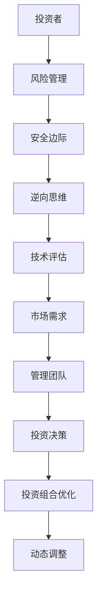

                 

# 芒格的"避免失败"原则在前沿科技投资中的重要性

> 关键词：芒格，避免失败，前沿科技，投资，风险管理，安全边际

> 摘要：本文深入探讨了芒格的“避免失败”原则在前沿科技投资中的重要性，分析了这些原则如何帮助投资者在高风险的科技领域中避免重大损失，并通过实际案例和系统设计提供了具体的应用策略。

---

# 第一章：芒格“避免失败”原则的核心理念

## 1.1 芒格“避免失败”原则的背景介绍

### 1.1.1 投资中的常见失败模式

在投资领域，失败往往源于对风险的忽视、对市场的过度乐观以及对自身能力的低估。投资者常常陷入追求高回报的误区，而忽略了潜在的风险。芒格的“避免失败”原则提醒我们，投资的首要目标不是追求超额收益，而是避免重大损失。

### 1.1.2 芒格投资理念的形成背景

查理·芒格（Charlie Munger）是沃伦·巴菲特（Warren Buffett）的合作伙伴，也是伯克希尔·哈撒韦公司（Berkshire Hathaway）的重要决策者。芒格的投资理念深受其心理学、经济学和哲学背景的影响。他认为，投资不仅仅是对市场的分析，更是对人性的深刻理解。他强调避免失败的重要性，认为投资的长期成功取决于对风险的管理和对安全边际的重视。

### 1.1.3 芒格“避免失败”原则的核心思想

芒格的核心思想可以概括为：**避免重大损失比追求高回报更重要**。他强调通过合理的风险管理、安全边际和逆向思维来降低投资失败的概率。这种方法不仅适用于传统投资领域，也对前沿科技投资具有重要的指导意义。

---

## 1.2 “避免失败”原则与传统投资理念的对比

### 1.2.1 传统投资理念的优缺点

传统投资理念往往侧重于寻找高增长的公司和市场机会，追求超额收益。这种方法在市场繁荣时期表现良好，但在市场下跌时往往会导致重大损失。传统投资理念的缺点在于其对风险的忽视，尤其是在高波动性和不确定的前沿科技领域。

### 1.2.2 芒格“避免失败”原则的独特性

芒格的“避免失败”原则与传统投资理念的核心区别在于其对风险的重视。他主张通过分析和避免可能导致失败的因素，构建防御性的投资组合，从而在市场波动中保持稳健。

### 1.2.3 两者的异同点分析

| **对比维度** | **传统投资理念** | **芒格“避免失败”原则** |
|--------------|-------------------|---------------------------|
| **核心目标** | 追求超额收益      | 避免重大损失，稳健投资   |
| **风险控制** | 事后补救，被动应对 | 提前识别，主动规避       |
| **投资策略** | 积极寻找机会      | 保守防御，注重安全边际   |

---

## 1.3 芒格“避免失败”原则的核心要素

### 1.3.1 风险控制的重要性

在前沿科技投资中，风险控制是首要任务。科技领域的高不确定性使得许多初创公司难以生存，因此投资者需要通过严格的风险评估来筛选出真正具有潜力的项目。

### 1.3.2 安全边际的概念

芒格强调“安全边际”，即在投资时留出足够的安全空间，确保即使在不利情况下也能避免重大损失。在科技投资中，这意味着选择那些技术壁垒高、市场需求明确、管理团队可靠的公司。

### 1.3.3 投资中的逆向思维

逆向思维是指在市场低迷时寻找机会，避免在市场高点投资。这种策略在前沿科技领域尤为重要，因为许多科技公司可能因为市场波动或技术瓶颈而面临估值调整。

---

# 第二章：芒格“避免失败”原则在投资中的具体应用

## 2.1 失败的根源与预防

### 2.1.1 投资中的常见失败原因

在前沿科技投资中，失败的原因多种多样，包括技术失败、市场需求不足、管理问题、竞争压力等。投资者需要通过深入的尽职调查来识别和避免这些潜在风险。

### 2.1.2 如何识别和避免这些失败因素

1. **技术风险**：评估技术的创新性和可行性，确保技术壁垒足够高。
2. **市场需求**：验证产品的市场需求，避免投资于市场容量有限的项目。
3. **管理团队**：选择经验丰富的管理团队，确保公司能够应对市场挑战。
4. **竞争环境**：分析竞争对手的情况，评估公司在市场中的定位。

### 2.1.3 失败案例分析

以某家人工智能初创公司为例，该公司在技术上存在重大缺陷，且市场需求并未得到验证。最终，该公司因技术失败和市场需求不足而倒闭。这个案例提醒投资者，在投资前沿科技公司时，必须进行全面的评估。

---

## 2.2 风险管理与分散投资

### 2.2.1 风险管理的基本原则

风险管理是投资成功的关键。在前沿科技投资中，投资者需要制定一套系统化的风险管理策略，包括风险识别、风险评估和风险应对。

### 2.2.2 分散投资的策略与实践

通过分散投资，投资者可以降低单一项目的风险。在前沿科技领域，分散投资可以通过投资不同领域的科技公司或选择处于不同发展阶段的项目来实现。

### 2.2.3 如何在前沿科技投资中应用这些原则

在投资组合中，投资者可以将部分资金用于投资成熟的技术公司，另一部分用于投资高风险的初创公司。这样可以在保持增长潜力的同时，降低整体投资组合的风险。

---

## 2.3 投资组合的构建与优化

### 2.3.1 投资组合的基本构建原则

投资组合的构建需要考虑多样化的资产配置、风险与收益的平衡以及长期投资目标。在前沿科技投资中，投资者需要根据自身的风险承受能力和投资目标来构建投资组合。

### 2.3.2 芒格原则在投资组合中的具体应用

芒格的“避免失败”原则要求投资者在构建投资组合时，优先选择那些具有安全边际的公司，并避免投资于风险过高的项目。

### 2.3.3 投资组合的动态优化

随着市场环境的变化，投资组合需要进行动态优化。投资者应定期评估投资组合的表现，并根据市场变化和个人投资目标的调整进行优化。

---

# 第三章：前沿科技投资的基本逻辑

## 3.1 前沿科技的定义与特点

### 3.1.1 前沿科技的定义

前沿科技指的是那些具有革命性潜力的新兴技术，如人工智能、量子计算、生物技术等。这些技术往往具有较高的技术门槛和不确定性，但一旦成功，将带来巨大的市场价值。

### 3.1.2 前沿科技的核心

前沿科技的核心在于其创新性和颠覆性。这些技术往往能够改变现有的商业模式和行业格局，因此在投资中具有较高的潜力。

### 3.1.3 前沿科技投资的逻辑

前沿科技投资的逻辑在于其高增长潜力和市场颠覆能力。然而，由于其高风险和高不确定性，投资者需要谨慎选择，确保投资的可行性和安全性。

---

## 3.2 前沿科技投资中的风险管理

### 3.2.1 风险的分类与评估

在前沿科技投资中，风险可以分为技术风险、市场风险、管理风险和竞争风险。投资者需要通过详细的尽职调查来评估这些风险，并制定相应的应对策略。

### 3.2.2 风险评估的方法

1. **技术风险评估**：评估技术的创新性和可行性，确保技术壁垒足够高。
2. **市场需求评估**：验证产品的市场需求，确保投资项目的可行性。
3. **管理风险评估**：评估管理团队的能力和经验，确保公司能够应对市场挑战。
4. **竞争环境评估**：分析竞争对手的情况，评估公司在市场中的定位。

---

## 3.3 前沿科技投资中的技术可行性评估

### 3.3.1 技术可行性评估的步骤

1. **技术背景分析**：了解技术的起源、发展和现状。
2. **技术瓶颈分析**：评估技术在实际应用中可能遇到的瓶颈。
3. **技术可行性验证**：通过实验或小规模测试验证技术的可行性。

### 3.3.2 技术可行性评估的关键指标

1. **技术成熟度**：技术是否已经经过验证，是否处于可行阶段。
2. **技术壁垒**：技术是否具有足够的壁垒，防止竞争对手的模仿。
3. **技术团队能力**：技术团队是否具有足够的经验和能力，确保技术的成功应用。

---

# 第四章：芒格原则在前沿科技投资中的具体应用

## 4.1 投资风险的识别与规避

### 4.1.1 如何识别投资风险

在前沿科技投资中，投资者需要通过尽职调查来识别潜在的风险。这包括对技术、市场、管理和竞争环境的全面评估。

### 4.1.2 如何规避投资风险

1. **选择具有安全边际的公司**：投资那些具有技术壁垒高、市场需求明确、管理团队可靠的公司。
2. **分散投资**：通过分散投资来降低单一项目的风险。
3. **长期投资**：避免短期波动，关注公司的长期价值。

---

## 4.2 投资组合的构建与优化

### 4.2.1 投资组合的基本构建原则

在前沿科技投资中，投资者需要根据自身的风险承受能力和投资目标来构建投资组合。这包括选择不同的科技领域和投资阶段的公司。

### 4.2.2 如何在前沿科技投资中应用芒格原则

芒格的“避免失败”原则要求投资者在构建投资组合时，优先选择那些具有安全边际的公司，并避免投资于风险过高的项目。

### 4.2.3 投资组合的动态优化

随着市场环境的变化，投资组合需要进行动态优化。投资者应定期评估投资组合的表现，并根据市场变化和个人投资目标的调整进行优化。

---

## 4.3 投资中的系统思维与风险管理

### 4.3.1 系统思维在投资中的重要性

系统思维是指将投资视为一个整体系统，考虑各个组成部分之间的相互作用和影响。在前沿科技投资中，系统思维可以帮助投资者更好地识别和管理风险。

### 4.3.2 如何在投资中应用系统思维

1. **整体评估**：将技术、市场、管理和竞争环境视为一个整体系统进行评估。
2. **动态调整**：根据市场变化和公司发展情况，动态调整投资组合。
3. **系统优化**：通过系统优化，降低投资组合的整体风险，提高投资收益。

---

## 4.4 投资中的逆向思维与风险管理

### 4.4.1 逆向思维在投资中的应用

逆向思维是指在市场低迷时寻找机会，避免在市场高点投资。在前沿科技投资中，逆向思维可以帮助投资者在市场低谷时发现价值，从而获得超额收益。

### 4.4.2 如何在投资中应用逆向思维

1. **市场低迷时寻找机会**：在市场低迷时，许多科技公司的估值可能被低估，此时是投资的好机会。
2. **避免市场高点投资**：在市场高点时，投资者应保持谨慎，避免高位追涨。

---

# 第五章：系统思维与投资决策

## 5.1 系统思维的定义与核心要素

### 5.1.1 系统思维的定义

系统思维是指将事物视为一个整体系统，考虑各个组成部分之间的相互作用和影响。在投资中，系统思维可以帮助投资者更好地识别和管理风险。

### 5.1.2 系统思维的核心要素

1. **整体性**：将投资视为一个整体系统，考虑各个组成部分之间的相互作用。
2. **动态性**：系统中的各个部分会随着市场环境的变化而动态调整。
3. **关联性**：系统中的各个部分之间存在密切的关联，一个部分的变化可能会影响整个系统的运行。

---

## 5.2 系统思维在投资中的应用

### 5.2.1 投资决策的系统化

1. **系统化的决策流程**：投资者需要制定一套系统化的决策流程，包括信息收集、分析评估、决策制定和执行监督。
2. **系统化的风险管理**：通过系统化的风险管理，降低投资组合的整体风险。

### 5.2.2 系统思维在前沿科技投资中的具体应用

在前沿科技投资中，系统思维可以帮助投资者更好地识别和管理风险。例如，通过系统化的方法，投资者可以更好地评估技术、市场、管理和发展阶段等各个因素，并根据这些因素的变化动态调整投资策略。

---

## 5.3 系统思维与投资结果的关系

### 5.3.1 系统思维对投资结果的影响

系统思维可以帮助投资者更好地识别和管理风险，从而提高投资收益和降低投资风险。通过系统化的方法，投资者可以更好地应对市场变化和公司发展中的各种不确定性。

### 5.3.2 系统思维与投资成功的内在联系

成功的投资不仅取决于市场分析和技术评估，还取决于投资者的系统思维和风险管理能力。通过系统思维，投资者可以更好地理解市场的复杂性和不确定性，并制定相应的投资策略。

---

# 第六章：芒格原则在前沿科技投资中的案例分析

## 6.1 成功案例分析

### 6.1.1 某人工智能公司的成功投资

某人工智能公司在成立初期，通过芒格的“避免失败”原则，选择了具有安全边际的项目，并避免了高风险的投资。通过系统化的风险管理，该公司成功地在市场波动中保持了稳健的增长。

### 6.1.2 投资策略的具体实施

1. **技术评估**：公司对人工智能技术的创新性和可行性进行了全面评估，确保技术壁垒足够高。
2. **市场需求验证**：公司验证了人工智能技术的市场需求，确保投资项目的可行性。
3. **管理团队评估**：公司选择了经验丰富的管理团队，确保公司能够应对市场挑战。
4. **投资组合优化**：公司通过分散投资和动态优化，降低了投资组合的整体风险。

---

## 6.2 失败案例分析

### 6.2.1 某生物技术公司的投资失败

某生物技术公司因技术失败和市场需求不足而倒闭。这个案例提醒投资者，在投资前沿科技公司时，必须进行全面的评估。

### 6.2.2 投资失败的原因

1. **技术风险**：公司在技术评估中存在重大缺陷，导致技术失败。
2. **市场需求不足**：公司的产品市场需求不足，导致投资失败。
3. **管理问题**：公司管理团队经验不足，无法应对市场挑战。

---

## 6.3 案例分析的启示

### 6.3.1 成功案例的成功经验

成功的案例表明，通过芒格的“避免失败”原则，投资者可以在前沿科技投资中获得稳健的收益。

### 6.3.2 失败案例的教训

失败的案例提醒投资者，在投资前沿科技公司时，必须进行全面的评估，确保技术、市场和管理团队的可行性。

### 6.3.3 案例分析对投资策略的启示

通过案例分析，投资者可以更好地理解芒格原则在前沿科技投资中的具体应用，并制定相应的投资策略。

---

# 第七章：投资中的心理学因素与芒格原则

## 7.1 投资中的心理学因素

### 7.1.1 心理因素对投资决策的影响

心理因素在投资决策中起着重要作用。例如，贪婪和恐惧会导致投资者做出错误的决策。

### 7.1.2 心理偏差对投资结果的影响

心理偏差，如过度自信和从众心理，会导致投资者忽视风险，从而导致投资失败。

---

## 7.2 如何克服心理偏差

### 7.2.1 提高自我认知

投资者需要通过自我反思和学习，提高自我认知，避免心理偏差的影响。

### 7.2.2 建立合理的决策机制

投资者需要建立合理的决策机制，确保决策的科学性和客观性。

---

## 7.3 芒格原则对心理因素的启示

芒格的“避免失败”原则强调了心理因素在投资中的重要性。投资者需要通过心理调节和决策机制的建立，克服心理偏差，从而在投资中取得成功。

---

# 第八章：芒格原则在前沿科技投资中的个性化应用

## 8.1 个性化投资系统的构建

### 8.1.1 投资目标的设定

投资者需要根据自身的财务状况、风险承受能力和投资目标，制定个性化的投资策略。

### 8.1.2 投资策略的制定

在制定投资策略时，投资者需要考虑自身的投资目标、风险承受能力和投资期限，并根据这些因素选择合适的投资策略。

---

## 8.2 投资策略的动态调整

### 8.2.1 投资策略的动态优化

随着市场环境的变化，投资者需要定期评估投资策略，并根据市场变化和个人投资目标的调整进行优化。

### 8.2.2 动态调整的实施步骤

1. **定期评估**：投资者需要定期评估投资策略的执行情况，并根据市场变化进行调整。
2. **动态优化**：根据评估结果，投资者需要对投资策略进行优化，确保投资策略的有效性和适应性。

---

## 8.3 个性化投资系统的实施

### 8.3.1 个性化投资系统的构建

投资者需要根据自身的投资目标、风险承受能力和投资期限，构建个性化的投资系统。

### 8.3.2 个性化投资系统的实施

在实施个性化投资系统时，投资者需要根据市场变化和个人投资目标的调整，动态优化投资策略，确保投资策略的有效性和适应性。

---

# 第九章：总结与展望

## 9.1 全文总结

芒格的“避免失败”原则在前沿科技投资中具有重要的指导意义。通过避免失败，投资者可以在高风险的科技领域中保持稳健的投资收益。芒格的原则强调了风险管理、安全边际和逆向思维的重要性，这些原则在实际投资中具有重要的应用价值。

---

## 9.2 对未来投资的展望

随着科技的不断发展，前沿科技投资将面临更多的机会和挑战。投资者需要通过芒格的“避免失败”原则，不断提高自身的投资能力，从而在未来的投资中取得成功。

---

# 附录

## 附录A：芒格“避免失败”原则的数学模型

在投资中，可以通过数学模型来量化芒格原则的应用。例如，可以通过计算安全边际和风险调整后的回报率，来评估投资项目的可行性。

**数学公式：**

$$
\text{安全边际} = \text{内在价值} - \text{市场价格}
$$

$$
\text{风险调整后的回报率} = \frac{\text{预期回报率} - \text{无风险利率}}{\text{风险溢价}}
$$

---

## 附录B：系统架构图（Mermaid）

---

## 附录C：案例分析的详细步骤

1. **案例背景**：介绍案例的基本情况。
2. **案例分析**：详细分析案例中的各个因素。
3. **案例结论**：总结案例的教训和启示。

---

## 附录D：最佳实践 Tips

1. **定期评估投资策略**：投资者需要定期评估投资策略，并根据市场变化进行调整。
2. **注重风险管理**：在投资中，风险管理是首要任务。
3. **选择具有安全边际的公司**：投资者应选择那些具有安全边际的公司，避免高风险的投资。

---

通过芒格的“避免失败”原则，投资者可以在前沿科技投资中避免重大损失，从而在高风险的科技领域中保持稳健的投资收益。芒格的原则不仅适用于传统投资领域，也对前沿科技投资具有重要的指导意义。希望本文能够为投资者提供有价值的参考和启示。

