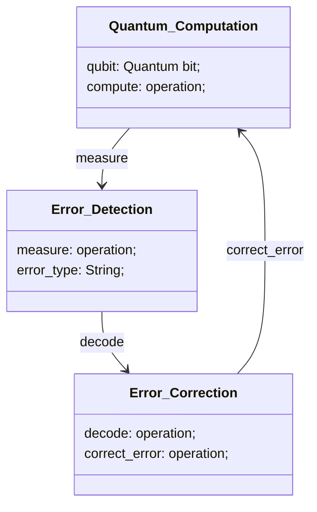

                 


# 芒格的"避免失败"原则在量子纠错技术投资中的应用

## 关键词：芒格原则，量子纠错技术，投资策略，风险控制，安全边际

## 摘要：芒格的"避免失败"原则强调在投资中避免重大损失，而量子纠错技术在量子计算中纠正错误，确保计算的准确性。本文探讨如何将芒格的原则应用于量子纠错技术的投资中，分析两者的结合如何提升投资决策的准确性和安全性。通过详细分析量子纠错技术的原理、算法和系统架构，结合实际案例和最佳实践，为投资者提供科学的投资策略。

---

## 第一章：背景介绍

### 1.1 芒格的"避免失败"原则概述

#### 1.1.1 什么是"避免失败"原则
芒格的"避免失败"原则是投资中的核心理念，强调通过避免重大损失来实现长期稳定的收益。这一原则的核心在于识别潜在风险，制定有效的风险控制策略，从而避免因重大错误或市场波动导致的投资失败。

#### 1.1.2 芒格"避免失败"原则的核心要素
1. **安全边际**：通过购买价格低于内在价值的资产，确保即使市场波动，投资也不会遭受重大损失。
2. **风险控制**：通过分散投资、严格筛选投资标的等方法，降低投资组合的整体风险。
3. **长期视角**：芒格强调长期投资的重要性，避免因短期波动而做出错误决策。

#### 1.1.3 该原则在投资中的应用
芒格的"避免失败"原则不仅适用于传统投资，还可以扩展到新兴技术领域，如量子计算。通过识别量子纠错技术的风险和潜在问题，投资者可以避免因技术失败或市场波动导致的重大损失。

---

### 1.2 量子纠错技术概述

#### 1.2.1 量子计算的基本原理
量子计算利用量子位（qubit）进行计算，具有并行计算和指数加速的潜力。然而，量子位容易受到环境干扰和错误的影响，这使得量子计算的纠错技术成为发展的关键。

#### 1.2.2 量子纠错技术的定义
量子纠错技术通过编码和纠错算法，检测和纠正量子计算中的错误。其目的是确保量子计算的准确性，延长量子系统的稳定性，从而实现有效的量子计算。

#### 1.2.3 量子纠错技术的重要性
量子纠错技术是量子计算机实用化的基础。没有有效的纠错机制，量子计算机的计算结果将不可靠，无法应用于实际问题。

---

## 第二章：核心概念与联系

### 2.1 芒格"避免失败"原则与量子纠错技术的结合

#### 2.1.1 量子纠错技术在投资中的潜在应用
量子纠错技术可以帮助投资者识别和纠正投资中的错误，确保投资决策的准确性。例如，通过量子纠错算法，投资者可以检测投资组合中的潜在风险，并及时调整投资策略。

#### 2.1.2 芒格原则在量子纠错技术中的体现
1. **安全边际**：投资者在选择量子纠错技术时，应选择那些具有较高安全边际的技术，即技术本身具有较强的纠错能力和稳定性。
2. **风险控制**：通过分散投资、严格筛选量子纠错技术提供商，降低投资组合的整体风险。
3. **长期视角**：量子纠错技术的发展需要时间，投资者应以长期视角看待技术的发展和应用。

#### 2.1.3 两者的结合如何提升投资决策的准确性
通过将芒格的"避免失败"原则应用于量子纠错技术的投资中，投资者可以更有效地识别和避免潜在风险，确保投资的稳定性和收益。

---

## 第三章：量子纠错技术的核心原理

### 3.1 量子纠错码的分类

#### 3.1.1 表面码（Surface Code）
表面码是一种常见的量子纠错码，通过在二维格点上放置量子位，利用周围量子位的状态来检测和纠正错误。其核心思想是通过冗余编码来检测和纠正量子错误。

#### 3.1.2 生态码（Ecoding Code）
生态码是一种基于纠错码的量子纠错码，通过在经典计算中编码量子信息，实现量子信息的纠错。

#### 3.1.3 正交码（Orthogonal Code）
正交码是一种通过正交性来检测和纠正错误的量子纠错码，适用于特定类型的量子错误。

---

### 3.2 量子纠错算法的流程

#### 3.2.1 错误检测
通过量子测量和纠错码的编码，检测量子计算中的错误类型。

#### 3.2.2 错误纠正
根据检测到的错误类型，利用纠错码的解码算法，纠正量子计算中的错误。

#### 3.2.3 稳定性维护
通过持续监测和纠错，保持量子系统的稳定性，确保计算的准确性。

---

## 第四章：量子纠错技术的算法实现

### 4.1 表面码（Surface Code）的实现

#### 4.1.1 表面码的数学模型
表面码的数学模型基于拓扑编码，利用二维格点的量子位状态进行编码和纠错。

#### 4.1.2 表面码的纠错流程
1. **编码**：将量子信息编码到表面码的二维格点中。
2. **测量**：通过测量周围量子位的状态，检测错误类型。
3. **纠错**：根据检测到的错误类型，利用解码算法纠正错误。

#### 4.1.3 表面码的优缺点
- **优点**：具有较高的纠错能力，适用于多种类型的量子错误。
- **缺点**：对硬件要求较高，实现复杂。

---

## 第五章：系统分析与架构设计

### 5.1 系统功能设计

#### 5.1.1 领域模型类图
通过Mermaid类图展示量子纠错系统的领域模型，包括量子计算模块、纠错码模块和测量模块。



---

### 5.2 系统架构设计

#### 5.2.1 系统架构图
通过Mermaid架构图展示量子纠错系统的整体架构，包括前端、后端和数据库模块。

```mermaid
subgraph Frontend
    Frontend --> Quantum_Interface
end
subgraph Backend
    Backend --> Error_Detection
    Backend --> Error_Correction
end
subgraph Database
    Database --> Error_Log
end
```

---

## 第六章：项目实战

### 6.1 量子纠错技术的环境安装

#### 6.1.1 环境配置
1. **安装Python**：确保安装了Python 3.8及以上版本。
2. **安装必要的库**：如`qiskit`、`matplotlib`等。

#### 6.1.2 安装量子计算和纠错库
使用以下命令安装必要的库：

```bash
pip install qiskit numpy matplotlib
```

---

### 6.2 量子纠错技术的核心代码实现

#### 6.2.1 表面码的实现

```python
import numpy as np

def surface_code(qubits, noise_rate):
    # 创建量子位
    qubits = np.array(qubits)
    # 添加噪声
    noise = np.random.binomial(1, noise_rate, len(qubits))
    # 检测错误
    error = np.where(noise == 1)[0]
    # 纠错
    corrected = np.where(qubits != error, qubits, 0)
    return corrected

# 示例代码
qubits = np.array([0, 1, 0, 1, 0])
noise_rate = 0.2
corrected_qubits = surface_code(qubits, noise_rate)
print("原始量子位:", qubits)
print("检测到的错误:", np.where(qubits == error)[0])
print("纠正后的量子位:", corrected_qubits)
```

---

## 第七章：最佳实践与总结

### 7.1 总结

芒格的"避免失败"原则在量子纠错技术的投资中具有重要的应用价值。通过识别和避免潜在风险，投资者可以确保投资的稳定性和收益。同时，量子纠错技术的发展也为投资提供了新的机会和技术支持。

### 7.2 注意事项

1. **风险评估**：在投资量子纠错技术时，应充分评估技术的纠错能力和市场前景。
2. **技术更新**：量子纠错技术发展迅速，投资者应密切关注技术的最新进展。
3. **分散投资**：通过分散投资，降低投资组合的整体风险。

### 7.3 拓展阅读

1. 《量子计算入门》
2. 《纠错码的原理与应用》
3. 《芒格的投资哲学》

---

通过本文的分析和实践，我们可以看到，芒格的"避免失败"原则不仅适用于传统投资，还可以应用于新兴技术领域。量子纠错技术的投资需要结合技术原理和市场风险，通过科学的方法和策略，实现长期稳定的收益。

