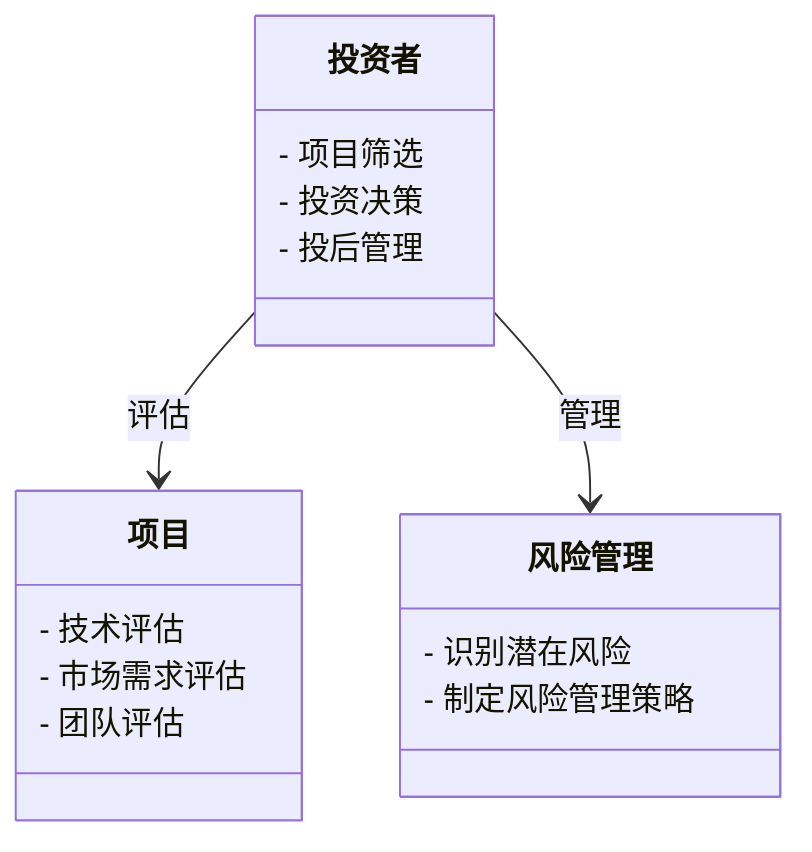
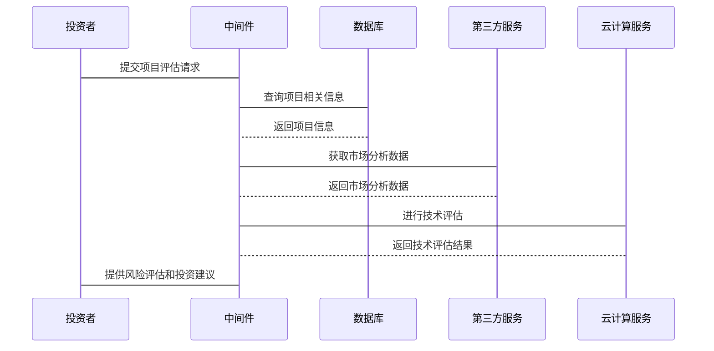

                 


# 芒格的"避免失败"原则在量子计算创业投资中的应用

---

## 关键词：
芒格原则、量子计算、创业投资、逆向思维、风险管理

---

## 摘要：
芒格的"避免失败"原则是一种以逆向思维为核心的投资策略，旨在通过避免重大错误来实现长期的成功。本文将探讨这一原则在量子计算创业投资中的应用，分析如何通过逆向思维和风险管理来降低投资风险，提升投资成功率。文章结合量子计算的技术特点和投资环境，提供具体的策略和案例分析，为投资者提供实践指导。

---

### 目录

---

# 第一部分：芒格的"避免失败"原则概述

## 第1章：芒格的"避免失败"原则

### 1.1 芒格的"避免失败"原则

#### 1.1.1 逆向思维的核心

- 芒格的"避免失败"原则以逆向思维为核心，强调通过避免重大错误来实现成功。
- 逆向思维的核心在于先考虑"如何不失败"，再思考"如何成功"。
- 这种思维方式帮助投资者在复杂和不确定的环境中做出更明智的决策。

#### 1.1.2 芒格原则的其他关键要素

- **独立思考**：芒格强调独立思考的重要性，避免随波逐流。
- **格栅思维**：通过多学科的知识框架来分析问题，避免单一视角的局限性。
- **安全边际**：在投资中留有安全边际，以应对不确定性。

---

## 第2章：量子计算创业投资的背景

### 2.1 量子计算的基本概念

#### 2.1.1 量子计算的定义

- 量子计算是一种基于量子力学原理的计算方式，利用量子叠加和量子纠缠的特性，能够在某些领域（如密码学、优化问题）提供远超经典计算机的计算效率。

#### 2.1.2 量子计算的核心技术

- **量子位（qubit）**：量子计算的基本单位，可以同时表示0和1的叠加态。
- **量子叠加**：量子位的状态可以是多个可能性的叠加。
- **量子纠缠**：两个或多个量子位之间形成的一种特殊关联，能够实现信息的快速传输。
- **量子门（quantum gates）**：用于对量子位进行操作的基本逻辑单元。

#### 2.1.3 量子计算的现状与未来

- 当前量子计算仍处于实验阶段，尚未实现大规模商业化应用。
- 主要的技术挑战包括量子位的稳定性和纠错技术的突破。
- 未来量子计算有望在特定领域（如药物研发、金融建模）发挥重要作用。

---

### 2.2 创业投资的基本概念

#### 2.2.1 创业投资的定义

- 创业投资是指对新兴企业进行股权投资，支持其成长和发展的行为。
- 创业投资的核心目标是通过投资具有高成长潜力的企业，实现资本增值。

#### 2.2.2 创业投资的流程

1. 项目筛选：通过初步评估，筛选出具有潜力的创业项目。
2. 尽职调查：对目标企业的财务状况、团队能力、市场前景等进行深入调查。
3. 投资决策：基于调查结果，决定是否进行投资。
4. 投后管理：提供资源支持、战略指导，帮助被投企业成长。
5. 退出机制：通过股权转让、并购等方式实现投资收益。

#### 2.2.3 创业投资的风险与收益

- **高风险**：创业投资具有较高的失败率，许多初创企业难以存活。
- **高收益**：成功的创业投资能够带来丰厚的回报，尤其是技术创新型的项目。

---

## 第3章：芒格原则与量子计算创业投资的结合

### 3.1 芒格原则在量子计算中的应用

#### 3.1.1 逆向思维在量子计算中的应用

- 在量子计算创业投资中，芒格的逆向思维可以帮助投资者识别和避免潜在的失败因素。
- 例如，先分析量子计算领域的"常见失败原因"，再选择那些能够避免这些失败因素的项目进行投资。

#### 3.1.2 避免失败在量子计算中的应用

- 通过分析量子计算领域的技术风险、市场需求风险、团队风险等，制定相应的风险管理策略。
- 例如，优先投资具有稳定技术团队和明确市场需求的企业。

#### 3.1.3 芒格原则对量子计算投资的影响

- 芒格原则可以帮助投资者在量子计算领域中降低投资风险，提高投资的成功率。
- 通过避免重大错误，投资者可以更专注于那些具有高潜力的项目。

---

# 第二部分：芒格原则的核心概念与联系

## 第4章：芒格原则的核心概念

### 4.1 芒格原则的核心要素

#### 4.1.1 逆向思维

- 逆向思维是芒格原则的核心，强调从反面思考问题。
- 例如，在量子计算投资中，先考虑"哪些项目容易失败"，再选择那些能够避免这些失败因素的项目。

#### 4.1.2 避免失败

- 芒格认为，成功的投资可以通过避免重大错误来实现。
- 在量子计算投资中，这意味着要识别和避免技术不成熟、市场需求不足等潜在风险。

#### 4.1.3 独立思考

- 独立思考是芒格原则的重要组成部分，要求投资者具备独立判断的能力。
- 在量子计算投资中，独立思考可以帮助投资者避免盲目跟风，做出更明智的投资决策。

---

## 第5章：芒格原则与量子计算的联系

### 5.1 芒格原则在量子计算中的应用

#### 5.1.1 逆向思维在量子计算中的应用

- 通过逆向思维，投资者可以识别量子计算领域的技术风险、市场需求风险等。
- 例如，先分析量子计算技术的可行性，再选择投资那些技术成熟且市场需求明确的项目。

#### 5.1.2 避免失败在量子计算中的应用

- 芒格原则强调避免失败，这在量子计算投资中尤为重要。
- 例如，通过严格的尽职调查，避免投资那些技术不稳定或市场需求不明确的项目。

#### 5.1.3 芒格原则对量子计算投资的影响

- 芒格原则可以帮助投资者在量子计算领域中降低投资风险，提高投资的成功率。
- 通过避免重大错误，投资者可以更专注于那些具有高潜力的项目。

---

### 5.2 芒格原则与量子计算的对比

#### 5.2.1 芒格原则的特点

- 强调逆向思维和避免失败。
- 注重独立思考和多学科的知识框架。

#### 5.2.2 量子计算的特点

- 技术复杂性高，不确定性大。
- 市场需求潜力大，但技术实现难度高。

#### 5.2.3 芒格原则与量子计算的异同点

- **相同点**：两者都强调在复杂和不确定的环境中做出明智的决策。
- **不同点**：芒格原则是一种通用的投资策略，而量子计算是一种特定的技术领域。

---

# 第三部分：芒格原则在量子计算中的应用

## 第6章：芒格原则在量子计算中的具体应用

### 6.1 芒格原则在量子计算中的应用

#### 6.1.1 逆向思维在量子计算中的应用

- 在量子计算投资中，逆向思维可以帮助投资者识别和避免潜在的失败因素。
- 例如，先分析量子计算技术的可行性，再选择投资那些技术成熟且市场需求明确的项目。

#### 6.1.2 避免失败在量子计算中的应用

- 芒格原则强调避免失败，这在量子计算投资中尤为重要。
- 例如，通过严格的尽职调查，避免投资那些技术不稳定或市场需求不明确的项目。

#### 6.1.3 芒格原则对量子计算投资的影响

- 芒格原则可以帮助投资者在量子计算领域中降低投资风险，提高投资的成功率。
- 通过避免重大错误，投资者可以更专注于那些具有高潜力的项目。

---

## 第7章：芒格原则在量子计算中的案例分析

### 7.1 芒格原则在量子计算中的成功案例

#### 7.1.1 案例一：投资一家技术稳定的量子计算公司

- **背景**：某量子计算公司拥有一支经验丰富的技术团队，并且在量子位稳定性方面取得了显著进展。
- **应用芒格原则**：通过逆向思维，投资者识别到该公司的技术优势，避免了投资那些技术不稳定的企业。
- **结果**：投资成功，公司逐步成长为量子计算领域的领导者。

#### 7.1.2 案例二：避免投资市场需求不足的量子计算项目

- **背景**：某量子计算项目声称能够解决复杂的优化问题，但在实际应用中市场需求有限。
- **应用芒格原则**：投资者通过逆向思维，识别到该项目的市场需求不足，决定避免投资。
- **结果**：避免了潜在的失败，资金用于其他更有潜力的项目。

#### 7.1.3 案例三：通过独立思考发现团队问题

- **背景**：某量子计算公司表面上技术先进，但团队内部存在严重的合作问题。
- **应用芒格原则**：投资者通过独立思考，识别到团队的潜在问题，决定不进行投资。
- **结果**：避免了投资失败，保护了资金安全。

---

### 7.2 芒格原则在量子计算中的失败案例

#### 7.2.1 案例一：技术不成熟的投资

- **背景**：某量子计算公司声称拥有革命性的技术，但在实际应用中技术不成熟，无法实现预期效果。
- **应用芒格原则**：投资者未能通过逆向思维识别技术风险，进行了投资。
- **结果**：投资失败，公司最终倒闭。

#### 7.2.2 案例二：市场需求评估不足

- **背景**：某量子计算项目专注于某个 niche市场，但市场需求远低于预期。
- **应用芒格原则**：投资者未能通过逆向思维识别市场需求风险，进行了投资。
- **结果**：投资失败，公司难以获得足够的客户支持。

#### 7.2.3 案例三：团队不稳定的投资

- **背景**：某量子计算公司的团队内部存在严重的合作问题，导致项目进展缓慢。
- **应用芒格原则**：投资者未能通过独立思考识别团队问题，进行了投资。
- **结果**：投资失败，公司无法实现预期目标。

---

# 第四部分：芒格原则在量子计算中的系统分析与架构设计

## 第8章：系统分析与架构设计方案

### 8.1 问题场景介绍

- **目标**：通过芒格原则，构建一个能够在量子计算投资中降低风险、提高成功率的系统架构。
- **范围**：涵盖从项目筛选到投资决策的整个投资流程。

### 8.2 系统功能设计

#### 8.2.1 领域模型



---

#### 8.2.2 系统架构设计


---

#### 8.2.3 系统接口设计

- **输入接口**：投资者输入待评估的量子计算项目信息。
- **输出接口**：系统输出项目的风险评估结果和投资建议。

---

#### 8.2.4 系统交互设计



---

### 8.3 项目实战

#### 8.3.1 环境安装

- **工具安装**：安装必要的数据分析工具和市场分析工具。
- **依赖安装**：安装Python、Pandas、NumPy等数据分析库。

#### 8.3.2 核心实现源代码

```python
import pandas as pd
import numpy as np

def evaluate_quantum_project(project_data):
    # 项目数据包括技术评估、市场需求评估、团队评估等
    # 技术评估：0-10分，市场需求：0-10分，团队评估：0-10分
    # 总分为各项评估的加权平均，权重为0.4、0.3、0.3
    total_score = np.dot([0.4, 0.3, 0.3], project_data)
    # 根据总分判断是否值得投资
    if total_score > 7:
        return "值得投资"
    else:
        return "不值得投资"

# 示例数据
project_data = [8, 7, 6]  # 技术评估8，市场需求7，团队评估6
result = evaluate_quantum_project(project_data)
print(result)
```

---

#### 8.3.3 应用解读与分析

- **代码功能**：上述代码通过加权平均的方式，对量子计算项目的技术评估、市场需求评估和团队评估进行综合评分，判断项目是否值得投资。
- **实际应用**：投资者可以根据项目的各项评估结果，结合芒格原则，做出更明智的投资决策。

---

## 第9章：最佳实践 tips、小结、注意事项、拓展阅读

### 9.1 最佳实践 tips

- **独立思考**：在量子计算投资中，投资者需要具备独立思考的能力，避免盲目跟风。
- **逆向思维**：通过逆向思维，识别和避免潜在的失败因素。
- **风险管理**：制定完善的风险管理策略，降低投资风险。

### 9.2 小结

- 本文探讨了芒格的"避免失败"原则在量子计算创业投资中的应用，通过逆向思维和风险管理，帮助投资者降低投资风险，提高投资成功率。
- 通过具体案例和系统设计，本文提供了实践指导，为投资者在量子计算领域中的投资决策提供了参考。

### 9.3 注意事项

- **技术风险**：量子计算技术尚处于发展阶段，技术不确定性较大，投资者需谨慎评估技术可行性。
- **市场需求**：投资者需要对量子计算的市场需求进行深入分析，避免投资市场需求不足的项目。
- **团队稳定性**：团队是量子计算项目成功的关键，投资者需评估团队的合作能力和经验。

### 9.4 拓展阅读

- 《芒格的"避免失败"原则》：深入理解芒格的投资哲学。
- 《量子计算入门》：掌握量子计算的基本概念和技术。
- 《创业投资的逻辑》：了解创业投资的基本流程和策略。

---

# 结语

芒格的"避免失败"原则在量子计算创业投资中的应用，不仅能够帮助投资者降低风险，还能提高投资的成功率。通过逆向思维和风险管理，投资者可以在复杂和不确定的环境中做出更明智的决策。未来，随着量子计算技术的不断发展，芒格原则的应用将更加重要，帮助投资者在这一新兴领域中获得长期的成功。

---

