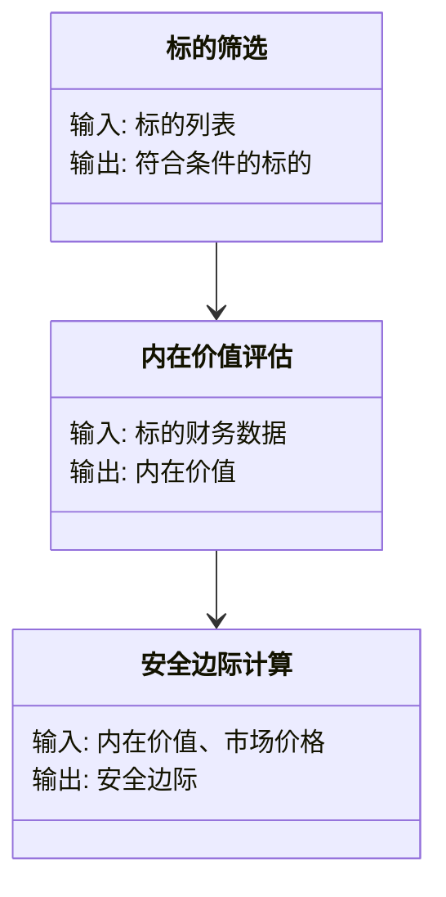
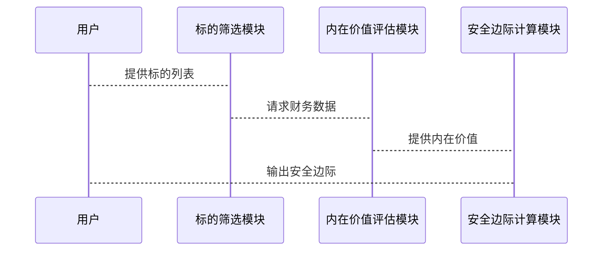

                 


#芒格的"避免失败"原则：投资成功的另一面

> 关键词：芒格、避免失败、投资原则、安全边际、逆向思维、多元思维模型、投资决策

> 摘要：芒格的"避免失败"原则是投资成功的重要基石。本文从芒格的核心思想出发，深入探讨了"避免失败"原则的核心概念、系统化方法、数学模型与算法、系统架构设计，以及在实际投资中的应用。通过详细分析和案例解读，帮助读者掌握如何在投资中避免失败，实现长期稳定的收益。

---

# 第1章: 引言

## 1.1 芒格的生平与思想
### 1.1.1 芒格的背景与投资哲学
查理·芒格是世界著名投资者、伯克希尔·哈撒韦公司的副主席，被誉为“投资界的智者”。他的投资哲学以“价值投资”为核心，强调理性思考、安全边际和长期价值。芒格的思想不仅仅局限于投资领域，更是一种智慧的生活态度。

### 1.1.2 芒格的"避免失败"原则的提出
芒格认为，投资成功的关键不仅在于寻找优秀的投资机会，更在于避免重大的投资失败。他的"避免失败"原则强调通过系统化的方法和多元思维模型，降低投资风险，提高决策的准确性。

## 1.2 投资成功的另一面
### 1.2.1 成功与失败的双重性
投资成功不仅仅是找到优秀的标的，更是通过避免重大失败来积累长期稳定的收益。芒格的"避免失败"原则揭示了投资成功的另一面：通过降低失败概率来实现长期成功。

### 1.2.2 "避免失败"原则的核心意义
"避免失败"原则强调在投资决策中，注重风险控制和安全边际，避免因为过度乐观或盲目决策而导致的重大损失。这种思维方式不仅适用于投资领域，也适用于其他决策过程。

### 1.2.3 本书的结构与目标
本书将从芒格的核心思想出发，系统化地分析"避免失败"原则的核心概念、数学模型、系统架构设计，以及在实际投资中的应用。通过理论与实践相结合，帮助读者掌握如何在投资中避免失败，实现长期稳定收益。

---

# 第2章: 芒格"避免失败"原则的核心概念

## 2.1 安全边际
### 2.1.1 安全边际的定义
安全边际是指投资标的的内在价值与其市场价格之间的差距。芒格认为，安全边际是避免投资失败的重要保障，它能够为投资者提供一个“缓冲区”，以应对市场波动和不确定性。

### 2.1.2 安全边际的重要性
通过建立安全边际，投资者能够在市场波动时保持理性，避免因价格波动而做出错误的决策。同时，安全边际也能够帮助投资者在估值错误时减少损失。

### 2.1.3 安全边际的计算与应用
安全边际的计算通常基于对标的内在价值的评估。例如，假设某标的的内在价值为100元，市场价格为80元，那么安全边际为20元。在实际投资中，安全边际越大，投资风险越小。

## 2.2 逆向思维
### 2.2.1 逆向思维的定义
逆向思维是指从反方向思考问题，即从失败的案例中总结经验教训，从而避免类似的错误。芒格认为，逆向思维是避免失败的重要方法。

### 2.2.2 逆向思维在投资中的应用
在投资中，逆向思维可以帮助投资者避免追涨杀跌的错误。例如，当市场情绪高涨时，投资者可以通过逆向思维冷静分析，避免被市场情绪所左右。

### 2.2.3 逆向思维的优缺点
优点：逆向思维能够帮助投资者避免盲目跟风，降低投资风险。缺点：逆向思维需要投资者具备较强的独立思考能力和心理承受能力，尤其是在市场情绪极端的情况下。

## 2.3 多元思维模型
### 2.3.1 多元思维模型的定义
多元思维模型是指通过多个不同的学科和思维方式来分析问题，从而避免单一视角的局限性。芒格强调，投资者应该掌握多个领域的知识，从而形成多元化的思维模型。

### 2.3.2 多元思维模型的核心要素
多元思维模型的核心要素包括经济学、心理学、物理学、生物学等多个学科的基本原理。通过这些原理的综合应用，投资者能够更全面地分析问题。

### 2.3.3 多元思维模型的实际应用
例如，在评估一家公司时，投资者可以通过经济学分析公司的商业模式，通过心理学分析管理层的动机，通过物理学分析公司的技术优势等。

---

# 第3章: 芒格"避免失败"原则的系统化方法

## 3.1 投资决策的系统化模型
### 3.1.1 系统化投资决策的定义
系统化投资决策是指通过建立系统的分析框架和决策流程，避免主观情绪对决策的影响。

### 3.1.2 系统化决策的核心要素
系统化决策的核心要素包括数据收集、数据分析、决策模型和风险管理。

### 3.1.3 系统化决策与"避免失败"原则的关系
系统化决策是"避免失败"原则的重要实现方式。通过系统化的方法，投资者可以更好地控制风险，避免重大失败。

## 3.2 失败案例分析
### 3.2.1 失败案例的定义
失败案例是指由于决策失误或市场波动导致的投资失败。

### 3.2.2 失败案例的分析方法
失败案例的分析方法包括原因分析、经验总结和改进措施。

### 3.2.3 失败案例的启示
通过分析失败案例，投资者可以更好地理解"避免失败"原则的重要性，并将其应用到实际投资中。

## 3.3 投资决策的流程图
### 3.3.1 投资决策流程图的定义
投资决策流程图是指通过图形化的方式展示投资决策的步骤和流程。

### 3.3.2 流程图的绘制方法
流程图的绘制方法包括识别关键决策点、确定决策顺序、分析每个决策的影响等。

### 3.3.3 流程图的实际应用
例如，在投资决策中，流程图可以帮助投资者系统化地分析标的的价值、市场风险、管理层能力等多个因素。

---

# 第4章: 芒格"避免失败"原则的数学模型与算法

## 4.1 投资决策的数学模型
### 4.1.1 投资决策模型的定义
投资决策模型是指通过数学方法对投资决策进行建模和分析。

### 4.1.2 投资决策模型的数学表达式
例如，内在价值模型可以用以下公式表示：
$$ \text{内在价值} = \sum_{t=1}^{n} \frac{\text{现金流}_t}{(1 + r)^t} $$
其中，\( r \) 是折现率，\( \text{现金流}_t \) 是第 \( t \) 年的现金流。

### 4.1.3 投资决策模型的优缺点
优点：数学模型能够帮助投资者量化分析，提高决策的科学性。缺点：模型假设可能与实际情况不符，导致分析结果的偏差。

## 4.2 算法原理
### 4.2.1 算法原理的定义
算法原理是指通过特定的算法来实现投资决策的自动化和系统化。

### 4.2.2 算法原理的核心步骤
例如，基于安全边际的算法可以分为以下步骤：
1. 计算标的的内在价值。
2. 比较内在价值与市场价格。
3. 如果市场价格低于内在价值，且低于一定的安全边际，执行买入操作。
4. 否则，等待更好的机会。

### 4.2.3 算法原理的实际应用
例如，利用算法对多个标的进行筛选，找出符合安全边际条件的投资机会。

## 4.3 算法流程图
### 4.3.1 算法流程图的定义
算法流程图是指通过图形化的方式展示算法的执行步骤和逻辑关系。

### 4.3.2 流程图的绘制方法
流程图的绘制方法包括识别关键步骤、确定步骤之间的逻辑关系、分析每个步骤的执行条件等。

### 4.3.3 流程图的实际应用
例如，基于安全边际的算法流程图可以帮助投资者系统化地筛选投资机会。

---

# 第5章: 芒格"避免失败"原则的项目实战

## 5.1 项目背景
### 5.1.1 项目背景的定义
项目背景是指项目所处的环境和条件，包括市场环境、行业趋势、政策法规等。

### 5.1.2 项目背景的重要性
项目背景可以帮助投资者更好地理解项目的整体环境，从而做出更合理的决策。

### 5.1.3 项目背景的分析方法
项目背景的分析方法包括市场分析、行业研究、政策解读等。

## 5.2 项目介绍
### 5.2.1 项目目标
本项目的目标是通过芒格的"避免失败"原则，筛选出具有安全边际的优质标的。

### 5.2.2 项目范围
项目范围包括标的筛选、内在价值评估、安全边际计算、投资决策等。

## 5.3 系统功能设计
### 5.3.1 领域模型mermaid类图


### 5.3.2 系统架构设计mermaid架构图


### 5.3.3 系统接口设计
系统接口设计包括输入接口、输出接口和数据接口。例如：
- 输入接口：接收标的列表和财务数据。
- 输出接口：输出符合安全边际的标的。
- 数据接口：提供数据存储和查询功能。

### 5.3.4 系统交互mermaid序列图


## 5.4 项目实战
### 5.4.1 环境安装
需要安装Python、相关库（如pandas、numpy）和mermaid工具。

### 5.4.2 系统核心实现源代码
以下是基于安全边际的算法实现的Python代码：
```python
import pandas as pd

def calculate_intrinsic_value(fcf, discount_rate):
    # 计算内在价值，简化模型
    return fcf / (1 + discount_rate)

def calculate_margin_of_safety(price, intrinsic_value, buffer=0.2):
    # 计算安全边际
    return intrinsic_value * (1 - buffer)

# 示例数据
data = {
    '现金流': [100, 120, 130],
    '折现率': [0.08, 0.08, 0.08]
}

df = pd.DataFrame(data)
intrinsic_values = []
for i in range(len(df)):
    iv = calculate_intrinsic_value(df['现金流'][i], df['折现率'][i])
    intrinsic_values.append(iv)
    
# 假设市场价格为100
price = 100
safety = calculate_margin_of_safety(price, sum(intrinsic_values) / len(intrinsic_values))
print(f"安全边际: {safety}")
```

### 5.4.3 代码应用解读与分析
上述代码通过简单的现金流折现模型计算内在价值，并基于安全边际筛选标的。通过调整缓冲区，投资者可以控制安全边际的宽裕程度。

### 5.4.4 实际案例分析
以苹果公司为例，假设其内在价值为150美元，市场价格为130美元。安全边际为15%，即150 * (1 - 0.15) = 127.5美元。由于市场价格130 > 安全边际127.5，建议等待更好的价格。

### 5.4.5 项目小结
通过本项目，读者可以掌握如何基于芒格的"避免失败"原则，系统化地筛选投资机会，并通过代码实现投资决策的自动化。

---

# 第6章: 总结

## 6.1 小结
芒格的"避免失败"原则强调安全边际、逆向思维和多元思维模型的应用，通过系统化的方法和数学模型，帮助投资者降低风险，实现长期稳定的收益。

## 6.2 注意事项
- 投资决策需要结合实际市场环境，模型假设可能与实际情况不符。
- 投资者需要具备独立思考能力和风险控制意识。

## 6.3 拓展阅读
- 《穷查理宝典》
- 《投资的哲学》
- 相关投资策略和风险管理的书籍

---

通过以上章节的详细分析，读者可以全面理解芒格的"避免失败"原则，并在实际投资中灵活运用这些理念，从而在复杂多变的市场环境中实现稳健的投资回报。

