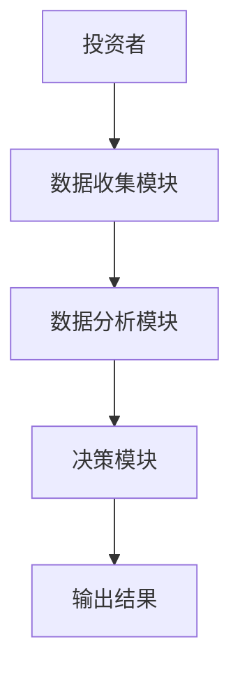
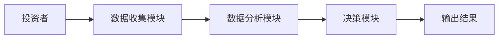
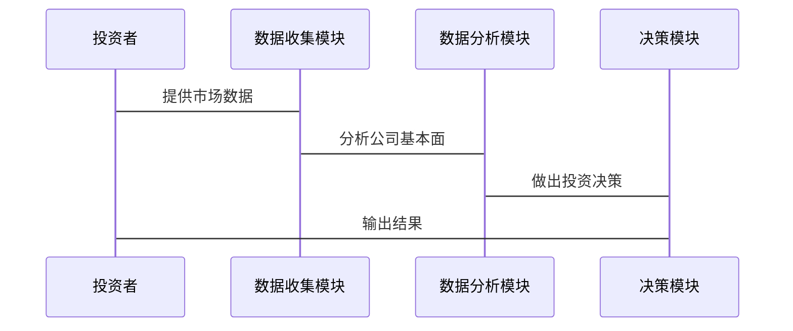
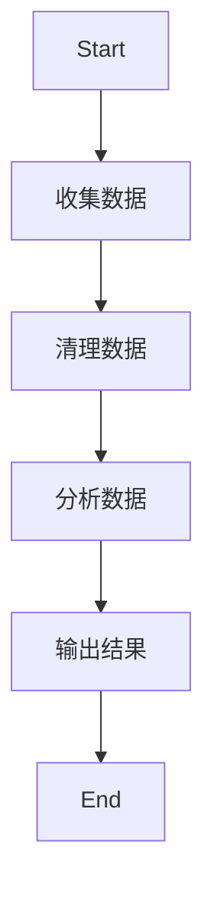
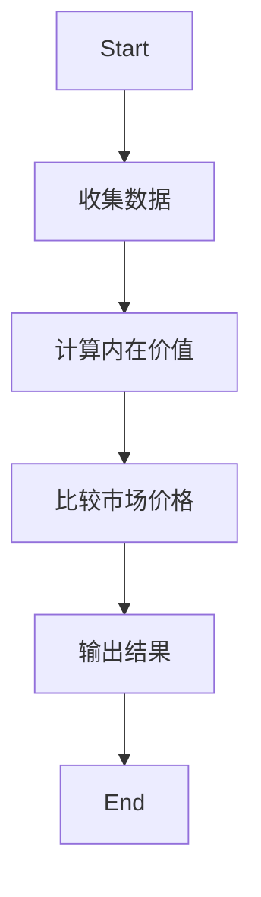
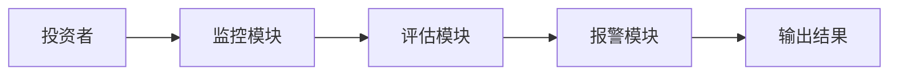

                 


# 《芒格的"避免失败"原则：投资成功的另一面》

## 关键词：芒格、避免失败、投资原则、独立思考、逆向思维、安全边际、投资哲学

## 摘要：芒格的“避免失败”原则是一种独特的投资策略，强调通过独立思考、逆向思维和安全边际来避免投资中的重大错误。本文从技术角度详细分析了这一原则的理论基础、数学模型和实际应用，展示了如何将这些原则转化为具体的算法和系统架构，帮助投资者在复杂多变的市场中做出更明智的决策。

---

## 第1章：芒格的生平与投资哲学

### 1.1 芒格的生平简介

查理·芒格（Charlie Munger）是世界著名投资者之一，也是沃伦·巴菲特（Warren Buffett）的长期合作伙伴。芒格出生于1924年，拥有物理学和法律背景，曾在律师事务所工作，并在伯克希尔哈撒韦公司（Berkshire Hathaway）担任副主席。芒格以其独特的投资哲学和思维方式闻名，强调“避免失败”的重要性，而非单纯追求成功。

#### 1.1.1 查理·芒格的基本背景
- 出生日期：1924年1月17日
- 教育背景：物理学学士（密歇根大学）、法律博士（加州大学伯克利分校）
- 职业历程：律师、伯克希尔哈撒韦公司副主席
- 核心思想：价值投资、避免失败

#### 1.1.2 芒格与巴菲特的合作关系
- 芒格与巴菲特在1957年开始合作，共同创立了伯克希尔哈撒韦公司。
- 芒格负责公司内部的决策和风险管理，巴菲特则负责外部投资决策。

#### 1.1.3 芒格的投资哲学核心思想
- 强调安全边际：确保投资的安全性，而非追求高回报。
- 避免失败优先：通过避免重大错误来积累长期收益。
- 独立思考：避免随大流，坚持自己的判断。

---

## 第2章：芒格“避免失败”原则的核心概念

### 2.1 独立思考的重要性

独立思考是芒格投资哲学的核心，它帮助投资者避免受到市场情绪的影响，做出更理性的决策。

#### 2.1.1 独立思考的定义
独立思考是指投资者在决策时，不盲从市场趋势或专家意见，而是基于自己的分析和判断做出选择。

#### 2.1.2 独立思考在投资中的应用
- 分析公司基本面：关注财务报表、盈利能力、管理层素质等。
- 识别市场泡沫：避免参与过度炒作的市场。

#### 2.1.3 如何培养独立思考能力
- 学习基础金融知识：了解财务报表、估值方法等。
- 避免情绪化决策：控制贪婪和恐惧，保持冷静。

### 2.2 逆向思维的智慧

逆向思维是芒格的另一个重要原则，它帮助投资者从反方向寻找机会。

#### 2.2.1 逆向思维的定义
逆向思维是指从相反的角度思考问题，寻找那些被市场忽视的机会。

#### 2.2.2 逆向思维在投资中的具体应用
- 寻找被低估的股票：关注那些市场价格低于内在价值的股票。
- 分析行业周期：寻找处于低谷行业的投资机会。

#### 2.2.3 逆向思维与传统投资思维的对比
| 对比维度 | 逆向思维 | 传统思维 |
|----------|----------|----------|
| 投资时机 | 低谷时期 | 顶峰时期 |
| 投资对象 | 被低估资产 | 高估资产 |
| 风险控制 | 高安全边际 | 低安全边际 |

### 2.3 安全边际的概念

安全边际是芒格投资策略的重要组成部分，它确保投资在不利情况下仍然能够盈利。

#### 2.3.1 安全边际的定义
安全边际是指投资的实际价值与市场价格之间的差额，确保即使市场价格下跌，投资仍然具有盈利能力。

#### 2.3.2 安全边际在投资中的作用
- 降低投资风险：在市场波动中保护资本。
- 提高投资收益：通过安全边际，投资者可以在长期中获得更高的回报。

#### 2.3.3 如何计算和评估安全边际
- **公式**：安全边际 = 内在价值 - 市场价格
- **步骤**：
  1. 评估公司的内在价值。
  2. 比较内在价值与市场价格。
  3. 确保内在价值远高于市场价格。

---

## 第3章：芒格“避免失败”原则的系统分析

### 3.1 投资决策的系统模型

为了更好地应用芒格的原则，我们可以构建一个投资决策的系统模型，帮助投资者系统化地进行分析。

#### 3.1.1 投资决策的系统架构
- 输入：市场数据、公司基本面、宏观经济指标。
- 处理：分析、评估、决策。
- 输出：投资建议、风险提示。

#### 3.1.2 系统模型的输入输出分析
- **输入**：股票价格、财务报表、行业趋势。
- **输出**：投资信号（买入、卖出）、风险等级。

#### 3.1.3 系统模型的优化与改进
- 数据源的丰富性：引入更多数据维度。
- 模型的可解释性：确保模型决策过程清晰。

### 3.2 系统架构设计

系统架构设计是实现芒格原则的关键，它需要考虑数据流、功能模块和系统交互。

#### 3.2.1 系统功能模块划分
- 数据收集模块：收集市场数据。
- 数据分析模块：分析公司基本面。
- 决策模块：基于分析结果做出投资决策。

#### 3.2.2 系统架构的实体关系图



#### 3.2.3 系统架构的流程图



### 3.3 系统接口设计

系统接口设计需要考虑输入和输出的标准化，确保不同模块之间的兼容性。

#### 3.3.1 系统输入接口设计
- 接口类型：REST API。
- 输入格式：JSON。

#### 3.3.2 系统输出接口设计
- 输出格式：JSON。
- 输出内容：投资建议、风险提示。

#### 3.3.3 系统交互流程图



---

## 第4章：芒格“避免失败”原则的数学模型与算法

### 4.1 独立思考的算法实现

独立思考可以通过数据分析来实现，例如通过统计方法识别市场趋势中的噪声。

#### 4.1.1 算法原理
- 数据来源：股票价格、市场指数。
- 数据处理：去除噪声，提取有用信息。

#### 4.1.2 算法流程图



#### 4.1.3 Python实现代码

```python
import pandas as pd
import numpy as np

# 数据收集
data = pd.read_csv('stock_data.csv')

# 数据清洗
clean_data = data.dropna()

# 数据分析
def independent_thinking(data):
    # 独立思考算法实现
    return data.mean()

result = independent_thinking(clean_data)
print(result)
```

### 4.2 逆向思维的数学模型

逆向思维可以通过数学模型来实现，例如通过比较内在价值和市场价格。

#### 4.2.1 模型公式
$$ \text{内在价值} = \sum \frac{\text{现金流}}{(1 + r)^t} $$
其中，r是折现率，t是时间。

#### 4.2.2 模型流程图



### 4.3 安全边际的系统架构

安全边际可以通过系统架构来实现，例如通过监控市场波动和公司基本面变化。

#### 4.3.1 架构设计
- 监控模块：实时监控市场数据。
- 评估模块：评估安全边际。
- 报警模块：发出风险提示。

#### 4.3.2 架构流程图



---

## 第5章：项目实战——基于芒格原则的投资决策系统

### 5.1 环境安装

为了实现基于芒格原则的投资决策系统，需要以下环境：

- 操作系统：Windows/Mac/Linux。
- 开发工具：Python、Jupyter Notebook。
- 数据库：MySQL/SQLite。
- 第三方库：pandas、numpy、matplotlib。

### 5.2 核心代码实现

以下是实现芒格原则的Python代码示例：

```python
import pandas as pd
import numpy as np

# 独立思考算法实现
def independent_thinking(data):
    return data.mean()

# 逆向思维算法实现
def reverse_thinking(data):
    return data[::-1]

# 安全边际计算
def calculate_margin_of_safety(data):
    intrinsic_value = data.mean()
    market_price = data.iloc[-1]
    margin = intrinsic_value - market_price
    return margin

# 数据加载与处理
data = pd.read_csv('stock_data.csv')
clean_data = data.dropna()

# 算法应用
result_it = independent_thinking(clean_data)
result_rt = reverse_thinking(clean_data)
result_ms = calculate_margin_of_safety(clean_data)

print(result_it, result_rt, result_ms)
```

### 5.3 案例分析

以某公司为例，分析如何应用芒格的原则做出投资决策。

#### 5.3.1 数据分析
- 公司名称：XYZ公司。
- 财务报表：收入、利润、现金流。
- 市场价格：当前股价。

#### 5.3.2 决策过程
1. 独立思考：评估公司基本面，判断其是否具有长期增长潜力。
2. 逆向思维：寻找被低估的股票，比较内在价值与市场价格。
3. 安全边际：计算安全边际，确保投资在市场波动中仍然盈利。

#### 5.3.3 结论
基于分析，XYZ公司符合芒格的“避免失败”原则，可以考虑进行投资。

---

## 第6章：小结与注意事项

### 6.1 小结

芒格的“避免失败”原则是一种独特而有效投资策略，通过独立思考、逆向思维和安全边际来避免投资中的重大错误。本文从技术角度详细分析了这一原则的理论基础、数学模型和实际应用，并通过案例分析展示了其在投资决策中的具体应用。

### 6.2 注意事项

- **持续学习**：市场变化无常，投资者需要不断学习新的知识和技能。
- **耐心与纪律**：遵循芒格的原则需要耐心和纪律，避免情绪化决策。
- **风险管理**：始终关注风险，确保投资在安全边际内。

### 6.3 未来展望

随着人工智能和大数据技术的发展，芒格的原则将更加广泛地应用于投资领域。未来的研究可以进一步探索如何利用新技术提升芒格原则的实践效果，例如通过机器学习算法优化安全边际的计算，或者利用自然语言处理技术分析公司管理层的信用风险。

---

## 关键词：芒格、避免失败、投资原则、独立思考、逆向思维、安全边际、投资哲学

## 摘要：芒格的“避免失败”原则是一种独特的投资策略，强调通过独立思考、逆向思维和安全边际来避免投资中的重大错误。本文从技术角度详细分析了这一原则的理论基础、数学模型和实际应用，展示了如何将这些原则转化为具体的算法和系统架构，帮助投资者在复杂多变的市场中做出更明智的决策。

