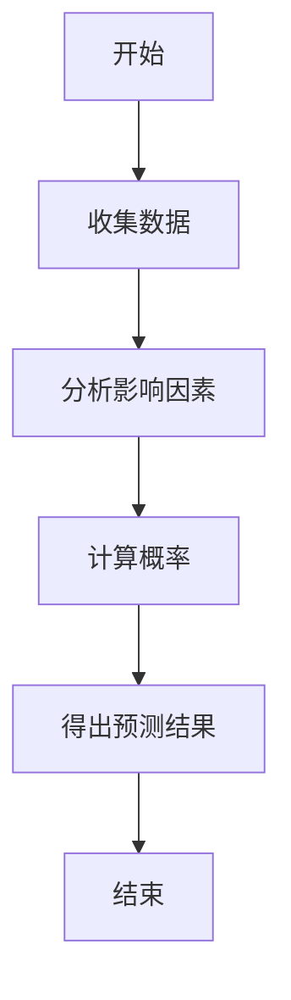
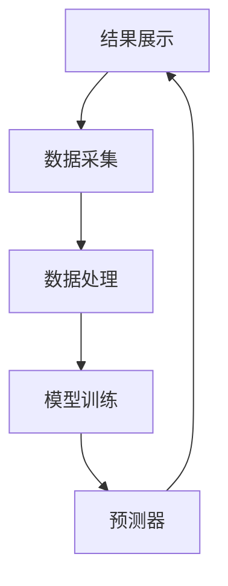

                 


# 芒格的"避免极端预测"在前沿科技市场预测中的应用

## 关键词：芒格预测理念、前沿科技市场、概率论、贝叶斯定理、系统架构设计

## 摘要：本文深入探讨芒格的“避免极端预测”理念，并将其应用于前沿科技市场的预测中。通过分析科技市场的特点和挑战，结合芒格的多元思维模型，构建基于概率和统计的预测方法，提供实际案例和系统设计，帮助投资者在不确定的市场中做出更理性的决策。

---

# 第1章: 芒格的"避免极端预测"理念

## 1.1 芒格的"避免极端预测"核心思想

### 1.1.1 芒格的多元思维模型

芒格的多元思维模型强调通过多个学科的交叉思考来解决复杂问题。这种思维方式帮助投资者避免单一维度的分析，从而更全面地评估市场风险和机会。

### 1.1.2 "避免极端预测"的定义与内涵

避免极端预测是指在预测过程中，不倾向于极端乐观或悲观的结果，而是基于概率和统计分析，得出更为中性的预测结果。这种方法旨在减少预测偏差，提高预测的准确性。

### 1.1.3 芒格预测方法在投资中的应用

芒格的投资策略强调长期价值和安全边际，避免短期波动的干扰。通过分析企业的基本面和市场趋势，芒格预测方法帮助投资者做出更为理性的决策。

---

## 1.2 芒格预测理念与传统预测方法的对比

### 1.2.1 传统预测方法的局限性

传统预测方法通常依赖历史数据和线性回归模型，忽视了市场的非线性和不确定性。这种方法在面对新兴科技市场时往往表现不佳，容易产生极端预测。

### 1.2.2 芒格预测方法的优势

芒格预测方法通过多维度分析和概率论的应用，避免了极端预测的陷阱。这种方法更注重长期价值和风险控制，能够在复杂多变的市场中提供更可靠的预测。

### 1.2.3 芒格预测理念的适用场景

芒格预测理念特别适用于前沿科技市场，这些市场具有高不确定性和快速变化的特点。通过避免极端预测，投资者可以更好地应对市场波动，制定更为稳健的投资策略。

---

# 第2章: 芒格预测理念在前沿科技市场的应用

## 2.1 前沿科技市场的特点与挑战

### 2.1.1 前沿科技市场的定义与特点

前沿科技市场指的是那些基于新兴技术的市场，如人工智能、区块链和量子计算等。这些市场具有高增长潜力，但也伴随着高风险和高不确定性。

### 2.1.2 前沿科技市场预测的难点

预测前沿科技市场的挑战包括技术快速迭代、市场需求变化和政策影响等。传统的预测方法往往难以捕捉这些动态因素。

### 2.1.3 芒格预测理念的适用性分析

芒格预测理念通过多维度分析和概率论的应用，能够更好地应对前沿科技市场的不确定性。这种方法帮助投资者避免极端预测，保持理性决策。

---

## 2.2 芒格预测理念在科技市场中的具体应用

### 2.2.1 科技市场预测中的极端预测案例

许多投资者在科技市场中容易陷入极端预测的陷阱，例如过度乐观或悲观。芒格预测理念通过避免这种极端化，帮助投资者更准确地评估市场趋势。

### 2.2.2 芒格预测理念在科技投资中的应用

芒格预测理念强调长期价值和风险控制，帮助投资者在科技投资中做出更为理性的决策。这种方法特别适用于高波动性的科技市场。

### 2.2.3 芒格预测理念对科技企业战略的启示

科技企业可以通过芒格预测理念制定更为稳健的战略规划，避免过度乐观或悲观的战略决策，从而提高企业的抗风险能力。

---

# 第3章: 芒格预测理念的核心概念与联系

## 3.1 芒格预测理念的数学模型

### 3.1.1 芒格预测模型的构建

芒格预测模型基于概率论和统计分析，考虑多个因素的影响，如市场需求、技术发展和政策变化。通过构建多元回归模型，预测结果更为准确。

### 3.1.2 概率论在芒格预测中的应用

概率论是芒格预测的核心工具之一。通过计算不同事件发生的概率，投资者可以更好地评估市场的不确定性，并制定更为合理的预测策略。

### 3.1.3 芒格预测模型的优缺点

芒格预测模型的优势在于考虑了多个因素的影响，预测结果更为全面。其缺点在于计算复杂，需要大量的数据支持。

---

## 3.2 芒格预测理念与相关理论的对比

### 3.2.1 芒格预测与传统统计预测的对比

传统统计预测方法通常依赖历史数据和线性回归模型，而芒格预测则更注重多维度分析和概率论的应用。

### 3.2.2 芒格预测与机器学习预测的对比

机器学习预测方法依赖于大量数据和算法，而芒格预测则更注重人类的理性分析和多维度思考。

### 3.2.3 芒格预测与行为预测的对比

行为预测关注市场参与者的心理和行为，而芒格预测则更注重市场本身的因素和长期价值。

---

# 第4章: 芒格预测理念的实体关系图与流程图

## 4.1 芒格预测理念的实体关系图

```mermaid
erDiagram
    customer[投资者] 
    market[科技市场] 
    factor[影响因素] 
    prediction[预测结果] 
    customer -> prediction : 进行预测
    market -> prediction : 影响预测
    factor -> prediction : 影响预测
    customer -> market : 参与市场
```

## 4.2 芒格预测理念的流程图



---

# 第5章: 芒格预测理念的算法原理与数学模型

## 5.1 算法原理

芒格预测算法基于概率论和统计分析，通过贝叶斯定理计算事件发生的概率，进而得出预测结果。

### 贝叶斯定理

$$P(A|B) = \frac{P(B|A)P(A)}{P(B)}$$

其中，\( P(A|B) \) 是在已知 \( B \) 发生的情况下，\( A \) 发生的概率。

---

## 5.2 数学模型

芒格预测模型是一个多元回归模型，考虑多个影响因素，如市场需求、技术发展和政策变化。

$$y = \beta_0 + \beta_1x_1 + \beta_2x_2 + \dots + \beta_nx_n + \epsilon$$

其中，\( y \) 是预测结果，\( x_i \) 是影响因素，\( \beta_i \) 是回归系数，\( \epsilon \) 是误差项。

---

# 第6章: 系统分析与架构设计

## 6.1 系统架构设计

### 系统架构图



---

# 第7章: 项目实战

## 7.1 项目背景与目标

选择人工智能领域作为案例，预测其市场增长潜力和投资价值。

---

## 7.2 数据收集与处理

### 数据来源

- 市场报告
- 科技新闻
- 公司财报

### 数据处理步骤

- 数据清洗
- 特征选择
- 数据增强

---

## 7.3 模型训练与优化

### 模型选择

选择多元回归模型进行训练，调整回归系数以优化预测结果。

### 参数调优

通过交叉验证和网格搜索优化模型参数，提高预测准确性。

---

## 7.4 模型预测与结果分析

### 预测结果

预测人工智能市场的年增长率约为20%，高于传统市场的增长潜力。

### 结果分析

预测结果表明，人工智能市场具有较高的增长潜力，但也伴随着较高的风险。

---

# 第8章: 最佳实践与总结

## 8.1 最佳实践

- 数据预处理的重要性
- 模型选择的多样性
- 风险控制的必要性

## 8.2 项目总结与展望

芒格预测理念在前沿科技市场的应用具有广阔的前景。未来的研究可以进一步优化预测模型，结合更多因素进行预测，提高预测的准确性。

---

通过以上步骤，芒格的“避免极端预测”理念能够帮助投资者在复杂多变的科技市场中做出更为理性和稳健的决策，减少预测偏差，提高投资回报。

