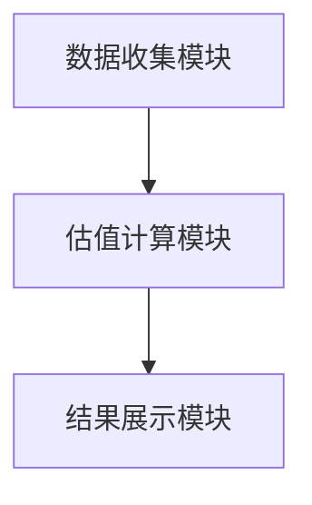

                 

# 芒格的"避免极端预测"在新兴技术估值中的应用

---

## 关键词

- 芒格
- 技术估值
- 极端预测
- 安全边际
- 新兴技术

---

## 摘要

芒格的“避免极端预测”理念强调在决策中避免过于乐观或悲观的预测，注重理性分析和安全边际。本文探讨如何将这一理念应用于新兴技术的估值中，特别是在技术生命周期的不同阶段，如何通过避免极端预测来制定合理的估值策略。文章结合数学模型和实际案例，详细阐述了芒格方法的具体应用步骤，帮助读者在技术投资中避免误判，实现更准确的技术估值。

---

## 第1章：芒格的“避免极端预测”理念

### 1.1 芒格的“避免极端预测”概述

芒格的“避免极端预测”理念源于其投资哲学，核心在于避免对未来的极端乐观或悲观预测。他认为，投资者应关注企业的内在价值，而不是市场的短期波动。这种理念强调安全边际，即在估值时预留一定的安全空间，以应对不确定性。

#### 1.1.1 芒格的“避免极端预测”的核心思想

- **安全边际**：芒格认为，安全边际是投资成功的关键。通过预留安全边际，投资者可以降低因极端预测带来的风险。
- **理性分析**：避免极端预测要求投资者基于事实和数据进行分析，而不是依赖情感或市场情绪。
- **长期视角**：芒格强调长期投资，关注企业的基本面，而非短期市场波动。

#### 1.1.2 极端预测的定义与特征

- **极端预测**：对未来的过高或过低的预测，通常忽视了潜在风险和不确定性。
- **特征**：
  - 过度乐观：忽视技术的实际发展障碍。
  - 过度悲观：低估技术的潜力和价值。

#### 1.1.3 芒格投资哲学中的安全边际概念

安全边际通过低估资产价值来实现，确保在市场波动中保持投资的安全性。在技术估值中，安全边际帮助投资者避免因极端预测而产生的误判。

---

## 第2章：新兴技术估值的核心要素

### 2.1 技术生命周期与估值阶段

技术生命周期分为几个阶段：引入期、成长期、成熟期和衰退期。每个阶段的技术特点和估值方法不同。

#### 2.1.1 技术发展的阶段划分

- **引入期**：技术初步出现，市场认知度低，风险高，估值困难。
- **成长期**：技术逐渐成熟，市场需求增加，估值上升。
- **成熟期**：市场饱和，技术稳定，估值趋于平稳。
- **衰退期**：技术被替代，估值下降。

#### 2.1.2 不同阶段的技术估值特点

- **引入期**：高风险，低估值。
- **成长期**：高增长，估值上升。
- **成熟期**：稳定，估值合理。
- **衰退期**：低增长，估值下降。

#### 2.1.3 技术成熟度对估值的影响

技术成熟度越高，估值越容易，风险越低。引入期的技术估值风险较高，需要更多的安全边际。

---

## 第3章：芒格方法在技术估值中的应用

### 3.1 芒格方法的基本步骤

#### 3.1.1 明确估值目标

确定估值的具体目标，如技术的市场潜力、商业化能力等。

#### 3.1.2 收集相关信息

收集技术相关的市场数据、行业趋势和竞争分析，为估值提供依据。

#### 3.1.3 分析技术的优缺点

全面评估技术的优势和劣势，识别潜在风险和机会。

#### 3.1.4 评估潜在风险和机会

量化风险和机会的影响，制定应对策略。

---

## 第4章：技术估值的数学模型与算法

### 4.1 技术估值的基本数学模型

#### 4.1.1 贴现现金流模型

贴现现金流模型用于估算技术的未来现金流，计算其现值。

$$ \text{现值} = \sum_{t=1}^{n} \frac{\text{现金流}_t}{(1 + r)^t} $$

其中，\( r \) 是贴现率，\( n \) 是技术的生命周期。

#### 4.1.2 市盈率与市净率模型

市盈率（P/E）和市净率（P/B）用于评估技术的市场估值。

- 市盈率：$$ \text{市盈率} = \frac{\text{股价}}{\text{每股收益}} $$
- 市净率：$$ \text{市净率} = \frac{\text{股价}}{\text{每股净资产}} $$

#### 4.1.3 技术生命周期模型

技术生命周期模型用于预测技术的市场表现和估值变化。

$$ \text{估值} = f(\text{阶段}, \text{风险}, \text{潜力}) $$

---

## 第5章：系统分析与架构设计

### 5.1 系统功能设计

#### 5.1.1 数据收集模块

收集技术相关的市场数据和行业趋势。

#### 5.1.2 估值计算模块

基于数学模型计算技术估值。

#### 5.1.3 结果展示模块

展示估值结果和相关分析。

### 5.2 系统架构设计

#### 5.2.1 系统架构图

使用mermaid绘制系统架构图，展示模块之间的关系。

---

## 第6章：项目实战

### 6.1 案例分析：人工智能技术的估值

#### 6.1.1 案例背景

人工智能技术处于成长期，市场潜力大，但竞争激烈。

#### 6.1.2 芒格方法的应用

- 明确估值目标：评估人工智能的市场潜力。
- 收集信息：市场数据、竞争分析。
- 分析优缺点：技术优势明显，但竞争激烈。
- 评估风险和机会：高风险和高机会并存。

#### 6.1.3 结果分析与总结

通过芒格方法，合理估值人工智能技术，避免极端预测带来的风险。

---

## 第7章：总结与展望

### 7.1 最佳实践 tips

- 保持理性分析，避免极端预测。
- 注重安全边际，降低投资风险。
- 结合实际数据，动态调整估值。

### 7.2 小结

芒格的“避免极端预测”理念在新兴技术估值中具有重要应用，帮助投资者制定更合理的估值策略。

### 7.3 注意事项

- 定期更新数据和模型，适应市场变化。
- 多关注技术的潜在风险，避免低估风险。

### 7.4 拓展阅读

- 《穷查理宝典》——芒格的完整投资哲学。
- 技术估值的最新模型和方法。

---

通过以上章节的详细阐述，芒格的“避免极端预测”理念在新兴技术估值中的应用得到了全面展示。读者可以结合实际案例和数学模型，更好地理解和应用这一方法，实现更准确的技术估值。

