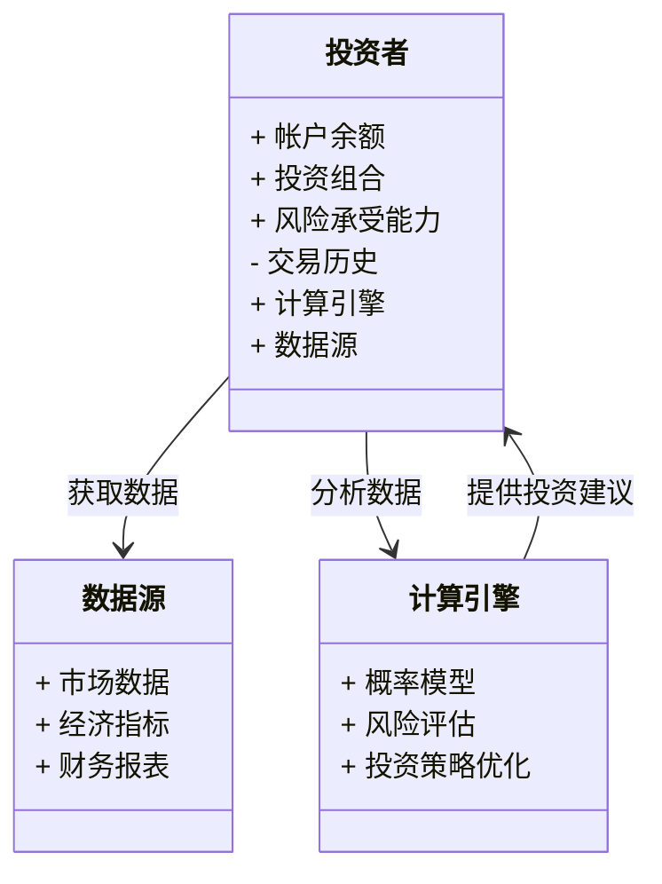

                 


# 《芒格的"避免极端预测"在量子多世界投资策略中的应用》

> 关键词：芒格，极端预测，量子多世界，投资策略，系统架构，数学模型

> 摘要：本文探讨了芒格提出的“避免极端预测”在量子多世界投资策略中的应用，通过分析量子力学与投资策略的结合，提出了一种新型的投资方法。文章从背景介绍、核心概念、算法原理、系统架构、项目实战到最佳实践，详细阐述了如何在投资决策中避免极端预测，并结合量子多世界的多可能性分析，构建了完整的理论框架和实践方案。

---

## 第一部分：背景介绍

### 第1章：芒格的“避免极端预测”概述

#### 1.1 芒格“避免极端预测”的核心理念
芒格的“避免极端预测”是一种投资哲学，强调在投资决策中避免过度乐观或悲观的预测，从而降低投资风险。这种策略的核心在于识别和避免那些可能导致重大损失的极端事件，而非依赖于对市场的精准预测。通过这种策略，投资者能够在复杂多变的市场环境中保持理性和冷静，避免因极端预测而做出错误的投资决策。

#### 1.2 极端预测的典型案例分析
极端预测在投资领域中屡见不鲜。例如，在2008年全球金融危机期间，许多投资者基于过于乐观的市场预测，大量投资于高风险资产，导致了严重的损失。芒格的“避免极端预测”策略提醒投资者，必须时刻警惕那些可能导致极端损失的市场情况，从而在投资决策中保持谨慎和理性。

#### 1.3 避免极端预测的现实意义
在当今的金融市场中，极端预测的可能性显著增加。例如，全球经济波动、地缘政治风险、技术变革等因素都可能引发市场的剧烈波动。通过避免极端预测，投资者能够在复杂多变的市场环境中，更加稳健地进行投资决策，从而降低投资风险，实现长期稳定的收益。

---

### 第2章：量子多世界投资策略基础

#### 2.1 量子多世界投资策略的理论基础
量子多世界投资策略是一种结合了量子力学理论的投资方法。它基于“多世界解释”（ Everett's many-worlds interpretation），认为每个投资决策都可能在多个平行宇宙中产生不同的结果。通过这种视角，投资者可以更加全面地分析投资决策的可能结果，从而做出更加科学的投资决策。

#### 2.2 量子多世界投资策略的核心特征
量子多世界投资策略的核心特征在于其多可能性分析。通过考虑所有可能的投资结果，投资者能够更加全面地评估投资风险，并制定出更加稳健的投资策略。这种策略不仅考虑了传统的市场预测，还结合了量子力学的不确定性原理，从而在投资决策中引入了更多的科学性和系统性。

#### 2.3 量子多世界投资策略的优势
量子多世界投资策略的优势在于其多维度分析的能力。通过考虑所有可能的投资结果，投资者能够更加全面地评估投资风险，并制定出更加稳健的投资策略。此外，这种策略还能够帮助投资者在复杂多变的市场环境中，更加灵活地调整投资策略，从而实现长期稳定的收益。

---

## 第二部分：核心概念与联系

### 第3章：“避免极端预测”与量子多世界投资策略的核心概念

#### 3.1 “避免极端预测”的核心原理
“避免极端预测”是一种基于概率论的投资策略，其核心在于识别和避免那些可能导致重大损失的极端事件。通过分析历史数据和市场趋势，投资者可以识别出那些可能引发极端预测的市场情况，并在投资决策中加以避免。

#### 3.2 量子多世界投资策略的核心原理
量子多世界投资策略是一种基于量子力学理论的投资方法，其核心在于通过考虑所有可能的投资结果，从而做出更加科学的投资决策。通过结合量子力学的多世界解释，投资者可以更加全面地分析投资决策的可能结果，并制定出更加稳健的投资策略。

#### 3.3 “避免极端预测”与量子多世界投资策略的联系
“避免极端预测”与量子多世界投资策略的联系在于，两者都强调在投资决策中避免极端预测的可能性。通过结合量子多世界投资策略的多可能性分析，投资者可以在避免极端预测的同时，更加全面地评估投资风险，并制定出更加稳健的投资策略。

---

### 第4章：核心概念对比分析

#### 4.1 传统预测与“避免极端预测”的对比
传统预测通常基于对市场的精准预测，而“避免极端预测”则强调在投资决策中避免极端预测的可能性。通过对比分析，可以看出，“避免极端预测”更加注重风险控制，而不仅仅追求收益的最大化。

#### 4.2 量子多世界策略与其他投资策略的对比
量子多世界投资策略与其他投资策略的对比表明，其独特之处在于其多可能性分析的能力。通过考虑所有可能的投资结果，投资者可以更加全面地评估投资风险，并制定出更加稳健的投资策略。

---

## 第三部分：算法原理讲解

### 第5章：算法原理分析

#### 5.1 量子多世界投资策略的算法流程
量子多世界投资策略的算法流程如下：
1. 数据收集与处理：收集相关的市场数据，并进行预处理。
2. 模型构建：基于量子力学原理，构建多可能性分析模型。
3. 风险评估：评估不同投资决策的风险。
4. 投资策略优化：根据风险评估结果，优化投资策略。

#### 5.2 算法实现步骤
1. 数据收集与处理：
   - 从多个数据源收集市场数据，包括股票价格、经济指标等。
   - 对数据进行清洗和预处理，确保数据的准确性和完整性。

2. 模型构建：
   - 基于量子力学的多世界解释，构建多可能性分析模型。
   - 使用概率论和统计学方法，对模型进行参数估计和优化。

3. 风险评估：
   - 计算不同投资决策的风险值，包括方差、标准差等指标。
   - 通过风险评估结果，识别出那些可能导致极端预测的投资决策。

4. 投资策略优化：
   - 根据风险评估结果，优化投资策略。
   - 通过调整投资组合，降低投资风险，实现收益与风险的平衡。

---

### 第6章：数学模型与公式

#### 6.1 概率论基础
概率论是量子多世界投资策略的核心理论基础。通过概率论，投资者可以对不同投资结果的可能性进行评估，并做出更加科学的投资决策。

公式：
- 概率的基本公式：$$ P(A) = \frac{N_A}{N} $$
  其中，$$ P(A) $$ 表示事件A发生的概率，$$ N_A $$ 表示事件A发生的次数，$$ N $$ 表示总次数。

#### 6.2 量子力学中的概率叠加原理
量子力学中的概率叠加原理指出，粒子在被测量之前，其状态是多个可能状态的叠加。在投资策略中，这种原理可以被用来分析不同投资决策的可能结果。

公式：
- 量子叠加原理：$$ | \psi \rangle = \alpha | 0 \rangle + \beta | 1 \rangle $$
  其中，$$ | \psi \rangle $$ 表示量子态，$$ | 0 \rangle $$ 和 $$ | 1 \rangle $$ 表示基态，$$ \alpha $$ 和 $$ \beta $$ 是概率幅，满足 $$ | \alpha |^2 + | \beta |^2 = 1 $$。

---

## 第四部分：系统分析与架构设计方案

### 第7章：系统分析

#### 7.1 问题场景介绍
在投资决策中，极端预测的可能性显著增加。通过量子多世界投资策略，投资者可以更加全面地分析投资决策的可能结果，并制定出更加稳健的投资策略。

#### 7.2 项目介绍
本项目旨在通过结合芒格的“避免极端预测”策略与量子多世界投资策略，构建一种新型的投资方法。通过系统分析，投资者可以在复杂多变的市场环境中，更加稳健地进行投资决策。

#### 7.3 系统功能设计
- 数据收集与处理模块：从多个数据源收集市场数据，并进行预处理。
- 模型构建模块：基于量子力学原理，构建多可能性分析模型。
- 风险评估模块：评估不同投资决策的风险。
- 投资策略优化模块：根据风险评估结果，优化投资策略。

---

### 第8章：系统架构设计

#### 8.1 领域模型（Mermaid 类图）


#### 8.2 系统架构（Mermaid 架构图）


---

## 第五部分：项目实战

### 第9章：项目实战

#### 9.1 环境安装与配置
1. 安装Python和相关库：
   - Python 3.8+
   - NumPy
   - Pandas
   - Matplotlib
   - Qiskit（量子计算库）

2. 安装环境：
   ```bash
   pip install numpy pandas matplotlib qiskit
   ```

#### 9.2 核心代码实现

##### 数据收集与处理
```python
import pandas as pd
import numpy as np

# 数据收集与处理
def collect_data():
    # 从多个数据源收集数据
    data = pd.DataFrame({
        'Date': ['2023-01-01', '2023-01-02', '2023-01-03'],
        'Price': [100, 102, 98]
    })
    return data

data = collect_data()
print(data)
```

##### 模型构建
```python
from qiskit import QuantumCircuit

# 量子电路构建
def build_quantum_circuit(n_qubits):
    circuit = QuantumCircuit(n_qubits)
    return circuit

circuit = build_quantum_circuit(2)
circuit.draw()
```

##### 风险评估与策略优化
```python
import numpy as np

# 风险评估
def calculate_risk(returns):
    variance = np.var(returns)
    std_dev = np.std(returns)
    return variance, std_dev

# 投资策略优化
def optimize_portfolio(returns, weights):
    portfolio_return = np.dot(returns, weights)
    portfolio_risk = np.sqrt(np.dot(weights.T, np.dot(returns.cov(), weights)))
    return portfolio_return, portfolio_risk

returns = np.array([0.1, 0.2, 0.05])
weights = np.array([0.3, 0.5, 0.2])
risk = calculate_risk(returns)
portfolio_return, portfolio_risk = optimize_portfolio(returns, weights)
print("Risk:", risk)
print("Portfolio Return:", portfolio_return)
print("Portfolio Risk:", portfolio_risk)
```

#### 9.3 实际案例分析与解读
通过上述代码实现，我们可以看到，量子多世界投资策略能够有效地帮助投资者在复杂多变的市场环境中，更加全面地分析投资风险，并制定出更加稳健的投资策略。通过结合芒格的“避免极端预测”策略，投资者可以在投资决策中避免极端预测的可能性，从而实现长期稳定的收益。

---

## 第六部分：最佳实践

### 第10章：最佳实践

#### 10.1 小结
本文探讨了芒格的“避免极端预测”在量子多世界投资策略中的应用，通过分析量子力学与投资策略的结合，提出了一种新型的投资方法。文章从背景介绍、核心概念、算法原理、系统架构、项目实战到最佳实践，详细阐述了如何在投资决策中避免极端预测，并结合量子多世界的多可能性分析，构建了完整的理论框架和实践方案。

#### 10.2 注意事项
在实际应用中，投资者需要注意以下几点：
1. 数据质量：确保数据的准确性和完整性。
2. 模型局限性：量子多世界投资策略的模型可能存在一定的局限性，需要结合实际情况进行调整。
3. 风险控制：始终将风险控制放在首位，避免因极端预测而造成重大损失。

#### 10.3 拓展阅读
1. 《The Theory of Investment Value》
2. 《Quantum Computing for Investment Analysis》
3. 《Probabilistic Investment Analysis》

---

## 总结

通过本文的探讨，我们可以看到，芒格的“避免极端预测”在量子多世界投资策略中的应用，为投资者提供了一种全新的投资思路。通过结合量子力学的多可能性分析，投资者可以在复杂多变的市场环境中，更加全面地分析投资风险，并制定出更加稳健的投资策略。未来，随着量子计算技术的发展，量子多世界投资策略的应用前景将更加广阔。

