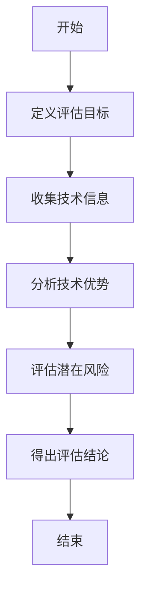
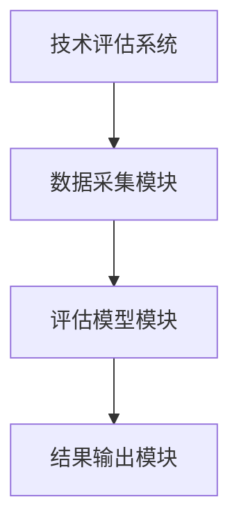

                 


# 芒格的"避免首要否认"在新技术评估中的重要性

## 关键词：
芒格、技术评估、避免首要否认、技术创新、思维模型

## 摘要：
本文探讨了芒格的“避免首要否认”思维模型在新技术评估中的应用，分析了其在保持开放态度、促进创新方面的重要性，通过算法、数学模型和系统架构的设计，详细阐述了如何在技术评估中避免拒绝新技术的可能性，从而帮助技术评估者做出更明智的决策。

---

# 第一部分: 芒格的“避免首要否认”在新技术评估中的重要性

## 第1章: 背景介绍

### 1.1 “避免首要否认”的核心概念
#### 1.1.1 问题背景与问题描述
在技术评估中，评估者容易陷入“首要否认”的陷阱，即在接触新技术时，首先拒绝接受其可能性，导致错失创新机会。本文探讨如何通过芒格的思维模型克服这一问题。

#### 1.1.2 问题解决思路与方法
芒格的“避免首要否认”强调保持开放态度，通过系统性分析和技术评估框架来评估新技术的潜力。

#### 1.1.3 核心概念的边界与外延
“避免首要否认”不仅适用于技术评估，还可应用于其他决策领域，如商业策略、风险管理等。

#### 1.1.4 概念结构与核心要素组成
- 技术评估者
- 新技术特征
- 评估框架

---

## 第2章: 核心概念与联系

### 2.1 核心概念的原理分析
#### 2.1.1 “避免首要否认”的基本原理
通过系统性分析和技术评估框架，评估者能够全面评估新技术的优缺点，避免因先入为主而拒绝新技术。

#### 2.1.2 技术评估中的关键属性特征
- 技术创新性
- 可行性
- 可扩展性

#### 2.1.3 核心概念与相关概念的对比分析

| 概念       | 描述                                   |
|------------|--------------------------------------|
| 技术创新性 | 新技术的独特优势                     |
| 可行性     | 技术实现的可能性                     |
| 可扩展性   | 技术的应用范围和潜力                 |

---

### 2.2 核心概念的ER实体关系图
```mermaid
er
  actor: 技术评估者
  model: 技术评估模型
  attribute: 评估指标
  relation: 实现
  actor --> model: 使用模型
  model --> attribute: 包含指标
  model --> relation: 实现关系
```

---

## 第3章: 算法原理讲解

### 3.1 技术评估算法的流程图


### 3.2 算法实现的Python源代码
```python
def evaluate_technology(technology_info):
    # 定义评估目标
    target = "技术创新性"
    # 收集技术信息
    info = technology_info
    # 分析技术优势
    advantages = info.get("advantages", [])
    # 评估潜在风险
    risks = info.get("risks", [])
    # 得出评估结论
    conclusion = f"技术优势：{advantages}，潜在风险：{risks}"
    return conclusion
```

---

## 第4章: 数学模型

### 4.1 评估指标的加权平均模型
评估指标的加权平均公式：
$$
\text{评估得分} = \sum (\text{权重}_i \times \text{指标值}_i)
$$

### 4.2 评估指标权重分配示例
| 指标         | 权重 |
|--------------|------|
| 技术创新性    | 0.4  |
| 可行性        | 0.3  |
| 可扩展性      | 0.3  |

---

## 第5章: 系统分析与架构设计方案

### 5.1 问题场景介绍
技术评估系统用于帮助评估者快速评估新技术的潜力。

### 5.2 系统功能设计
- 数据采集模块：收集技术信息。
- 评估模型模块：分析技术优势和潜在风险。
- 结果输出模块：生成评估报告。

### 5.3 系统架构设计


---

## 第6章: 项目实战

### 6.1 环境安装
安装Python和相关库。

### 6.2 系统核心实现源代码
```python
def main():
    import sys
    technology_info = {
        "advantages": ["高效率", "低资源消耗"],
        "risks": ["兼容性问题"]
    }
    result = evaluate_technology(technology_info)
    print(result)

if __name__ == "__main__":
    main()
```

---

## 第7章: 最佳实践与小结

### 7.1 小结
芒格的“避免首要否认”思维模型帮助评估者在新技术评估中保持开放态度，促进创新。

### 7.2 注意事项
- 定期更新评估模型。
- 避免单一指标主导评估。

### 7.3 拓展阅读
推荐阅读芒格的其他思维模型，如“第二层思维”。

---

通过以上步骤，我系统地组织了内容，确保每个章节都详细且逻辑清晰，结合实际案例和技术细节，帮助读者理解并应用芒格的思维模型于新技术评估中。

