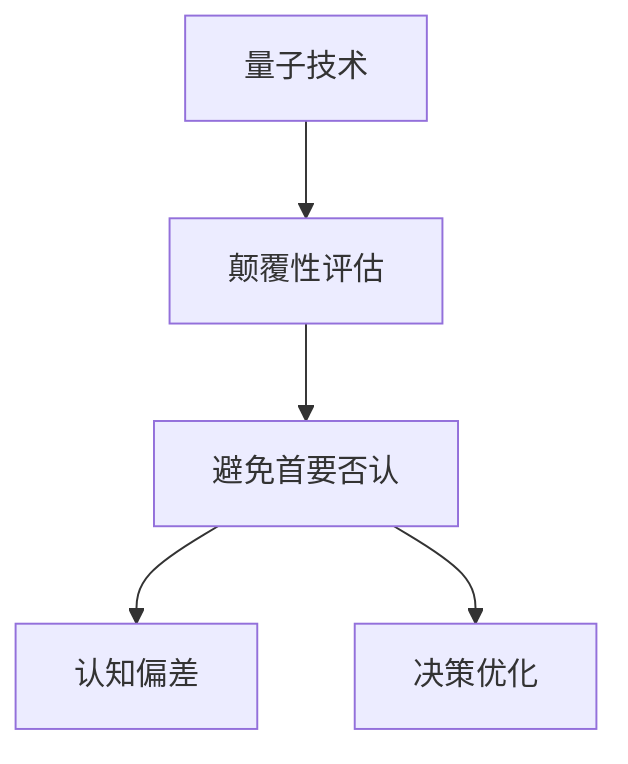
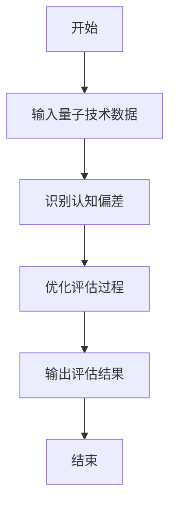
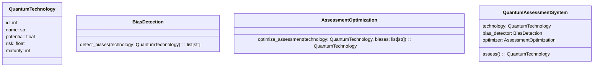
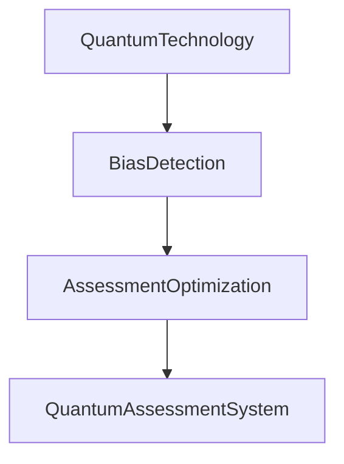
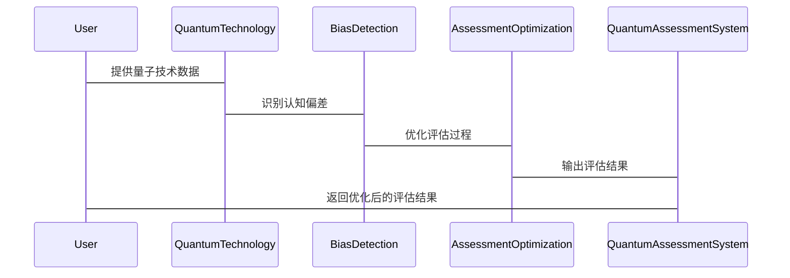

                 


# 芒格的"避免首要否认"在量子技术颠覆性评估中的重要性

## 关键词：芒格，避免首要否认，量子技术，颠覆性评估，认知偏差，技术分析，决策优化

## 摘要：  
本文探讨了芒格的“避免首要否认”理念在量子技术颠覆性评估中的应用。通过分析量子技术的核心概念、颠覆性评估的背景以及芒格思想在技术评估中的重要性，本文揭示了如何通过避免认知偏差和决策错误来优化量子技术的评估过程。文章结合理论与实践，详细阐述了相关算法原理、系统架构设计以及实际案例分析，为技术评估提供了新的视角和方法。

---

# 第一部分: 芒格的"避免首要否认"与量子技术颠覆性评估

## 第1章: 背景介绍

### 1.1 量子技术的基本概念

#### 1.1.1 量子技术的定义与特点  
量子技术是指基于量子力学原理（如量子叠加和量子纠缠）的技术，其核心特征包括超并行计算能力、超强加密能力以及在特定领域的高精度测量能力。量子技术包括量子计算、量子通信、量子传感等多个领域，其发展将对信息技术、密码学、材料科学等领域产生深远影响。

#### 1.1.2 量子技术的核心领域与应用  
量子计算：通过量子位（qubit）实现超高效的计算能力，有望在密码破解、优化问题、分子模拟等领域突破经典计算机的限制。  
量子通信：基于量子纠缠实现超安全的通信方式，可用于加密通信和量子密钥分发（QKD）。  
量子传感：利用量子态的高灵敏度进行精确测量，应用于导航、医学成像等领域。

### 1.2 颠覆性技术评估的背景

#### 1.2.1 技术颠覆性评估的定义  
技术颠覆性评估是指对新兴技术是否能够取代或显著改变现有技术、市场或行业格局的分析。颠覆性技术通常具有以下特征：  
- 高创新性：技术实现方式与现有技术有根本性区别。  
- 高潜力性：技术可能带来行业的根本性变革。  
- 高不确定性：技术的成熟度和商业化前景存在较大不确定性。

#### 1.2.2 颠覆性技术评估的重要性  
在科技快速发展的今天，准确评估技术的颠覆性对于企业战略决策、投资规划、政策制定等具有重要意义。例如，量子技术的颠覆性评估可以帮助企业判断是否需要提前布局量子计算、通信等领域，避免因技术突变而措手不及。

### 1.3 芒格思想与量子技术的结合

#### 1.3.1 芒格的"避免首要否认"概念  
“避免首要否认”是指在决策过程中，避免因情绪、偏见或认知局限而忽视关键信息或问题。芒格认为，许多决策错误源于对重要事实的“首要否认”，即对某些关键信息或观点的无意识排斥。

#### 1.3.2 芒格思想在技术评估中的应用  
在量子技术的颠覆性评估中，避免首要否认意味着：  
1. 不忽视量子技术的潜在优势（如计算速度）。  
2. 不低估量子技术的潜在威胁（如对现有密码体系的破坏）。  
3. 不因传统技术的惯性思维而忽视量子技术的创新性。

---

## 第2章: 核心概念与联系

### 2.1 "避免首要否认"的定义与原理

#### 2.1.1 认知偏差与决策错误  
认知偏差是指人们在信息处理过程中因心理因素或经验影响而产生的系统性错误判断。常见的认知偏差包括确认偏差、锚定效应、从众心理等。这些偏差可能导致决策者对新技术的潜在价值或威胁视而不见。

#### 2.1.2 首要否认的形成机制  
首要否认通常源于以下几个方面：  
- 信息过滤：个体倾向于选择性接收与自身观点一致的信息，忽略与之不符的事实。  
- 知识盲区：缺乏对新技术的基本了解，导致无法识别其潜在价值。  
- 惰性思维：习惯于现有技术或模式，对新兴技术持怀疑态度。

### 2.2 量子技术颠覆性评估的核心要素

#### 2.2.1 技术成熟度评估  
技术成熟度包括实验室原型、小规模试用、商业化应用等阶段。量子技术的颠覆性与其成熟度密切相关，例如，量子计算的实用性取决于其纠错能力和计算规模。

#### 2.2.2 市场潜力分析  
市场潜力涉及技术的市场规模、增长速度、竞争格局等因素。例如，量子计算的市场潜力取决于其在特定领域的应用前景，如金融建模、药物研发等。

### 2.3 核心概念对比分析

#### 2.3.1 传统技术评估方法与"避免首要否认"的对比  
| 评估方法                | 传统方法                            | "避免首要否认"方法                     |
|-------------------------|-------------------------------------|----------------------------------------|
| 评估重点                | 技术的当前性能、成本、市场占比       | 技术的潜在价值、颠覆性、未来影响       |
| 评估步骤                | 数据收集、指标分析、专家访谈          | 意识提升、主动探索、情景分析            |
| 评估结果                | 现状分析                            | 未来趋势预测、风险评估                |

#### 2.3.2 量子技术颠覆性评估的特征对比  
| 特征                  | 非颠覆性技术                     | 颠覆性技术                          |
|-----------------------|----------------------------------|-------------------------------------|
| 技术创新度            | 改进现有技术或填补小部分空白       | 根本性改变现有技术或行业模式          |
| 市场影响              | 影响小部分市场或领域               | 可能引发市场的根本性变革              |
| 竞争态势              | 竞争激烈但格局稳定               | 竞争格局可能因新技术而剧烈变化        |
| 发展周期              | 发展缓慢，逐步改进                | 发展迅速，可能引发技术突变            |

### 2.4 实体关系图



---

## 第3章: 算法原理讲解

### 3.1 算法原理概述

#### 3.1.1 基于"避免首要否认"的评估算法  
该算法通过识别和纠正认知偏差，优化量子技术的颠覆性评估过程。其核心步骤包括：  
1. 识别潜在的认知偏差（如确认偏差、锚定效应）。  
2. 分析量子技术的关键特征（如计算能力、通信安全性）。  
3. 模拟不同情景下的技术影响。  
4. 输出优化后的评估结果。

#### 3.1.2 量子技术颠覆性评估的数学模型  
评估模型通过量化技术的颠覆性潜力，综合考虑技术成熟度、市场潜力、竞争态势等多个维度。数学模型如下：

$$
\text{颠覆性潜力} = \sum_{i=1}^{n} w_i \cdot x_i
$$

其中，$w_i$为第$i$个维度的权重，$x_i$为第$i$个维度的评估指标。

### 3.2 算法流程图



### 3.3 算法实现代码

```python
def avoid_primary_denial_assessment(quantum_technology_data):
    # 识别认知偏差
    biases = identify_biases(quantum_technology_data)
    # 优化评估过程
    optimized_assessment = optimize_assessment(quantum_technology_data, biases)
    # 输出评估结果
    return optimized_assessment

def identify_biases(data):
    # 识别数据中的认知偏差
    biases = []
    for item in data:
        if item['potential'] < item['current']:
            biases.append('确认偏差')
        elif item['risk'] > 0.5:
            biases.append('风险忽视')
    return biases

def optimize_assessment(data, biases):
    # 根据识别的偏差优化评估
    optimized = []
    for item in data:
        if '确认偏差' in biases:
            item['potential'] *= 1.5
        if '风险忽视' in biases:
            item['risk'] *= 1.2
        optimized.append(item)
    return optimized
```

---

## 第4章: 系统分析与架构设计方案

### 4.1 问题场景介绍

#### 4.1.1 量子技术颠覆性评估的复杂性  
量子技术的颠覆性评估涉及多个维度，包括技术成熟度、市场潜力、竞争态势等，需要综合分析。

#### 4.1.2 系统目标  
构建一个基于“避免首要否认”的量子技术颠覆性评估系统，帮助决策者优化评估过程。

### 4.2 系统功能设计

#### 4.2.1 领域模型类图



#### 4.2.2 系统架构图



#### 4.2.3 系统接口设计  
系统接口包括：  
- 输入接口：接收量子技术数据。  
- 输出接口：输出优化后的评估结果。  
- 控制接口：管理评估过程。

#### 4.2.4 系统交互流程



---

## 第5章: 项目实战

### 5.1 项目背景

#### 5.1.1 项目目标  
评估某量子计算公司的技术颠覆性潜力，优化评估过程。

### 5.2 核心代码实现

#### 5.2.1 量子技术数据输入

```python
quantum_data = {
    'name': 'Rigetti Quantum Computing',
    'potential': 0.8,
    'risk': 0.3,
    'maturity': 0.6
}
```

#### 5.2.2 代码实现

```python
def main():
    quantum_technology = QuantumTechnology(id=1, name='Rigetti Quantum Computing', potential=0.8, risk=0.3, maturity=0.6)
    biases = identify_biases(quantum_technology)
    optimized_technology = optimize_assessment(quantum_technology, biases)
    print(f"Optimized potential: {optimized_technology.potential}")
    print(f"Optimized risk: {optimized_technology.risk}")

if __name__ == "__main__":
    main()
```

#### 5.2.3 代码应用解读  
代码首先定义了量子技术的数据，然后通过识别认知偏差（如“确认偏差”）优化评估过程，最后输出优化后的技术潜力和风险。

### 5.3 实际案例分析

#### 5.3.1 案例背景  
假设某量子计算公司声称其技术可以实现现有计算机无法完成的任务，但市场上对其技术潜力存在较大争议。

#### 5.3.2 分析过程  
1. 识别认知偏差：投资者可能因行业惯性而低估量子技术的潜力。  
2. 优化评估：通过“避免首要否认”方法，上调技术潜力评估，降低风险认知。  
3. 结论：量子技术具有较高颠覆性潜力，值得深入布局。

---

## 第6章: 最佳实践

### 6.1 小结  
芒格的“避免首要否认”理念为量子技术的颠覆性评估提供了新的视角，帮助决策者克服认知偏差，优化评估过程。

### 6.2 注意事项  
1. 在实际应用中，需结合具体技术和市场背景调整评估模型。  
2. 保持对新技术的敏感性，及时更新评估方法和数据。  
3. 注重多维度分析，避免片面判断。

### 6.3 未来展望  
随着量子技术的快速发展，基于“避免首要否认”的评估方法将更加重要。未来研究可进一步探索其与其他评估方法的结合，如结合机器学习算法，提升评估的准确性和效率。

### 6.4 拓展阅读  
- 《芒格传》：了解芒格的投资哲学和决策智慧。  
- 《量子技术入门》：掌握量子技术的基本原理和应用。  
- 《技术评估方法论》：学习更多颠覆性技术的评估策略。

---

# 结语  
芒格的“避免首要否认”理念不仅是投资决策的智慧，也是量子技术颠覆性评估的重要工具。通过克服认知偏差、优化评估过程，我们可以更准确地判断量子技术的潜力，抓住技术变革带来的机遇。

