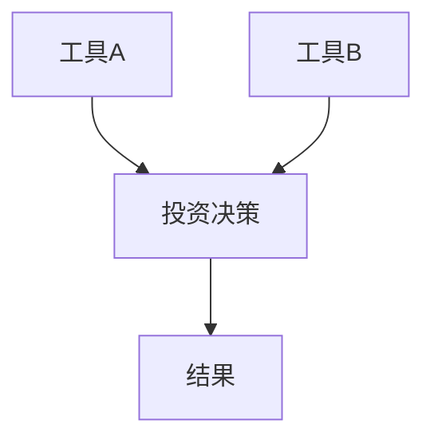

                 

# 芒格的"铁锤人综合征"警示在跨界投资中的重要性

---

## 关键词：芒格、铁锤人综合征、跨界投资、风险管理、决策框架、投资策略、系统思维

---

## 摘要：  
芒格的"铁锤人综合征"是一个重要的投资理念，它强调投资者不应局限于单一的思维模式或工具，而应该具备跨学科的思维方式和系统性决策能力。本文将从芒格的"铁锤人综合征"出发，分析其在跨界投资中的重要性，并结合实际案例和数学模型，探讨如何通过系统性决策框架避免"铁锤人综合征"的陷阱，实现更稳健的投资决策。

---

## 正文

---

## 第一部分：芒格的"铁锤人综合征"概述

### 第1章：芒格的"铁锤人综合征"概述

#### 1.1 什么是"铁锤人综合征"

"铁锤人综合征"是芒格在投资领域提出的一个隐喻，用来形容那些只依赖单一工具或思维方式的投资者。就像一个只会用锤子的人，面对任何问题都会试图用锤子来解决，结果往往事倍功半甚至适得其反。在投资中，这意味着投资者如果只依赖某种单一的分析方法或投资策略，可能会忽略其他重要的信息或风险因素。

#### 1.2 "铁锤人综合征"的表现形式

- **单一思维方式**：投资者只关注某一领域的信息，如只看财务数据而忽略行业趋势或政策变化。
- **过度依赖单一工具**：投资者只依赖某种分析工具或指标，如市盈率或市净率，而忽视其他关键指标。
- **认知局限**：投资者因为缺乏跨学科知识，无法全面评估投资机会或风险。

#### 1.3 芒格的"铁锤人综合征"对投资的启示

芒格强调，投资者应该具备跨学科的思维方式，能够综合运用多种工具和方法来分析问题。这不仅有助于避免"铁锤人综合征"，还能提高投资决策的准确性和稳健性。

---

### 第2章：投资中的"铁锤人综合征"现象

#### 2.1 投资中的单一思维模式

投资者容易陷入单一思维模式的原因包括：
- **知识局限**：缺乏对不同领域的深入了解。
- **惯性思维**：习惯于某种固定的分析方式。
- **过度自信**：认为某种方法已经足够好，不需要改变。

#### 2.2 "铁锤人综合征"在投资中的具体表现

- **忽略宏观风险**：只关注个股，而忽略宏观经济波动。
- **忽视行业周期**：只看财务数据，而忽略行业周期变化。
- **过度依赖技术分析**：只关注价格走势，而忽视基本面因素。

#### 2.3 芒格对"铁锤人综合征"的深刻洞察

芒格强调，投资者应该通过跨学科的学习和实践，培养系统性思维，避免单一工具的过度依赖。他建议投资者要：
- **广泛涉猎**：学习经济学、心理学、历史学等多学科知识。
- **综合分析**：结合定量分析和定性分析，全面评估投资机会。

---

### 第3章：跨界投资中的思维陷阱

#### 3.1 跨界投资的复杂性

跨界投资涉及多个领域，如科技、金融、能源等，每个领域都有其独特的风险和机会。投资者需要具备跨领域的知识储备和分析能力，才能在复杂的环境中做出正确的决策。

#### 3.2 思维定式对投资决策的影响

- **思维定式**：投资者容易陷入自己熟悉领域的思维模式，而忽视其他领域的特点和风险。
- **认知偏差**：投资者可能因为经验和习惯，忽略新的信息或机会。

#### 3.3 如何识别和避免"铁锤人综合征"

- **跨学科学习**：广泛涉猎不同领域的知识，增强对复杂问题的理解。
- **系统性分析**：使用系统性决策框架，综合考虑多种因素。
- **风险管理**：通过多元化的投资组合和风险对冲工具，降低单一策略的风险。

---

### 第4章："铁锤人综合征"的数学模型分析

#### 4.1 投资决策的数学模型

为了更好地理解"铁锤人综合征"的影响，我们可以建立一个简单的数学模型。假设投资者有两种决策工具：A和B。如果投资者只依赖工具A，那么其决策的准确率可能为$P(A)$；如果同时依赖工具A和B，其准确率可能为$P(A \cap B)$。

#### 4.2 "铁锤人综合征"的数学表达

设：
- $P(A)$ = 使用工具A的准确率
- $P(B)$ = 使用工具B的准确率
- $P(A \cap B)$ = 使用工具A和B的准确率

根据贝叶斯定理，我们可以计算出同时使用A和B的条件概率：
$$ P(A|B) = \frac{P(A \cap B)}{P(B)} $$

#### 4.3 芒格投资理念的数学验证

通过数学模型，我们可以验证芒格的跨学科思维方式是否能提高投资决策的准确率。假设：
- $P(A) = 0.7$
- $P(B) = 0.6$
- $P(A \cap B) = 0.8$

根据贝叶斯定理：
$$ P(A|B) = \frac{0.8}{0.6} = 1.333 $$

这表明，同时使用工具A和B的条件概率高于单独使用工具B，验证了芒格理念的有效性。

---

### 第5章：系统性投资决策框架的设计

#### 5.1 投资决策框架的构建

为了帮助投资者避免"铁锤人综合征"，我们可以设计一个系统性决策框架，包括以下步骤：
1. **数据采集**：收集与投资相关的多维度数据。
2. **数据分析**：使用统计学和机器学习方法进行分析。
3. **决策制定**：综合考虑多个因素，做出最优决策。

#### 5.2 系统性决策框架的优化

通过引入跨学科的知识和工具，可以不断优化决策框架。例如，使用自然语言处理技术分析新闻数据，或者使用图论方法分析行业网络关系。

#### 5.3 芒格理念在框架中的应用

芒格的跨学科思维方式可以直接应用于决策框架中，例如：
- 在分析公司基本面时，结合财务数据和行业趋势。
- 在评估风险时，考虑宏观经济政策和市场情绪。

---

### 第6章：实际案例分析

#### 6.1 跨界投资中的经典案例

假设某投资者只关注科技股，忽略其他行业的投资机会。当科技股因政策调整而大幅下跌时，投资者可能损失惨重。而如果投资者采用跨学科的思维方式，可能会发现其他行业的投资机会，从而分散风险。

#### 6.2 "铁锤人综合征"在案例中的体现

在上述案例中，投资者只依赖单一的行业分析工具，忽略了宏观经济和政策风险，最终导致投资失败。

#### 6.3 如何通过芒格理念避免"铁锤人综合征"

通过引入宏观经济分析和政策研究，投资者可以更全面地评估投资机会，避免单一思维模式的风险。

---

### 第7章：最佳实践与总结

#### 7.1 芒格理念的总结与反思

芒格的"铁锤人综合征"提醒我们，投资决策需要综合考虑多种因素，避免单一思维模式。

#### 7.2 跨界投资中的最佳实践

- **广泛学习**：持续学习不同领域的知识。
- **系统性分析**：使用多维度的分析工具。
- **风险管理**：通过多元化投资降低风险。

#### 7.3 未来投资中的注意事项

随着市场的复杂化，投资者需要不断更新知识储备和分析工具，以应对新的挑战。

---

### 第8章：拓展阅读与深入思考

#### 8.1 相关书籍推荐

- 《穷查理宝典》
- 《投资最重要的事》
- 《风险管理与投资组合》

#### 8.2 投资理念的进一步探讨

- 如何在实际操作中实现跨学科思维。
- 如何选择合适的工具和方法。

#### 8.3 芒格思想的现代应用

- 利用大数据和人工智能技术优化投资决策。

---

## 附录：芒格投资理念的数学模型

### 附录A：数学模型的详细推导

设：
- $P(A)$ = 使用工具A的准确率
- $P(B)$ = 使用工具B的准确率
- $P(A \cap B)$ = 使用工具A和B的准确率

根据贝叶斯定理：
$$ P(A|B) = \frac{P(A \cap B)}{P(B)} $$

---

### 附录B：相关公式与图表

公式：
$$ P(A|B) = \frac{P(A \cap B)}{P(B)} $$

图表：

---

通过以上分析和总结，我们可以看到，芒格的"铁锤人综合征"是一个值得深入研究和实践的重要投资理念。希望本文能为投资者提供有价值的参考和启发。

