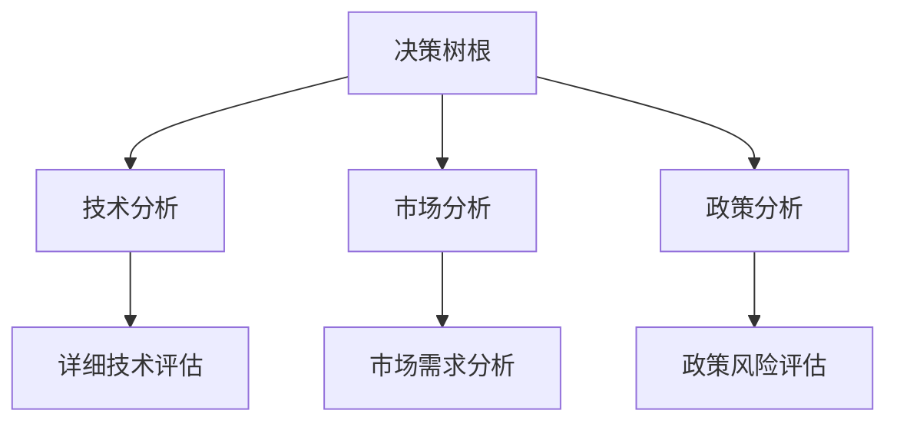

                 


# 芒格的"铁锤人综合征"警示在跨界科技投资中的应用

**关键词**：芒格、铁锤人综合征、跨界科技投资、认知偏差、风险管理、投资决策、系统架构

**摘要**：芒格的“铁锤人综合征”是一种投资者在决策过程中过度依赖单一思维模式而导致判断失误的现象。本文通过分析铁锤人综合征的核心概念、数学模型、系统架构及实际案例，揭示其在跨界科技投资中的潜在风险，并提供相应的防范策略和建议。

---

## 第1章：芒格的“铁锤人综合征”概述

### 1.1 铁锤人综合征的定义与背景

#### 1.1.1 铁锤人综合征的定义
芒格的“铁锤人综合征”是指投资者在决策时，因过度依赖单一思维方式或工具，导致无法全面分析问题，最终引发投资失误。这种综合征源于人类的认知偏差，常见于复杂决策场景。

#### 1.1.2 铁锤人综合征的背景与来源
芒格在投资实践中观察到，许多投资者倾向于使用单一的分析框架，忽视其他可能性，从而错失机会或蒙受损失。铁锤人综合征的名称来源于“铁锤”的隐喻——只用一种工具解决问题。

#### 1.1.3 铁锤人综合征与投资决策的关系
在投资中，铁锤人综合征可能导致投资者忽略市场变化、技术进步或潜在风险，从而做出错误的决策。

---

### 1.2 铁锤人综合征的核心概念

#### 1.2.1 铁锤人综合征的核心要素
- **单一思维模式**：投资者只关注某一领域或工具，忽视其他可能性。
- **认知偏差**：过度依赖已有的知识或经验，拒绝接受新信息。
- **决策失误**：因思维局限导致判断错误，影响投资结果。

#### 1.2.2 铁锤人综合征与投资决策的联系
- 铁锤人综合征会导致投资者在决策中缺乏全面性，容易忽视潜在风险。
- 这种综合征在科技投资中尤为危险，因为科技领域变化快，跨界投资需要多维度分析。

#### 1.2.3 铁锤人综合征的边界与外延
- **边界**：铁锤人综合征主要发生在决策者过度依赖单一方法或工具时。
- **外延**：涉及心理学、行为经济学和投资决策等多个领域。

---

## 第2章：跨界科技投资的基本原理

### 2.1 跨界科技投资的定义

#### 2.1.1 跨界科技投资的定义
跨界科技投资是指将不同领域的科技结合，例如人工智能与医疗、区块链与金融等。这种投资模式具有高风险和高回报的特点。

#### 2.1.2 跨界科技投资的特点
- **多样性**：涉及多个科技领域。
- **复杂性**：需要综合分析技术、市场和政策因素。
- **创新性**：跨界投资通常涉及新技术或新商业模式。

#### 2.1.3 跨界科技投资的分类
- **技术驱动型**：基于技术创新的投资。
- **市场驱动型**：基于市场需求的投资。
- **政策驱动型**：基于政策支持的投资。

---

## 第3章：铁锤人综合征对跨界科技投资的影响

### 3.1 铁锤人综合征的表现与影响

#### 3.1.1 铁锤人综合征在科技投资中的表现
- **过度依赖单一技术**：只关注某一技术，忽视其他技术的可能性。
- **忽略市场变化**：因技术专注而忽视市场动态。
- **决策失误**：因思维局限导致投资失败。

#### 3.1.2 铁锤人综合征对科技投资的影响
- **投资失败**：因单一思维导致技术或市场判断失误。
- **机会错失**：忽视其他领域的潜在机会。

#### 3.1.3 铁锤人综合征与投资失败的关联
- 投资者因过度依赖单一技术，无法适应快速变化的市场环境。

---

## 第4章：铁锤人综合征的核心概念与数学模型

### 4.1 铁锤人综合征的行为特征

#### 4.1.1 过度依赖单一思维模式
- **行为特征**：投资者倾向于使用单一方法解决问题，拒绝接受其他方法。

#### 4.1.2 投资决策的非理性倾向
- **非理性决策**：因认知偏差导致判断失误。

#### 4.1.3 风险认知的偏差
- **风险误判**：因思维局限导致风险评估不准确。

---

### 4.2 铁锤人综合征的心理学基础

#### 4.2.1 认知偏差与决策失误
- **确认偏误**：投资者倾向于寻找支持自己观点的信息，忽视反面证据。
- **过度自信**：因过度依赖单一方法而过于自信，忽视其他可能性。

#### 4.2.2 心理账户与投资决策
- **心理账户**：投资者将资金分配到不同账户，影响决策。

#### 4.2.3 社会认知与投资行为
- **社会影响**：投资者受他人行为影响，导致决策失误。

---

## 第5章：铁锤人综合征的数学模型与算法

### 5.1 铁锤人综合征的行为模型

#### 5.1.1 基于决策树的行为模型
- **决策树**：构建投资决策树，分析不同路径的可能性。

#### 5.1.2 基于概率的决策模型
- **概率模型**：计算不同决策的概率和收益。

#### 5.1.3 基于强化学习的投资行为模拟
- **强化学习**：通过不断试错，优化投资决策。

---

### 5.2 铁锤人综合征的数学公式

#### 5.2.1 风险-收益平衡公式
$$ \text{收益} = \text{概率} \times \text{收益} - \text{概率} \times \text{损失} $$

#### 5.2.2 投资决策树的构建与分析
使用Mermaid流程图展示决策树结构。

#### 5.2.3 基于马尔可夫链的投资行为模拟
- **马尔可夫链**：模拟投资过程中的状态转移。

---

## 第6章：系统分析与架构设计

### 6.1 系统分析

#### 6.1.1 问题场景介绍
- **问题场景**：投资者在跨界科技投资中因思维局限导致决策失误。

#### 6.1.2 项目介绍
- **项目目标**：构建一个基于多维度分析的科技投资系统。

---

### 6.2 系统架构设计

#### 6.2.1 领域模型
- **领域模型**：展示投资过程中的关键要素和关系。

#### 6.2.2 系统架构图
使用Mermaid架构图展示系统架构。

---

## 第7章：项目实战

### 7.1 环境安装

#### 7.1.1 系统需求
- **硬件需求**：推荐配置。
- **软件需求**：安装Python、Mermaid、Git等工具。

#### 7.1.2 安装步骤
- **安装Python**：使用Anaconda或Pyenv。
- **安装Mermaid**：安装Mermaid CLI和图形化工具。

---

### 7.2 系统核心实现

#### 7.2.1 核心代码实现
- **Python代码**：实现投资决策树的构建与分析。

#### 7.2.2 代码解读
- **代码功能**：展示决策树的构建过程和结果分析。

---

## 第8章：总结与建议

### 8.1 总结

#### 8.1.1 核心内容回顾
- **芒格的铁锤人综合征**：投资者因思维局限导致决策失误。
- **跨界科技投资**：需要多维度分析和风险管理。

#### 8.1.2 投资决策的启示
- **多元化思维**：避免过度依赖单一方法。
- **风险管理**：建立全面的风险评估机制。

### 8.2 小结

#### 8.2.1 投资策略建议
- **多维度分析**：结合技术、市场和政策因素。
- **持续学习**：保持对新技术和市场的敏感性。

#### 8.2.2 注意事项
- **避免铁锤人综合征**：定期反思和调整投资策略。
- **专业团队合作**：借助团队力量进行决策。

---

## 第9章：拓展阅读

### 9.1 推荐书籍

#### 9.1.1 《巴菲特和芒格的智慧》
- 作者：查理·芒格
- 内容：芒格的投资理念和决策智慧。

#### 9.1.2 《跨界思维》
- 作者：张维迎
- 内容：跨领域投资的策略与方法。

### 9.2 相关研究

#### 9.2.1 行为经济学研究
- **研究领域**：认知偏差与决策行为。
- **研究方法**：实验研究和理论分析。

#### 9.2.2 科技投资研究
- **研究领域**：科技领域的投资策略与风险评估。

---

## 附录：工具与资源

### 附录A：Python代码示例

```python
import graphviz

def build_decision_tree():
    dot = graphviz.Digraph()
    dot.node('root', '决策树根')
    dot.node('node1', '技术分析')
    dot.node('node2', '市场分析')
    dot.node('node3', '政策分析')
    dot.edge('root', 'node1')
    dot.edge('root', 'node2')
    dot.edge('root', 'node3')
    return dot

tree = build_decision_tree()
tree.view()
```

### 附录B：Mermaid流程图



---

## 结语

芒格的“铁锤人综合征”警示我们在科技投资中需要保持清醒的头脑，避免因思维局限而导致决策失误。通过系统分析、多元化思维和持续学习，我们可以更好地应对跨界科技投资中的挑战。

