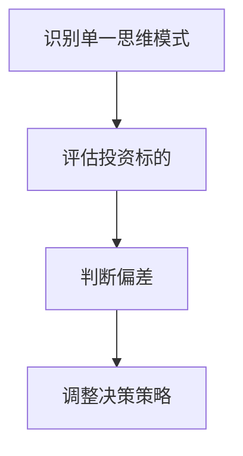
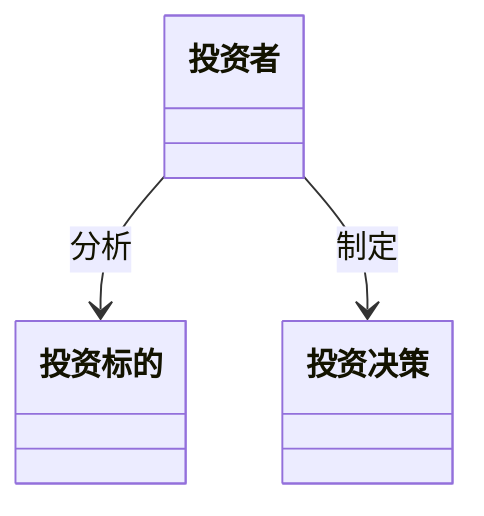

                 

# 目录大纲：芒格的"铁锤人综合征"警示在跨维度科技投资中的应用

---

## 关键词：
1. 芒格铁锤人综合征
2. 科技投资
3. 跨维度投资
4. 投资决策
5. 心理偏差
6. 系统架构

---

## 摘要：
芒格的"铁锤人综合征"是一种认知偏差，表现为用单一思维模式解决问题，导致投资决策失误。本文通过系统分析，探讨该综合征在跨维度科技投资中的表现、成因及应对策略，结合实际案例和系统架构设计，提出解决方案和最佳实践。

---

# 第一部分：芒格的"铁锤人综合征"概述

## 第1章：铁锤人综合征的定义与背景

### 1.1 铁锤人综合征的定义
- **问题背景**：铁锤人综合征的起源与芒格的观察。
- **核心概念**：单一思维模式的特点。
- **在投资中的表现**：过度依赖单一投资策略。

### 1.2 铁锤人综合征的背景介绍
- **问题背景**：科技投资的复杂性。
- **问题描述**：投资者认知偏差的具体表现。
- **边界与外延**：铁锤人综合征的适用范围。

## 第2章：铁锤人综合征的核心概念与联系

### 2.1 核心概念的原理分析
- **原理分析**：单一思维模式的形成机制。
- **特征对比**：与其他认知偏差的对比分析。
- **ER实体关系图**：铁锤人综合征与投资决策的关系。

## 第3章：铁锤人综合征的算法原理

### 3.1 算法原理的数学模型
- **数学模型**：概率论在投资决策中的应用。
- **公式推导**：$P(错误决策) = \frac{单一思维模式的使用频率}{总决策数}$。

### 3.2 算法原理的mermaid流程图

## 第4章：系统分析与架构设计方案

### 4.1 问题场景介绍
- **投资决策中的问题**：如何避免单一思维模式。
- **跨维度科技投资的复杂性**：多因素分析的需求。

### 4.2 系统功能设计
- **领域模型mermaid类图**：

## 第5章：项目实战

### 5.1 环境安装与配置
- **投资分析工具的安装**：Python、Pandas、NumPy。
- **数据收集与处理工具的安装**：SQL、Jupyter Notebook。

### 5.2 系统核心实现
- **铁锤人综合征识别算法的实现**：Python代码示例。
- **跨维度科技投资决策系统的实现**：数据处理与分析。

### 5.3 代码应用解读与分析
- **核心算法的代码解读**：如何检测单一思维模式。
- **系统功能的代码实现**：如何优化投资决策。

### 5.4 实际案例分析
- **铁锤人综合征在实际投资中的案例**：某投资者的决策失误分析。
- **跨维度科技投资决策的案例**：成功应用铁锤人综合征识别的案例。

---

## 第二部分：最佳实践与小结

### 6.1 小结
- **核心内容回顾**：芒格铁锤人综合征的核心概念。
- **系统架构的应用**：如何构建有效的投资决策系统。

### 6.2 注意事项
- **铁锤人综合征的隐蔽性**：如何避免自我欺骗。
- **数据驱动决策的重要性**：如何利用数据优化投资策略。

### 6.3 拓展阅读
- **推荐书籍**：芒格的其他著作。
- **相关论文**：行为金融学中的认知偏差研究。

---

# 第三部分：总结与展望

## 第7章：总结与展望

### 7.1 总结
- **本文的核心观点**：芒格铁锤人综合征在科技投资中的危害与应对策略。
- **系统架构的价值**：如何通过系统化方法避免认知偏差。

### 7.2 展望
- **未来研究方向**：如何利用人工智能优化投资决策。
- **技术进步的影响**：大数据和AI在投资中的应用前景。

---

## 附录

### 附录A：常用工具安装指南
- **Python安装**：Anaconda的使用。
- **数据处理工具安装**：SQLAlchemy的配置。

### 附录B：关键术语解释
- **铁锤人综合征**：定义与影响。
- **跨维度投资**：多维度分析的重要性。

### 附录C：参考文献
- **书籍**：芒格的相关著作。
- **论文**：行为金融学研究文献。

---

通过以上目录，本文将系统地分析芒格的"铁锤人综合征"在科技投资中的表现，结合实际案例和系统架构设计，为投资者提供避免认知偏差的实践指导。

