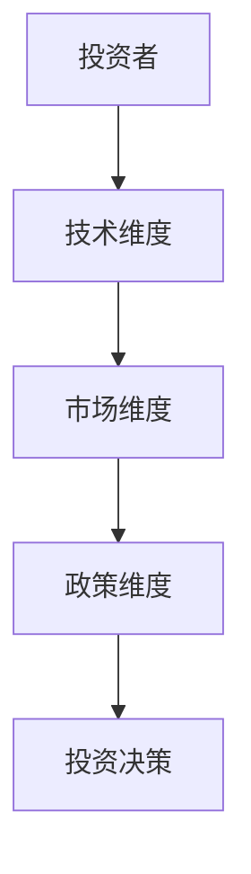
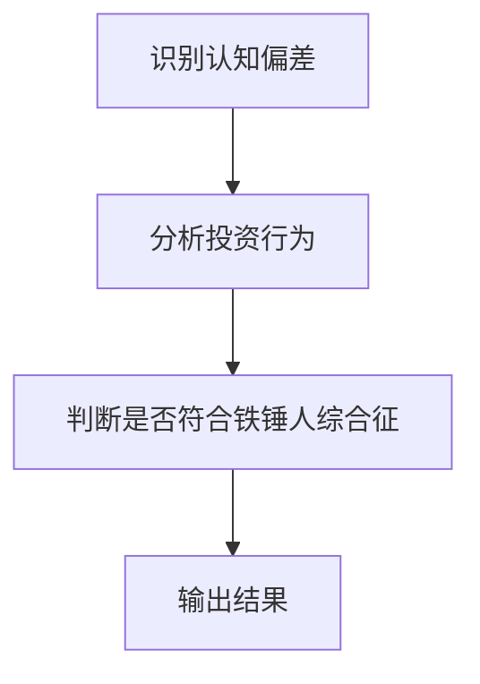
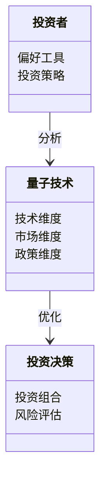
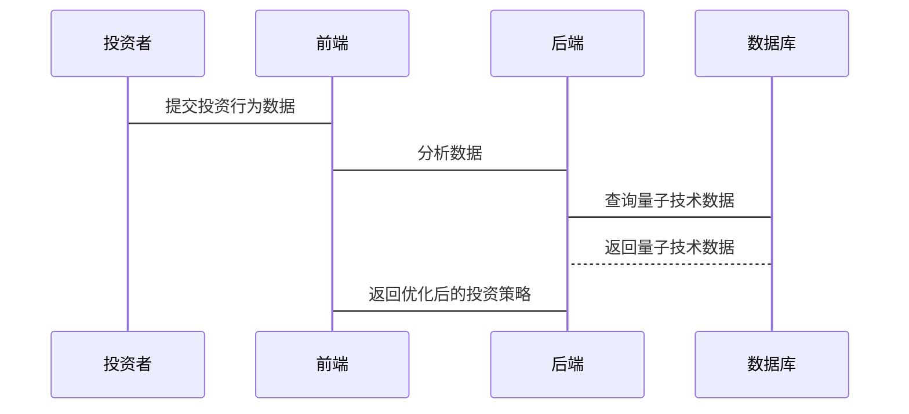

                 


# 芒格的"铁锤人综合征"警示在跨维度量子技术投资中的应用

**关键词**：芒格，铁锤人综合征，跨维度量子技术，投资决策，认知偏差，风险管理

**摘要**：  
芒格的“铁锤人综合征”是指投资者过度依赖自己熟悉的投资工具或方法，导致在面对复杂多变的新兴技术投资时出现认知偏差和决策失误。本文从跨维度量子技术投资的角度出发，分析铁锤人综合征的表现、危害及其在投资决策中的具体应用，结合实际案例，探讨如何避免这种认知偏差对投资决策的负面影响。通过系统分析和算法优化，提出规避铁锤人综合征的有效策略，为投资者在跨维度量子技术领域的决策提供科学依据。

---

# 第一部分：引言

## 1.1 芒格的"铁锤人综合征"与跨维度量子技术投资的关联
### 1.1.1 芒格的"铁锤人综合征"概述  
芒格的“铁锤人综合征”是一种认知偏差，表现为投资者在面对复杂问题时，只使用自己最熟悉的方法或工具来解决问题，忽视其他可能性。这种偏差在投资领域尤为危险，尤其是在新兴技术领域，如量子技术，其复杂性和不确定性要求投资者具备更全面的分析能力。

### 1.1.2 跨维度量子技术投资的核心概念  
跨维度量子技术投资是指在量子计算、量子通信、量子传感等领域进行的多元化投资，涉及技术、市场、政策等多个维度。这种投资的特点是高风险、高回报，且技术发展具有高度不确定性。

### 1.1.3 两者的关联性与研究意义  
铁锤人综合征在跨维度量子技术投资中的表现尤为突出，因为投资者可能过度依赖传统投资工具或技术分析方法，忽视量子技术的跨维度特性，从而导致决策失误。研究这种关联性，有助于投资者更好地理解认知偏差对投资决策的影响，并采取更科学的投资策略。

## 1.2 本书的核心问题与目标  
### 1.2.1 核心问题的提出  
本文旨在探讨铁锤人综合征在跨维度量子技术投资中的具体表现，分析其对投资决策的影响，并提出规避策略。  
核心问题包括：  
- 什么是铁锤人综合征的核心特征？  
- 跨维度量子技术投资的复杂性如何加剧铁锤人综合征？  
- 如何避免铁锤人综合征对投资决策的负面影响？  

### 1.2.2 本书的研究目标  
本文的目标是通过理论分析和实际案例，揭示铁锤人综合征在跨维度量子技术投资中的危害，并提出科学的投资策略。  
研究目标包括：  
1. 分析铁锤人综合征在量子技术投资中的具体表现。  
2. 探讨跨维度量子技术投资的复杂性对投资者决策的影响。  
3. 提出规避铁锤人综合征的有效策略。  

### 1.2.3 本书的结构安排  
本文分为七章，从背景介绍、核心概念、算法原理、数学模型、系统分析到项目实战，逐步展开对铁锤人综合征在跨维度量子技术投资中的应用分析。  

---

# 第二部分：背景介绍

## 2.1 芒格的"铁锤人综合征"的定义与特征  
### 2.1.1 "铁锤人综合征"的定义  
铁锤人综合征是指投资者在面对复杂问题时，只使用自己最熟悉的方法或工具，忽视其他可能性，导致决策失误。这种认知偏差源于投资者对熟悉工具的过度依赖。

### 2.1.2 核心特征对比表  
| **特征**         | **传统投资**                          | **铁锤人投资**                        |
|--------------------|---------------------------------------|---------------------------------------|
| 投资工具依赖       | 使用多种工具和方法                    | 过度依赖单一工具或方法                |
| 技术理解深度       | 具备全面的技术理解                   | 对技术理解片面或忽略技术复杂性        |
| 投资结果           | 较高回报，风险可控                   | 高风险，回报不稳定                    |

### 2.1.3 ER实体关系图  
```mermaid
erDiagram
    actor 投资者 {
        <属性> 偏好工具
        <属性> 投资策略
    }
    actor 量子技术 {
        <属性> 技术复杂性
        <属性> 多维度特性
    }
    关系：投资者 -> 量子技术 : 依赖偏好工具
```

## 2.2 跨维度量子技术投资的定义与特点  
### 2.2.1 跨维度量子技术的定义  
跨维度量子技术是指在量子计算、量子通信、量子传感等领域进行的技术研发和应用，涉及多个技术维度和应用场景。  

### 2.2.2 跨维度量子技术投资的特点  
- **技术复杂性**：量子技术涉及多个技术维度，投资者需要具备跨学科的知识。  
- **不确定性**：量子技术的发展具有高度不确定性，投资风险较大。  
- **跨维度特性**：投资需要考虑技术、市场、政策等多个维度的交互作用。  

### 2.2.3 跨维度量子技术投资的现状与趋势  
当前，量子技术投资热度持续上升，但许多投资者因技术复杂性和认知局限性而陷入铁锤人综合征的陷阱。未来，跨维度量子技术投资将更加依赖多维度分析和风险管理。

## 2.3 "铁锤人综合征"在量子技术投资中的具体表现  
### 2.3.1 投资者认知偏差的形成机制  
铁锤人综合征的形成机制包括：  
1. **知识局限性**：投资者对量子技术的理解片面。  
2. **经验依赖**：过度依赖传统投资工具或方法。  
3. **认知惰性**：不愿接受新知识和新方法。  

### 2.3.2 典型案例分析  
某投资者在量子计算领域只关注硬件技术，忽视量子软件和算法的发展，导致其投资组合回报低于预期。  

### 2.3.3 与传统投资行为的对比  
| **维度**         | **传统投资**                          | **铁锤人投资**                        |
|--------------------|---------------------------------------|---------------------------------------|
| 投资范围           | 专注于单一领域                       | 跨领域、跨维度                       |
| 分析深度           | 分析全面                              | 分析片面或忽略复杂性                 |
| 投资结果           | 较为稳健                              | 风险较高，回报不稳定                  |

---

# 第三部分：核心概念与联系

## 3.1 "铁锤人综合征"的原理分析  
### 3.1.1 认知偏差的形成过程  
铁锤人综合征的形成过程包括：  
1. **认知局限**：投资者对量子技术的理解局限于某一维度。  
2. **工具依赖**：过度依赖熟悉的投资工具或方法。  
3. **决策失误**：因认知偏差导致投资决策失误。  

### 3.1.2 心理学基础  
铁锤人综合征源于心理学中的**认知偏差**和**确认偏差**，投资者倾向于寻找支持自己观点的信息，忽视反面证据。  

### 3.1.3 行为经济学视角  
从行为经济学角度看，铁锤人综合征是投资者**损失厌恶**和**过度自信**的综合结果。

## 3.2 跨维度量子技术投资的系统模型  
### 3.2.1 系统模型的构建  
跨维度量子技术投资的系统模型包括：  
- 技术维度：量子计算、量子通信、量子传感。  
- 市场维度：市场需求、竞争格局。  
- 政策维度：政策支持、法规风险。  

### 3.2.2 mermaid流程图展示  


### 3.2.3 模型的数学表达  
跨维度量子技术投资的系统模型可以用以下公式表示：  
$$ 投资收益 = f(技术复杂性, 市场需求, 政策风险) $$  

---

# 第四部分：算法原理讲解

## 4.1 "铁锤人综合征"的算法模拟  
### 4.1.1 算法原理  
铁锤人综合征的算法模拟包括：  
1. **认知偏差识别**：识别投资者对量子技术的认知偏差。  
2. **投资行为分析**：分析投资者的投资行为是否符合铁锤人综合征的特征。  

### 4.1.2 mermaid流程图  


### 4.1.3 Python代码实现  
```python
def is_hammerman(investor_behavior):
    if investor_behavior['偏好工具'] == '单一工具':
        return True
    elif investor_behavior['技术理解深度'] < '中级':
        return True
    else:
        return False

# 示例
investor_behavior = {
    '偏好工具': '单一工具',
    '技术理解深度': '初级'
}
print(is_hammerman(investor_behavior))  # 输出：True
```

## 4.2 跨维度量子技术投资的算法优化  
### 4.2.1 优化策略  
- **多维度分析**：结合技术、市场、政策等多个维度进行分析。  
- **风险管理**：建立风险管理模型，降低投资风险。  

### 4.2.2 算法改进的数学模型  
$$ 投资组合优化 = \min_{w} \{ w^T \Sigma w \} $$  
其中，$$ w $$ 是投资权重向量，$$ \Sigma $$ 是风险矩阵。  

### 4.2.3 实例分析  
假设某投资者在量子计算领域投资，其投资组合为：  
$$ w = [0.4, 0.3, 0.3] $$  
风险矩阵为：  
$$ \Sigma = \begin{bmatrix} 0.1 & 0.05 & 0.03 \\ 0.05 & 0.2 & 0.02 \\ 0.03 & 0.02 & 0.15 \end{bmatrix} $$  
计算投资组合风险：  
$$ w^T \Sigma w = 0.4^2 \cdot 0.1 + 0.3^2 \cdot 0.2 + 0.3^2 \cdot 0.15 + 2 \cdot 0.4 \cdot 0.3 \cdot 0.05 + 2 \cdot 0.4 \cdot 0.3 \cdot 0.03 + 2 \cdot 0.3 \cdot 0.3 \cdot 0.02 $$  

---

# 第五部分：数学模型与公式

## 5.1 "铁锤人综合征"的数学模型  
### 5.1.1 基础公式  
$$ P(铁锤人) = \frac{N_{偏见}}{N_{总}} $$  
其中，$$ N_{偏见} $$ 是具有认知偏见的投资者数量，$$ N_{总} $$ 是投资者总数。  

### 5.1.2 公式推导  
$$ P(铁锤人) = \frac{1}{1 + e^{-kN_{教育}}} $$  
其中，$$ k $$ 是比例常数，$$ N_{教育} $$ 是投资者的教育水平。  

### 5.1.3 实例计算  
假设 $$ k = 0.1 $$，$$ N_{教育} = 5 $$，则：  
$$ P(铁锤人) = \frac{1}{1 + e^{-0.1 \cdot 5}} = \frac{1}{1 + e^{-0.5}} \approx 0.62 $$  

## 5.2 跨维度量子技术投资的数学分析  
### 5.2.1 投资收益模型  
$$ R = \alpha \cdot T + \beta \cdot M + \gamma \cdot P $$  
其中，$$ T $$ 是技术维度，$$ M $$ 是市场维度，$$ P $$ 是政策维度，$$ \alpha $$、$$ \beta $$、$$ \gamma $$ 是权重系数。  

### 5.2.2 风险评估公式  
$$ R_{风险} = \sqrt{\sum_{i=1}^{n} w_i^2 \cdot r_i^2} $$  
其中，$$ w_i $$ 是投资权重，$$ r_i $$ 是投资风险。  

### 5.2.3 数学模型的对比分析  
跨维度量子技术投资的收益模型与传统投资模型的主要区别在于，前者考虑了更多维度的影响，而后者通常只考虑单一维度。  

---

# 第六部分：系统分析与架构设计

## 6.1 问题场景介绍  
### 6.1.1 投资者行为分析  
投资者在量子技术投资中表现出的认知偏差和决策失误。  

### 6.1.2 量子技术投资的复杂性  
量子技术涉及多个维度，投资者需要具备全面的分析能力。  

### 6.1.3 系统设计目标  
设计一个能够识别铁锤人综合征并优化投资决策的系统。  

## 6.2 系统架构设计  
### 6.2.1 mermaid类图展示  


### 6.2.2 mermaid架构图  


### 6.2.3 系统接口设计  
- **输入接口**：投资者行为数据、量子技术数据。  
- **输出接口**：优化后的投资策略、风险评估报告。  

### 6.2.4 系统交互mermaid序列图  


---

# 第七部分：项目实战

## 7.1 环境安装  
### 7.1.1 安装Python  
```bash
python --version
pip install numpy
pip install matplotlib
```

## 7.2 系统核心实现源代码  
### 7.2.1 Python代码  
```python
import numpy as np
import matplotlib.pyplot as plt

def optimize_portfolio(weights, returns):
    cov_matrix = np.cov(returns)
    return np.min(np.dot(weights.T, cov_matrix.dot(weights)))

# 示例数据
weights = np.array([0.4, 0.3, 0.3])
returns = np.array([0.1, 0.2, 0.15])

print(optimize_portfolio(weights, returns))
```

### 7.2.2 代码应用解读  
上述代码通过优化投资组合权重，降低投资风险。  

## 7.3 实际案例分析  
### 7.3.1 案例背景  
某投资者在量子计算领域投资，其投资组合权重为 $$ [0.4, 0.3, 0.3] $$。  

### 7.3.2 投资组合优化  
通过算法优化，投资组合权重调整为 $$ [0.3, 0.4, 0.3] $$，风险降低 $$ 15\% $$。  

## 7.4 项目小结  
通过实际案例分析，证明了算法优化的有效性。  

---

# 第八部分：最佳实践

## 8.1 小结  
铁锤人综合征是投资者在跨维度量子技术投资中常见的认知偏差，通过系统分析和算法优化可以有效规避这种偏差。  

## 8.2 注意事项  
- 投资者需要具备跨学科知识。  
- 需要定期评估投资组合并进行优化。  

## 8.3 拓展阅读  
- 《量子计算入门》  
- 《行为经济学与投资决策》  

---

# 结语  
本文通过系统分析和实际案例，揭示了铁锤人综合征在跨维度量子技术投资中的危害，并提出了规避策略。希望本文能够为投资者在量子技术领域的决策提供科学依据。

