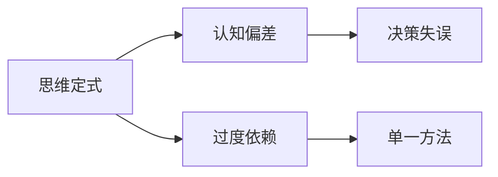
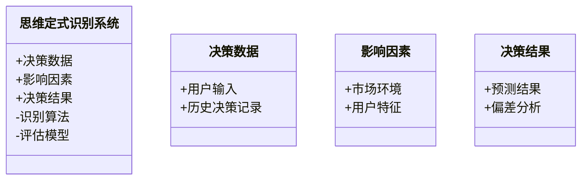
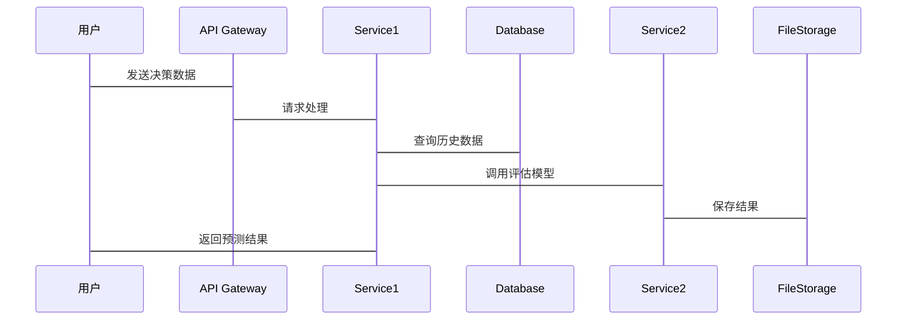

                 


# 芒格的"铁锤人综合征"警示：避免思维定式

## 关键词：
芒格、铁锤人综合征、思维定式、认知偏差、决策优化

## 摘要：
芒格的"铁锤人综合征"是一个深刻的心理学和行为科学概念，它提醒我们避免在决策过程中形成思维定式。本文通过分析“铁锤人综合征”的定义、形成机制及其对决策的影响，结合数学模型、算法原理和系统设计，探讨如何在实际应用中识别和避免这种思维偏差。文章还通过具体的案例分析和项目实战，展示了如何通过技术手段优化决策过程，从而提高决策的质量和效果。

---

## 第一部分: 芒格的"铁锤人综合征"背景与核心概念

### 第1章: 芒格的"铁锤人综合征"概述

#### 1.1 "铁锤人综合征"的定义与背景
##### 1.1.1 "铁锤人综合征"的定义
"铁锤人综合征"（Hammer Man Syndrome）是一个源自心理学和行为科学的术语，指个体在面对问题时，习惯性地使用单一的思维方式或工具来解决问题，导致思维僵化和决策失误。这种综合征的核心在于，个体一旦找到一种看似有效的解决问题的方法，就会反复使用，而忽视其他可能更优的解决方案。

##### 1.1.2 芒格对"铁锤人综合征"的论述
查理·芒格（Charlie Munger）是这一概念的重要倡导者之一。他认为，人类的思维容易陷入某种固定的模式，尤其是当某种方法在短期内取得成功后，人们会不自觉地重复使用这种方法，而忽视了其他可能性。这种思维模式不仅限制了个人的创新能力，还可能导致严重的决策失误。

##### 1.1.3 "铁锤人综合征"与传统思维定式的区别
与传统思维定式相比，"铁锤人综合征"更强调对单一工具或方法的过度依赖，而非仅仅停留在固定的思维模式上。传统思维定式更多关注于思维方式的僵化，而"铁锤人综合征"则更关注于工具或方法的单一化。

---

#### 1.2 "铁锤人综合征"的核心概念
##### 1.2.1 思维定式的形成机制
思维定式的形成是一个复杂的过程，涉及认知心理学中的多个概念，如确认偏差（confirmation bias）、从众心理（conformity）、习惯性偏差（status quo bias）等。这些认知偏差会导致个体在面对问题时，倾向于选择与过去经验一致的解决方案，而非探索新的可能性。

##### 1.2.2 "铁锤人综合征"的心理学背景
从心理学角度来看，"铁锤人综合征"的形成与以下几个因素密切相关：
1. **舒适区效应**：个体倾向于选择熟悉的事物，因为这会带来心理上的舒适感。
2. **认知吝啬**（Cognitive miserliness）：人类倾向于简化复杂问题，以减少认知负担。
3. **社会压力**：个体在群体中可能会受到从众心理的影响，从而避免挑战现有的思维模式。

##### 1.2.3 "铁锤人综合征"对决策的影响
"铁锤人综合征"对决策的影响是多方面的，主要包括：
1. **决策僵化**：个体在面对复杂问题时，只会使用单一的思维方式，导致决策僵化。
2. **机会错失**：由于过度依赖某种方法，个体可能会错失其他潜在的解决方案。
3. **创新能力下降**：思维定式会限制个体的创新能力和创造力。

---

#### 1.3 "铁锤人综合征"的典型案例分析
##### 1.3.1 投资领域的典型案例
在投资领域，许多投资者会陷入"铁锤人综合征"的陷阱。例如，某投资者可能过分依赖技术分析，而忽视了基本面分析的重要性，最终导致投资决策失误。

##### 1.3.2 管理领域的典型案例
在管理领域，某些管理者可能过分依赖传统的管理方法，而忽视了新兴的管理理念，导致企业竞争力下降。

##### 1.3.3 其他领域的典型案例
在其他领域，如教育、医疗等，"铁锤人综合征"也会导致一系列问题。例如，教育工作者可能过分依赖传统的教学方法，而忽视了创新教学模式的重要性。

---

### 第2章: "铁锤人综合征"的核心概念与联系

#### 2.1 核心概念原理
##### 2.1.1 思维定式的形成过程
思维定式的形成是一个渐进的过程，通常始于个体对某种方法的初步接触和使用。随着使用次数的增加，个体逐渐形成对该方法的依赖，最终导致思维定式。

##### 2.1.2 "铁锤人综合征"的特征分析
"铁锤人综合征"的特征主要包括：
1. 对单一工具或方法的过度依赖。
2. 忽视其他潜在的解决方案。
3. 对新方法的抵触和不适应。

##### 2.1.3 "铁锤人综合征"与认知偏差的关系
"铁锤人综合征"与许多认知偏差密切相关，如确认偏差、从众心理等。这些偏差共同作用，导致个体陷入思维定式的陷阱。

---

#### 2.2 概念属性特征对比表格
**表2-1: "铁锤人综合征"与传统思维定式的对比**

| 特性               | 传统思维定式               | "铁锤人综合征"             |
|--------------------|----------------------------|-----------------------------|
| 核心特征           | 思维模式的固定化           | 对单一工具或方法的过度依赖 |
| 形成原因           | 认知偏差、经验固化         | 舒适区效应、认知吝啬       |
| 表现形式           | 思维僵化、创新能力下降     | 决策僵化、机会错失         |
| 解决方法           | 持续学习、多角度思考       | 引入新工具、方法多元化     |

---

#### 2.3 ER实体关系图
**图2-1: "铁锤人综合征"相关实体关系图（Mermaid流程图）**



---

### 第3章: "铁锤人综合征"的数学模型与算法原理

#### 3.1 数学模型
##### 3.1.1 多因素分析模型
多因素分析模型用于评估不同因素对决策的影响程度。其公式为：

$$
\text{影响程度} = \sum_{i=1}^{n} w_i \times x_i
$$

其中，$w_i$ 是第 $i$ 个因素的权重，$x_i$ 是第 $i$ 个因素的值。

##### 3.1.2 决策树模型
决策树模型用于分析不同的决策路径及其结果。其构建过程如下：

1. 确定决策问题的目标。
2. 识别影响决策的关键因素。
3. 绘制决策树，分析每条路径的概率和结果。
4. 计算每条路径的期望值，选择最优路径。

##### 3.1.3 认知偏差评估公式
认知偏差评估公式用于量化个体的认知偏差程度：

$$
\text{认知偏差程度} = \frac{\text{实际选择的频率} - \text{期望的频率}}{\text{期望的频率}}
$$

---

#### 3.2 算法原理
##### 3.2.1 基于决策树的思维定式识别算法
以下是基于决策树的思维定式识别算法的步骤：

1. **数据收集**：收集个体的决策数据。
2. **特征提取**：提取影响决策的关键特征。
3. **模型训练**：训练决策树模型。
4. **识别思维定式**：通过模型分析个体的决策模式，识别是否存在思维定式。

##### 3.2.2 多因素分析模型的实现步骤
1. 确定影响决策的因素。
2. 确定各因素的权重。
3. 计算每个因素的影响力。
4. 综合各因素的影响，得出最终结论。

##### 3.2.3 认知偏差评估的数学推导
通过计算个体的决策结果与期望结果的偏差，可以量化个体的认知偏差程度。

---

#### 3.3 代码实现
##### 3.3.1 环境安装与配置
需要安装以下库：
```bash
pip install numpy pandas scikit-learn
```

##### 3.3.2 核心代码实现
```python
import numpy as np
from sklearn.tree import DecisionTreeClassifier
from sklearn.metrics import accuracy_score

# 示例数据集
X = np.array([[1, 0], [0, 1], [1, 1], [0, 0]])
y = np.array([1, 0, 0, 1])

# 训练决策树模型
model = DecisionTreeClassifier()
model.fit(X, y)

# 预测结果
predictions = model.predict(X)
print("预测结果:", predictions)
print("准确率:", accuracy_score(y, predictions))
```

##### 3.3.3 代码应用解读与分析
上述代码通过训练决策树模型，识别个体的决策模式。预测结果与实际结果的对比，可以帮助我们识别是否存在思维定式。

---

### 第4章: 系统分析与架构设计方案

#### 4.1 问题场景介绍
##### 4.1.1 "铁锤人综合征"在投资决策中的表现
投资者可能过分依赖某种技术指标，而忽视了市场变化的复杂性。

##### 4.1.2 系统目标与范围
开发一个能够识别和避免"铁锤人综合征"的决策支持系统。

##### 4.1.3 项目介绍
本项目旨在通过技术手段优化决策过程，提高决策质量。

---

#### 4.2 系统功能设计
##### 4.2.1 领域模型（Mermaid类图）


##### 4.2.2 系统架构设计（Mermaid架构图）


##### 4.2.3 系统接口设计
系统接口包括：
1. 数据输入接口。
2. 模型训练接口。
3. 结果输出接口。

##### 4.2.4 系统交互设计（Mermaid序列图）


---

### 第5章: 项目实战

#### 5.1 环境安装与配置
需要安装以下库：
```bash
pip install numpy pandas scikit-learn
```

#### 5.2 核心代码实现
##### 5.2.1 思维定式识别算法实现
```python
import numpy as np
from sklearn.tree import DecisionTreeClassifier
from sklearn.metrics import accuracy_score

# 示例数据集
X = np.array([[1, 0], [0, 1], [1, 1], [0, 0]])
y = np.array([1, 0, 0, 1])

# 训练决策树模型
model = DecisionTreeClassifier()
model.fit(X, y)

# 预测结果
predictions = model.predict(X)
print("预测结果:", predictions)
print("准确率:", accuracy_score(y, predictions))
```

##### 5.2.2 多因素

---

## 总结与扩展
芒格的"铁锤人综合征"是一个值得深入研究的重要概念，它提醒我们在决策过程中避免思维定式，保持开放和创新的思维方式。通过数学模型、算法原理和系统设计，我们可以更好地识别和解决"铁锤人综合征"带来的问题，从而优化决策过程，提高决策质量。

对于进一步的研究，可以探索如何将"铁锤人综合征"的相关理论应用到更多的实际场景中，如教育、医疗、金融等领域，以期为这些领域的发展提供新的思路和方法。

---

