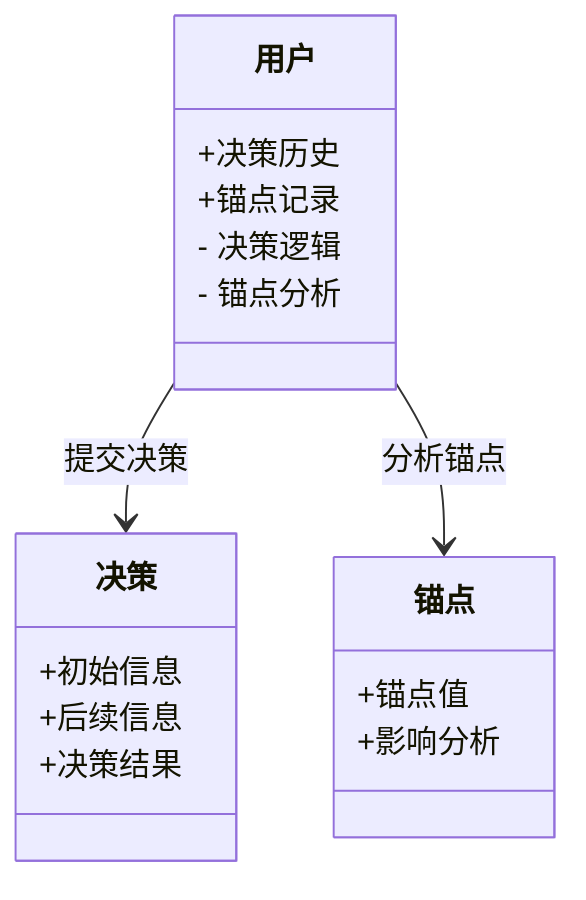
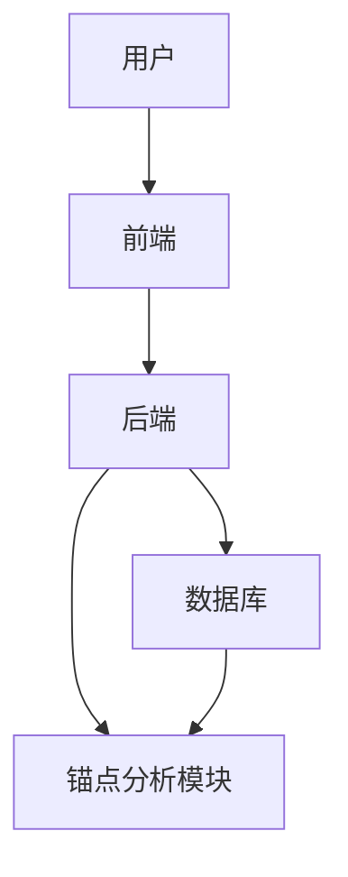

                 


# 芒格的"锚定效应"警示：避免固有思维陷阱

> **关键词**：芒格、锚定效应、认知偏差、决策智慧、独立思考、多元思维模型  
> **摘要**：本文将探讨芒格的“锚定效应”概念，分析其在决策中的影响，并结合实际案例，提供如何避免固有思维陷阱的策略。通过深入分析心理学原理和算法模型，结合系统架构设计，为读者提供实用的决策优化方法。

---

## 第一部分：引言

### 第1章：芒格的“锚定效应”与思维陷阱

#### 1.1 芒格的生平与思想
- **芒格的生平简介**  
  查理·芒格（Charlie Munger）是世界著名投资家、伯克希尔哈撒韦公司副董事长，以其独特的投资理念和决策智慧闻名。他强调“多元思维模型”和独立思考的重要性。
  
- **芒格的决策智慧**  
  芒格在投资和生活中始终坚持理性决策，强调避免认知偏差和情绪化判断。

- **芒格与“锚定效应”的关联**  
  芒格的思想为理解锚定效应提供了重要的心理学背景，特别是在投资决策中，锚定效应常导致错误判断。

#### 1.2 “锚定效应”的定义与背景
- **什么是“锚定效应”**  
  锚定效应（Anchoring Effect）是心理学中的一个基本概念，指人们在决策时会过度依赖某个初始信息或“锚点”，导致判断失误。

- **锚定效应的发现与研究**  
  该效应最早由心理学家丹尼尔·卡尼曼（Daniel Kahneman）和阿莫斯·特维斯（Amos Tversky）提出，通过实验研究发现人们在决策时容易受到初始信息的影响。

- **锚定效应在现实中的表现**  
  锚定效应广泛存在于投资、商业决策、谈判等领域，常导致非理性决策。

#### 1.3 本文的核心目标
- **避免思维陷阱的重要性**  
  锚定效应是认知偏差的一种，如果不加以识别和克服，将严重影响决策质量。

- **如何通过芒格的思想克服锚定效应**  
  芒格的“多元思维模型”和独立思考原则为我们提供了解决锚定效应的有效方法。

- **本文的结构与内容概述**  
  本文将从心理学原理、算法模型、系统架构设计、项目实战等多方面展开，全面解析锚定效应及其应对策略。

---

## 第二部分：锚定效应的核心概念

### 第2章：锚定效应的定义与类型

#### 2.1 锚定效应的定义与类型
- **定义**  
  锚定效应是指人们在决策时，过度依赖某个初始信息或“锚点”，从而影响后续判断。

- **类型**  
  - 初始锚定：基于第一个信息点的锚定。
  - 参照锚定：基于外部参照点的锚定。
  - 情境锚定：基于当前情境的锚定。

- **影响因素**  
  初始信息的强度、个体认知风格、情境复杂性等。

#### 2.2 锚定效应的心理学原理
- **认知偏差的基本概念**  
  认知偏差是人们在信息处理过程中产生的系统性错误，锚定效应是其中一种典型偏差。

- **锚定效应与认知偏差的关系**  
  锚定效应是认知偏差的一种，常与其他偏差（如确认偏差）交织影响决策。

- **心理机制**  
  人们倾向于快速决策，导致对初始信息的过度依赖，忽略后续信息的调整。

#### 2.3 锚定效应的识别与分析
- **识别方法**  
  - 确认初始信息的影响。
  - 分析决策中是否过度依赖某个点。
  - 检查决策是否符合实际情况。

- **常见表现形式**  
  - 投资中对初始成本的过度关注。
  - 商业谈判中对初始报价的固守。

- **案例分析**  
  某公司CEO在谈判中坚持初始报价，拒绝调整，导致交易失败。

---

## 第三部分：芒格的决策智慧与思维框架

### 第3章：芒格的决策智慧

#### 3.1 独立思考的原则
- **独立思考的定义**  
  不受外界干扰，基于事实和逻辑做出决策。

- **独立思考的重要性**  
  能够避免锚定效应，做出更理性的判断。

- **如何培养独立思考**  
  - 多角度分析问题。
  - 避免从众心理。

#### 3.2 多元思维模型
- **多元思维模型的定义**  
  通过多个学科的视角分析问题，避免单一维度的思维。

- **多元思维模型的优势**  
  能够全面分析问题，避免锚定效应的影响。

- **芒格的实践案例**  
  在投资中，芒格通过经济学、心理学等多学科视角分析企业价值。

#### 3.3 如何避免锚定陷阱
- **避免锚定陷阱的策略**  
  - 重新审视初始信息。
  - 引入新的信息点。
  - 通过讨论和反馈调整决策。

---

## 第四部分：现实中的锚定效应案例分析

### 第4章：商业与投资中的锚定效应

#### 4.1 商业决策中的锚定效应
- **案例分析：某公司并购案**  
  并购方因初始估值过高，忽视目标公司的真实价值，导致并购失败。

- **影响分析**  
  锚定效应导致决策者忽视市场变化，错失调整机会。

#### 4.2 投资中的锚定效应
- **案例分析：投资者的买入成本锚定**  
  投资者因买入成本过低，坚持高点卖出，错失收益。

- **避免策略**  
  定期评估投资逻辑，避免被初始成本束缚。

---

## 第五部分：系统架构设计与算法实现

### 第5章：系统分析与架构设计

#### 5.1 问题场景介绍
- **场景描述**  
  设计一个决策辅助系统，帮助用户识别锚定效应。

#### 5.2 系统功能设计
- **领域模型设计**  
  使用Mermaid绘制类图，展示用户、决策、锚点等核心要素。



#### 5.3 系统架构设计
- **架构设计**  
  使用Mermaid绘制系统架构图，展示前端、后端、数据库的交互。



---

## 第六部分：项目实战与总结

### 第6章：项目实战

#### 6.1 环境安装与代码实现
- **环境要求**  
  Python 3.8以上，安装相关库（如numpy、pandas）。

- **代码实现**  
  编写一个简单的锚定效应模拟程序，展示初始锚点对决策的影响。

```python
import numpy as np

# 初始锚点
anchor_point = 100

# 决策调整
adjusted_decision = anchor_point * 0.9

print(f"初始锚点：{anchor_point}\n调整后决策：{adjusted_decision}")
```

#### 6.2 案例分析与解读
- **案例分析**  
  某公司因锚定效应导致决策失误，通过系统分析识别问题。

- **代码应用**  
  使用上述代码模拟调整决策过程，展示如何避免锚定效应。

#### 6.3 项目总结
- **小结**  
  通过项目实战，验证了系统设计的有效性。

- **注意事项**  
  在实际应用中，需结合具体情境调整算法参数。

---

## 第七部分：总结与展望

### 第7章：总结与实践

#### 7.1 本文总结
- **总结内容**  
  本文从心理学、算法和系统架构等多个角度，全面解析了锚定效应及其应对策略。

- **实践价值**  
  为技术人员和管理者提供了避免锚定效应的实用方法。

#### 7.2 小结与建议
- **小结**  
  锚定效应是认知偏差的一种，但通过芒格的智慧和系统设计，可以有效克服。

- **注意事项**  
  在实际决策中，需结合具体情况灵活调整策略。

- **拓展阅读**  
  推荐阅读《怪诞行为学》和《芒格的决策智慧》。

---

## 参考文献
- [1] 查理·芒格. 《芒格的决策智慧》
- [2] 丹尼尔·卡尼曼. 《怪诞行为学》
- [3] 费舍尔. 《决策的艺术》

---

通过以上结构，本文详细解析了芒格的“锚定效应”及其在决策中的影响，并结合实际案例、系统架构和算法实现，为读者提供了全面的解决方案。希望本文能帮助读者在实际工作中避免固有思维陷阱，做出更理性的决策。

