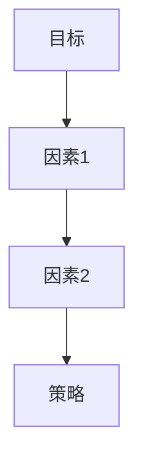
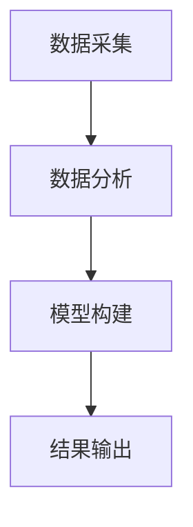

                 


# 芒格的"颠倒思考"在投资分析中的应用

> 关键词：芒格、颠倒思考、投资分析、决策树模型、贝叶斯定理、系统架构设计

> 摘要：本文详细探讨了芒格的“颠倒思考”方法在投资分析中的应用。通过从结果推导原因的逻辑，分析了其在股票投资、价值评估和投资决策中的作用。结合数学模型和系统架构设计，展示了如何将“颠倒思考”应用于实际投资分析中，提供了代码实现和案例分析。

---

## 第一章：芒格的“颠倒思考”概述

### 1.1 芒格“颠倒思考”的定义与特点

芒格的“颠倒思考”是一种逆向思维的投资分析方法，通过从结果推导原因来分析问题。其核心特点包括：

1. **从结果到原因**：不同于传统分析的正向逻辑，“颠倒思考”强调从目标或结果出发，逆向推导实现目标的路径或原因。
2. **注重本质**：通过逆向分析，能够更深刻地理解问题的本质，避免被表面现象迷惑。
3. **逻辑清晰**：采用结构化的逆向思维框架，帮助投资者更清晰地制定策略。

### 1.2 “颠倒思考”在投资分析中的应用领域

#### 1.2.1 股票投资中的应用
通过分析目标股价，逆向推导影响股价的关键因素，如公司基本面、行业趋势等。

#### 1.2.2 价值评估中的应用
从目标价值出发，逆向推导公司的真实价值，评估其市场定价是否合理。

#### 1.2.3 投资决策中的应用
通过设定投资目标，逆向规划投资策略和风险控制措施。

---

## 第二章：芒格“颠倒思考”的核心概念与联系

### 2.1 “颠倒思考”的基本原理

芒格的“颠倒思考”基于概率论和决策树模型，通过构建数学模型来分析问题。

#### 2.1.1 从结果推导原因的逻辑
1. **目标设定**：明确投资目标。
2. **原因分析**：分析影响目标的关键因素。
3. **路径规划**：制定实现目标的策略。

#### 2.1.2 “颠倒思考”的数学模型
使用贝叶斯定理，通过概率分析来评估投资决策的不确定性。

$$ P(A|B) = \frac{P(B|A) \cdot P(A)}{P(B)} $$

---

## 第三章：芒格“颠倒思考”的算法原理

### 3.1 “颠倒思考”的决策树模型

#### 3.1.1 决策树的构建过程
1. **目标设定**：确定投资目标。
2. **节点划分**：分析影响目标的关键因素。
3. **路径规划**：制定实现目标的策略。

#### 3.1.2 决策树的优化算法
通过信息增益最大化原则，优化决策树的结构。



#### 3.1.3 决策树的实现代码
```python
from sklearn.tree import DecisionTreeClassifier
from sklearn.datasets import make_classification

# 生成数据
X, y = make_classification(n_samples=100, n_features=2, n_classes=2)

# 构建决策树模型
model = DecisionTreeClassifier()
model.fit(X, y)

# 预测结果
print(model.predict(X))
```

---

## 第四章：芒格“颠倒思考”的系统分析与架构设计

### 4.1 投资分析的系统功能设计

#### 4.1.1 系统功能模块划分
1. **数据采集**：获取市场数据。
2. **数据分析**：分析数据，提取特征。
3. **模型构建**：构建投资模型。
4. **结果输出**：输出投资建议。

#### 4.1.2 系统功能流程图


---

## 第五章：芒格“颠倒思考”的项目实战

### 5.1 环境安装

安装Python和相关库：
```bash
pip install numpy pandas scikit-learn
```

### 5.2 核心代码实现

#### 5.2.1 数据清洗
```python
import pandas as pd

# 读取数据
data = pd.read_csv('data.csv')

# 删除缺失值
data.dropna(inplace=True)
```

#### 5.2.2 特征提取
```python
from sklearn.feature_selection import SelectKBest

# 提取特征
selector = SelectKBest(k=2)
selector.fit_transform(data)
```

#### 5.2.3 模型训练
```python
from sklearn.tree import DecisionTreeClassifier

# 构建模型
model = DecisionTreeClassifier()
model.fit(X_train, y_train)
```

#### 5.2.4 模型预测
```python
# 预测结果
y_pred = model.predict(X_test)
print(y_pred)
```

---

## 第六章：总结与展望

### 6.1 总结
芒格的“颠倒思考”通过逆向逻辑，帮助投资者制定更有效的投资策略。结合数学模型和系统设计，能够更好地应对复杂的投资环境。

### 6.2 最佳实践 tips
- **注重本质**：分析问题时，关注核心因素。
- **系统思考**：从整体角度优化投资决策。
- **持续学习**：不断更新知识，适应市场变化。

### 6.3 注意事项
- **数据质量**：确保数据的准确性和完整性。
- **模型优化**：定期更新模型，避免过时。

### 6.4 拓展阅读
推荐阅读芒格的《穷查理宝典》，深入理解其投资哲学。

---

以上是《芒格的"颠倒思考"在投资分析中的应用》的完整目录结构和详细内容。

