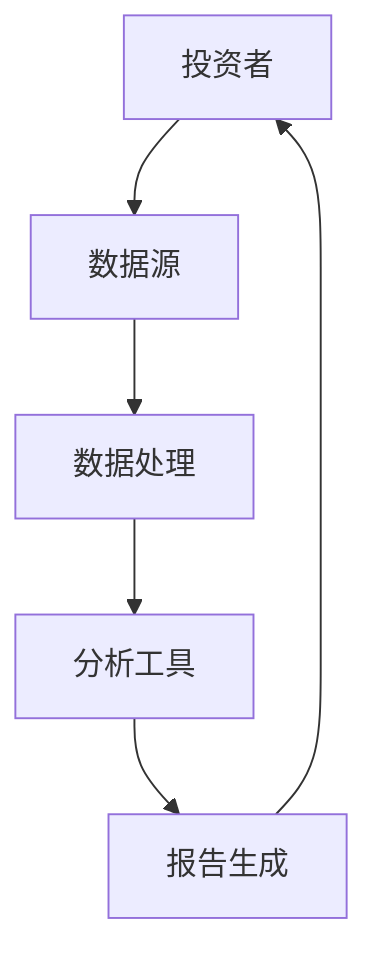
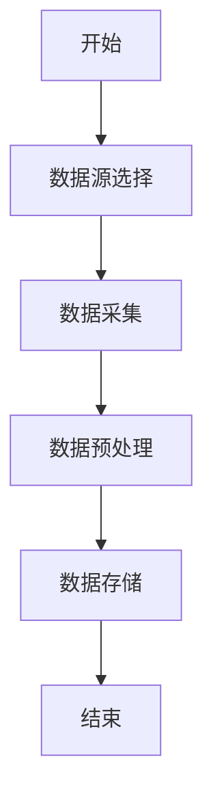
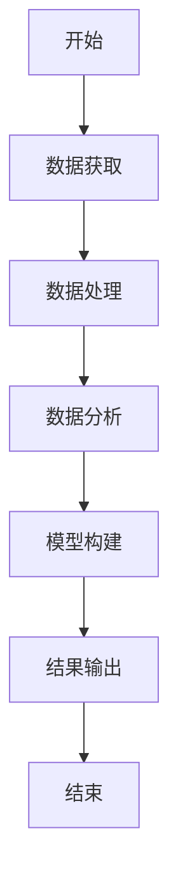
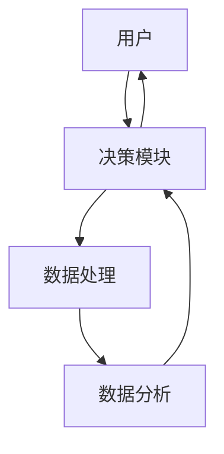

                 


# 菲利普·费雪的信息网络：如何建立投资情报系统

> 关键词：投资情报系统，菲利普·费雪，信息网络，投资策略，数据分析

> 摘要：本文深入探讨了菲利普·费雪的信息网络理论，分析了其投资情报系统的构建方法。通过详细的技术分析，结合算法和系统架构设计，揭示了如何利用信息网络进行高效的投资决策。本文适合对投资技术分析感兴趣的读者，帮助他们建立自己的投资情报系统。

---

# {{此处是文章标题}}

> 关键词：{{此处列出文章的5-7个核心关键词}}

> 摘要：{{此处给出文章的核心内容和主题思想}}

---

# 背景介绍

## 菲利普·费雪的投资理念概述

### 1.1 菲利普·费雪的生平简介

菲利普·费雪（Philip A. Fisher）是美国著名的投资专家，被誉为“成长型投资之父”。他出生于1907年，逝世于2004年，是投资界的重要人物。费雪的投资理念以“成长型投资”为核心，强调长期关注公司基本面，寻找那些具备持续增长潜力的企业进行投资。

### 1.2 信息网络在投资中的重要性

信息网络是指通过收集、分析和利用信息来支持决策的一系列方法和工具。在投资领域，信息网络的作用尤为重要，它能够帮助投资者快速获取市场动态、公司财务数据、行业趋势等信息，从而做出更明智的投资决策。

### 1.3 费雪如何利用信息网络进行投资

费雪在其投资生涯中，通过建立广泛的信息网络，与多家公司高管和行业专家保持联系，获取第一手信息。他认为，投资决策的成功与否，很大程度上取决于投资者能否及时、准确地获取相关信息。

---

## 菲利普·费雪的信息网络体系

### 2.1 信息网络的核心概念

信息网络在投资情报系统中扮演着至关重要的角色。以下是信息网络的核心概念：

- **数据源**：包括公司财报、行业报告、市场分析等。
- **数据处理**：对收集到的数据进行清洗、整理和分析。
- **数据分析工具**：如Python、Excel等工具，用于数据建模和预测。

### 2.2 信息网络的实体关系图



---

## 投资情报系统的算法原理

### 3.1 数据收集算法

数据收集是投资情报系统的第一步。以下是数据收集的流程：



### 3.2 数据分析与投资决策算法

数据分析是投资情报系统的核心部分。以下是数据分析的流程：



---

## 投资情报系统的数学模型

### 4.1 投资价值评估的数学公式

内在价值计算公式：

$$ V = \frac{CF}{r - g} $$

其中，CF为现金流，r为折现率，g为增长率。

### 4.2 信息网络的评估指标

准确率计算公式：

$$ \text{准确率} = \frac{\text{正确预测数}}{\text{总预测数}} $$

---

## 系统架构设计

### 5.1 系统功能设计

- **数据采集模块**：负责收集市场数据。
- **数据分析模块**：对数据进行建模和分析。
- **投资决策模块**：根据分析结果生成投资建议。

### 5.2 系统架构图



---

## 项目实战——构建投资情报系统

### 6.1 环境安装与配置

- **Python环境安装**：使用Anaconda安装Python。
- **数据库安装与配置**：使用MySQL或MongoDB存储数据。

### 6.2 核心代码实现

```python
import requests

def get_data(url):
    response = requests.get(url)
    return response

def analyze_data(data):
    # 数据分析逻辑
    pass

def generate_report(data):
    # 生成报告
    pass
```

---

## 总结与展望

### 6.3 项目总结

通过构建投资情报系统，投资者可以更高效地获取和分析信息，从而做出更明智的投资决策。

### 6.4 项目小结

本文详细介绍了菲利普·费雪的信息网络理论，并通过实际案例展示了如何利用这些理论构建投资情报系统。

### 6.5 注意事项

- 数据来源的可靠性至关重要。
- 投资决策需要结合多方面的信息进行综合判断。

### 6.6 拓展阅读

- 《投资之道》——彼得·林奇
- 《股市真经》——格雷厄姆

---

# 结语

菲利普·费雪的信息网络理论为投资者提供了一种高效的投资情报系统构建方法。通过本文的分析，读者可以更好地理解如何利用信息网络进行投资决策。希望本文能为投资领域的技术研究和实践提供有价值的参考。

