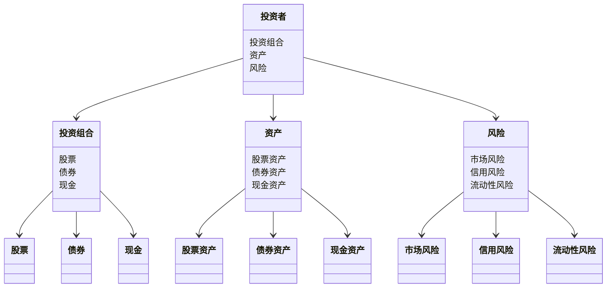

                 


# 菲利普·费雪的全球化投资视野

## 关键词
菲利普·费雪, 投资策略, 全球化投资, 价值投资, 风险管理, 投资组合优化

## 摘要
本文深入探讨了菲利普·费雪的投资理念及其在全球化背景下的应用。文章首先介绍了菲利普·费雪的生平和投资哲学，接着分析了全球化对投资策略的影响，详细阐述了其成长股投资策略、投资组合管理和风险管理的核心要素。此外，本文还结合现代投资环境，探讨了菲利普·费雪策略的现代应用，并通过系统设计和项目实战展示了如何将这些理念应用于实际投资中。最后，文章总结了菲利普·费雪投资理念的启示，并提出了最佳实践建议。

---

# 第1章：菲利普·费雪的生平与投资哲学

## 1.1 菲利普·费雪的生平简介

### 1.1.1 菲利普·费雪的早年经历
菲利普·费雪（Philip Fisher）于1906年12月13日出生在美国纽约州的芝加哥。他从小就展现出对数学和金融的浓厚兴趣，这为他后来的投资事业奠定了基础。费雪在高中时期就通过自学掌握了基础的股票投资知识，并在大学期间进一步深化了对投资理论的理解。

### 1.1.2 费雪投资生涯的转折点
1929年，费雪从斯坦福大学毕业后进入华尔街，开始了自己的投资生涯。他在早期的投资实践中逐渐形成了自己的投资理念，尤其是在成长股投资方面。1949年，他出版了经典著作《投资成功的关键》，书中提出了“成长股”这一概念，并详细阐述了投资的长期性和复利效应。

### 1.1.3 费雪的核心投资理念
菲利普·费雪的核心投资理念可以概括为以下几点：
1. **长期投资**：他认为投资的目的是通过长期持有优质股票，实现资产的复利增长。
2. **深入研究**：在投资前，必须对公司的财务状况、行业地位和管理层进行深入研究。
3. **成长股投资**：专注于那些具有持续增长潜力的公司，而不是短期波动的股票。

## 1.2 费雪的投资哲学

### 1.2.1 价值投资的核心思想
菲利普·费雪是价值投资的倡导者之一，他认为股票的价值不仅仅体现在其当前的市场价格上，更重要的是公司的未来盈利能力。他强调，投资者应该关注公司的基本面，而不是市场的短期波动。

### 1.2.2 长期投资与复利效应
费雪认为，投资的真正意义在于通过长期持有优质资产，实现财富的稳步增长。他强调复利效应的重要性，认为时间是投资最好的朋友。

### 1.2.3 股票分析的三大原则
菲利普·费雪提出了股票分析的三大原则：
1. **公司盈利能力**：公司必须具备持续的盈利能力。
2. **行业地位**：公司必须在其所在的行业中具有领先地位。
3. **管理层素质**：公司管理层必须具备高度的专业性和道德水准。

---

# 第2章：全球化背景下的投资视野

## 2.1 全球化对投资环境的改变

### 2.1.1 经济全球化的定义与特征
经济全球化是指世界各国之间的经济联系日益紧密，资本、技术、信息和人才的流动更加频繁。全球化使得投资者可以跨越国界进行投资，从而分散风险并捕捉更多的投资机会。

### 2.1.2 全球化对资本市场的影响
全球化使得资本市场更加国际化，投资者可以投资于全球范围内的资产。同时，全球化也带来了更多的不确定性，如汇率波动、地缘政治风险等。

### 2.1.3 不同经济周期下的投资策略
在不同的经济周期下，投资策略需要进行相应的调整。例如，在经济衰退期，投资者可能需要选择防御性资产，而在经济复苏期，则可以考虑周期性股票。

## 2.2 全球化视角下的资产配置

### 2.2.1 资产配置的全球化策略
全球化资产配置的核心思想是通过投资于不同国家和地区的资产，来分散风险并捕捉更多的投资机会。投资者需要根据自身的风险承受能力、投资目标和市场环境来制定资产配置策略。

### 2.2.2 多元化投资的重要性
多元化是投资的基本原则之一。通过在全球范围内配置不同的资产，投资者可以有效降低特定国家或地区的市场风险。

### 2.2.3 全球经济波动对投资组合的影响
全球经济波动对投资组合的影响是多方面的。例如，美元走弱可能不利于美国资产，而新兴市场可能因此受益。因此，投资者需要密切关注全球经济走势，并及时调整投资策略。

---

# 第3章：成长股投资策略

## 3.1 成长股的定义与特征

### 3.1.1 成长股的定义
成长股是指那些具有持续增长潜力的公司的股票。这些公司通常处于快速发展的行业，且具备较高的盈利能力和增长前景。

### 3.1.2 成长股的财务特征
- 高增长率：销售收入和净利润的年增长率较高。
- 高市盈率：由于市场对公司未来增长的预期较高，成长股的市盈率通常较高。
- 高ROE：成长股通常具有较高的净资产收益率（ROE）。

### 3.1.3 成长股的行业分布
成长股主要集中在科技、医疗、消费和新能源等行业。这些行业具有较高的增长潜力和创新空间。

## 3.2 成长股的投资逻辑

### 3.2.1 成长股的盈利预期
投资者在选择成长股时，需要重点关注公司的盈利预期。通常，成长股的盈利增长速度要高于行业平均水平。

### 3.2.2 行业周期与成长股的选择
成长股的选择需要考虑行业周期。例如，在经济复苏期，周期性行业中的成长股可能表现更好。

### 3.2.3 成长股的风险与回报
成长股的风险较高，但回报潜力也更大。投资者需要在风险与回报之间找到平衡点。

---

# 第4章：投资组合管理与风险管理

## 4.1 投资组合的基本原理

### 4.1.1 投资组合的定义
投资组合是指投资者持有的各种资产的组合。通过合理配置不同类型的资产，投资者可以有效分散风险并提高收益。

### 4.1.2 投资组合的分散化原则
分散化是投资组合管理的核心原则之一。通过将资金分配到不同的资产类别、行业和地域，投资者可以降低特定资产的风险。

### 4.1.3 投资组合的收益与风险分析
投资组合的收益通常由资产的期望收益和相关性决定。而风险则取决于资产的波动性和相关性。

## 4.2 投资组合优化的数学模型

### 4.2.1 均值-方差优化模型
均值-方差优化模型是投资组合优化的基本模型之一。该模型通过最小化投资组合的方差（风险）来实现期望收益的最大化。

$$ \text{目标函数：} \quad \min \sigma^2$$
$$ \text{约束条件：} \quad \sum w_i = 1$$
$$ \quad \quad \quad \quad \sum w_i \mu_i = \mu_p$$

其中，\( w_i \) 是第 \( i \) 个资产的投资比例，\( \mu_i \) 是第 \( i \) 个资产的期望收益，\( \mu_p \) 是投资组合的期望收益。

### 4.2.2 Markowitz有效前沿理论
Markowitz有效前沿理论指出，在给定风险水平下，有效前沿代表了能够提供最高期望收益的投资组合。反之，在给定收益水平下，有效前沿代表了能够提供最低风险的投资组合。

### 4.2.3 现实中的投资组合优化
在现实投资中，由于市场摩擦和投资者偏好，投资组合优化需要考虑更多的因素，如交易成本、税收、市场流动性等。

---

# 第5章：风险管理与策略调整

## 5.1 风险管理的基本概念

### 5.1.1 风险的定义与分类
风险是指投资收益的不确定性。它可以分为市场风险、信用风险、流动性风险等。

### 5.1.2 风险与收益的平衡
投资者需要在风险与收益之间找到平衡点。通常，风险越高，潜在的收益也越大。

### 5.1.3 风险管理的目标
风险管理的目标是通过降低风险来提高投资组合的稳定性。具体目标包括：降低投资组合的波动性、避免重大损失、提高投资组合的流动性等。

## 5.2 风险管理的具体策略

### 5.2.1 仓位调整策略
通过调整投资组合的仓位，投资者可以降低特定资产的风险。例如，在市场下跌时减少高风险资产的投资比例。

### 5.2.2 期权与对冲工具的使用
期权和对冲工具可以帮助投资者降低投资组合的波动性。例如，使用期权进行套期保值。

### 5.2.3 定期复盘与策略优化
投资者需要定期复盘投资组合的表现，并根据市场变化和自身目标进行策略调整。

---

# 第6章：菲利普·费雪投资理念的现代应用

## 6.1 现代投资环境的变化

### 6.1.1 技术进步对投资的影响
技术进步使得投资者可以更高效地进行数据收集和分析。例如，大数据和人工智能技术可以帮助投资者更好地预测市场趋势。

### 6.1.2 金融创新与投资工具
金融创新为投资者提供了更多的投资工具和策略。例如，指数基金、ETF和衍生品等。

### 6.1.3 全球化与多元化投资
全球化使得投资者可以投资于全球范围内的资产，从而更好地分散风险并捕捉更多的投资机会。

---

# 第7章：系统分析与架构设计

## 7.1 问题场景介绍
在现代投资环境中，投资者需要一个高效的投资管理系统来帮助他们进行资产配置、风险管理和投资决策。

## 7.2 系统功能设计

### 7.2.1 领域模型设计
以下是领域模型的Mermaid类图：



## 7.3 系统架构设计

### 7.3.1 系统架构图
以下是系统架构的Mermaid图：

```mermaid
rectangle 数据层 {
    数据库
}

rectangle 业务逻辑层 {
    投资组合管理
    风险管理
    资产配置
}

rectangle 用户界面层 {
    投资者界面
    管理界面
}

数据层 --> 业务逻辑层
业务逻辑层 --> 用户界面层
```

## 7.4 系统接口设计

### 7.4.1 接口设计
以下是系统接口的Mermaid图：

```mermaid
client ---(http)--> 服务器
服务器 ---(rest)--> 数据库
```

## 7.5 系统交互设计

### 7.5.1 交互流程图
以下是系统交互的Mermaid图：

```mermaid
client --> 服务器
服务器 --> 数据库
数据库 --> 服务器
服务器 --> client
```

---

# 第8章：项目实战

## 8.1 环境安装

### 8.1.1 安装Python
```bash
python --version
pip install --upgrade pip
```

### 8.1.2 安装必要的库
```bash
pip install numpy pandas matplotlib
```

## 8.2 系统核心实现源代码

### 8.2.1 资产配置模块
```python
import numpy as np
import pandas as pd

def portfolio_optimization(returns, weights):
    # 计算投资组合的期望收益
    expected_return = np.dot(returns.mean(), weights)
    # 计算投资组合的风险
    covariance_matrix = returns.cov()
    portfolio_variance = weights.T.dot(c covariance_matrix).dot(weights)
    return expected_return, portfolio_variance
```

### 8.2.2 风险管理模块
```python
import numpy as np

def value_at_risk(returns, confidence_level=0.95):
    # 计算VaR
    returns_sorted = sorted(returns)
    index = int(len(returns_sorted) * (1 - confidence_level))
    var = returns_sorted[index]
    return var
```

## 8.3 实际案例分析
假设我们有一个包含3种资产的投资组合，分别为股票、债券和现金。我们可以通过上述代码计算投资组合的期望收益和风险。

### 8.3.1 数据准备
```python
returns = pd.DataFrame({
    '股票': [0.1, 0.05, -0.02],
    '债券': [0.03, 0.02, 0.01],
    '现金': [0, 0, 0]
})
weights = [0.5, 0.3, 0.2]
```

### 8.3.2 计算期望收益和风险
```python
expected_return, portfolio_variance = portfolio_optimization(returns, weights)
print(f"期望收益: {expected_return}")
print(f"投资组合风险: {portfolio_variance}")
```

### 8.3.3 计算VaR
```python
returns_series = returns.values.flatten()
var = value_at_risk(returns_series)
print(f"VaR: {var}")
```

---

# 第9章：最佳实践

## 9.1 小结
菲利普·费雪的投资理念在全球化背景下仍然具有重要的指导意义。投资者需要结合现代技术和市场环境，灵活运用这些理念。

## 9.2 注意事项
1. 投资者需要根据自身情况调整投资策略。
2. 风险管理是投资成功的关键。
3. 投资者需要保持对市场的敏感性和洞察力。

## 9.3 拓展阅读
1. 《投资成功的关键》——菲利普·费雪
2. 《投资学》——威廉·夏普
3. 《风险管理与投资组合》——哈里·马科维茨

---

# 结语
菲利普·费雪的投资理念强调长期、深入和全球化的视角。在全球化的今天，投资者需要将这些理念与现代技术和市场环境相结合，以实现长期稳定的收益。通过系统化的投资管理和风险管理，投资者可以更好地应对市场波动，并抓住全球化带来的投资机会。

