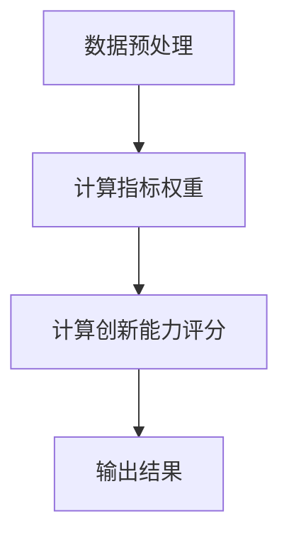

                 


# 菲利普·费雪的创新能力评估模型

## 关键词：
菲利普·费雪, 创新能力评估, 投资模型, 算法原理, 系统架构, 项目实战

## 摘要：
菲利普·费雪的创新能力评估模型是一种基于成长股投资理念的创新分析方法，通过多维度评估企业的创新能力，帮助投资者识别具有长期增长潜力的企业。本文详细解析了模型的背景、核心概念、算法原理、系统架构以及实际应用，为读者提供了全面的理解和实践指导。

---

## 第一章：引言

### 1.1 菲利普·费雪的背景与贡献
菲利普·费雪（Philip Fisher）是20世纪著名的投资专家，以其成长股投资理念闻名。他强调长期投资和选择具有强大创新能力的企业。费雪的创新能力评估模型是其理念的核心工具之一，旨在通过量化方法评估企业的创新潜力。

### 1.2 模型的核心目标
- **识别高增长企业**：通过评估创新能力，筛选出具有长期增长潜力的企业。
- **优化投资决策**：结合创新能力和财务表现，制定科学的投资策略。
- **风险控制**：通过量化评估，降低投资风险。

---

## 第二章：核心概念

### 2.1 创新能力的评估维度
- **技术创新**：研发投入、专利数量。
- **产品创新**：新产品推出频率、市场接受度。
- **商业模式创新**：业务模式、市场策略创新。

### 2.2 模型的输入与输出
- **输入**：企业基本面数据、创新能力指标、市场环境数据。
- **输出**：创新能力评分、投资建议。

---

## 第三章：算法原理

### 3.1 模型计算步骤


### 3.2 创新能力评分公式
$$创新能力评分 = \sum_{i=1}^{n} (w_i \times x_i)$$
其中，$w_i$为第$i$个指标的权重，$x_i$为该指标的评分。

### 3.3 指标权重计算
权重基于行业标准和企业历史表现确定，可通过主成分分析优化。

---

## 第四章：系统架构

### 4.1 系统架构设计


### 4.2 系统功能模块
- **数据处理模块**：数据清洗与转换。
- **模型计算模块**：指标计算与评分。
- **结果展示模块**：可视化输出。

---

## 第五章：项目实战

### 5.1 环境安装
- **Python 3.8+**
- **库依赖**：pandas、numpy、scikit-learn。

### 5.2 核心代码实现
```python
import pandas as pd
import numpy as np

def calculate创新能力评分(data):
    # 示例代码，具体实现根据实际需求调整
    weights = np.array([0.4, 0.3, 0.3])
    scores = np.dot(data, weights)
    return scores

data = pd.read_csv('input.csv')
result = calculate创新能力评分(data)
print(result)
```

---

## 第六章：总结与展望

### 6.1 最佳实践
- 数据准确性是关键。
- 定期更新模型以适应市场变化。

### 6.2 小结
菲利普·费雪的创新能力评估模型为投资者提供了科学的决策工具，通过量化方法评估企业创新潜力，优化投资组合。

---

通过以上步骤，您可以全面理解和应用菲利普·费雪的创新能力评估模型，帮助做出更明智的投资决策。

