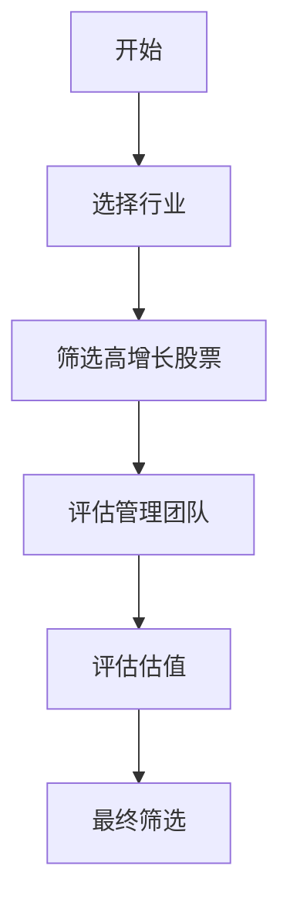
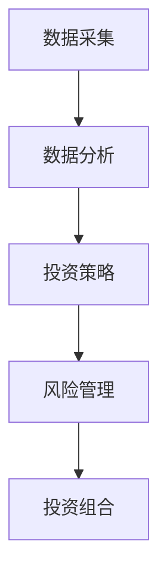
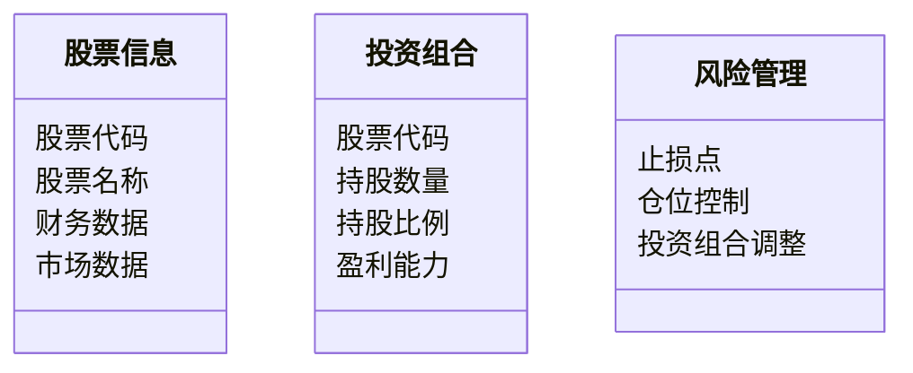

                 

# 菲利普·费雪的成长型股票投资策略

> 关键词：菲利普·费雪，成长型投资，股票选择，投资组合，风险管理，数学模型

> 摘要：本文深入探讨了菲利普·费雪的成长型股票投资策略，从其核心理念到实际操作方法进行了详细分析。文章首先介绍了费雪的成长型投资思想及其与价值投资的区别，然后分析了成长型企业的特征和识别方法。接着，文章详细阐述了成长型股票的选择策略，包括基本面分析、估值方法和投资组合的构建。最后，文章通过数学模型和系统架构的方法，结合实际案例，展示了如何在实际投资中应用这些策略，并提出了风险管理的最佳实践。

---

## 第1章：成长型投资的起源与核心理念

### 1.1 菲利普·费雪的生平与投资思想

菲利普·费雪（Philip Fisher）是20世纪最伟大的投资家之一，被誉为“成长型投资之父”。他于1906年出生于美国加利福尼亚州，早年在耶鲁大学学习化学，后来转向金融领域。费雪的职业生涯始于1930年代，他通过长期持有优质成长型股票的投资策略，取得了卓越的投资业绩。他的投资理念影响了后来的许多投资者，包括彼得·林奇和沃伦·巴菲特。

#### 费雪的投资思想

费雪的成长型投资理念可以总结为以下几点：

1. **长期投资**：费雪主张长期持有优质股票，而非频繁交易。他认为，短期市场波动不应该影响长期投资者的决策。
2. **投资于成长型企业**：费雪强调选择那些具有持续增长潜力的企业。他关注企业的收入、利润和市场份额的增长。
3. **深入研究**：费雪认为，成功的投资需要对企业的基本面进行深入研究，包括财务状况、管理团队和行业地位。
4. **边际利润的重要性**：费雪提出，企业的成功不仅取决于总收入，还取决于每单位收入的利润，即边际利润。

### 1.2 成长型投资的基本概念

#### 成长型投资的定义与特征

成长型投资是指投资于那些收入和利润能够持续以高于平均水平的速度增长的公司。与价值投资不同，成长型投资更关注企业的未来增长潜力，而非当前的估值。

#### 成长型投资与价值投资的区别

| 方面         | 成长型投资                | 价值投资                |
|--------------|--------------------------|--------------------------|
| 核心目标     | 寻找具有高增长潜力的企业  | 寻找被市场低估的股票     |
| 重点         | 未来的增长                | 当前的估值                |
| 投资期限     | 长期                     | 中长期                  |
| 风险         | 较高                     | 较低                     |

#### 成长型投资的适用场景与局限性

- **适用场景**：当市场处于上升周期，成长型企业通常表现优于价值型企业。
- **局限性**：在市场 downturn 时，成长型企业可能会面临更大的波动性和估值压力。

---

## 第2章：成长型企业的核心特征

### 2.1 企业的成长性分析

#### 收入与利润的持续增长

成长型企业通常表现出以下特征：

- 收入增长率高于行业平均水平。
- 净利润增长率高于行业平均水平。
- 营业利润率稳定或上升。

#### 高ROE的持续性

ROE（净资产收益率）是衡量企业盈利能力的重要指标。成长型企业通常具有较高的ROE，并且这一比率能够持续增长。

#### 创新能力与市场扩展能力

成长型企业需要具备强大的创新能力，能够不断推出新产品或服务，以满足市场需求。同时，它们还需要具备市场扩展能力，能够在不同市场或地区扩大业务。

### 2.2 成长型企业识别的关键指标

#### 财务指标分析

- **收入增长率**：过去3-5年的收入增长率。
- **净利润增长率**：过去3-5年的净利润增长率。
- **ROE**：过去3-5年的ROE趋势。

#### 市场指标分析

- **市场份额**：企业在行业中的市场份额。
- **行业地位**：企业在行业中的排名和声誉。

#### 管理团队的能力与稳定性

- **管理团队的经验**：高管团队的行业经验和管理能力。
- **管理团队的稳定性**：团队是否稳定，是否有频繁的变动。

---

## 第3章：菲利普·费雪的成长型股票选择策略

### 3.1 股票选择的三步法

#### 第一步：初步筛选（行业分析与财务指标）

- **行业分析**：选择具有增长潜力的行业，如科技、医疗等。
- **财务指标筛选**：根据收入增长率、净利润增长率和ROE等指标筛选出符合条件的股票。

#### 第二步：深入分析（公司基本面与管理团队）

- **公司基本面分析**：包括公司的业务模式、竞争优势、市场地位等。
- **管理团队分析**：评估管理团队的能力和稳定性。

#### 第三步：最终评估（成长性与估值）

- **成长性评估**：综合考虑公司的收入增长率、净利润增长率和ROE等因素。
- **估值评估**：通过市盈率（P/E）、市净率（P/B）等指标评估股票的合理估值。

### 3.2 股票估值的核心方法

#### 市盈率（P/E）与市净率（P/B）的应用

- **市盈率（P/E）**：公式为 $P/E = \frac{股价}{每股净利润}$。
- **市净率（P/B）**：公式为 $P/B = \frac{股价}{每股净资产}$。

#### 内在价值的计算方法

内在价值是股票的合理估值，可以通过以下公式计算：

$$
\text{内在价值} = \sum_{t=1}^{n} \frac{\text{未来现金流}}{(1 + r)^t}
$$

其中，$r$ 是折现率，$n$ 是预测的现金流年限。

#### 高增长股票的合理估值区间

对于高增长股票，通常使用市盈率（P/E）和市净率（P/B）作为估值指标。通常，成长型企业可以接受较高的市盈率，因为它们的高增长率可以支撑较高的估值。

---

## 第4章：投资组合的构建与风险管理

### 4.1 成长型投资组合的构建策略

#### 分散化原则

投资组合应分散投资于不同行业和不同成长阶段的股票，以降低风险。

#### 不同成长阶段股票的配比

- **高增长阶段**：收入和利润增长率较高，但估值可能较高。
- **稳定增长阶段**：收入和利润增长率稳定，估值相对合理。
- **低增长阶段**：收入和利润增长率较低，估值可能较低。

#### 行业分布与风险控制

投资组合应分散投资于不同行业，以降低行业风险。

### 4.2 风险管理与投资纪律

#### 仓位控制与止损策略

- **仓位控制**：通常建议将资金分散投资于5-10只股票，每只股票的投资比例不超过总资金的20%。
- **止损策略**：设定止损点，通常为买入价的10%-20%。

#### 定期复盘与投资组合调整

- **定期复盘**：每月或每季度复盘投资组合的表现，评估是否符合预期。
- **投资组合调整**：根据市场变化和企业基本面的变化，调整投资组合。

#### 心理因素对投资决策的影响

投资者需要克服贪婪和恐惧的心理，坚持投资纪律，避免情绪化决策。

---

## 第5章：菲利普·费雪投资策略的数学模型与分析

### 5.1 成长型股票的估值模型

#### 常用估值指标与公式

- **市盈率（P/E）**：$P/E = \frac{股价}{每股净利润}$。
- **市净率（P/B）**：$P/B = \frac{股价}{每股净资产}$。
- **内在价值**：$$
\text{内在价值} = \sum_{t=1}^{n} \frac{\text{未来现金流}}{(1 + r)^t}
$$

#### 市盈率与市净率的比较分析

| 指标   | 适用场景                     |
|--------|------------------------------|
| P/E    | 利润增长稳定的公司           |
| P/B    | 资产密集型行业               |

#### 市盈率与市净率的比较图（Mermaid）

### 5.2 成长性股票的筛选算法

#### 基于财务指标的多因子筛选

1. 收入增长率 > 行业平均水平。
2. 净利润增长率 > 行业平均水平。
3. ROE > 行业平均水平。

#### 基于行业趋势的权重分配

- **高增长行业**：权重较高。
- **稳定行业**：权重中等。
- **低增长行业**：权重较低。

#### 算法流程图（Mermaid）

---

## 第6章：成长型投资的系统架构与实现

### 6.1 系统架构设计

#### 系统功能模块

1. **数据采集模块**：采集股票数据，包括财务数据和市场数据。
2. **数据分析模块**：分析股票的财务指标、成长性和估值。
3. **投资策略模块**：根据数据分析结果，筛选出符合条件的股票。
4. **风险管理模块**：评估投资组合的风险，并进行调整。

#### 系统架构图（Mermaid）

### 6.2 系统功能设计

#### 数据库设计（Mermaid）

---

## 第7章：实战案例与策略优化

### 7.1 实战案例分析

#### 案例一：科技行业

- **公司**：苹果（AAPL）
- **财务指标**：收入增长率 > 10%，净利润增长率 > 20%，ROE > 20%。
- **估值**：市盈率 = 15，市净率 = 3。

#### 案例二：医疗行业

- **公司**：强生（JNJ）
- **财务指标**：收入增长率 = 8%，净利润增长率 = 10%，ROE = 18%。
- **估值**：市盈率 = 18，市净率 = 3.5。

### 7.2 策略优化与注意事项

- **定期复盘**：每月复盘投资组合的表现，评估是否符合预期。
- **动态调整**：根据市场变化和企业基本面的变化，动态调整投资组合。
- **风险管理**：设定止损点，控制仓位，避免过度集中。

---

## 结论

菲利普·费雪的成长型股票投资策略为投资者提供了一种系统化的方法来选择和管理成长型股票。通过深入分析企业的财务指标、成长性和估值，投资者可以筛选出具有高增长潜力的股票，并构建一个风险可控的投资组合。然而，成长型投资也存在一定的风险，投资者需要具备长期的投资视角，坚持投资纪律，并根据市场变化动态调整投资策略。

---

通过以上章节的详细分析，读者可以全面了解菲利普·费雪的成长型股票投资策略，并将其应用于实际投资中。

