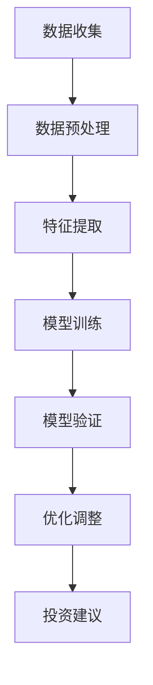

                 


# 菲利普·费雪的消费者行为研究在投资中的应用

## 关键词：菲利普·费雪，消费者行为，投资策略，价值投资，烟屁股理论，市场分析，投资回报

## 摘要：菲利普·费雪是价值投资领域的先驱，他提出的“烟屁股理论”通过分析消费者行为来评估企业投资价值。本文详细探讨了费雪的消费者行为研究方法，分析其在投资决策中的应用，并结合实际案例，展示了如何通过消费者行为分析优化投资策略，为投资者提供实用的指导。

---

## 第一部分: 背景介绍与核心概念

### 第1章: 菲利普·费雪与消费者行为研究概述

#### 1.1 菲利普·费雪的生平与投资理念

- **1.1.1 菲利普·费雪的生平简介**
  - 菲利普·费雪（Philip Fisher）是20世纪美国著名投资家，被誉为“成长股之父”。
  - 他于1907年出生，1926年进入哈佛大学，后转学到加州大学伯克利分校，1931年获得化学工程学士学位。
  - 费雪在1934年加入父亲的公司，开始投资生涯，逐渐形成了独特的价值投资理念。

- **1.1.2 费雪的价值投资理念**
  - 费雪认为，投资的核心在于寻找那些具有持续增长潜力的企业。
  - 他强调对企业基本面的深入研究，尤其是企业的管理和竞争优势。
  - 费雪提出了“烟屁股理论”，即从消费者行为中发现投资机会。

- **1.1.3 费雪对消费者行为研究的贡献**
  - 费雪通过研究消费者行为，发现了一些具有长期增长潜力的企业。
  - 他的研究方法为后来的价值投资提供了重要参考。

#### 1.2 消费者行为研究的背景与意义

- **1.2.1 消费者行为研究的定义**
  - 消费者行为研究是指对消费者在购买、使用和处置产品或服务时的行为进行分析。
  - 目的在于理解消费者的需求、动机和决策过程。

- **1.2.2 消费者行为研究在投资中的重要性**
  - 通过分析消费者行为，投资者可以预测市场需求的变化趋势。
  - 消费者行为分析帮助企业识别潜在的市场机会和风险。

- **1.2.3 费雪如何将消费者行为研究应用于投资**
  - 费雪通过研究消费者的购买习惯，发现了一些具有竞争优势的企业。
  - 例如，他通过分析消费者对可口可乐的需求，投资了可口可乐公司。

#### 1.3 费雪的“烟屁股理论”与消费者行为分析

- **1.3.1 烟屁股理论的核心思想**
  - 烟屁股理论是指，通过分析消费者对产品的使用情况，发现那些被市场忽视的潜在投资机会。
  - 费雪认为，消费者对产品的使用频率可以反映企业的盈利能力。

- **1.3.2 烟屁股理论与消费者行为的关系**
  - 烟屁股理论的核心在于通过消费者行为分析，发现企业的市场地位。
  - 例如，费雪通过分析消费者对香烟的消费习惯，发现了一些具有竞争优势的烟草公司。

- **1.3.3 烟屁股理论在投资中的应用案例**
  - 费雪通过分析消费者对可口可乐的需求，投资了可口可乐公司，并取得了巨大成功。
  - 他通过分析消费者对电话的需求，投资了美国电话电报公司（AT&T），同样取得了长期收益。

---

### 第2章: 消费者行为研究的核心概念与理论框架

#### 2.1 消费者行为的核心概念

- **2.1.1 消费者需求与动机**
  - 消费者的需求包括基本需求和心理需求。
  - 动机是指驱动消费者购买产品或服务的心理因素。

- **2.1.2 消费者决策过程**
  - 消费者在购买产品或服务时，通常会经历信息收集、评估、决策和购买过程。
  - 费雪通过分析消费者的决策过程，发现了一些具有竞争优势的企业。

- **2.1.3 消费者行为的外部影响因素**
  - 经济环境、社会文化、技术进步等因素都会影响消费者行为。

#### 2.2 费雪消费者行为分析的理论框架

- **2.2.1 需求分析与市场定位**
  - 需求分析是指通过研究消费者的需求，确定产品的市场定位。
  - 市场定位是指将产品定位在目标市场中的特定位置。

- **2.2.2 品牌忠诚度与消费者行为**
  - 品牌忠诚度是指消费者对某个品牌产品的偏好程度。
  - 高品牌忠诚度意味着消费者更愿意购买该品牌的产品。

- **2.2.3 消费者行为的量化分析方法**
  - 通过问卷调查、数据分析等方法，量化消费者的购买行为。
  - 使用统计方法分析消费者行为数据，发现市场趋势。

#### 2.3 费雪消费者行为分析的核心要素对比

- **2.3.1 对比表格：消费者行为核心要素对比**

| 消费者行为核心要素 | 描述 |
|---------------------|------|
| 需求                | 消费者对产品的基本需求 |
| 动机                | 驱动消费者购买的内在因素 |
| 品牌忠诚度          | 消费者对品牌的偏好程度 |
| 购买频率            | 消费者购买产品的频率 |
| 市场定位            | 产品在市场中的定位 |

- **2.3.2 ER实体关系图：消费者行为分析框架**

```mermaid
erd
  消费者
    + 消费者ID (PK)
    + 消费者属性
  产品
    + 产品ID (PK)
    + 产品属性
  市场
    + 市场ID (PK)
    + 市场属性
  消费者行为
    + 行为ID (PK)
    + 消费者ID (FK)
    + 产品ID (FK)
    + 市场ID (FK)
```

---

### 第3章: 消费者行为与投资决策的关联性分析

#### 3.1 消费者行为对投资决策的影响

- **3.1.1 消费者需求变化对投资的影响**
  - 消费者需求的变化直接影响企业的销售和利润。
  - 投资者需要关注消费者需求的变化趋势，及时调整投资策略。

- **3.1.2 市场趋势与消费者行为的关系**
  - 市场趋势是由消费者行为驱动的。
  - 投资者需要通过分析市场趋势，预测企业的未来表现。

- **3.1.3 消费者行为预测投资机会的可能性**
  - 通过分析消费者行为，投资者可以发现潜在的投资机会。
  - 例如，费雪通过分析消费者对科技产品的需求，投资了早期的科技公司。

#### 3.2 投资决策中的消费者行为分析模型

- **3.2.1 消费者行为分析模型的构建**
  - 模型输入：消费者行为数据、市场数据。
  - 模型输出：投资建议、市场趋势预测。

- **3.2.2 模型的输入与输出**
  - 输入：消费者行为数据（如购买频率、品牌忠诚度）。
  - 输出：投资建议（如买入信号、卖出信号）。

- **3.2.3 模型的验证与优化**
  - 使用历史数据验证模型的准确性。
  - 根据实际投资结果优化模型。

#### 3.3 费雪消费者行为分析的数学模型

- **3.3.1 消费者需求函数的数学表达**
  - 需求函数：$$ D(p) = a - bp $$
  - 其中，$$ a $$ 是需求的基本水平，$$ b $$ 是价格敏感性系数。

- **3.3.2 市场渗透率与消费者行为的关系**
  - 市场渗透率公式：$$ M = \frac{D(p)}{P} $$
  - 其中，$$ D(p) $$ 是需求函数，$$ P $$ 是市场潜力。

- **3.3.3 消费者行为对投资回报的影响公式**
  - 投资回报公式：$$ ROI = \frac{D(p) \times P}{I} $$
  - 其中，$$ D(p) $$ 是需求，$$ P $$ 是价格，$$ I $$ 是投资成本。

---

### 第4章: 费雪消费者行为分析的算法原理

#### 4.1 消费者行为分析的算法概述

- **4.1.1 数据收集与预处理**
  - 数据来源：消费者调查、市场数据、企业财报。
  - 数据预处理：数据清洗、数据标准化。

- **4.1.2 数据分析与建模**
  - 数据分析方法：统计分析、机器学习。
  - 建模方法：回归分析、聚类分析。

- **4.1.3 模型验证与优化**
  - 模型验证：使用历史数据验证模型准确性。
  - 模型优化：调整参数、改进算法。

#### 4.2 消费者行为分析的 mermaid 流程图



---

### 第5章: 实际应用与案例分析

#### 5.1 费雪消费者行为分析的实际应用

- **5.1.1 费雪的投资策略**
  - 长期投资：费雪通过分析消费者行为，选择具有长期增长潜力的企业。
  - 价值投资：寻找被市场低估的企业。

- **5.1.2 费雪的烟屁股理论在实际中的应用**
  - 通过分析消费者行为，发现市场机会。
  - 例如，费雪通过分析消费者对可口可乐的需求，投资了可口可乐公司。

#### 5.2 成功案例分析

- **5.2.1 可口可乐公司**
  - 费雪通过分析消费者对可乐的需求，投资了可口可乐公司，并取得了长期收益。
  - 可口可乐的消费者忠诚度高，市场需求稳定。

- **5.2.2 微软公司**
  - 费雪通过分析消费者对科技产品的需求，投资了早期的科技公司。
  - 微软的市场地位和消费者行为分析为其投资提供了依据。

---

### 第6章: 投资策略与风险管理

#### 6.1 投资策略的制定

- **6.1.1 长期投资策略**
  - 长期投资的核心在于选择具有长期增长潜力的企业。
  - 通过消费者行为分析，发现具有竞争优势的企业。

- **6.1.2 防御性投资策略**
  - 防御性投资的核心在于降低投资风险。
  - 通过分析消费者行为，避免投资于需求下降的企业。

#### 6.2 风险管理与消费者行为分析

- **6.2.1 风险识别**
  - 通过消费者行为分析，识别市场风险。
  - 例如，消费者需求下降可能引发企业的销售下降。

- **6.2.2 风险控制**
  - 通过分散投资，降低投资风险。
  - 选择不同行业的企业，降低行业风险。

---

### 第7章: 总结与展望

#### 7.1 总结

- 菲利普·费雪的消费者行为研究为投资提供了重要的理论依据。
- 通过分析消费者行为，投资者可以发现市场机会，优化投资策略。

#### 7.2 未来展望

- 消费者行为分析将更加依赖于大数据和人工智能技术。
- 未来的投资决策将更加依赖于对消费者行为的深入分析。

---

### 第8章: 最佳实践与小结

#### 8.1 最佳实践 tips

- **持续学习**：投资者需要不断学习新的消费者行为分析方法。
- **关注市场趋势**：通过分析市场趋势，发现投资机会。
- **分散投资**：通过分散投资降低风险。

#### 8.2 小结

- 费雪的消费者行为研究为投资提供了重要的理论依据。
- 投资者需要结合市场实际情况，灵活应用这些理论。

#### 8.3 注意事项

- 投资者需要关注企业的基本面，避免只关注消费者行为。
- 投资者需要结合市场实际情况，灵活调整投资策略。

#### 8.4 拓展阅读

- 建议投资者阅读菲利普·费雪的原著《成长股》。
- 关注最新的消费者行为研究文献。

---

通过以上内容，我们可以看到，菲利普·费雪的消费者行为研究为投资提供了重要的理论依据。投资者可以通过分析消费者行为，发现市场机会，优化投资策略。未来，随着大数据和人工智能技术的发展，消费者行为分析将在投资中发挥越来越重要的作用。

