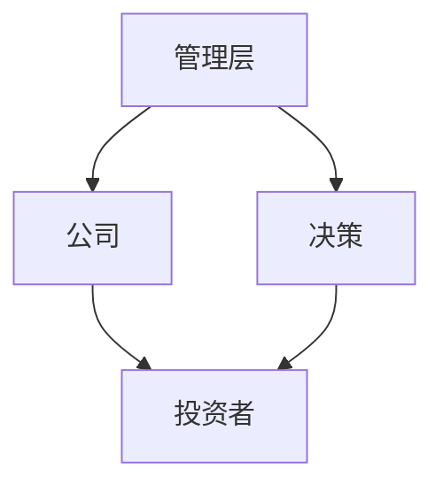
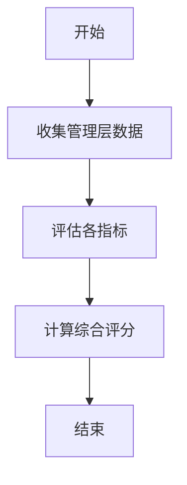
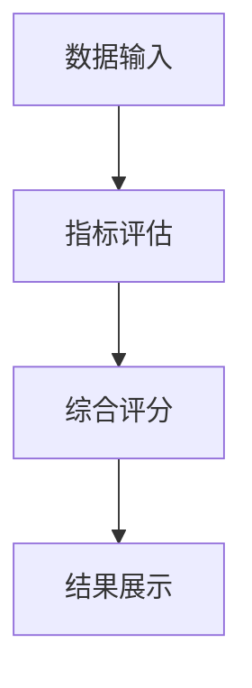
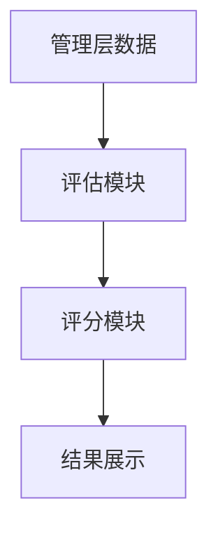
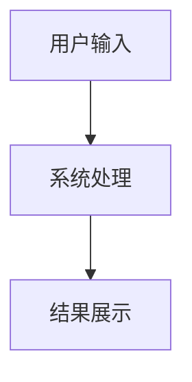

                 

# 菲利普·费雪的管理层质量评估标准

## 关键词：
菲利普·费雪、管理层质量评估、投资理念、能力评估、道德标准、决策影响力

## 摘要：
菲利普·费雪是价值投资领域的先驱，他提出的管理层质量评估标准是投资决策中的重要组成部分。本文将从背景介绍、核心概念、算法原理到系统设计，全面解析菲利普·费雪的管理层质量评估标准，帮助投资者更好地识别和评估管理层的能力和道德水平。

---

# 第1章：背景介绍

## 1.1 管理层质量评估的重要性

### 1.1.1 什么是管理层质量评估
管理层质量评估是对公司管理层的能力、道德水平和决策能力进行系统性评估的过程。它是投资决策中不可或缺的一部分，直接影响公司的长期发展和投资回报。

### 1.1.2 管理层质量评估的必要性
在投资过程中，管理层的质量往往决定着公司的命运。一家公司的好坏不仅取决于其财务状况，还取决于管理层的战略眼光、执行能力和道德水平。

### 1.1.3 管理层质量评估的边界与外延
管理层质量评估的边界包括管理层的决策能力、道德水平和团队协作能力。外延则包括公司文化、战略规划和市场环境。

---

## 1.2 菲利普·费雪的背景与投资理念

### 1.2.1 菲利普·费雪的生平简介
菲利普·费雪（Philip Fisher）是价值投资的先驱之一，被誉为“成长股之父”。他提出了许多重要的投资理念，其中包括对管理层质量的高度重视。

### 1.2.2 菲利普·费雪的投资哲学
菲利普·费雪认为，投资的成功不仅取决于公司的财务状况，还取决于管理层的能力和道德水平。他强调长期投资和对公司基本面的深入分析。

### 1.2.3 菲利普·费雪与管理层质量评估的关系
菲利普·费雪的管理层质量评估标准是其投资哲学的重要组成部分。他认为，优秀的管理层是公司长期增长的核心驱动力。

---

# 第2章：核心概念与联系

## 2.1 管理层质量评估的核心要素

### 2.1.1 管理层能力的构成要素
管理层的能力包括战略眼光、执行能力和创新精神。这些能力直接影响公司的长期发展。

### 2.1.2 管理层道德与责任感
管理层的道德水平和责任感是评估其质量的重要标准。道德高尚的管理层更有可能为公司和股东创造长期价值。

### 2.1.3 管理层决策的影响力
管理层的决策直接影响公司的经营成果。优秀的管理层能够制定出符合公司利益的决策。

## 2.2 核心概念对比分析

### 2.2.1 管理层能力与公司绩效的关系
管理层能力与公司绩效呈正相关关系。优秀的管理层能够带领公司实现更高的绩效。

### 2.2.2 不同行业对管理层质量的要求
不同行业的管理层质量要求有所不同。例如，科技行业更注重创新能力和技术背景，而传统行业更注重执行能力和成本控制能力。

### 2.2.3 管理层风格与企业文化的匹配度
管理层的管理风格需要与企业文化相匹配。匹配的风格能够提升公司的凝聚力和执行力。

## 2.3 实体关系图（ER图）

---

# 第3章：算法原理讲解

## 3.1 管理层质量评估的数学模型

### 3.1.1 指标体系
管理层质量评估的指标体系包括以下几个方面：
- 战略能力（权重：30%）
- 执行能力（权重：30%）
- 创新能力（权重：20%）
- 道德水平（权重：20%）

### 3.1.2 指标权重的分配方法
指标权重的分配方法可以根据行业的特点和公司的实际情况进行调整。例如，对于科技公司，创新能力和战略能力的权重可以适当提高。

### 3.1.3 综合评分的计算公式
$$ \text{综合评分} = \sum (\text{指标权重} \times \text{指标得分}) $$

---

## 3.2 算法流程图

---

## 3.3 数学模型与公式

### 3.3.1 加权平均模型
$$ \text{综合评分} = \sum (\text{指标权重} \times \text{指标得分}) $$

### 3.3.2 举例说明
假设某公司管理层的得分为：
- 战略能力：90分（权重30%）
- 执行能力：85分（权重30%）
- 创新能力：80分（权重20%）
- 道德水平：85分（权重20%）

综合评分 = (90 × 0.3) + (85 × 0.3) + (80 × 0.2) + (85 × 0.2) = 27 + 25.5 + 16 + 17 = 85.5

---

# 第4章：系统分析与架构设计

## 4.1 系统功能设计

### 4.1.1 系统功能模块划分
- 数据输入模块
- 指标评估模块
- 综合评分模块
- 结果展示模块

### 4.1.2 系统功能流程图

---

## 4.2 系统架构设计

### 4.2.1 系统架构图

---

## 4.3 接口与交互设计

### 4.3.1 系统接口设计
- 数据接口：从数据库中读取管理层数据
- 评估接口：调用评估模块进行指标评估
- 展示接口：将结果展示给用户

### 4.3.2 系统交互

---

# 附录

## 附录A：工具与资源

- 数据分析工具：Python、R
- 图表工具：Mermaid
- 开发框架：Django、Flask

## 附录B：参考文献

- 菲利普·费雪的著作
- 相关学术论文

---

# 小结

菲利普·费雪的管理层质量评估标准是一个系统性的评估框架，能够帮助投资者识别和评估管理层的能力和道德水平。通过本文的分析，读者可以更好地理解这一标准的理论基础和实际应用。

