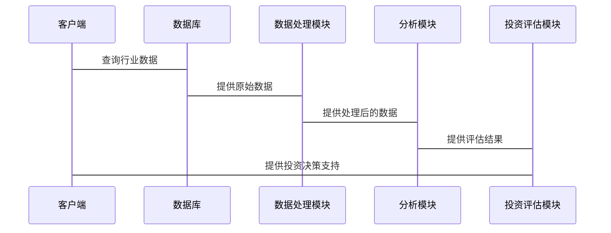

                 


# 菲利普费雪的产业分析框架

> 关键词：菲利普费雪，产业分析，投资决策，成长股，竞争优势

> 摘要：本文详细探讨了菲利普费雪的产业分析框架，分析了其在投资决策中的应用，结合实际案例，深入剖析了框架的核心原理、算法模型、系统设计和项目实战，帮助投资者更好地理解和应用这一经典方法。

---

## 第一章: 菲利普费雪产业分析框架的背景与核心概念

### 1.1 问题背景

#### 1.1.1 传统投资分析的局限性
传统投资分析方法往往关注于单一企业的财务数据，忽视了企业所处的行业环境和竞争优势。这种片面的分析方式容易导致投资者忽视行业周期性、市场竞争格局等因素对投资决策的影响。

#### 1.1.2 产业分析在投资决策中的重要性
产业分析能够帮助投资者全面了解企业的外部环境，包括市场规模、竞争格局、行业增长潜力等因素，从而为投资决策提供更全面的依据。

#### 1.1.3 菲利普费雪投资理念的提出背景
菲利普费雪是20世纪最著名的价值投资者之一，他提出了“成长股投资”的理念，强调选择那些具备持续成长潜力的企业进行投资。他的产业分析框架正是这一理念的重要组成部分。

### 1.2 问题描述

#### 1.2.1 产业分析的核心目标
产业分析的核心目标是识别那些具备持续增长潜力、竞争优势明显、市场地位稳固的行业，从而为投资决策提供科学依据。

#### 1.2.2 产业分析与企业投资决策的关系
产业分析是企业投资决策的重要前置环节，通过对行业环境的深入分析，可以帮助投资者识别行业的风险和机会，从而做出更明智的投资选择。

#### 1.2.3 菲利普费雪框架的独特性
菲利普费雪的产业分析框架注重企业的成长性和竞争优势，强调从行业周期、市场需求、竞争格局等多个维度对企业进行综合评估。

### 1.3 问题解决

#### 1.3.1 产业分析框架如何解决投资问题
通过产业分析框架，投资者可以系统地评估行业环境，识别行业的优势和劣势，从而做出更科学的投资决策。

#### 1.3.2 菲利普费雪方法的具体应用
菲利普费雪的方法强调长期投资和价值挖掘，通过对企业所在行业的深入分析，识别出那些具备持续增长潜力的企业。

#### 1.3.3 产业分析框架的边界与外延
产业分析的边界在于企业所处的具体行业，而外延则包括宏观经济环境、政策法规、技术进步等多个方面。

### 1.4 概念结构与核心要素

#### 1.4.1 产业分析的核心要素
- 行业市场规模
- 行业增长潜力
- 行业竞争格局
- 行业风险因素

#### 1.4.2 菲利普费雪框架的结构
- 企业成长性评估
- 企业竞争优势分析
- 行业周期性判断
- 投资价值综合评估

#### 1.4.3 框架与实际投资决策的联系
菲利普费雪的产业分析框架通过对企业所在行业的深入分析，为投资决策提供了科学依据，帮助投资者识别出那些具备持续增长潜力的优质企业。

---

## 第二章: 菲利普费雪产业分析框架的核心概念与联系

### 2.1 核心概念原理

#### 2.1.1 产业分析的核心原理
产业分析的核心原理是通过对企业所处的行业环境进行系统性分析，识别行业的优势和劣势，从而为投资决策提供依据。

#### 2.1.2 菲利普费雪框架的理论基础
菲利普费雪的理论基础包括企业成长性、竞争优势、行业周期性等多个方面，强调长期投资和价值挖掘。

#### 2.1.3 产业分析与企业竞争优势的关系
产业分析是企业竞争优势分析的重要组成部分，通过对行业环境的深入分析，可以更好地识别企业的竞争优势和劣势。

### 2.2 核心概念属性特征对比

| 核心概念 | 特征描述 |
|----------|----------|
| 行业市场规模 | 行业的整体规模，包括销售收入、利润水平等 |
| 行业增长潜力 | 行业未来增长的潜力，包括市场需求、技术进步等因素 |
| 行业竞争格局 | 行业内的主要竞争者、市场集中度等 |
| 行业风险因素 | 包括政策风险、技术风险、市场风险等 |

### 2.3 ER实体关系图

```mermaid
erDiagram
    customer[投资者] {
        id : int
        name : string
        investment_id : int
    }
    investment[投资标的] {
        id : int
        name : string
        industry : string
    }
    industry[行业] {
        id : int
        name : string
        market_size : float
    }
    risk_factor[风险因素] {
        id : int
        name : string
        industry_id : int
    }
    competition[竞争格局] {
        id : int
        company_name : string
        market_share : float
        industry_id : int
    }
    customer *-- investment
    investment *-- industry
    industry *-- risk_factor
    industry *-- competition
```

---

## 第三章: 菲利普费雪产业分析框架的算法原理

### 3.1 算法原理概述

#### 3.1.1 产业分析的数学模型
$$
\text{投资价值} = f(\text{行业市场规模}, \text{行业增长潜力}, \text{行业竞争格局}, \text{行业风险因素})
$$

#### 3.1.2 企业成长性评估公式
$$
\text{企业成长性} = \frac{\text{收入增长率} + \text{净利润增长率}}{2}
$$

### 3.2 算法实现步骤

#### 3.2.1 数据收集
- 收集行业市场规模数据
- 收集行业增长潜力数据
- 收集行业竞争格局数据
- 收集行业风险因素数据

#### 3.2.2 数据处理
- 数据清洗
- 数据标准化
- 数据分析

#### 3.2.3 模型计算
- 计算企业成长性
- 评估行业风险
- 综合评估投资价值

### 3.3 算法实现代码

```python
import pandas as pd

# 数据收集
industry_data = pd.DataFrame({
    'industry': ['科技', '金融', '消费', '制造'],
    'market_size': [1000, 800, 600, 400],
    'growth_potential': [0.15, 0.1, 0.08, 0.05],
    'competition': [0.8, 0.7, 0.6, 0.5],
    'risk_factors': ['政策风险', '技术风险', '市场风险', '经济周期风险']
})

# 数据处理
def calculate_growth(company_data):
    growth_score = (company_data['收入增长率'] + company_data['净利润增长率']) / 2
    return growth_score

# 模型计算
def assess_investment_value(industry_data):
    industry_data['投资价值'] = industry_data.apply(lambda x: x['market_size'] * (1 + x['growth_potential']), axis=1)
    return industry_data

# 示例应用
sample_company_data = pd.DataFrame({
    '公司名称': ['A公司', 'B公司', 'C公司', 'D公司'],
    '收入增长率': [0.2, 0.15, 0.1, 0.05],
    '净利润增长率': [0.15, 0.1, 0.08, 0.03]
})

growth_scores = calculate_growth(sample_company_data)
investment_value = assess_investment_value(industry_data)
print(growth_scores)
print(investment_value)
```

---

## 第四章: 菲利普费雪产业分析框架的系统分析与架构设计

### 4.1 系统分析

#### 4.1.1 问题场景介绍
投资者需要通过产业分析框架来评估不同行业的投资价值，从而做出更明智的投资决策。

#### 4.1.2 系统功能设计
- 数据收集与处理
- 行业分析与评估
- 投资价值综合评估
- 投资决策支持

### 4.2 系统架构设计


### 4.3 系统接口设计

- 数据接口：从数据库中获取行业数据
- 分析接口：计算企业成长性、评估行业风险
- 输出接口：提供投资价值评估结果

### 4.4 系统交互设计



---

## 第五章: 菲利普费雪产业分析框架的项目实战

### 5.1 环境安装

#### 5.1.1 安装Python
```bash
python --version
pip install --upgrade pip
```

#### 5.1.2 安装必要的库
```bash
pip install pandas numpy matplotlib
```

### 5.2 核心代码实现

```python
import pandas as pd
import numpy as np
import matplotlib.pyplot as plt

# 数据收集
industry_data = pd.read_csv('industry.csv')

# 数据处理
def preprocess_data(data):
    data = data.dropna()
    data = data[~data['market_size'].isin([0])]
    return data

processed_data = preprocess_data(industry_data)

# 可视化分析
processed_data.plot(x='industry', y='market_size', kind='bar')
plt.title('行业市场规模分析')
plt.show()

# 投资价值评估
def calculate_investment_value(data):
    data['投资价值'] = data['market_size'] * (1 + data['growth_potential'])
    return data

investment_value_data = calculate_investment_value(processed_data)
print(investment_value_data)
```

### 5.3 案例分析与详细解读

#### 5.3.1 案例背景
假设我们有四个行业：科技、金融、消费和制造。

#### 5.3.2 数据分析
- 科技行业的市场规模为1000，增长潜力为15%，竞争格局为0.8，风险因素为政策和技术风险。
- 金融行业的市场规模为800，增长潜力为10%，竞争格局为0.7，风险因素为经济周期风险。
- 消费行业的市场规模为600，增长潜力为8%，竞争格局为0.6，风险因素为市场风险。
- 制造行业的市场规模为400，增长潜力为5%，竞争格局为0.5，风险因素为技术风险。

#### 5.3.3 投资价值评估
$$
\text{投资价值} = \text{市场

