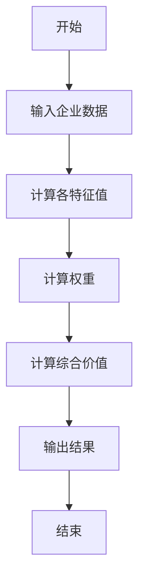

                 


# 菲利普费雪的创新企业特征

## 关键词：
菲利普费雪、创新企业、成长股投资、企业特征分析、投资策略

## 摘要：
本文深入分析了菲利普·费雪的创新企业特征，探讨了创新企业在投资中的重要性，结合数学模型和系统架构，提供了创新企业的评估方法和风险管理策略，帮助投资者识别和评估具有成长潜力的创新企业。

## 第1章: 菲利普·费雪投资理论的背景与核心思想

### 1.1 菲利普·费雪的生平与贡献
菲利普·费雪是20世纪著名的投资专家，以其成长股投资策略闻名。他强调基本面分析和长期投资，认为企业内在价值的增长是投资的关键。

### 1.2 创新企业特征的背景
创新企业是推动经济发展的核心力量，其特征包括技术创新、市场领先和持续成长潜力。费雪的研究为企业评估提供了重要参考。

## 第2章: 创新企业的核心特征分析

### 2.1 创新企业的竞争优势
竞争优势是企业的核心，创新企业通常具有技术壁垒和品牌忠诚度，确保其在市场中的领先地位。

### 2.2 创新企业的成长潜力
成长潜力是创新企业的关键特征，涉及市场扩展和新产品开发能力。评估时需考虑行业趋势和企业战略。

### 2.3 创新企业的财务表现
创新企业通常展示高利润率和稳定增长的收入，这些财务指标是评估企业价值的重要依据。

## 第3章: 创新企业特征的数学模型与算法

### 3.1 费雪选股模型
费雪模型通过加权计算企业各特征值，评估其综合价值。公式如下：
$$ P = \sum_{i=1}^{n} w_i x_i $$

### 3.2 Python实现
```python
def calculate_innovation_score(features):
    score = 0
    for i in range(len(features)):
        score += features[i] * weights[i]
    return score

# 示例
features = [0.8, 0.7, 0.9]
weights = [0.4, 0.3, 0.3]
score = calculate_innovation_score(features)
print(score)
```

## 第4章: 系统分析与架构设计

### 4.1 系统架构


## 第5章: 项目实战

### 5.1 案例分析
以科技公司为例，分析其创新特征和财务表现，使用费雪模型评估其价值。

## 第6章: 风险管理

### 6.1 风险识别与应对
讨论创新企业在市场波动和管理中的风险，提出分散投资和定期评估的策略。

## 第7章: 总结与展望

### 7.1 总结
菲利普·费雪的创新企业特征为企业评估提供了重要工具，帮助投资者识别高成长潜力的企业。

### 7.2 展望
未来研究可结合大数据和机器学习，进一步优化评估模型，提高投资决策的准确性。

---

通过以上分析，菲利普·费雪的创新企业特征为企业评估和投资决策提供了系统化的框架，帮助投资者识别和评估高成长潜力的企业。

