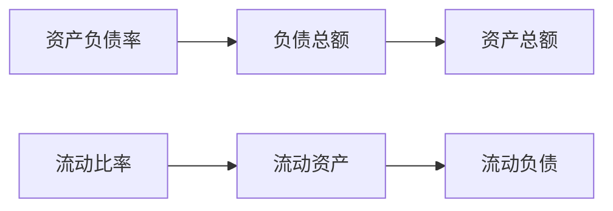

                 

---

# 菲利普费雪的成长股选择标准

> 关键词：菲利普费雪，成长股，投资标准，基本面分析，估值模型

> 摘要：本文详细阐述了菲利普·费雪的成长股投资理论，分析了其选择成长股的标准，并结合实际案例，探讨了如何通过基本面分析和估值模型来筛选和管理成长股投资组合。文章结构清晰，内容详实，旨在为投资者提供科学的指导和实践参考。

---

## 第一部分: 成长股投资概述

### 第1章: 成长股的定义与投资理念

#### 1.1 成长股的定义
成长股是指那些具有较高成长潜力，预期未来收益能够持续增长的公司股票。这类股票通常属于新兴行业或朝阳行业，公司营业收入和净利润增速显著高于行业平均水平。与价值股不同，成长股的投资价值更多来源于其未来的发展潜力，而非当前的市场价格。

##### 图1-1: 成长股与价值股的对比分析

#### 1.2 菲利普·费雪的投资理念
菲利普·费雪是成长股投资的鼻祖，他提出了“成长股投资法”，强调长期持有优质成长股，通过深入研究公司基本面，选择那些具有持续增长潜力的公司。

##### 图1-2: 费雪的成长股投资理念

### 第2章: 成长股投资的基本原则

#### 2.1 菲利普·费雪的成长股选择标准
费雪提出了15个选股标准，包括：
1. **强劲的收益增长**：过去5-10年收益持续增长，且增速高于行业平均水平。
2. **高利润率**：公司毛利率和净利润率较高。
3. **强大的竞争优势**：公司具有独特的竞争优势，如专利、品牌、技术壁垒等。
4. **良好的财务状况**：低负债率，健康的现金流。
5. **管理团队**：公司管理层能力强，注重股东利益。
6. **行业地位**：公司在行业中具有领先地位。
7. **未来成长空间**：行业增长潜力大，市场空间广阔。
8. **估值合理**：市盈率、市净率等估值指标合理，具有投资吸引力。

##### 图2-1: 成长股选择标准的流程图

---

## 第二部分: 成长股选择标准的详细分析

### 第3章: 公司基本面分析的核心指标

#### 3.1 赢利能力分析
赢利能力是衡量公司成长潜力的重要指标，主要包括以下几个方面：

##### 3.1.1 净利润与每股收益（EPS）
净利润是公司利润的最终体现，而每股收益（EPS）则是净利润与总股本的比值，是衡量公司盈利能力的重要指标。

##### 图3-1: 净利润与EPS的关系

##### 公式：
$$ EPS = \frac{\text{净利润}}{\text{总股本}} $$

##### 3.1.2 营业利润率与净利润率
营业利润率 = 营业利润 / 营业收入
净利润率 = 净利润 / 营业收入

##### 图3-2: 营业利润率与净利润率的对比

---

#### 3.2 财务健康状况分析

##### 3.2.1 资产负债率与流动比率
资产负债率 = 负债总额 / 资产总额
流动比率 = 流动资产 / 流动负债

##### 图3-3: 资产负债率与流动比率的计算

---

### 第4章: 成长股估值方法与模型

#### 4.1 市盈率（P/E）分析
市盈率 = 股价 / 每股收益

##### 图4-1: 市盈率与成长股估值的关系

#### 4.2 市净率（P/B）分析
市净率 = 股价 / 每股净资产

##### 图4-2: 市净率与成长股估值的关系

---

### 第5章: 成长股投资的风险管理

#### 5.1 成长股投资的主要风险
1. 市场波动风险
2. 估值过高风险
3. 业绩增速放缓风险

##### 图5-1: 成长股投资风险的管理流程

---

## 第三部分: 实战案例分析

### 第6章: 成长股投资组合的构建与管理

#### 6.1 案例分析：假设我们选择了一家科技公司
##### 6.1.1 基本面分析
- 净利润增长率：20%（过去5年）
- 营业利润率：25%
- 负债率：30%
- 现金流：健康

##### 6.1.2 估值分析
- 市盈率：25
- 市净率：3
- 内在价值：合理

##### 6.1.3 投资决策
- 符合费雪的成长股标准
- 适合长期持有

---

## 第四部分: 最佳实践与总结

### 第7章: 投资策略与风险管理

#### 7.1 小结
- 成长股投资需要结合基本面分析和估值模型
- 长期持有优质成长股是实现财富增长的有效方式
- 风险管理是投资成功的关键

#### 7.2 注意事项
1. 避免短期波动干扰
2. 定期复盘与调整
3. 保持对市场的敏感性

#### 7.3 拓展阅读
- 《菲利普·费雪的投资哲学》
- 《股票作手回忆录》
- 《价值投资实战策略》

---

# 结语

菲利普·费雪的成长股选择标准为投资者提供了科学的指导，但实际操作中需要结合市场环境和个人判断。通过深入分析公司基本面、合理估值和有效管理风险，投资者可以在成长股领域实现长期稳健的投资回报。

--- 

以上是《菲利普费雪的成长股选择标准》的完整目录和文章结构。

