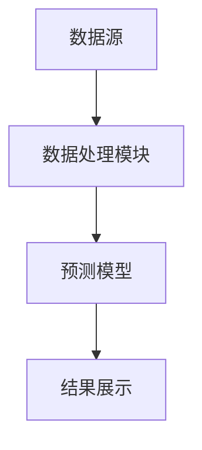
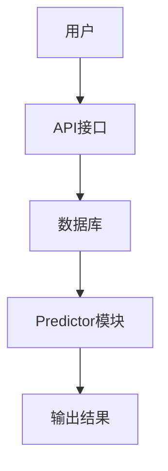

                 


# 菲利普费雪的未来增长预测

## 关键词：菲利普·费雪、投资分析、股票预测、经济增长、财务指标、投资策略

## 摘要：菲利普·费雪是投资界的重要人物，以其成长股理论闻名。本文深入探讨了他的投资理念，并详细讲解了如何利用其预测模型来评估公司的未来增长潜力。文章结合数学模型、系统架构和实际案例，展示了如何在现代投资中应用菲利普·费雪的方法。

---

## 第一部分: 菲利普·费雪投资理念与未来增长预测背景

### 第1章: 菲利普·费雪及其投资理念

#### 1.1 菲利普·费雪的生平与贡献
- **1.1.1 菲利普·费雪的早年经历**
  菲利普·费雪出生于1933年，是一位成长型投资的先驱。他在20世纪50年代开始投资生涯，逐渐发展出一套独特的投资方法。
  
- **1.1.2 菲利普·费雪的投资哲学**
  费雪认为，投资成功的关键在于选择那些具备持续增长潜力的公司，并长期持有。

- **1.1.3 菲利普·费雪对投资界的贡献**
  他提出了“成长股”概念，强调公司未来收益的增长，而非当前的市盈率。

#### 1.2 菲利普·费雪的成长股理论
- **1.2.1 成长股的定义与特征**
  成长股是指那些销售收入和净利润持续以高于行业平均水平的速度增长的公司股票。

- **1.2.2 成长股投资的核心理念**
  费雪认为，投资成长股的关键在于识别那些具有强大竞争优势和创新能力的公司。

- **1.2.3 成长股投资与价值投资的对比**
  价值投资关注低市盈率和低市净率，而成长股投资关注未来的增长潜力和高市盈率。

### 第2章: 未来增长预测的背景与意义

#### 2.1 经济预测的重要性
- **2.1.1 经济预测的定义与作用**
  经济预测帮助投资者识别潜在的投资机会和风险。

- **2.1.2 经济预测在投资中的应用**
  投资者利用经济预测来调整投资组合，以应对经济波动。

- **2.1.3 未来增长预测的核心问题**
  未来增长预测的核心在于识别能够持续增长的公司。

#### 2.2 菲利普·费雪未来增长预测的方法
- **2.2.1 菲利普·费雪预测模型的概述**
  费雪的预测模型基于对公司财务指标的分析，特别是销售收入和净利润的增长率。

- **2.2.2 菲利普·费雪预测模型的假设与限制**
  模型假设公司未来增长率保持稳定，但实际中可能存在波动。

- **2.2.3 菲利普·费雪预测模型的实际应用**
  投资者可以利用该模型筛选出具备持续增长潜力的公司。

---

## 第二部分: 菲利普·费雪未来增长预测的核心概念

### 第3章: 成长股的特征与评估指标

#### 3.1 成长股的核心特征
- **3.1.1 高增长的销售收入**
  公司的销售收入增长率应高于行业平均水平。

- **3.1.2 高ROE（净资产收益率）**
  高ROE表明公司有效地利用股东资产创造利润。

- **3.1.3 高研发投入与创新能力**
  公司应具备持续创新的能力，以保持竞争优势。

#### 3.2 成长股的评估指标
- **3.2.1 市盈率（P/E）分析**
  市盈率 = 股价 / 每股净利润。

- **3.2.2 市净率（P/B）分析**
  市净率 = 股价 / 每股净资产。

- **3.2.3 市销率（P/S）分析**
  市销率 = 股价 / 每股销售收入。

### 第4章: 菲利普·费雪预测模型的数学基础

#### 4.1 菲利普·费雪预测模型的数学公式

##### 4.1.1 股票内在价值的计算公式
$$ V = \frac{E}{k} $$
其中，V为股票的内在价值，E为预期收益，k为折现率。

##### 4.1.2 销售收入增长率预测
$$ g_{revenue} = \frac{S_{t+1} - S_t}{S_t} $$
其中，\( S_t \) 为第t年的销售收入，\( S_{t+1} \) 为第t+1年的销售收入。

##### 4.1.3 净利润增长率预测
$$ g_{net} = \frac{N_{t+1} - N_t}{N_t} $$
其中，\( N_t \) 为第t年的净利润，\( N_{t+1} \) 为第t+1年的净利润。

### 第5章: 菲利普·费雪预测模型的算法原理

#### 5.1 菲利普·费雪预测模型的算法流程

```mermaid
graph TD
    A[开始] -> B[收集历史财务数据]
    B -> C[计算销售收入增长率]
    C -> D[计算净利润增长率]
    D -> E[评估ROE]
    E -> F[确定是否为成长股]
    F -> G[结束]
```

#### 5.2 算法实现的Python代码

```python
import pandas as pd

def calculate_growth_rate(data, n=1):
    return (data.iloc[-1] / data.iloc[-n-1]) - 1

# 示例数据
data = pd.DataFrame({
    'revenue': [100, 200, 300, 600],
    'net_profit': [20, 40, 60, 120]
})

revenue_growth = calculate_growth_rate(data['revenue'], n=2)
net_profit_growth = calculate_growth_rate(data['net_profit'], n=2)

print(f"收入增长率: {revenue_growth:.2f}")
print(f"净利润增长率: {net_profit_growth:.2f}")
```

---

## 第三部分: 系统分析与架构设计

### 第6章: 系统分析与架构设计方案

#### 6.1 问题场景介绍
- 投资者需要预测公司的未来增长潜力，以做出投资决策。

#### 6.2 系统功能设计
- 数据收集模块：收集公司历史财务数据。
- 数据处理模块：计算各项增长率指标。
- 预测模块：基于费雪模型预测未来增长。

#### 6.3 系统架构设计



#### 6.4 接口设计与交互



---

## 第四部分: 项目实战

### 第7章: 项目实战

#### 7.1 环境安装
- 安装必要的Python库，如Pandas、NumPy等。

#### 7.2 核心代码实现

```python
import pandas as pd

def calculate_growth_rates(df, n=2):
    growth_rates = {}
    for column in df.columns:
        growth_rates[column] = (df[column].iloc[-1] / df[column].iloc[-n-1]) - 1
    return growth_rates

# 示例数据
data = pd.DataFrame({
    'revenue': [100, 200, 300, 600],
    'net_profit': [20, 40, 60, 120]
})

growth_rates = calculate_growth_rates(data, n=2)
print(growth_rates)
```

#### 7.3 案例分析
- 分析一家公司过去几年的财务数据，计算其销售收入和净利润增长率，判断其是否为成长股。

---

## 第五部分: 总结与最佳实践

### 第8章: 总结与最佳实践

#### 8.1 小结
菲利普·费雪的未来增长预测方法为投资者提供了一种系统化的分析框架，帮助识别具备持续增长潜力的公司。

#### 8.2 注意事项
- 预测模型假设增长率保持稳定，但实际中可能存在波动。
- 投资者应结合其他因素，如行业趋势和宏观经济环境，进行综合分析。

#### 8.3 拓展阅读
- 阅读菲利普·费雪的经典著作《成长股投资》。
- 学习其他投资策略，如彼得·林奇的成长股投资法。

---

通过以上结构，文章详细介绍了菲利普·费雪的投资理念和预测模型，并结合实际案例和系统设计，为读者提供了一套完整的分析框架。

