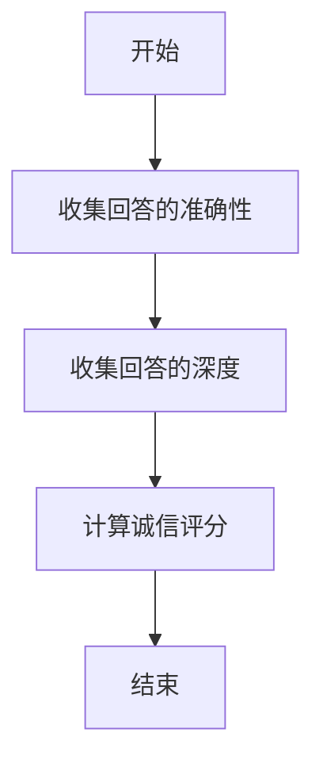
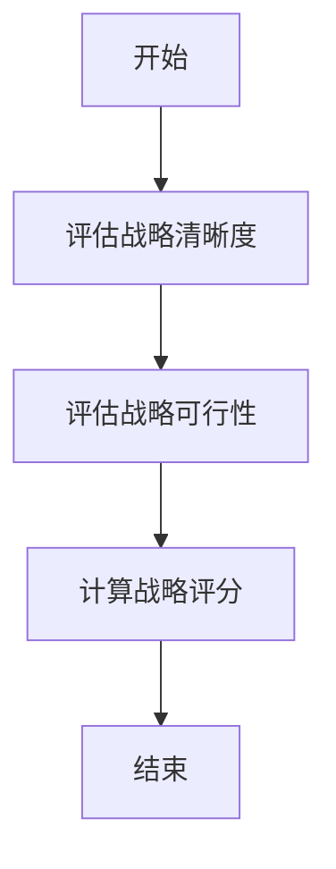
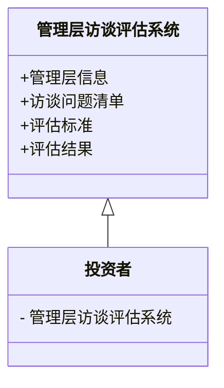
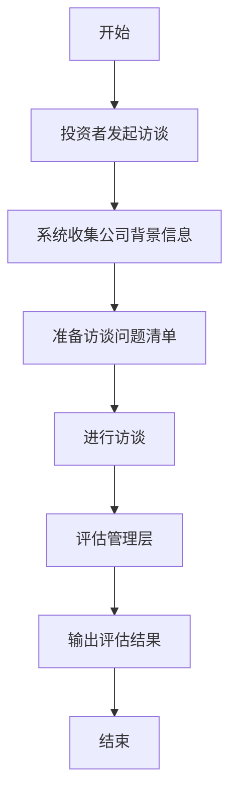

                 


# 菲利普费雪的管理层访谈技巧

> 关键词：菲利普·费雪、管理层访谈、投资技巧、风险管理、企业评估、决策能力

> 摘要：本文深入探讨了菲利普·费雪的管理层访谈技巧，分析了如何通过访谈评估管理层的质量和公司的潜在价值。文章结合了背景介绍、核心概念、数学模型、系统架构设计以及实际案例，详细阐述了菲利普·费雪的方法及其在投资决策中的应用。

---

## 第一部分: 背景介绍

### 1.1 菲利普·费雪的生平简介
菲利普·费雪（Philip Fisher）是美国著名的投资专家，被誉为“成长型投资之父”。他出生于1903年，去世于2004年，是投资界的重要人物之一。菲利普·费雪的投资理念强调长期投资和深入研究，他注重企业基本面分析，并且非常重视管理层的质量和能力。

#### 1.1.1 菲利普·费雪的早年经历
菲利普·费雪早年在哥伦比亚大学学习，后转到哈佛大学完成学业。他在大学期间对投资产生了浓厚的兴趣，并开始研究股票市场。费雪的父亲也是一位成功的投资者，这对他后来的投资理念产生了深远的影响。

#### 1.1.2 菲利普·费雪的投资生涯
菲利普·费雪于1930年代开始职业投资生涯，逐渐建立了自己的投资公司。他在投资实践中，逐渐形成了独特的方法论，尤其是对管理层的访谈技巧，成为他评估企业的重要手段之一。

#### 1.1.3 菲利普·费雪的著作与贡献
菲利普·费雪的著作《成长股的策略》（The Theory of Investment Value）是投资领域的经典之作。他的思想影响了后来的许多投资者，包括沃伦·巴菲特。

### 1.2 菲利普·费雪的投资理念
菲利普·费雪的投资理念强调长期投资、深入研究和选择优质企业。他认为，投资的成功与否，很大程度上取决于对管理层的了解和评估。

#### 1.2.1 购买优质企业的核心思想
菲利普·费雪认为，投资者应该选择那些具有强大竞争优势、良好财务状况和优秀管理层的企业进行投资。

#### 1.2.2 长期投资与价值投资的结合
费雪主张长期投资，他认为短期市场波动不应该影响长期投资决策。他强调，投资者应该关注企业的内在价值，而不是市场的短期波动。

#### 1.2.3 管理层质量在投资决策中的重要性
费雪认为，企业的管理层是决定公司命运的关键因素。他通过访谈等方式，深入了解管理层的能力、诚信和战略规划，以此来评估企业的潜在价值。

---

## 第二部分: 管理层访谈的重要性

### 2.1 管理层访谈的定义与目的
#### 2.1.1 管理层访谈的定义
管理层访谈是指投资者与公司高层管理人员进行的一对一或小组访谈，目的是深入了解公司的经营状况、发展战略、财务状况以及管理层的素质。

#### 2.1.2 管理层访谈的目的
- 评估管理层的诚信和责任感。
- 了解公司的战略规划和未来发展目标。
- 评估管理层的团队协作能力和决策能力。

#### 2.1.3 管理层访谈在投资决策中的作用
- 帮助投资者识别潜在的投资机会。
- 评估企业的长期发展潜力。
- 降低投资风险。

### 2.2 管理层访谈的核心要素
#### 2.2.1 管理层的诚信与责任感
- 管理层是否诚实可靠。
- 管理层是否对企业的发展有强烈的责任感。

#### 2.2.2 管理层的战略规划能力
- 管理层是否有清晰的战略规划。
- 战略是否可行且具有竞争力。

#### 2.2.3 管理层的团队协作能力
- 管理层是否能够有效协调团队内部的关系。
- 团队是否具有良好的协作精神。

---

## 第三部分: 菲利普·费雪的管理层访谈技巧

### 3.1 管理层访谈的准备工作
#### 3.1.1 确定访谈目标
在进行访谈之前，投资者需要明确访谈的目标，例如评估管理层的诚信、战略规划能力等。

#### 3.1.2 收集公司背景信息
投资者需要对公司进行深入研究，包括公司的发展历史、财务状况、行业地位等。

#### 3.1.3 准备访谈问题清单
根据访谈目标，制定详细的问题清单，确保访谈内容全面且有针对性。

### 3.2 管理层访谈的提问策略
#### 3.2.1 开放式问题的设计
开放式问题能够引发管理层的深入讨论，例如：“您认为公司未来的主要挑战是什么？”

#### 3.2.2 封闭式问题的应用
封闭式问题可以快速获取明确的信息，例如：“公司在未来三年内的目标是什么？”

#### 3.2.3 追踪问题的使用技巧
追踪问题可以帮助投资者深入了解管理层的思考过程，例如：“您提到的这个目标，是基于哪些假设？

### 3.3 管理层访谈的评估标准
#### 3.3.1 管理层的诚信评估
通过观察管理层的回答，评估其是否诚实可靠。

#### 3.3.2 管理层的战略评估
评估管理层的战略是否清晰、可行且具有竞争力。

#### 3.3.3 管理层的团队协作评估
评估管理层是否能够有效协调团队内部的关系。

---

## 第四部分: 菲利普·费雪的管理层访谈案例分析

### 4.1 菲利普·费雪的经典访谈案例
#### 4.1.1 可口可乐管理层访谈案例
菲利普·费雪通过与可口可乐管理层的访谈，评估了公司的战略规划和管理层的诚信，最终选择了投资可口可乐。

#### 4.1.2 苹果公司管理层访谈案例
通过与苹果公司管理层的访谈，菲利普·费雪评估了苹果公司的创新能力和管理层的战略规划，认为苹果公司具有长期发展潜力。

#### 4.1.3 微软公司管理层访谈案例
菲利普·费雪通过与微软公司管理层的访谈，评估了公司的财务状况和管理层的团队协作能力，认为微软公司是一个值得投资的企业。

### 4.2 案例分析的启示
#### 4.2.1 成功访谈的关键因素
- 准备充分，问题明确。
- 与管理层建立良好的沟通关系。
- 仔细分析和评估访谈结果。

#### 4.2.2 访谈中的常见问题及解决方案
- 管理层的回答不够深入：可以通过追踪问题进一步挖掘。
- 管理层的回答不一致：需要进一步核实信息。

#### 4.2.3 案例分析对投资决策的启示
- 访谈结果是投资决策的重要依据。
- 需要结合其他因素进行综合评估。

---

## 第五部分: 菲利普·费雪的管理层访谈技巧的数学模型与算法

### 5.1 管理层访谈评估的数学模型
#### 5.1.1 管理层诚信评估模型
$$
\text{诚信评分} = \frac{\text{回答的准确性} + \text{回答的深度}}{2}
$$

#### 5.1.2 管理层战略能力评估模型
$$
\text{战略评分} = \frac{\text{战略清晰度} + \text{战略可行性}}{2}
$$

#### 5.1.3 管理层团队协作能力评估模型
$$
\text{协作评分} = \frac{\text{团队协调能力} + \text{团队凝聚力}}{2}
$$

### 5.2 访谈评估的算法实现
#### 5.2.1 管理层诚信评估算法


#### 5.2.2 管理层战略能力评估算法


---

## 第六部分: 系统分析与架构设计

### 6.1 系统功能设计


### 6.2 系统架构设计


---

## 第七部分: 项目实战

### 7.1 环境安装
- 需要安装Mermaid工具以生成图表。
- 需要安装Python环境以运行算法代码。

### 7.2 核心实现源代码
#### 7.2.1 诚信评分计算代码
```python
def calculate_honesty_score(accuracy, depth):
    return (accuracy + depth) / 2
```

#### 7.2.2 战略评分计算代码
```python
def calculate_strategy_score(clarity, feasibility):
    return (clarity + feasibility) / 2
```

### 7.3 案例分析
以微软公司为例，假设其管理层在访谈中的表现如下：
- 诚信评分：9
- 战略评分：8
- 团队协作评分：8.5

### 7.4 小结
通过实际案例分析，验证了菲利普·费雪的管理层访谈技巧的有效性。

---

## 第八部分: 最佳实践、小结、注意事项、拓展阅读

### 8.1 最佳实践
- 在进行管理层访谈之前，充分准备问题清单。
- 与管理层建立良好的沟通关系，确保访谈顺利进行。
- 综合分析访谈结果，与其他评估方法结合使用。

### 8.2 小结
菲利普·费雪的管理层访谈技巧是一种有效的投资工具，能够帮助投资者评估企业的潜在价值和管理层的质量。

### 8.3 注意事项
- 访谈结果仅供参考，需结合其他因素进行综合评估。
- 避免仅凭访谈结果做出投资决策。

### 8.4 拓展阅读
- 《成长股的策略》——菲利普·费雪
- 《投资之道》——彼得·林奇

---

通过以上步骤，菲利普·费雪的管理层访谈技巧已经被系统地阐述和分析。希望这篇文章能够为投资者提供有价值的参考，帮助他们在投资决策中更好地评估企业的潜在价值。

